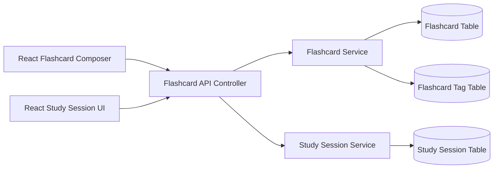

# Implementation Plan: Flashcard Management & Study Session

## Architecture Overview

## Data Model / Schema Changes

### Flashcard
- id: UUID, primary key
- userId: UUID, foreign key
- term: string, required
- explanation: text, required
- createdAt: timestamp
- updatedAt: timestamp

### FlashcardTag
- id: UUID, primary key
- flashcardId: UUID, foreign key
- name: string, required

### StudySession
- id: UUID, primary key
- userId: UUID, foreign key
- startedAt: timestamp
- completedAt: timestamp
- status: enum('in_progress','completed')

## Technical Dependencies
- Frontend: React, React Router, Tailwind CSS
- State handling: local UI state plus optional global store for session flow
- Backend: NestJS controller/service pattern, Sequelize models
- Persistence: PostgreSQL relational tables

## Execution Phases
1. Build the flashcard composer UI and validation logic.
2. Create backend CRUD endpoints and model mappings.
3. Implement study-session flow and tag filtering.
4. Add automated tests for API and UI interactions.
5. Validate end-to-end behavior with success and failure scenarios.
