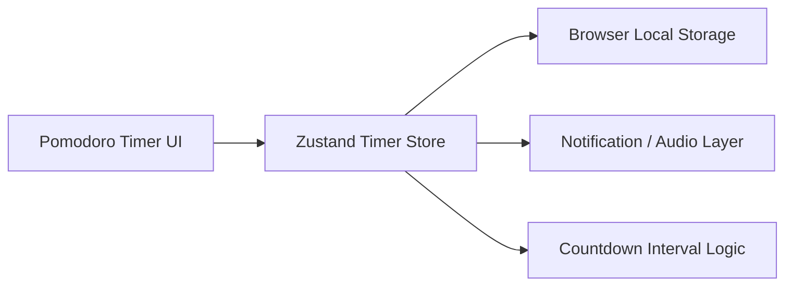

# Implementation Plan: Pomodoro Timer & Focus Session

## Architecture Overview

## Data Model / Schema Changes

### TimerPreferences
- focusTime: number
- breakTime: number
- dailyGoal: number
- completedSessions: number

### PomodoroSession
- mode: 'focus' | 'break'
- totalTime: number
- timeLeft: number
- endTime: timestamp
- isRunning: boolean

## Technical Dependencies
- Frontend: React, TypeScript, Zustand, Tailwind CSS
- Browser APIs: Notification, AudioContext, localStorage

## Execution Phases
1. Implement the timer UI and circular progress visualization.
2. Add state management with countdown logic and phase transitions.
3. Integrate notifications, audio alerts, and persistence.
4. Add tests for timer interactions and state updates.
