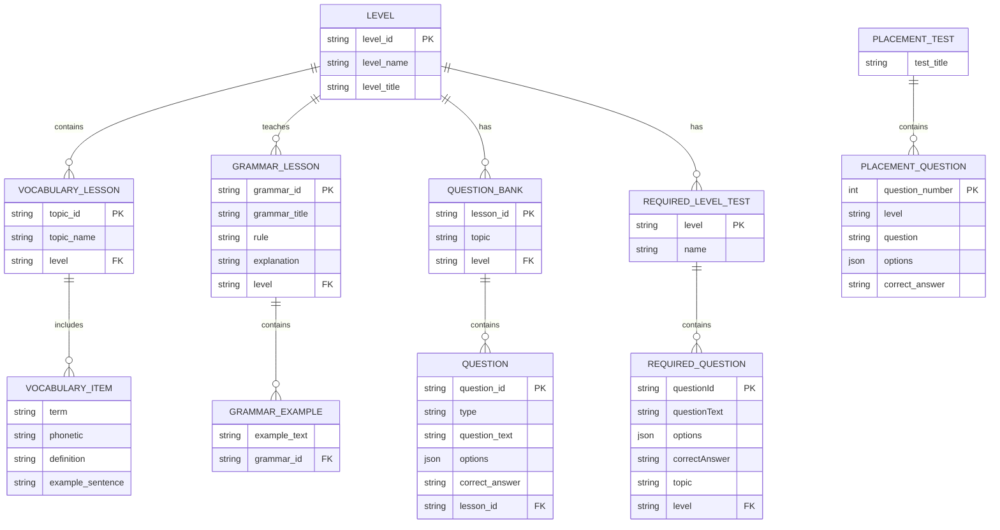

# ERD Mermaid for database/data

```mermaid
erDiagram
    LEVEL ||--o{ VOCABULARY_LESSON : contains
    LEVEL ||--o{ GRAMMAR_LESSON : teaches
    LEVEL ||--o{ QUESTION_BANK : has
    LEVEL ||--o{ REQUIRED_LEVEL_TEST : has

    VOCABULARY_LESSON ||--o{ VOCABULARY_ITEM : includes
    GRAMMAR_LESSON ||--o{ GRAMMAR_EXAMPLE : contains

    QUESTION_BANK ||--o{ QUESTION : contains
    PLACEMENT_TEST ||--o{ PLACEMENT_QUESTION : contains
    REQUIRED_LEVEL_TEST ||--o{ REQUIRED_QUESTION : contains

    LEVEL {
        string level_id PK
        string level_name
        string level_title
    }

    VOCABULARY_LESSON {
        string topic_id PK
        string topic_name
        string level FK
    }

    VOCABULARY_ITEM {
        string term
        string phonetic
        string definition
        string example_sentence
    }

    GRAMMAR_LESSON {
        string grammar_id PK
        string grammar_title
        string rule
        string explanation
        string level FK
    }

    GRAMMAR_EXAMPLE {
        string example_text
        string grammar_id FK
    }

    QUESTION_BANK {
        string lesson_id PK
        string topic
        string level FK
    }

    QUESTION {
        string question_id PK
        string type
        string question_text
        json options
        string correct_answer
        string lesson_id FK
    }

    PLACEMENT_TEST {
        string test_title
    }

    PLACEMENT_QUESTION {
        int question_number PK
        string level
        string question
        json options
        string correct_answer
    }

    REQUIRED_LEVEL_TEST {
        string level PK
        string name
    }

    REQUIRED_QUESTION {
        string questionId PK
        string questionText
        json options
        string correctAnswer
        string topic
        string level FK
    }
```
