# Studify
## Use-Case Specification: Register New Account

**Version:** 1.0

---

### Revision History

| Date | Version | Description | Author |
| :--- | :--- | :--- | :--- |
| 23/Jul/26 | 1.0 | Initial draft | Khanh Linh |

---

### Table of Contents

- [1. Use-Case Name](#1-use-case-name)
  - [1.1 Brief Description](#11-brief-description)
- [2. Flow of Events](#2-flow-of-events)
  - [2.1 Basic Flow](#21-basic-flow)
  - [2.2 Alternative Flows](#22-alternative-flows)
    - [2.2.1 Duplicate Email or Username](#221-duplicate-email-or-username)
    - [2.2.2 Invalid Input Format](#222-invalid-input-format)
- [3. Special Requirements](#3-special-requirements)
- [4. Preconditions](#4-preconditions)
- [5. Postconditions](#5-postconditions)
- [6. Extension Points](#6-extension-points)

---

## 1. Use-Case Name

**UC1 — Register New Account**

### 1.1 Brief Description

This use case allows a Guest (a user who does not yet have an account) to create a new account in the Studify system by providing an email address, a password, and a username. This is the entry point for all users who wish to access Studify's personalized learning features, and it directly leads into the Onboarding Survey use case (UC9) once registration succeeds.
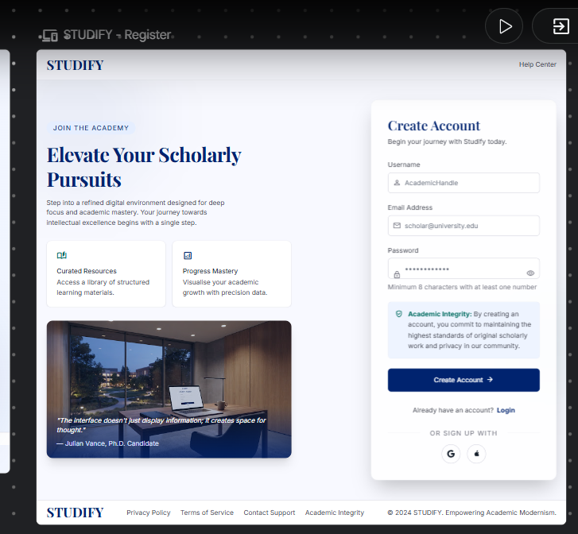
---

## 2. Flow of Events

### 2.1 Basic Flow

This use case begins when the Guest chooses to register a new account on the Studify landing page or login screen.

1. The Guest selects the "Sign Up" option.
2. The system displays the registration form, requesting: Email, Password, and Username.
3. The Guest enters their Email, Password, and desired Username, then submits the form.
4. The system performs UC7 — Validate Registration Info to check that the email format is valid, the password meets the minimum security requirements (e.g., minimum length, at least one number), and the username is not already taken.
5. The system creates a new user account and stores it in the database, with the account status set to "active."
6. The system automatically logs the Guest in as a Registered User.
7. The system redirects the newly Registered User into UC9 — Take Onboarding Survey to begin the onboarding process.
8. The use case ends successfully.

### 2.2 Alternative Flows

#### 2.2.1 Duplicate Email or Username

At step 4 of the Basic Flow, if the system determines that the submitted email or username already exists in the system:

1. The system displays an error message indicating which field (email or username) is already in use.
2. The system keeps the previously entered form values (except password) so the Guest does not have to re-enter everything.
3. The Guest updates the conflicting field and resubmits.
4. The flow resumes at step 4 of the Basic Flow.

#### 2.2.2 Invalid Input Format

At step 4 of the Basic Flow, if the email format is invalid, or the password does not meet the minimum security requirements:

1. The system displays a validation error message specific to the field(s) that failed (e.g., "Password must be at least 8 characters").
2. The Guest corrects the invalid field(s) and resubmits.
3. The flow resumes at step 4 of the Basic Flow.

---

## 3. Special Requirements

### 3.1 Password Security

Passwords must be hashed (e.g., using bcrypt) before being stored; plaintext passwords must never be persisted in the database.

### 3.2 Response Time

The registration process (from form submission to account creation confirmation) should complete within 2 seconds under normal network conditions.

### 3.3 Email Uniqueness

The system must enforce email and username uniqueness at the database level (unique constraints), not solely at the application logic level, to prevent race conditions during concurrent registrations.

---

## 4. Preconditions

### 4.1 No Existing Account

The Guest must not already have an existing account associated with the email address they are attempting to register with.

### 4.2 Network Connectivity

The Guest's device must have an active internet connection to communicate with the Studify backend.

---

## 5. Postconditions

### 5.1 Account Created

A new user record exists in the system's database with a unique identifier, hashed password, email, and username.

### 5.2 User Authenticated

The newly registered user is automatically authenticated and treated as a Registered User for the remainder of the session.

### 5.3 Onboarding Initiated

The user is directed into the Onboarding Survey (UC9) flow, having not yet completed it.

---

## 6. Extension Points

### 6.1 Onboarding Survey Trigger

*Location: End of Basic Flow, step 7.* This is the point at which control passes from UC1 to UC9 — Take Onboarding Survey, allowing the two use cases to remain independently specified while being sequentially linked in the actual user journey.
# Studify
## Use-Case Specification: Login

**Version:** 1.0

---

### Revision History

| Date | Version | Description | Author |
| :--- | :--- | :--- | :--- |
| 23/Jul/26 | 1.0 | Initial draft | Khanh Linh |

---

### Table of Contents

- [1. Use-Case Name](#1-use-case-name)
  - [1.1 Brief Description](#11-brief-description)
- [2. Flow of Events](#2-flow-of-events)
  - [2.1 Basic Flow](#21-basic-flow)
  - [2.2 Alternative Flows](#22-alternative-flows)
    - [2.2.1 Invalid Credentials](#221-invalid-credentials)
    - [2.2.2 Remember Login Selected](#222-remember-login-selected)
- [3. Special Requirements](#3-special-requirements)
- [4. Preconditions](#4-preconditions)
- [5. Postconditions](#5-postconditions)
- [6. Extension Points](#6-extension-points)

---

## 1. Use-Case Name

**UC2 — Login**

### 1.1 Brief Description

This use case allows a Registered User to authenticate into the Studify system using their email/username and password, granting access to personalized features such as the self-study dashboard, flashcards, virtual study rooms, and the AI speaking assistant. This use case includes UC8 — Validate Login Credentials, and may optionally extend into UC6 — Remember Login if the user chooses to stay signed in.
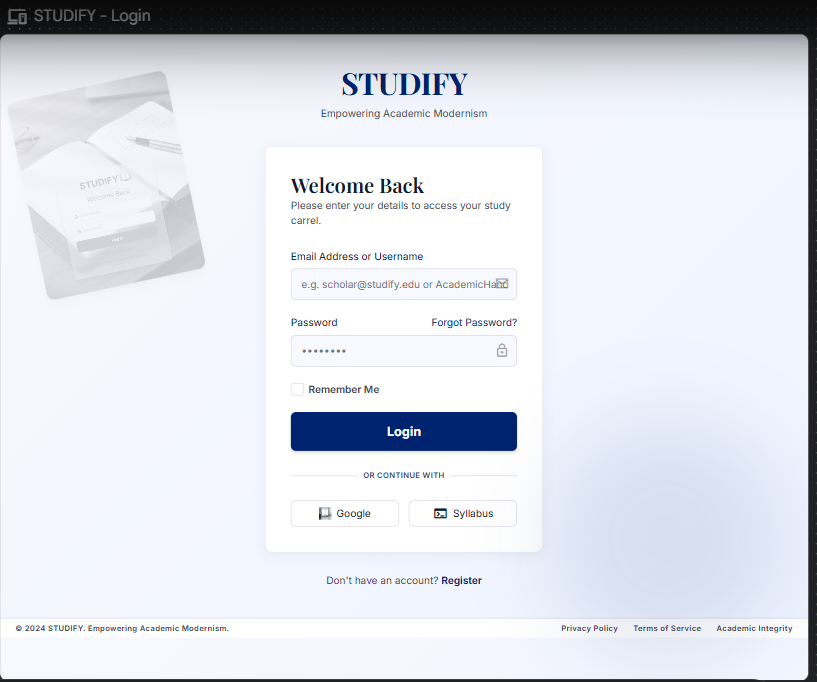
---

## 2. Flow of Events

### 2.1 Basic Flow

This use case begins when the Registered User navigates to the Login screen.

1. The Registered User selects the "Login" option.
2. The system displays the login form, requesting Email/Username and Password, along with a "Remember Login" checkbox.
3. The Registered User enters their Email/Username and Password.
4. The system performs UC8 — Validate Login Credentials to check that the submitted credentials match a stored account.
5. If the Registered User checked "Remember Login," the system performs UC6 — Remember Login (see Alternative Flow 2.2.2).
6. The system grants the Registered User an authenticated session and redirects them to their personal dashboard.
7. The use case ends successfully.

### 2.2 Alternative Flows

#### 2.2.1 Invalid Credentials

At step 4 of the Basic Flow, if the submitted Email/Username or Password does not match any stored account:

1. The system displays a generic error message (e.g., "Incorrect email/username or password") without indicating which specific field is wrong, to avoid revealing account existence.
2. The system does not disclose whether the email/username exists or the password is wrong, for security reasons.
3. The Registered User may retry entering their credentials, or select "Forgot Password" to initiate password recovery.
4. If retrying, the flow resumes at step 3 of the Basic Flow.

#### 2.2.2 Remember Login Selected

At step 5 of the Basic Flow, if the "Remember Login" checkbox was selected:

1. The system generates a long-lived authentication token and stores it securely on the Registered User's device (e.g., as an HTTP-only cookie).
2. On subsequent visits, the system automatically authenticates the Registered User using this token, without requiring the login form to be re-submitted, until the token expires or is revoked.
3. The flow resumes at step 6 of the Basic Flow.

---

## 3. Special Requirements

### 3.1 Account Lockout Policy

After a defined number of consecutive failed login attempts (e.g., 5), the system should temporarily lock the account or require additional verification (e.g., CAPTCHA) to mitigate brute-force attacks.

### 3.2 Session Security

Authentication tokens (including "Remember Login" tokens) must be transmitted and stored securely (e.g., HTTPS only, HTTP-only cookies) to prevent session hijacking.

### 3.3 Response Time

The login process (from form submission to dashboard redirect) should complete within 2 seconds under normal network conditions.

---

## 4. Preconditions

### 4.1 Existing Account

The user attempting to log in must already have a registered account in the Studify system (see UC1 — Register New Account).

### 4.2 Account Not Locked

The user's account must not currently be in a locked or suspended state.

---

## 5. Postconditions

### 5.1 User Authenticated

The Registered User has an active, authenticated session and can access personalized features of Studify.

### 5.2 Login Persisted (if applicable)

If "Remember Login" was selected, a persistent authentication token exists on the user's device for future automatic login.

---

## 6. Extension Points

### 6.1 Remember Login Trigger

*Location: Basic Flow, step 5.* This is the point at which control optionally passes from UC2 to UC6 — Remember Login, executed only if the Registered User selected the "Remember Login" option during login.
# Studify
## Use-Case Specification: Logout

**Version:** 1.0

---

### Revision History

| Date | Version | Description | Author |
| :--- | :--- | :--- | :--- |
| 23/Jul/26 | 1.0 | Initial draft | Khanh Linh |

---

### Table of Contents

- [1. Use-Case Name](#1-use-case-name)
  - [1.1 Brief Description](#11-brief-description)
- [2. Flow of Events](#2-flow-of-events)
  - [2.1 Basic Flow](#21-basic-flow)
  - [2.2 Alternative Flows](#22-alternative-flows)
    - [2.2.1 Session Already Expired](#221-session-already-expired)
    - [2.2.2 Logout with Remember Login Active](#222-logout-with-remember-login-active)
- [3. Special Requirements](#3-special-requirements)
- [4. Preconditions](#4-preconditions)
- [5. Postconditions](#5-postconditions)
- [6. Extension Points](#6-extension-points)

---

## 1. Use-Case Name

**UC3 — Logout**

### 1.1 Brief Description

This use case allows a Registered User to voluntarily end their authenticated session in the Studify system. Once logged out, the user is returned to a Guest state and must log in again (UC2) to access personalized features such as the dashboard, flashcards, virtual study rooms, or the AI speaking assistant.

---

## 2. Flow of Events

### 2.1 Basic Flow

This use case begins when the Registered User, currently authenticated, chooses to end their session.

1. The Registered User selects the "Logout" option from the account menu.
2. The system invalidates the user's current session token on the server side.
3. The system clears any session-related data stored on the client (e.g., session cookies, in-memory authentication state).
4. The system redirects the user to the public landing page or login screen.
5. The user is now treated as a Guest.
6. The use case ends successfully.

### 2.2 Alternative Flows

#### 2.2.1 Session Already Expired

At step 2 of the Basic Flow, if the system determines that the session token was already invalid or expired before the logout request was made:

1. The system proceeds directly to clearing any residual client-side data (step 3) without needing to invalidate a server-side session that no longer exists.
2. The system redirects the user to the login screen, optionally with a notice that their session had already expired.
3. The flow resumes at step 4 of the Basic Flow.
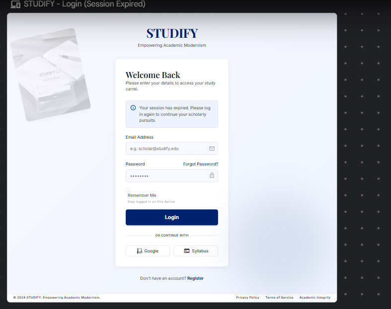
#### 2.2.2 Logout with Remember Login Active

At step 2 of the Basic Flow, if a "Remember Login" token (see UC6) is also active on the device:

1. The system asks the user whether they also want to revoke the "Remember Login" token, or only end the current session.
2. If the user chooses to revoke it, the system invalidates the persistent "Remember Login" token in addition to the current session.
3. If the user chooses not to revoke it, the persistent token remains valid, and the user will be automatically logged back in on their next visit.
4. The flow resumes at step 3 of the Basic Flow.

---

## 3. Special Requirements

### 3.1 Immediate Session Invalidation

Session invalidation on the server side must take effect immediately, preventing the same token from being reused to access protected resources after logout.

### 3.2 Response Time

The logout process should complete within 1 second under normal network conditions.

### 3.3 Data Integrity

Any in-progress user activity (e.g., an active Pomodoro timer session, unsaved flashcard progress) should be saved or gracefully handled before the session is terminated, where feasible.

---

## 4. Preconditions

### 4.1 Active Session

The user must currently have an active, authenticated session (i.e., must have previously completed UC2 — Login).

---

## 5. Postconditions

### 5.1 Session Terminated

The user's session token is invalidated and no longer grants access to protected resources.

### 5.2 User Returned to Guest State

The user is treated as a Guest and must complete UC2 — Login again to regain access to personalized features.

### 5.3 Client Data Cleared

Any session-related data stored on the client device is removed.

---

## 6. Extension Points

### 6.1 Remember Login Revocation

*Location: Basic Flow, step 2.* This is the point at which the system may prompt the user to also revoke an active "Remember Login" token (linked to UC6), allowing logout behavior to vary depending on whether persistent login was previously enabled.
# Studify
## Use-Case Specification: Update User Information

**Version:** 1.0

---

### Revision History

| Date | Version | Description | Author |
| :--- | :--- | :--- | :--- |
| 23/Jul/26 | 1.0 | Initial version of UC4 | Khanh Linh |

---

### Table of Contents

- [1. Use-Case Name](#1-use-case-name)
  - [1.1 Brief Description](#11-brief-description)
- [2. Flow of Events](#2-flow-of-events)
  - [2.1 Basic Flow](#21-basic-flow)
  - [2.2 Alternative Flows](#22-alternative-flows)
    - [2.2.1 Duplicate Username](#221-duplicate-username)
    - [2.2.2 Invalid Input Format](#222-invalid-input-format)
    - [2.2.3 User Cancels Update](#223-user-cancels-update)
- [3. Special Requirements](#3-special-requirements)
- [4. Preconditions](#4-preconditions)
- [5. Postconditions](#5-postconditions)
- [6. Extension Points](#6-extension-points)

---
## 1. Use-Case Name

**UC5 — Update User Information**

### 1.1 Brief Description

This use case allows a Registered User to view and modify their personal account information, primarily their username, while logged into Studify. This helps users keep their profile accurate and personalized without needing to create a new account.

---

## 2. Flow of Events

### 2.1 Basic Flow

This use case begins when the Registered User navigates to their account/profile settings page.

1. The Registered User selects the "Account Settings" or "Profile" option from the navigation menu.
2. The system displays the current user information, including the existing username, in an editable form.
3. The Registered User modifies the username field and selects "Save Changes."
4. The system validates the new username (see Alternative Flows 2.2.1 and 2.2.2 for validation failures).
5. The system updates the user's record in the database with the new username.
6. The system displays a confirmation message indicating the update was successful.
7. The use case ends successfully.

### 2.2 Alternative Flows

#### 2.2.1 Duplicate Username

At step 4 of the Basic Flow, if the new username submitted by the Registered User is already taken by another account:

1. The system displays an error message indicating the username is already in use.
2. The system keeps the form populated with the Registered User's attempted input so they do not need to re-enter it.
3. The Registered User modifies the username and resubmits.
4. The flow resumes at step 4 of the Basic Flow.
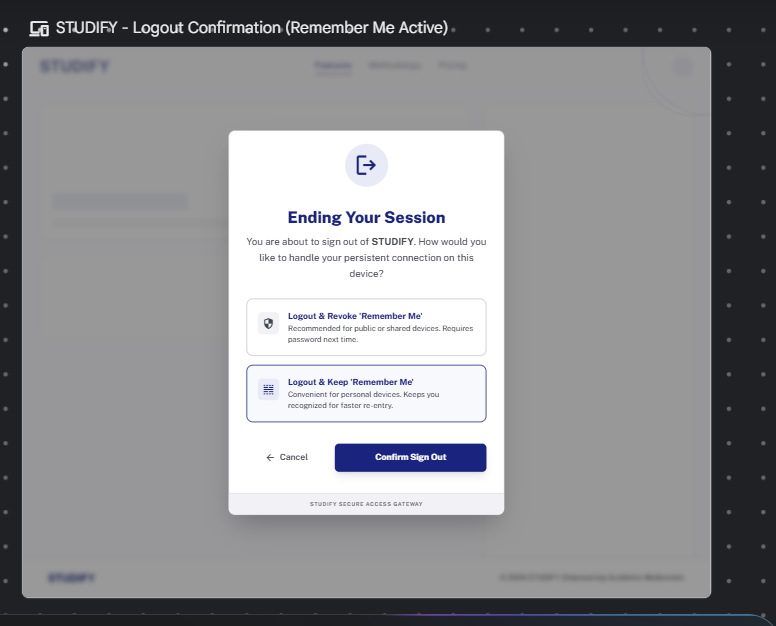
#### 2.2.2 Invalid Input Format

At step 4 of the Basic Flow, if the new username does not meet formatting requirements (e.g., contains invalid characters, is too short, or too long):

1. The system displays a validation error message specifying the formatting rule that was violated.
2. The Registered User corrects the input and resubmits.
3. The flow resumes at step 4 of the Basic Flow.
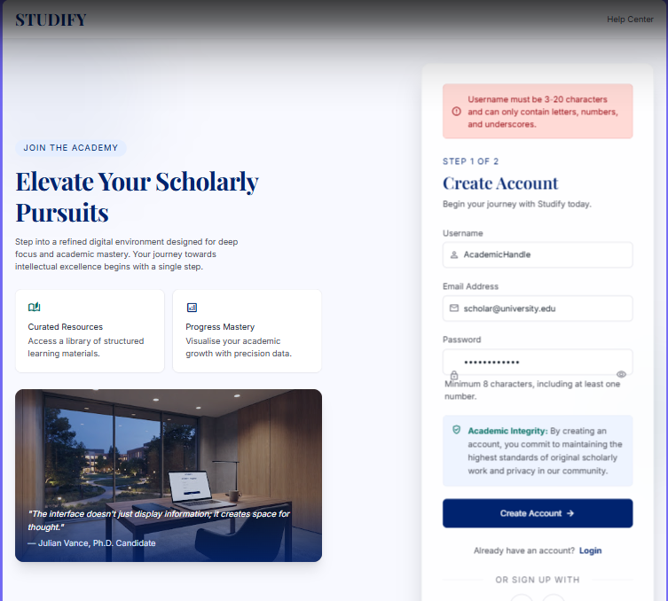
#### 2.2.3 User Cancels Update

At step 3 of the Basic Flow, if the Registered User selects "Cancel" instead of "Save Changes":

1. The system discards any unsaved changes made in the form.
2. The system returns the Registered User to the previous view (e.g., dashboard) without modifying their stored information.
3. The use case ends without any changes being made.
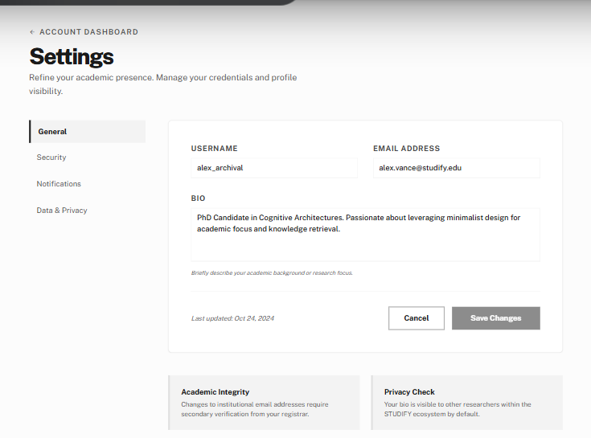
---

## 3. Special Requirements

### 3.1 Response Time

The update process (from form submission to confirmation) should complete within 2 seconds under normal network conditions.

### 3.2 Username Uniqueness

The system must enforce username uniqueness at the database level (unique constraint) to prevent race conditions when multiple users attempt to claim the same username concurrently.

### 3.3 Audit Trail

Changes to user information should be logged with a timestamp for account security and support purposes.

---

## 4. Preconditions

### 4.1 Authenticated Session

The Registered User must be logged into the system (i.e., must have previously completed UC2 — Login) to access and modify their account information.

---

## 5. Postconditions

### 5.1 Information Updated

The Registered User's stored information (username) is updated in the database to reflect the new value.

### 5.2 No Change on Cancellation

If the Registered User cancels the update, their stored information remains unchanged from before the use case began.

---

## 6. Extension Points

### 6.1 None

*This use case does not currently define any extension points into other use cases.*

## 1. Use-Case Name

**UC5 — Update User Information**

### 1.1 Brief Description

This use case allows a Registered User to view and modify their personal account information, primarily their username, while logged into Studify. This helps users keep their profile accurate and personalized without needing to create a new account.

---

## 2. Flow of Events

### 2.1 Basic Flow

This use case begins when the Registered User navigates to their account/profile settings page.

1. The Registered User selects the "Account Settings" or "Profile" option from the navigation menu.
2. The system displays the current user information, including the existing username, in an editable form.
3. The Registered User modifies the username field and selects "Save Changes."
4. The system validates the new username (see Alternative Flows 2.2.1 and 2.2.2 for validation failures).
5. The system updates the user's record in the database with the new username.
6. The system displays a confirmation message indicating the update was successful.
7. The use case ends successfully.

### 2.2 Alternative Flows

#### 2.2.1 Duplicate Username

At step 4 of the Basic Flow, if the new username submitted by the Registered User is already taken by another account:

1. The system displays an error message indicating the username is already in use.
2. The system keeps the form populated with the Registered User's attempted input so they do not need to re-enter it.
3. The Registered User modifies the username and resubmits.
4. The flow resumes at step 4 of the Basic Flow.

#### 2.2.2 Invalid Input Format

At step 4 of the Basic Flow, if the new username does not meet formatting requirements (e.g., contains invalid characters, is too short, or too long):

1. The system displays a validation error message specifying the formatting rule that was violated.
2. The Registered User corrects the input and resubmits.
3. The flow resumes at step 4 of the Basic Flow.

#### 2.2.3 User Cancels Update

At step 3 of the Basic Flow, if the Registered User selects "Cancel" instead of "Save Changes":

1. The system discards any unsaved changes made in the form.
2. The system returns the Registered User to the previous view (e.g., dashboard) without modifying their stored information.
3. The use case ends without any changes being made.

---

## 3. Special Requirements

### 3.1 Response Time

The update process (from form submission to confirmation) should complete within 2 seconds under normal network conditions.

### 3.2 Username Uniqueness

The system must enforce username uniqueness at the database level (unique constraint) to prevent race conditions when multiple users attempt to claim the same username concurrently.

### 3.3 Audit Trail

Changes to user information should be logged with a timestamp for account security and support purposes.

---

## 4. Preconditions

### 4.1 Authenticated Session

The Registered User must be logged into the system (i.e., must have previously completed UC2 — Login) to access and modify their account information.

---

## 5. Postconditions

### 5.1 Information Updated

The Registered User's stored information (username) is updated in the database to reflect the new value.

### 5.2 No Change on Cancellation

If the Registered User cancels the update, their stored information remains unchanged from before the use case began.

---

## 6. Extension Points

### 6.1 None

*This use case does not currently define any extension points into other use cases.*

# Studify
## Use-Case Specification: Update User Information

**Version:** 1.0

---

### Revision History

| Date | Version | Description | Author |
| :--- | :--- | :--- | :--- |
| 23/Jul/26 | 1.0 | Initial draft | Khanh Linh |

---

### Table of Contents

- [1. Use-Case Name](#1-use-case-name)
  - [1.1 Brief Description](#11-brief-description)
- [2. Flow of Events](#2-flow-of-events)
  - [2.1 Basic Flow](#21-basic-flow)
  - [2.2 Alternative Flows](#22-alternative-flows)
    - [2.2.1 Duplicate Username](#221-duplicate-username)
    - [2.2.2 Invalid Input Format](#222-invalid-input-format)
    - [2.2.3 User Cancels Update](#223-user-cancels-update)
- [3. Special Requirements](#3-special-requirements)
- [4. Preconditions](#4-preconditions)
- [5. Postconditions](#5-postconditions)
- [6. Extension Points](#6-extension-points)

---

## 1. Use-Case Name

**UC5 — Update User Information**

### 1.1 Brief Description

This use case allows a Registered User to view and modify their personal account information, primarily their username, while logged into Studify. This helps users keep their profile accurate and personalized without needing to create a new account.

---

## 2. Flow of Events

### 2.1 Basic Flow

This use case begins when the Registered User navigates to their account/profile settings page.

1. The Registered User selects the "Account Settings" or "Profile" option from the navigation menu.
2. The system displays the current user information, including the existing username, in an editable form.
3. The Registered User modifies the username field and selects "Save Changes."
4. The system validates the new username (see Alternative Flows 2.2.1 and 2.2.2 for validation failures).
5. The system updates the user's record in the database with the new username.
6. The system displays a confirmation message indicating the update was successful.
7. The use case ends successfully.

### 2.2 Alternative Flows

#### 2.2.1 Duplicate Username

At step 4 of the Basic Flow, if the new username submitted by the Registered User is already taken by another account:

1. The system displays an error message indicating the username is already in use.
2. The system keeps the form populated with the Registered User's attempted input so they do not need to re-enter it.
3. The Registered User modifies the username and resubmits.
4. The flow resumes at step 4 of the Basic Flow.

#### 2.2.2 Invalid Input Format

At step 4 of the Basic Flow, if the new username does not meet formatting requirements (e.g., contains invalid characters, is too short, or too long):

1. The system displays a validation error message specifying the formatting rule that was violated.
2. The Registered User corrects the input and resubmits.
3. The flow resumes at step 4 of the Basic Flow.

#### 2.2.3 User Cancels Update

At step 3 of the Basic Flow, if the Registered User selects "Cancel" instead of "Save Changes":

1. The system discards any unsaved changes made in the form.
2. The system returns the Registered User to the previous view (e.g., dashboard) without modifying their stored information.
3. The use case ends without any changes being made.

---

## 3. Special Requirements

### 3.1 Response Time

The update process (from form submission to confirmation) should complete within 2 seconds under normal network conditions.

### 3.2 Username Uniqueness

The system must enforce username uniqueness at the database level (unique constraint) to prevent race conditions when multiple users attempt to claim the same username concurrently.

### 3.3 Audit Trail

Changes to user information should be logged with a timestamp for account security and support purposes.

---

## 4. Preconditions

### 4.1 Authenticated Session

The Registered User must be logged into the system (i.e., must have previously completed UC2 — Login) to access and modify their account information.

---

## 5. Postconditions

### 5.1 Information Updated

The Registered User's stored information (username) is updated in the database to reflect the new value.

### 5.2 No Change on Cancellation

If the Registered User cancels the update, their stored information remains unchanged from before the use case began.

---

## 6. Extension Points

### 6.1 None

*This use case does not currently define any extension points into other use cases.*
# Studify
## Use-Case Specification: Remember Login

**Version:** 1.0

---

### Revision History

| Date | Version | Description | Author |
| :--- | :--- | :--- | :--- |
| 23/Jul/26 | 1.0 | Initial version of UC5 | Khanh Linh |

---

### Table of Contents

- [1. Use-Case Name](#1-use-case-name)
  - [1.1 Brief Description](#11-brief-description)
- [2. Flow of Events](#2-flow-of-events)
  - [2.1 Basic Flow](#21-basic-flow)
  - [2.2 Alternative Flows](#22-alternative-flows)
    - [2.2.1 Token Expired](#221-token-expired)
    - [2.2.2 Token Revoked or Invalidated](#222-token-revoked-or-invalidated)
- [3. Special Requirements](#3-special-requirements)
- [4. Preconditions](#4-preconditions)
- [5. Postconditions](#5-postconditions)
- [6. Extension Points](#6-extension-points)
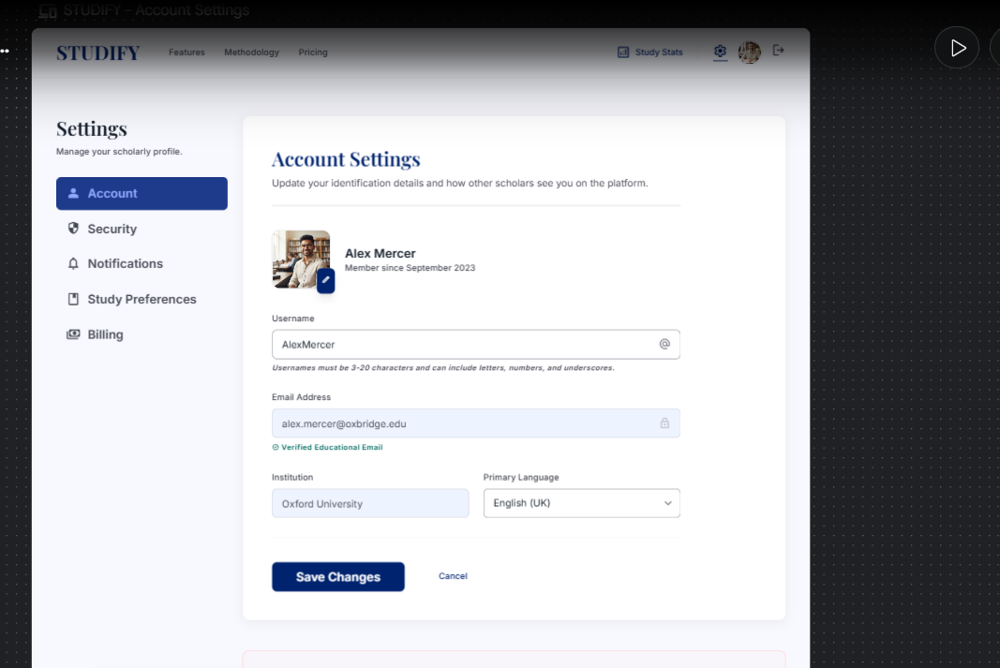
---

## 1. Use-Case Name

**UC6 — Remember Login**

### 1.1 Brief Description

This use case allows the system to keep a Registered User authenticated across sessions by issuing a persistent authentication token when the user selects "Remember Login" during UC2 — Login. This use case extends UC2, executing only when the user opts in, and enables automatic re-authentication on subsequent visits without requiring the login form to be resubmitted.

---

## 2. Flow of Events

### 2.1 Basic Flow

This use case begins as an extension of UC2 — Login, triggered when the Registered User checks the "Remember Login" option during login.

1. Following successful credential validation in UC2, the system generates a long-lived authentication token unique to the Registered User's session.
2. The system securely stores this token on the Registered User's device (e.g., as an HTTP-only, secure cookie).
3. The system records the token, its expiration date, and the associated device/session metadata in its persistent storage for future validation.
4. On a subsequent visit, when the Registered User opens Studify without an active session, the system checks for a valid "Remember Login" token on the device.
5. If a valid token is found, the system automatically authenticates the Registered User and grants access without displaying the login form.
6. The use case ends successfully.

### 2.2 Alternative Flows

#### 2.2.1 Token Expired

At step 4 of the Basic Flow, if the "Remember Login" token found on the device has expired:

1. The system discards the expired token.
2. The system redirects the user to the standard Login screen (UC2), requiring them to re-enter their credentials.
3. The use case ends without automatic authentication.
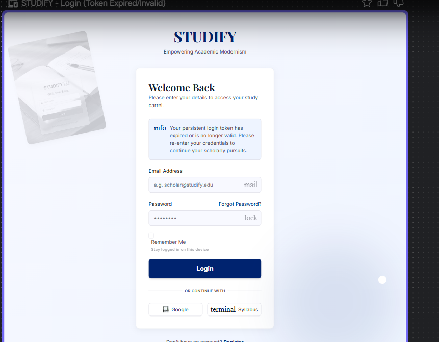
---
#### 2.2.2 Token Revoked or Invalidated

At step 4 of the Basic Flow, if the token has been explicitly revoked (e.g., due to logout with revocation, as described in UC3 — Logout, or a security-related action such as a password change):

1. The system rejects the token as invalid.
2. The system clears the invalid token from the device.
3. The system redirects the user to the standard Login screen (UC2), requiring them to re-enter their credentials.
4. The use case ends without automatic authentication.
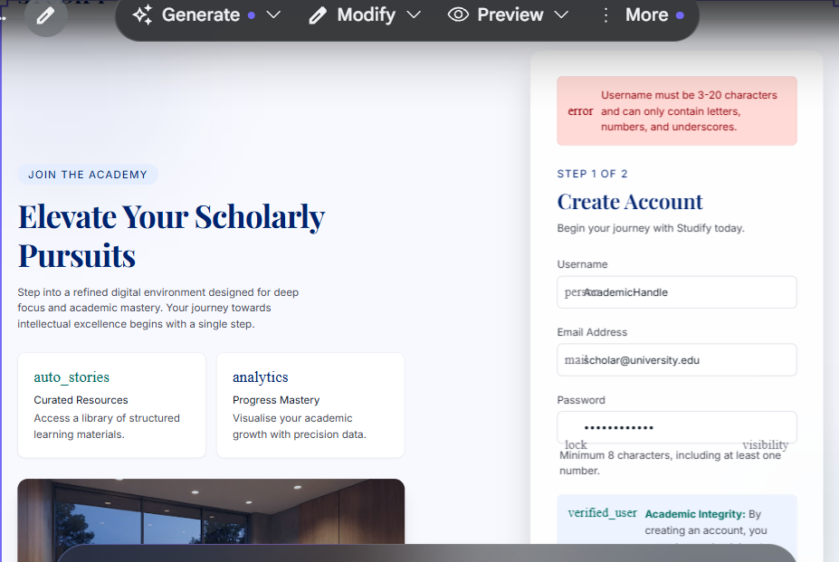
---
---

## 3. Special Requirements

### 3.1 Token Security

"Remember Login" tokens must be cryptographically random, transmitted only over HTTPS, and stored as HTTP-only cookies to prevent access via client-side scripts (mitigating XSS-based theft).

### 3.2 Token Expiration Policy

Tokens should have a defined maximum lifetime (e.g., 30 days) after which they automatically expire and require the user to log in again.

### 3.3 Token Rotation

To reduce the risk of token replay attacks, the system should rotate (reissue) the token periodically or upon each use, invalidating the previous token value.

### 3.4 Single Point of Revocation

The system must allow tokens to be revoked immediately and independently of their expiration date (e.g., if a user reports a stolen device).

---

## 4. Preconditions

### 4.1 Successful Login with Opt-In

The Registered User must have previously completed UC2 — Login and explicitly selected the "Remember Login" option.

---

## 5. Postconditions

### 5.1 Persistent Token Issued

A valid, securely stored authentication token exists on the Registered User's device, enabling automatic re-authentication on future visits.

### 5.2 Automatic Authentication (on subsequent visits)

When the token is valid, the Registered User is automatically authenticated without needing to resubmit login credentials.

---

## 6. Extension Points

### 6.1 None

*This use case is itself an extension of UC2 — Login and does not currently define further extension points into other use cases.*

# Studify
## Use-Case Specification: Validate Registration Info

**Version:** 1.0

---

### Revision History

| Date | Version | Description | Author |
| :--- | :--- | :--- | :--- |
| 23/Jul/26 | 1.0 | Initial version of UC6| Khanh Linh |

---

### Table of Contents

- [1. Use-Case Name](#1-use-case-name)
  - [1.1 Brief Description](#11-brief-description)
- [2. Flow of Events](#2-flow-of-events)
  - [2.1 Basic Flow](#21-basic-flow)
  - [2.2 Alternative Flows](#22-alternative-flows)
    - [2.2.1 Invalid Email Format](#221-invalid-email-format)
    - [2.2.2 Weak Password](#222-weak-password)
    - [2.2.3 Duplicate Email or Username](#223-duplicate-email-or-username)
- [3. Special Requirements](#3-special-requirements)
- [4. Preconditions](#4-preconditions)
- [5. Postconditions](#5-postconditions)
- [6. Extension Points](#6-extension-points)
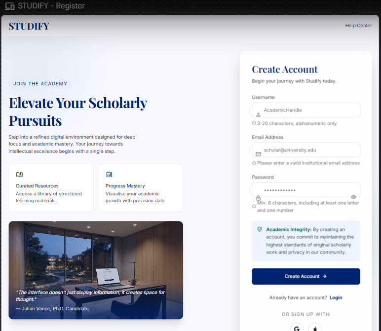
---

## 1. Use-Case Name

**UC7 — Validate Registration Info**

### 1.1 Brief Description

This use case describes the system's internal process of verifying that the information submitted during account registration — email, password, and username — is well-formed, secure, and unique. It is always executed (included) as part of UC1 — Register New Account, and does not exist as a standalone user-facing action; it is triggered automatically by the system rather than directly invoked by an actor.

---

## 2. Flow of Events

### 2.1 Basic Flow

This use case begins automatically when UC1 — Register New Account reaches the validation step, immediately after the Guest submits the registration form.

1. The system receives the submitted Email, Password, and Username values from UC1.
2. The system checks that the Email field conforms to a valid email address format (e.g., contains "@" and a valid domain structure).
3. The system checks that the Password meets the minimum security policy (e.g., minimum 8 characters, at least one number, at least one letter).
4. The system checks that the Username meets formatting rules (e.g., allowed characters, minimum/maximum length).
5. The system queries the database to confirm that neither the Email nor the Username is already associated with an existing account.
6. If all checks pass, the system returns a "valid" result to UC1, allowing the registration process to proceed to account creation.
7. The use case ends successfully.

### 2.2 Alternative Flows

#### 2.2.1 Invalid Email Format

At step 2 of the Basic Flow, if the Email does not match a valid email format:

1. The system returns a "validation failed" result to UC1, specifying that the email format is invalid.
2. UC1 displays the corresponding error message to the Guest (see UC1, Alternative Flow 2.2.2).
3. The use case ends without proceeding to account creation.
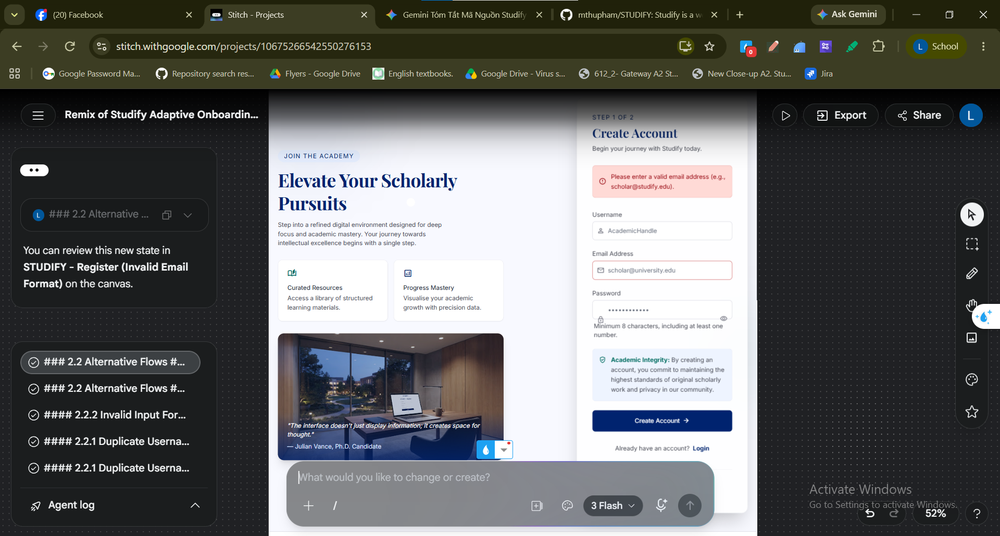
#### 2.2.2 Weak Password

At step 3 of the Basic Flow, if the Password does not meet the minimum security policy:

1. The system returns a "validation failed" result to UC1, specifying which password rule was not met.
2. UC1 displays the corresponding error message to the Guest (see UC1, Alternative Flow 2.2.2).
3. The use case ends without proceeding to account creation.
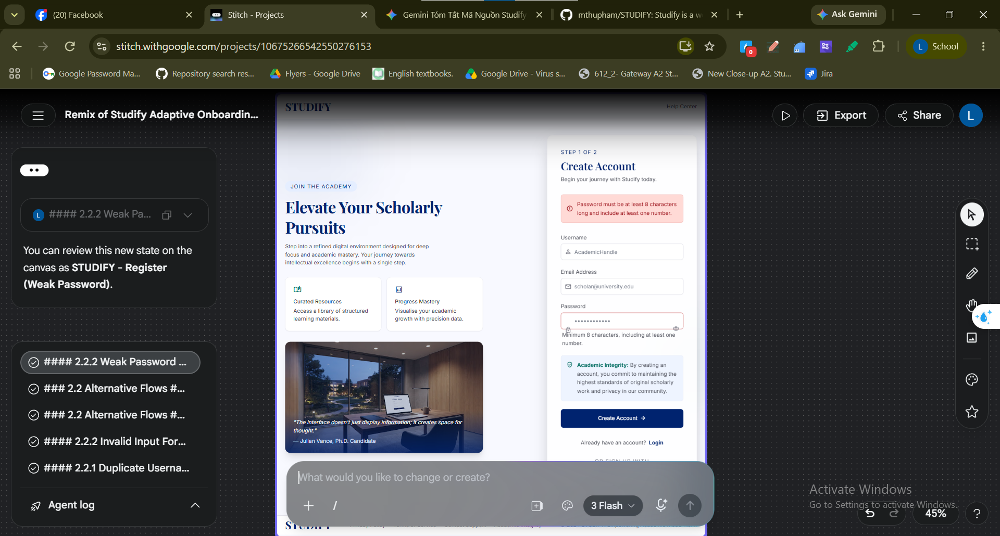
#### 2.2.3 Duplicate Email or Username

At step 5 of the Basic Flow, if either the Email or Username already exists in the database:

1. The system returns a "validation failed" result to UC1, specifying which field (email and/or username) is already in use.
2. UC1 displays the corresponding error message to the Guest (see UC1, Alternative Flow 2.2.1).
3. The use case ends without proceeding to account creation.
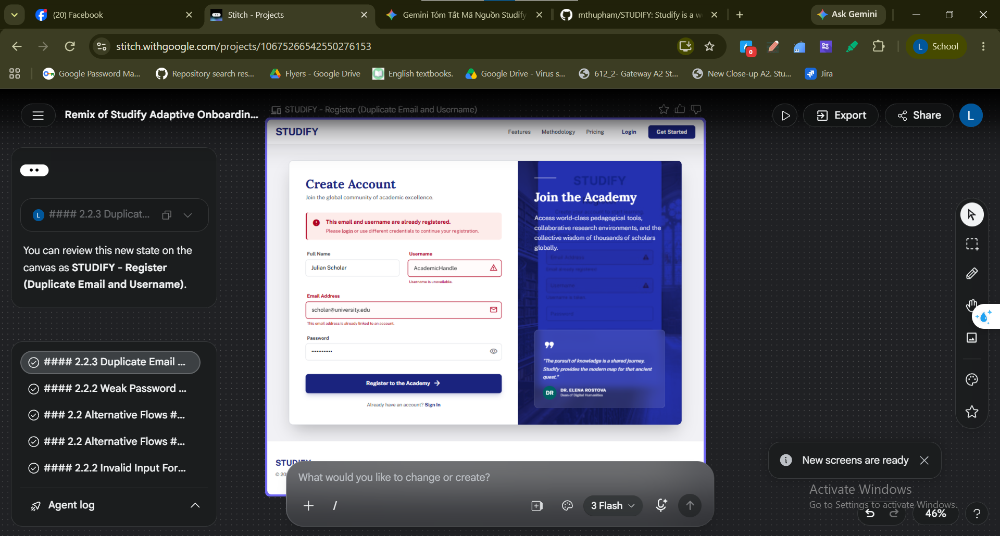
---

## 3. Special Requirements

### 3.1 Response Time

Validation checks, including the database uniqueness query, should complete within 500 milliseconds under normal load to keep the overall registration flow responsive.

### 3.2 Case-Insensitive Uniqueness

Email and username uniqueness checks should be case-insensitive (e.g., "User@Example.com" and "user@example.com" are treated as the same email) to prevent duplicate accounts through case variation.

### 3.3 Consistent Validation Rules

Password and username formatting rules must be consistently enforced on both the client side (for immediate feedback) and the server side (for security), with the server-side check being authoritative.

---

## 4. Preconditions

### 4.1 Triggered by Registration

This use case can only be initiated as part of UC1 — Register New Account; it cannot be triggered independently by any actor.

---

## 5. Postconditions

### 5.1 Validation Result Returned

A clear "valid" or "validation failed" (with reason) result is returned to UC1, determining whether the registration process may proceed.

### 5.2 No Side Effects on Failure

If validation fails, no account record is created or modified in the database.

---

## 6. Extension Points

### 6.1 None

*This use case is included by UC1 — Register New Account and does not currently define further extension points into other use cases.*
# Studify
## Use-Case Specification: Validate Login Credentials

**Version:** 1.0

---

### Revision History

| Date | Version | Description | Author |
| :--- | :--- | :--- | :--- |
| 23/Jul/26 | 1.0 | Initial version of UC7| Khanh Linh |

---

### Table of Contents

- [1. Use-Case Name](#1-use-case-name)
  - [1.1 Brief Description](#11-brief-description)
- [2. Flow of Events](#2-flow-of-events)
  - [2.1 Basic Flow](#21-basic-flow)
  - [2.2 Alternative Flows](#22-alternative-flows)
    - [2.2.1 Account Not Found](#221-account-not-found)
    - [2.2.2 Incorrect Password](#222-incorrect-password)
    - [2.2.3 Account Locked](#223-account-locked)
- [3. Special Requirements](#3-special-requirements)
- [4. Preconditions](#4-preconditions)
- [5. Postconditions](#5-postconditions)
- [6. Extension Points](#6-extension-points)
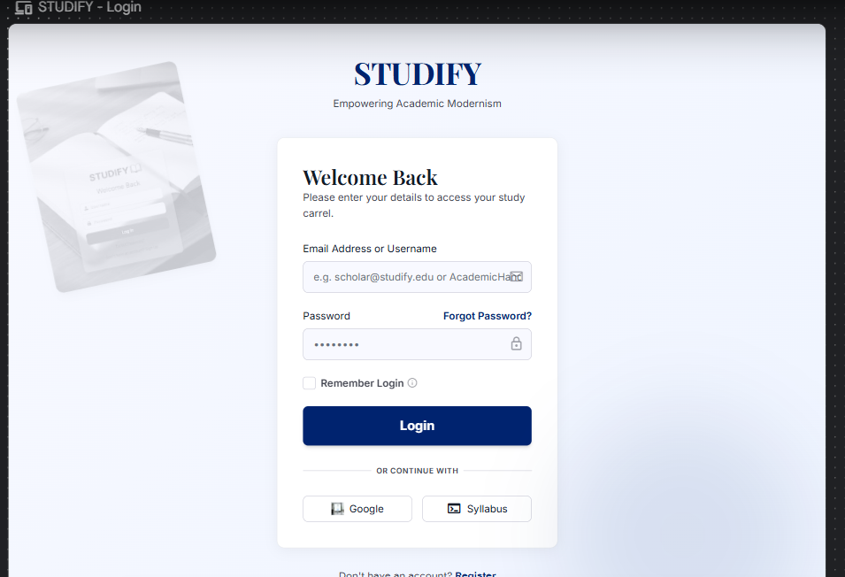
---

## 1. Use-Case Name

**UC8 — Validate Login Credentials**

### 1.1 Brief Description

This use case describes the system's internal process of verifying that the Email/Username and Password submitted during login match a stored, active account. It is always executed (included) as part of UC2 — Login, and is not directly invoked by an actor; it is a system-level check triggered automatically whenever a login attempt is made.

---

## 2. Flow of Events

### 2.1 Basic Flow

This use case begins automatically when UC2 — Login reaches the credential-checking step, immediately after the Registered User submits the login form.

1. The system receives the submitted Email/Username and Password values from UC2.
2. The system looks up the account record matching the submitted Email/Username.
3. The system checks that the account is active (not locked or suspended; see Alternative Flow 2.2.3).
4. The system hashes the submitted Password using the same algorithm used at registration and compares it against the stored password hash.
5. If the account exists, is active, and the password hash matches, the system returns a "valid" result to UC2, allowing the login process to proceed.
6. The use case ends successfully.

### 2.2 Alternative Flows

#### 2.2.1 Account Not Found

At step 2 of the Basic Flow, if no account matches the submitted Email/Username:

1. The system returns a "validation failed" result to UC2, using a generic reason (not revealing whether the email/username itself exists) to avoid account enumeration.
2. UC2 displays the corresponding generic error message to the Registered User (see UC2, Alternative Flow 2.2.1).
3. The system logs the failed attempt for security monitoring purposes.
4. The use case ends without granting access.
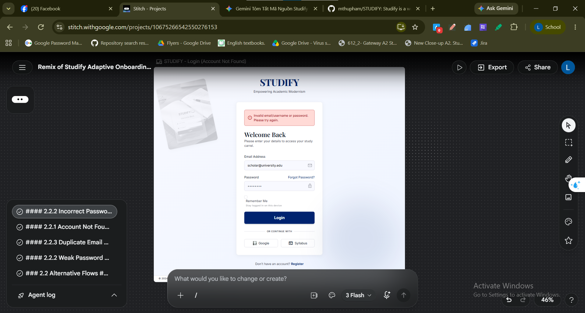
#### 2.2.2 Incorrect Password

At step 4 of the Basic Flow, if the account exists and is active, but the submitted password does not match the stored hash:

1. The system returns a "validation failed" result to UC2, using the same generic reason as in 2.2.1, to avoid revealing that the email/username was correct.
2. The system increments the account's consecutive failed-login counter.
3. UC2 displays the corresponding generic error message to the Registered User (see UC2, Alternative Flow 2.2.1).
4. The use case ends without granting access.
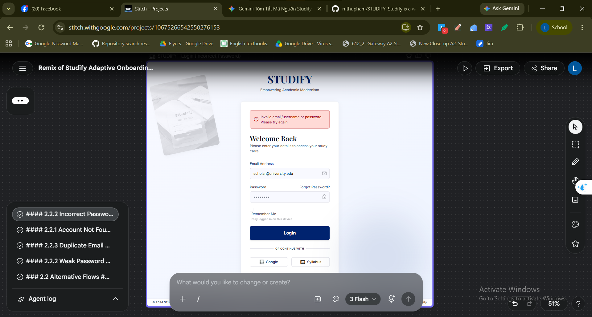
#### 2.2.3 Account Locked

At step 3 of the Basic Flow, if the account is found to be locked or suspended (e.g., due to too many consecutive failed login attempts, per the Account Lockout Policy):

1. The system returns a "validation failed" result to UC2, indicating the account is temporarily locked.
2. UC2 displays a message to the Registered User informing them of the lockout and, if applicable, how long until they may retry or how to unlock the account (e.g., via password reset).
3. The use case ends without granting access.
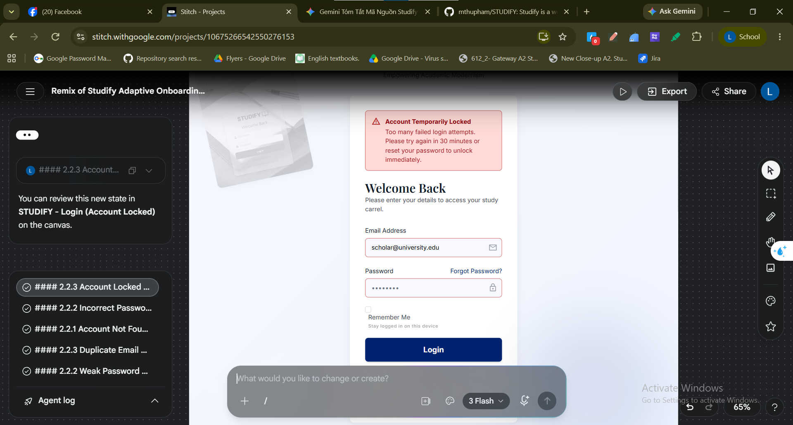
---

## 3. Special Requirements

### 3.1 Response Time

Credential validation, including password hash comparison, should complete within 500 milliseconds under normal load to keep the login flow responsive.

### 3.2 Timing-Attack Resistance

The system should take a similar amount of time to respond whether the account does not exist (2.2.1) or the password is incorrect (2.2.2), to prevent attackers from inferring account existence through response-time differences.

### 3.3 Failed Attempt Logging

All failed login attempts should be logged with a timestamp and, where feasible, source information (e.g., IP address) to support the Account Lockout Policy and security auditing.

### 3.4 Password Hash Algorithm

Password comparison must use a secure, industry-standard hashing algorithm (e.g., bcrypt) consistent with the algorithm used during registration (UC7).

---

## 4. Preconditions

### 4.1 Triggered by Login

This use case can only be initiated as part of UC2 — Login; it cannot be triggered independently by any actor.

---

## 5. Postconditions

### 5.1 Validation Result Returned

A clear "valid" or "validation failed" (with an internally logged reason, though not necessarily disclosed to the user) result is returned to UC2, determining whether the login process may proceed.

### 5.2 Failed Attempt Recorded (on failure)

If validation fails due to incorrect credentials, the account's failed-attempt counter is incremented, potentially leading to a lockout state.

---

## 6. Extension Points

### 6.1 None

*This use case is included by UC2 — Login and does not currently define further extension points into other use cases.*
# Studify
## Use-Case Specification: Take Onboarding Survey

**Version:** 1.0

---

### Revision History

| Date | Version | Description | Author |
| :--- | :--- | :--- | :--- |
| 23/Jul/26 | 1.0 | Initial version of UC8  | Khanh Linh |

---

### Table of Contents

- [1. Use-Case Name](#1-use-case-name)
  - [1.1 Brief Description](#11-brief-description)
- [2. Flow of Events](#2-flow-of-events)
  - [2.1 Basic Flow](#21-basic-flow)
  - [2.2 Alternative Flows](#22-alternative-flows)
    - [2.2.1 User Already Knows Their English Level](#221-user-already-knows-their-english-level)
    - [2.2.2 User Does Not Know Their English Level](#222-user-does-not-know-their-english-level)
    - [2.2.3 User Abandons Survey Midway](#223-user-abandons-survey-midway)
- [3. Special Requirements](#3-special-requirements)
- [4. Preconditions](#4-preconditions)
- [5. Postconditions](#5-postconditions)
- [6. Extension Points](#6-extension-points)

---

## 1. Use-Case Name

**UC9 — Take Onboarding Survey**

### 1.1 Brief Description

This use case guides a newly registered user through an onboarding questionnaire immediately after account creation, gathering information about their available study time and current English proficiency level. It is always executed (included) as part of UC1 — Register New Account. This use case always includes UC10 — Answer Study Time Availability and UC11 — Indicate Current English Level, may optionally extend into UC12 — Take Placement Test depending on the user's response, and always includes UC13 — Auto-generate CEFR Roadmap once the necessary information is gathered.
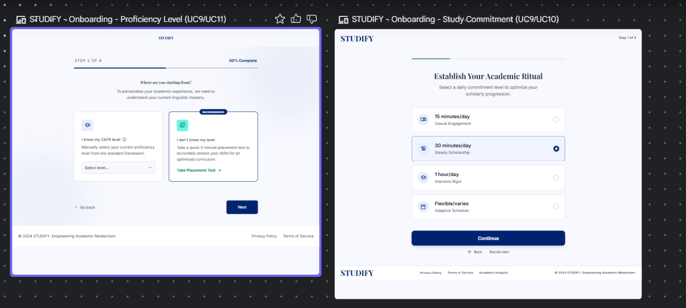
---

## 2. Flow of Events

### 2.1 Basic Flow

This use case begins automatically once UC1 — Register New Account completes successfully, redirecting the newly Registered User into the onboarding flow.

1. The system displays the onboarding survey's first question.
2. The system performs UC10 — Answer Study Time Availability, presenting the Registered User with a set of predefined options describing how much time they intend to dedicate to studying English (e.g., "15 minutes/day," "30 minutes/day," "1 hour/day," "Flexible/varies").
3. The Registered User selects one option and proceeds.
4. The system performs UC11 — Indicate Current English Level, asking whether the Registered User already knows their current English proficiency level.
5. If the user indicates they already know their level, the flow proceeds via Alternative Flow 2.2.1.
6. If the user indicates they do not know their level, the flow proceeds via Alternative Flow 2.2.2.
7. Once the user's English level has been determined (either through direct input or the placement test), the system performs UC13 — Auto-generate CEFR Roadmap to create a personalized learning roadmap.
8. The system presents the generated roadmap to the Registered User and marks onboarding as complete.
9. The use case ends successfully.

### 2.2 Alternative Flows

#### 2.2.1 User Already Knows Their English Level

At step 5 of the Basic Flow, if the Registered User indicates they already know their current English proficiency level (e.g., A1–C2 per CEFR):

1. The system displays a list of CEFR levels (A1, A2, B1, B2, C1, C2) for the user to choose from.
2. The Registered User selects their self-assessed level.
3. The system records the selected level as the user's starting point.
4. The flow resumes at step 7 of the Basic Flow.
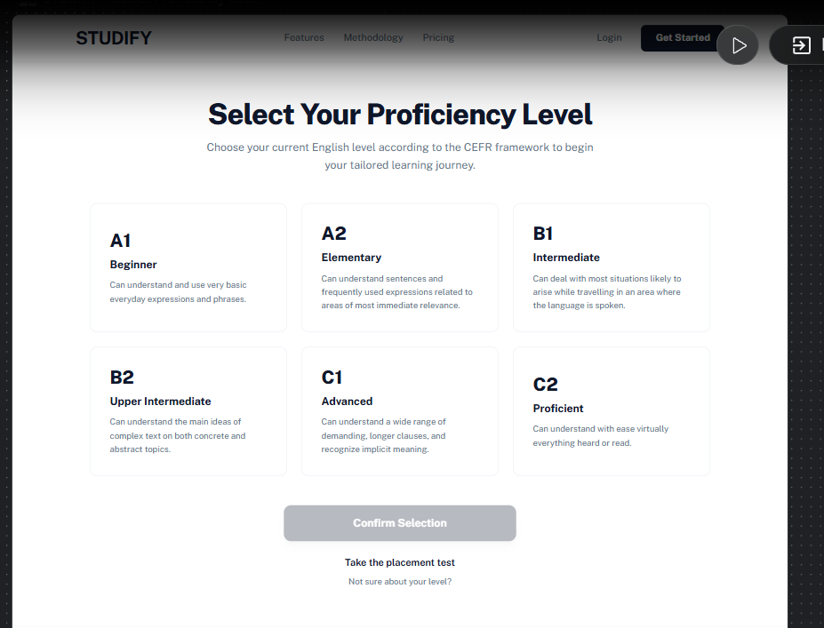
#### 2.2.2 User Does Not Know Their English Level

At step 6 of the Basic Flow, if the Registered User indicates they do not know their current English proficiency level:

1. The system performs UC12 — Take Placement Test, presenting a short test of 10–15 questions arranged from easy to difficult.
2. The Registered User answers the placement test questions.
3. The system evaluates the responses and determines an estimated CEFR level based on the results.
4. The system records the determined level as the user's starting point.
5. The flow resumes at step 7 of the Basic Flow.
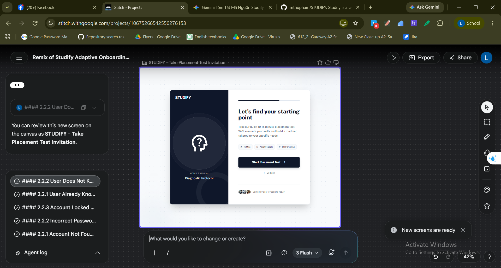
#### 2.2.3 User Abandons Survey Midway

At any step of the Basic Flow, if the Registered User closes the application or navigates away before completing the survey:

1. The system saves the Registered User's progress up to the last completed question.
2. On the user's next visit, the system resumes the survey from the last incomplete question rather than restarting from the beginning.
3. The flow resumes at the appropriate step of the Basic Flow based on saved progress.
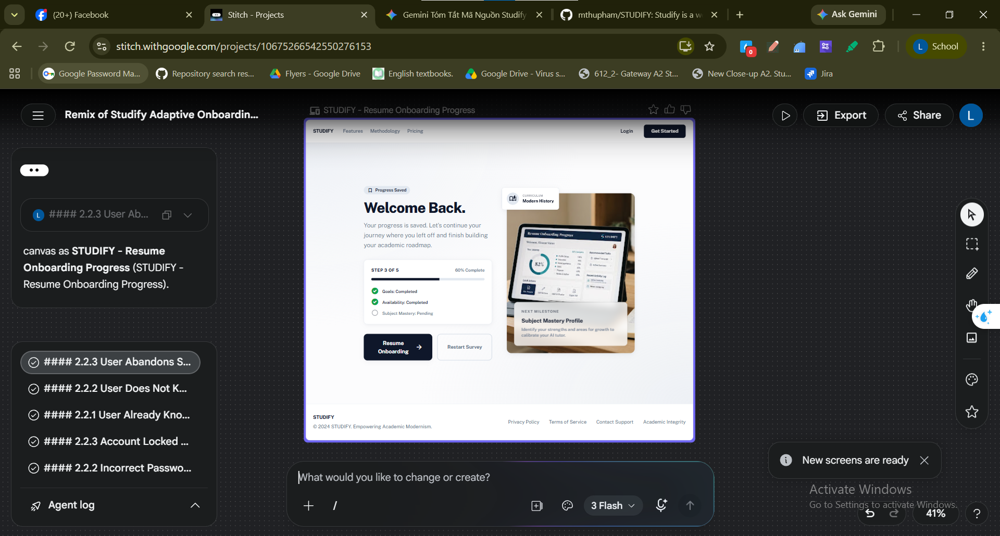
---

## 3. Special Requirements

### 3.1 Mandatory Completion

The onboarding survey should be presented in a way that strongly encourages completion (e.g., cannot be permanently dismissed) since it is required to generate the user's personalized CEFR roadmap, a core feature of Studify.

### 3.2 Response Time

Each survey step should load and respond within 1 second under normal network conditions to maintain a smooth onboarding experience.

### 3.3 Progress Persistence

Survey progress must be saved incrementally (e.g., after each question) so that users who abandon and return do not lose previously entered answers.

---

## 4. Preconditions

### 4.1 Newly Registered Account

The Registered User must have just completed UC1 — Register New Account and not yet completed the onboarding survey.

### 4.2 Onboarding Not Yet Completed

The Registered User's account must not already have a completed onboarding status; a user who has already finished onboarding is not re-prompted with this use case during normal login.

---

## 5. Postconditions

### 5.1 Study Preferences Recorded

The Registered User's intended study time availability is stored in their profile.

### 5.2 English Level Determined

The Registered User's starting English proficiency level (either self-reported or determined via placement test) is recorded in their profile.

### 5.3 Roadmap Generated

A CEFR-based learning roadmap has been generated and associated with the Registered User's account (via UC13).

### 5.4 Onboarding Marked Complete

The Registered User's account is flagged as having completed onboarding, so this use case is not triggered again on subsequent logins.

---

## 6. Extension Points

### 6.1 Placement Test Trigger

*Location: Alternative Flow 2.2.2, step 1.* This is the point at which control optionally passes from UC9 to UC12 — Take Placement Test, executed only when the Registered User does not already know their current English level.
