# STUDIFY
## Module 2: Self-Study Dashboard - Use-Case Specifications

**Version:** 1.0

---

### Revision History

| Date | Version | Description | Author |
| :--- | :--- | :--- | :--- |
| `23/Jul/26` | `1.0` | Consolidated all UC1-UC15 specifications for Module 2 | `Lê Kim Hằng` |

---

## Table of Contents

- [UC1: View Learning Roadmap](#uc1-view-learning-roadmap)
- [UC2: View Lesson Details by Level](#uc2-view-lesson-details-by-level)
- [UC3: Study Lesson](#uc3-study-lesson)
- [UC4: Study Theory](#uc4-study-theory)
- [UC5: Take Quiz](#uc5-take-quiz)
- [UC6: Multiple Choice](#uc6-multiple-choice)
- [UC7: Fill in the Blank](#uc7-fill-in-the-blank)
- [UC8: View Quiz/Assessment Result](#uc8-view-quizassessment-result)
- [UC9: Track Learning Progress](#uc9-track-learning-progress)
- [UC10: View Roadmap Completion % (Progress Bar)](#uc10-view-roadmap-completion--progress-bar)
- [UC11: Calculate Completion % (real-time)](#uc11-calculate-completion--real-time)
- [UC12: Take Level Assessment Test](#uc12-take-level-assessment-test)
- [UC13: Set Study Commitment Hours](#uc13-set-study-commitment-hours)
- [UC14: View Daily Study Widget](#uc14-view-daily-study-widget)
- [UC15: Calculate Daily Tasks Schedule](#uc15-calculate-daily-tasks-schedule)

---

# UC1: View Learning Roadmap

**Version:** 1.0

---

### Revision History

| Date | Version | Description | Author |
| :--- | :--- | :--- | :--- |
| 23/Jul/26 | 1.0 | Initial draft of use-case specification UC1 – View Learning Roadmap | `Lê Kim Hằng` |

---

## 1. Use-Case Name

**View Learning Roadmap**

### 1.1 Brief Description

This use case allows the Learner to view the overall learning roadmap of the Studify system, organized by proficiency levels (e.g., A1, A2, B1, etc.). The roadmap is displayed as a list or diagram of levels, allowing the Learner to understand the structure of the study program before diving into individual lessons. This use case includes the **View Lesson Details by Level** use case, which allows the Learner to view the detailed lessons contained within a selected level.

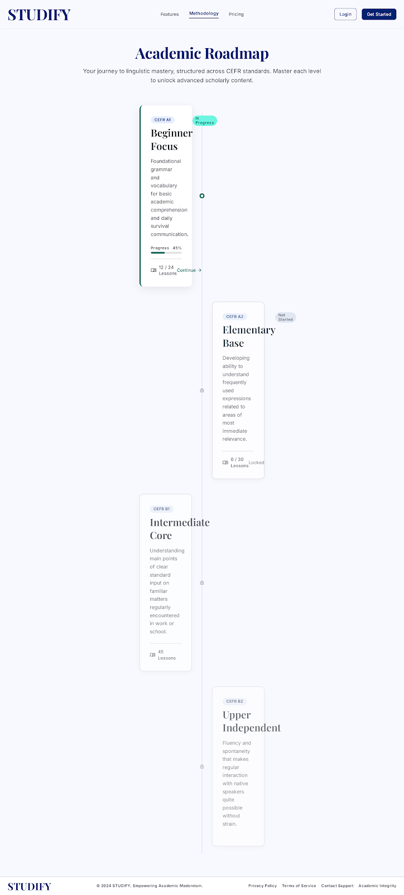

---

## 2. Flow of Events

### 2.1 Basic Flow

This use case begins when the Learner navigates to the **Roadmap** screen from the Dashboard.

1. The Learner selects the "Learning Roadmap" option from the navigation bar or the Dashboard home page.
2. The system queries the list of proficiency levels (A1, A2, B1, B2, C1, C2, etc.) along with summary information for each level (level name, number of lessons, short description).
3. The system displays the learning roadmap as a list/diagram of levels, ordered from easiest to hardest.
4. For each level, the system displays an overall status (Not Started / In Progress / Completed) based on the Learner's current learning progress.
5. The Learner selects a specific level to view its details.
6. The system executes the **View Lesson Details by Level** use case *(<<include>>)* to display the list of lessons belonging to the selected level.
7. The use case ends when the lesson list for the selected level has been successfully displayed.

### 2.2 Alternative Flows

#### 2.2.1 Empty Roadmap

*Trigger condition: The system has no level/roadmap data configured yet (e.g., newly deployed system, data not yet populated).*

1. At step 3 of the Basic Flow, the system detects that no levels exist in the database.
2. The system displays the message "No learning roadmap is available at this time. Please check back later."
3. The use case ends.

#### 2.2.2 Load Failure / Network Error

*Trigger condition: An error occurs while querying roadmap data from the server (network error, server 500 error, timeout).*

1. At step 2 of the Basic Flow, the request to fetch roadmap data fails.
2. The system displays a user-friendly error message, e.g., "Unable to load the learning roadmap. Please check your network connection and try again."
3. The system provides a "Retry" button.
4. If the Learner selects "Retry," the flow returns to step 2 of the Basic Flow.
5. If the Learner takes no action, the use case ends.

---

## 3. Special Requirements

### 3.1 Performance

The roadmap list must be loaded and displayed within a maximum of 2 seconds under normal network conditions (stable 4G/Wi-Fi connection).

### 3.2 Usability

The roadmap interface must be intuitive, clearly indicating progress status (using distinct colors or icons for: Not Started / In Progress / Completed) so the Learner can easily identify which level to study next.

---

## 4. Preconditions

### 4.1 Learner Logged In

The Learner must be successfully logged in to the Studify system before accessing the Roadmap screen.

---

## 5. Postconditions

### 5.1 Roadmap Displayed

The system has successfully displayed the list of learning levels along with the Learner's corresponding progress status. If the Learner has selected a specific level, the lesson list for that level has also been displayed (via the include relationship).

---

## 6. Extension Points

### 6.1 Level Selection

This extension point occurs at step 5 of the Basic Flow, immediately after the Learner selects a specific level on the roadmap. This is the point where the **View Lesson Details by Level** use case is included to continue the flow of displaying the lesson details for the selected level.

---

# UC2: View Lesson Details by Level

**Version:** 1.0

---

### Revision History

| Date | Version | Description | Author |
| :--- | :--- | :--- | :--- |
| 23/Jul/26 | 1.0 | Initial draft of use-case specification UC2 – View Lesson Details by Level | `Lê Kim Hằng` |

---

## 1. Use-Case Name

**View Lesson Details by Level**

### 1.1 Brief Description

This use case allows the Learner to view a detailed list of lessons belonging to a specific level selected from the Learning Roadmap. For each lesson, the system displays summary information such as the lesson name, overview content, and completion status (Not Started / In Progress / Completed). This use case is included by the **View Learning Roadmap** use case, and it in turn includes the **Study Lesson** use case when the Learner selects a specific lesson to begin studying.

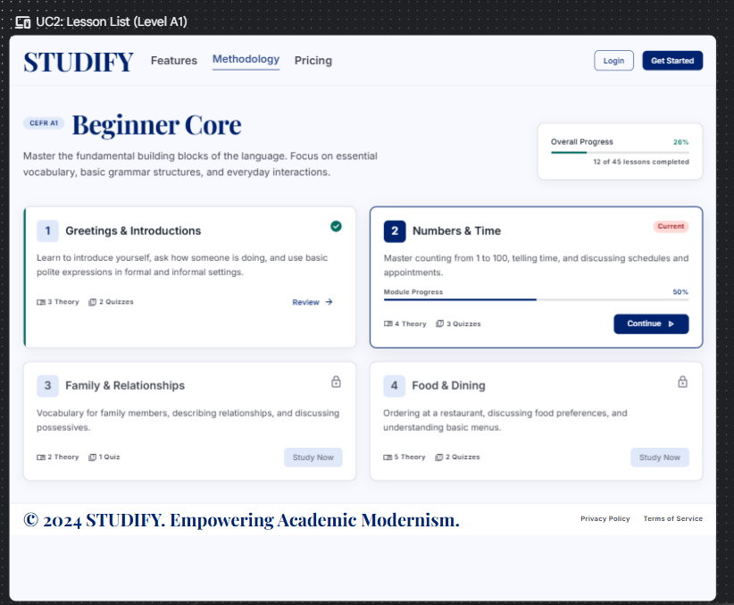

*Figure 2.1: Lesson list for Level A1 (Beginner Core), showing per-lesson progress and overall level progress.*

---

## 2. Flow of Events

### 2.1 Basic Flow

This use case begins immediately after the Learner selects a specific level on the Roadmap screen (triggered from the View Learning Roadmap use case).

1. The system receives the level ID that the Learner has selected (e.g., A1, A2, etc.).
2. The system queries the list of lessons belonging to that level from the database, ordered according to the recommended study sequence.
3. The system displays the lesson list, where each lesson includes: lesson name, short description, number of theory/quiz sections, and the Learner's current completion status.
4. The system displays an overall progress bar for the level, showing the ratio of completed lessons to the total number of lessons in that level.
5. The Learner selects a specific lesson from the list to begin studying.
6. The system executes the **Study Lesson** use case *(<<include>>)* to move the Learner to the detailed lesson study screen.
7. The use case ends when the study screen for the selected lesson has been successfully displayed.

### 2.2 Alternative Flows

#### 2.2.1 Level Has No Lessons

*Trigger condition: The selected level currently has no lessons configured in the system.*

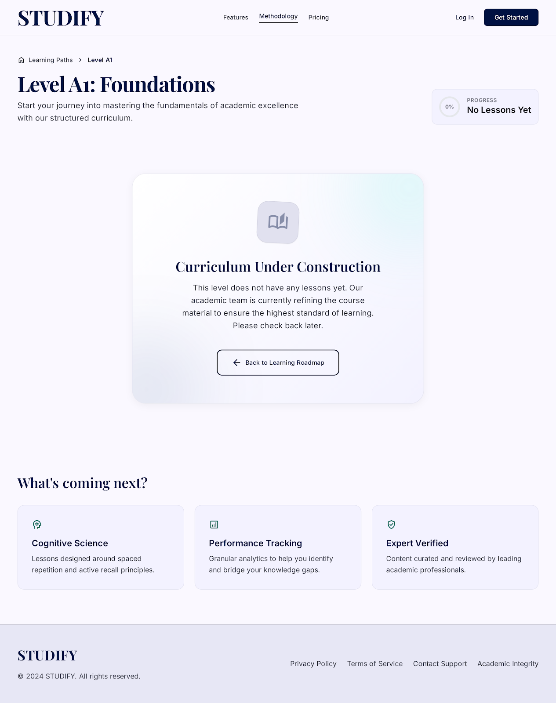

1. At step 3 of the Basic Flow, the system detects that the lesson list for the level is empty.
2. The system displays the message "This level does not have any lessons yet. Please check back later."
3. The system provides a "Back to Learning Roadmap" button to return the Learner to the Roadmap screen.
4. The use case ends.

#### 2.2.2 Load Failure / Network Error

*Trigger condition: An error occurs while querying lesson list data from the server (network error, server 500 error, timeout).*

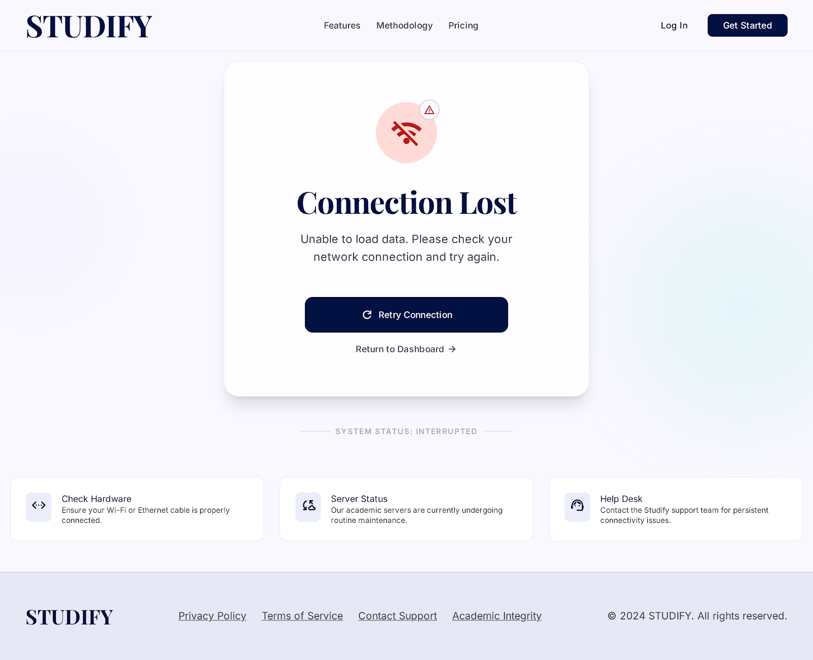

1. At step 2 of the Basic Flow, the request to fetch lesson data fails.
2. The system displays a user-friendly error message, e.g., "Unable to load the lesson list. Please check your network connection and try again."
3. The system provides a "Retry" button.
4. If the Learner selects "Retry," the flow returns to step 2 of the Basic Flow.
5. If the Learner takes no action, the use case ends.

#### 2.2.3 Learner Returns to Roadmap

*Trigger condition: The Learner wants to go back to the Roadmap screen instead of selecting a lesson.*

1. At any point after step 3 of the Basic Flow, the Learner selects the "Back" button.
2. The system navigates the Learner back to the View Learning Roadmap screen.
3. The use case ends.

---

## 3. Special Requirements

### 3.1 Performance

The lesson list for a level must be loaded and displayed within a maximum of 2 seconds under normal network conditions.

### 3.2 Usability

Each lesson in the list must clearly display its completion status (using a distinct icon or color for: Not Started / In Progress / Completed) so the Learner can easily identify which lesson to study next.

---

## 4. Preconditions

### 4.1 Level Selected

The Learner has selected a specific level from the View Learning Roadmap screen before this use case is executed.

---

## 5. Postconditions

### 5.1 Lesson List Displayed

The system has successfully displayed the lesson list for the selected level along with the Learner's corresponding completion status. If the Learner has selected a specific lesson, the Study Lesson screen has also been displayed (via the include relationship).

---

## 6. Extension Points

### 6.1 Lesson Selection

This extension point occurs at step 5 of the Basic Flow, immediately after the Learner selects a specific lesson from the list. This is the point where the **Study Lesson** use case is included to continue the flow of moving the Learner to the detailed lesson study screen.

---

# UC3: Study Lesson

**Version:** 1.0

---

### Revision History

| Date | Version | Description | Author |
| :--- | :--- | :--- | :--- |
| 23/Jul/26 | 1.0 | Initial draft of use-case specification UC3 – Study Lesson | `Lê Kim Hằng` |

---

## 1. Use-Case Name

**Study Lesson**

### 1.1 Brief Description

This use case allows the Learner to study the content of a specific lesson that was selected from the lesson list of a level. The lesson study screen combines two main components: condensed theory content and optional practice exercises. This use case is included by the **View Lesson Details by Level** use case, and it in turn includes two use cases: **Study Theory** (condensed content) and **Practice Exercises**.

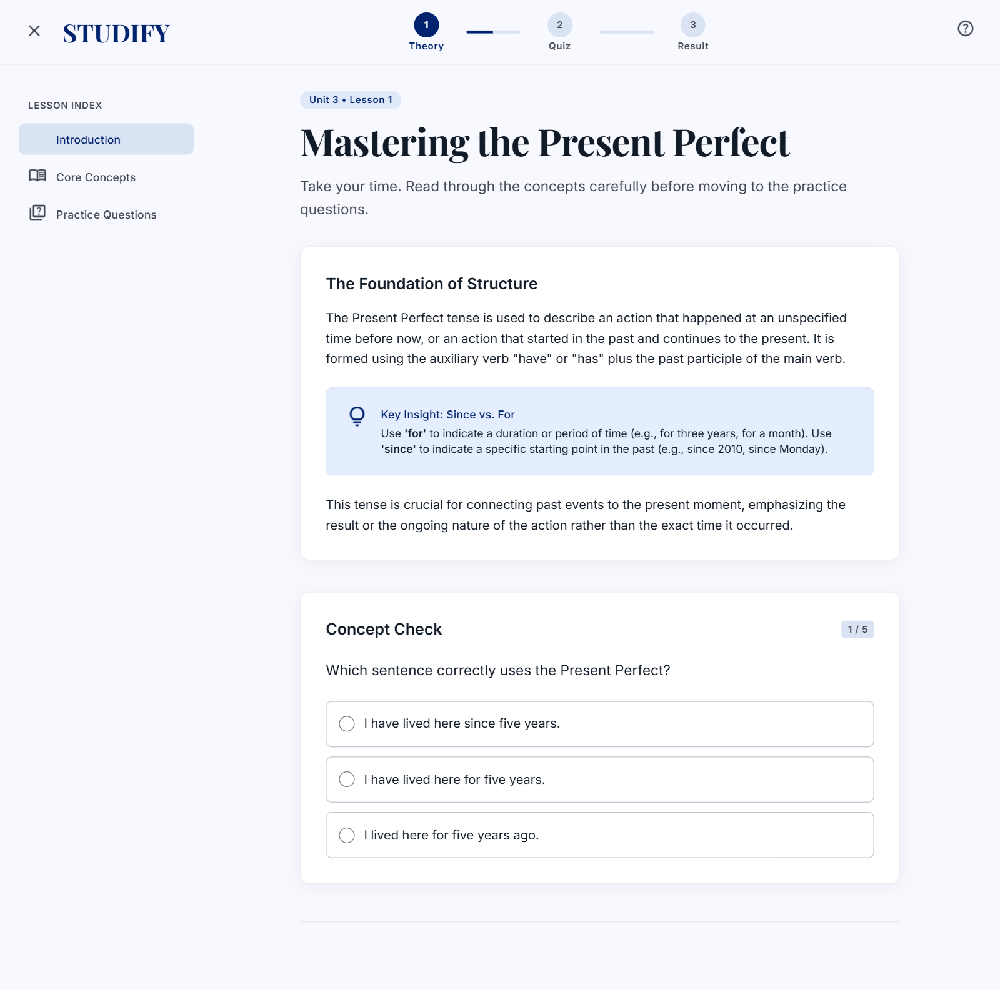

*Figure 3.1: Lesson study screen ("Mastering the Present Perfect") showing the Theory and Practice Exercises sections, condensed theory content, and an embedded concept-check question.*

---

## 2. Flow of Events

### 2.1 Basic Flow

This use case begins immediately after the Learner selects a specific lesson from the lesson list (triggered from the View Lesson Details by Level use case).

1. The system receives the lesson ID that the Learner has selected.
2. The system loads the full content of the lesson, including the theory section and the associated quiz.
3. The system displays the lesson study screen, starting with the theory content section.
4. The system executes the **Study Theory** use case *(<<include>>)* to present the condensed theoretical content to the Learner.
5. The Learner reviews the theory content and clicks the "Mark as Complete" button.
6. The system updates the Learner's progress for this lesson, marking it as Completed.
7. The Learner may optionally proceed to the practice exercises (reading or writing).
8. The use case ends when the Learner's lesson progress has been successfully updated.

### 2.2 Alternative Flows

#### 2.2.1 Learner Skips Practice Exercises

*Trigger condition: The Learner chooses to exit after clicking "Mark as Complete" on the theory content without taking the practice exercises.*

1. At step 7 of the Basic Flow, the Learner navigates away from the lesson screen without accessing practice exercises.
2. The system has already saved the Learner's progress for the lesson as "Completed" in step 6.
3. The use case ends.

#### 2.2.2 Load Failure / Network Error

*Trigger condition: An error occurs while loading lesson content (theory or quiz) from the server (network error, server 500 error, timeout).*

1. At step 2 of the Basic Flow, the request to fetch lesson content fails.
2. The system displays a user-friendly error message, e.g., "Unable to load the lesson content. Please check your network connection and try again."
3. The system provides a "Retry" button.
4. If the Learner selects "Retry," the flow returns to step 2 of the Basic Flow.
5. If the Learner takes no action, the use case ends.

#### 2.2.3 Learner Exits Lesson Early

*Trigger condition: The Learner chooses to leave the lesson screen before marking the theory as complete.*

1. At any point between step 3 and step 4 of the Basic Flow, the Learner navigates back.
2. The lesson status remains incomplete.
3. The flow navigates the Learner back to the lesson list (View Lesson Details by Level).
4. The use case ends.

---

## 3. Special Requirements

### 3.1 Performance

Lesson content (theory and quiz) must be fully loaded within a maximum of 3 seconds under normal network conditions.

### 3.2 Usability

The transition between the theory section and the practice exercises must be clear and intuitive, with visible buttons for Practice Writing Exercises and Practice Reading Exercises.

---

## 4. Preconditions

### 4.1 Lesson Selected

The Learner has selected a specific lesson from the View Lesson Details by Level screen before this use case is executed.

---

## 5. Postconditions

### 5.1 Lesson Progress Updated

The system has successfully updated the Learner's progress for the selected lesson (Not Started / In Progress / Completed), based on whether the Learner completed the theory section, the quiz, or both.

---

## 6. Extension Points

### 6.1 Theory Section

This extension point occurs at step 4 of the Basic Flow, right after the lesson study screen is displayed. This is the point where the **Study Theory** use case is included to present the condensed theoretical content to the Learner.

### 6.2 Quiz Section

This extension point occurs at step 6 of the Basic Flow, after the Learner has finished reviewing the theory content. This is the point where the **Take Quiz** use case is included to present the quiz associated with the lesson.

---

# UC4: Study Theory

**Version:** 1.0

---

### Revision History

| Date | Version | Description | Author |
| :--- | :--- | :--- | :--- |
| 23/Jul/26 | 1.0 | Initial draft of use-case specification UC4 – Study Theory | `Lê Kim Hằng` |

---

## 1. Use-Case Name

**Study Theory**

### 1.1 Brief Description

This use case allows the Learner to review the condensed theoretical content of a lesson before taking the associated quiz. The theory content is presented in a concise, easy-to-digest format (e.g., key points, short explanations, examples) rather than a long-form article, so the Learner can grasp the core concepts quickly. This use case is included by the **Study Lesson** use case and represents the first stage of the lesson study flow.

*Figure 4.1: Condensed theory content ("Defining the Present Perfect"), Theory Part 1 of 3, with Previous/Next Concept navigation.*

---

## 2. Flow of Events

### 2.1 Basic Flow

This use case begins immediately after the system displays the lesson study screen and starts with the theory content section (triggered from the Study Lesson use case).

1. The system retrieves the condensed theory content associated with the selected lesson (key points, short explanations, illustrative examples).
2. The system displays the theory content on screen, organized into short, clearly separated sections (e.g., cards, bullet points, or paginated slides).
3. The Learner reads through the theory content, navigating between sections using "Next" / "Previous" controls if the content spans multiple sections.
4. Once the Learner has reviewed all theory sections, the system enables the "Continue to Quiz" button.
5. The Learner selects "Continue to Quiz."
6. The use case ends, and control returns to the Study Lesson use case, which proceeds to the Take Quiz use case.

### 2.2 Alternative Flows

#### 2.2.1 Empty Theory Content

*Trigger condition: The selected lesson has no theory content configured (data not yet entered).*

1. At step 1 of the Basic Flow, the system detects that no theory content exists for the lesson.
2. The system displays the message "No theory content is available for this lesson yet."
3. The system automatically enables the "Continue to Quiz" button so the Learner is not blocked.
4. The use case ends.

#### 2.2.2 Load Failure / Network Error

*Trigger condition: An error occurs while retrieving theory content from the server (network error, server 500 error, timeout).*

1. At step 1 of the Basic Flow, the request to fetch theory content fails.
2. The system displays a user-friendly error message, e.g., "Unable to load the lesson content. Please check your network connection and try again."
3. The system provides a "Retry" button.
4. If the Learner selects "Retry," the flow returns to step 1 of the Basic Flow.
5. If the Learner takes no action, the use case ends.

#### 2.2.3 Learner Revisits Theory Content

*Trigger condition: The Learner has already completed the quiz for this lesson previously and re-opens the lesson to review the theory content again.*

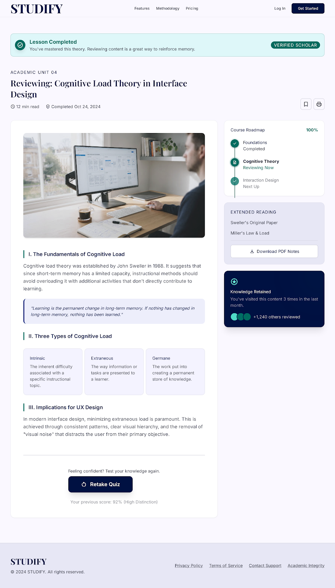

1. At step 2 of the Basic Flow, the system detects that the Learner has already completed this lesson.
2. The system displays the theory content in a read-only review mode, along with a note indicating the lesson has already been completed.
3. The Learner may still navigate through the content and choose "Continue to Quiz" to retake the quiz, or exit back to the lesson list.
4. The use case ends.

---

## 3. Special Requirements

### 3.1 Performance

Theory content must be fully loaded and rendered within a maximum of 2 seconds under normal network conditions.

### 3.2 Usability

Theory content must remain concise (condensed format), avoiding long blocks of text. Each section should be scannable within a few seconds, using visual aids (icons, highlighted keywords, short examples) to support quick comprehension.

---

## 4. Preconditions

### 4.1 Lesson Loaded

The lesson study screen has already been loaded and the Study Lesson use case has directed the flow to the theory content section.

---

## 5. Postconditions

### 5.1 Theory Section Marked as Reviewed

The system has recorded that the Learner has reviewed the theory content for this lesson, and the Learner has been directed to proceed to the quiz section.

---

## 6. Extension Points

### 6.1 Proceed to Quiz

This extension point occurs at step 5 of the Basic Flow, after the Learner selects "Continue to Quiz." This is the point where control returns to the Study Lesson use case, which then includes the **Take Quiz** use case.

---

# UC5: Take Quiz

**Version:** 1.0

---

### Revision History

| Date | Version | Description | Author |
| :--- | :--- | :--- | :--- |
| 23/Jul/26 | 1.0 | Initial draft of use-case specification UC5 – Take Quiz | `Lê Kim Hằng` |

---

## 1. Use-Case Name

**Take Quiz**

### 1.1 Brief Description

This use case allows the Learner to answer a set of quiz questions associated with a lesson, in order to test their comprehension of the theory content just reviewed. The quiz may contain different question types, specifically **Multiple Choice** and **Fill in the Blank**, which are specializations (generalization relationship) of this use case. Once the Learner submits the quiz, this use case includes the **View Quiz/Assessment Result** use case to present the outcome. This use case is included by the **Study Lesson** use case.

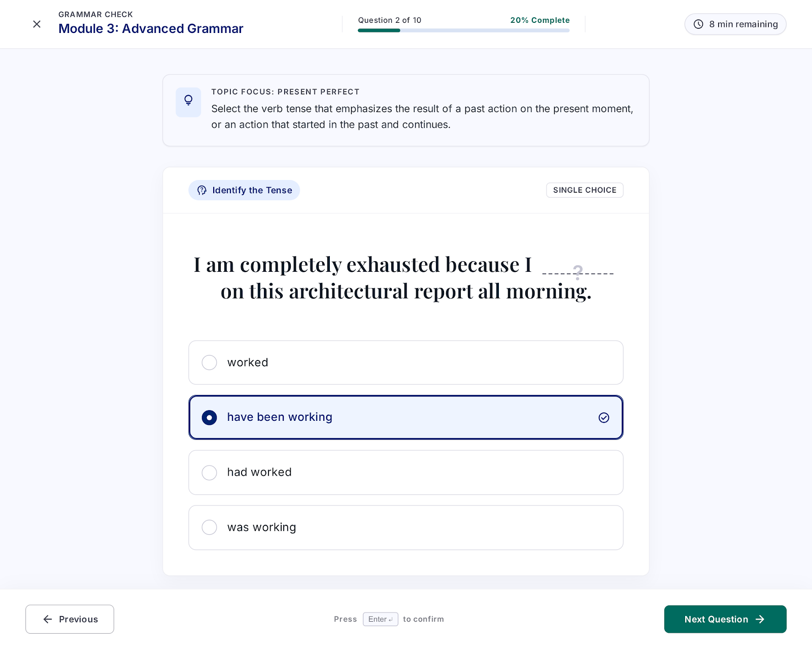

*Figure 5.1: Quiz question 2 of 10 (Fill in the Blank format), showing question progress, remaining time, and answer options.*

---

## 2. Flow of Events

### 2.1 Basic Flow

This use case begins immediately after the Learner selects "Continue to Quiz" from the Study Theory section (triggered from the Study Lesson use case).

1. The system retrieves the list of quiz questions associated with the selected lesson.
2. The system displays the first question to the Learner, along with the total number of questions and the current question index (e.g., "Question 1 of 10").
3. The system renders the question according to its type — either as a **Multiple Choice** question or a **Fill in the Blank** question — following the corresponding specialized flow.
4. The Learner submits an answer for the current question.
5. The system records the Learner's answer and moves to the next question.
6. Steps 3–5 repeat until the Learner has answered all questions in the quiz.
7. The Learner submits the completed quiz.
8. The system calculates the quiz score by comparing the Learner's answers against the correct answers.
9. The system saves the quiz attempt (score, answers, timestamp) associated with the Learner and the lesson.
10. The system executes the **View Quiz/Assessment Result** use case *(<<include>>)* to present the outcome to the Learner.
11. The use case ends when the quiz result has been successfully displayed.

### 2.2 Alternative Flows

#### 2.2.1 Multiple Choice Question Type

*Specialization (generalization): applies when the current question is of type Multiple Choice.*

1. At step 3 of the Basic Flow, the system renders the question stem along with a set of predefined answer options (typically 2–4 options).
2. The Learner selects exactly one option as their answer.
3. The flow resumes at step 4 of the Basic Flow.

#### 2.2.2 Fill in the Blank Question Type

*Specialization (generalization): applies when the current question is of type Fill in the Blank.*

1. At step 3 of the Basic Flow, the system renders the question stem containing one or more blank input fields.
2. The Learner types the missing word(s) or phrase(s) directly into the input field(s).
3. The system may apply basic normalization (trimming whitespace, case-insensitive comparison) when the answer is later evaluated.
4. The flow resumes at step 4 of the Basic Flow.

#### 2.2.3 Learner Leaves a Question Unanswered

*Trigger condition: The Learner attempts to move to the next question or submit the quiz without answering the current question.*

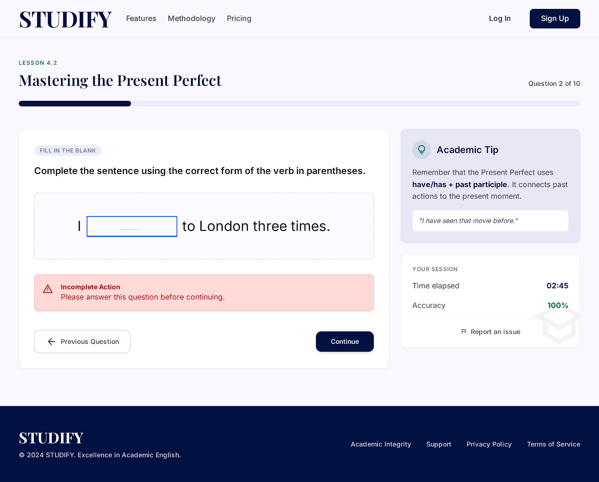

1. At step 4 of the Basic Flow, the Learner selects "Next" or "Submit" without providing an answer.
2. The system displays a warning: "Please answer this question before continuing."
3. The flow resumes at step 3 of the Basic Flow for the current question.

#### 2.2.4 Empty Quiz

*Trigger condition: The selected lesson has no quiz questions configured.*

1. At step 1 of the Basic Flow, the system detects that no questions exist for the lesson's quiz.
2. The system displays the message "No quiz is available for this lesson yet."
3. The system marks the lesson as completed based on the theory section alone, and returns control to the Study Lesson use case.
4. The use case ends.

#### 2.2.5 Load Failure / Network Error

*Trigger condition: An error occurs while retrieving quiz questions or submitting quiz answers to the server (network error, server 500 error, timeout).*

1. At step 1 or step 7 of the Basic Flow, the corresponding request fails.
2. The system displays a user-friendly error message, e.g., "Unable to load/submit the quiz. Please check your network connection and try again."
3. The system provides a "Retry" button.
4. If the Learner selects "Retry," the flow returns to the step that failed.
5. If the Learner takes no action, the use case ends without the quiz result being recorded.

#### 2.2.6 Learner Exits Quiz Early

*Trigger condition: The Learner chooses to leave the quiz before answering all questions.*

1. At any point between step 3 and step 6 of the Basic Flow, the Learner selects "Exit" or navigates back.
2. The system displays a confirmation prompt: "Your quiz progress will not be saved if you exit now. Are you sure?"
3. If the Learner confirms, the system discards the in-progress quiz attempt and navigates the Learner back to the lesson screen.
4. If the Learner cancels, the flow resumes at the point it was interrupted.
5. The use case ends if the Learner confirmed the exit.

---

## 3. Special Requirements

### 3.1 Performance

The quiz questions must be fully loaded within a maximum of 2 seconds, and the quiz score must be calculated and the result displayed within 1 second after submission, under normal network conditions.

### 3.2 Usability

The quiz interface must clearly indicate question progress (e.g., a progress bar or "Question X of Y" indicator) and provide clear visual distinction between Multiple Choice and Fill in the Blank question formats so the Learner immediately understands how to answer each type.

---

## 4. Preconditions

### 4.1 Theory Section Reviewed

The Learner has completed the Study Theory use case for the current lesson (or the lesson has no theory content) before this use case is executed.

---

## 5. Postconditions

### 5.1 Quiz Result Recorded

The system has saved the Learner's quiz attempt, including the score, submitted answers, and timestamp, and the corresponding lesson progress has been updated accordingly.

---

## 6. Extension Points

### 6.1 View Result

This extension point occurs at step 10 of the Basic Flow, immediately after the Learner submits the completed quiz and the score has been calculated. This is the point where the **View Quiz/Assessment Result** use case is included to present the outcome to the Learner.

---

# UC6: Multiple Choice

**Version:** 1.0

---

### Revision History

| Date | Version | Description | Author |
| :--- | :--- | :--- | :--- |
| 23/Jul/26 | 1.0 | Initial draft for UC6: Multiple Choice | `Lê Kim Hằng` |

---

## 1. Use-Case Name

**UC6: Multiple Choice**

### 1.1 Brief Description

This use case describes the specific interaction when a Learner encounters a Multiple Choice question during a quiz. As a specialization (generalization relationship) of UC5: Take Quiz, it details how the system presents a question with predefined options and how the Learner selects their intended answer(s). It supports both single-correct-answer (radio buttons) and multiple-correct-answer (checkboxes) formats.

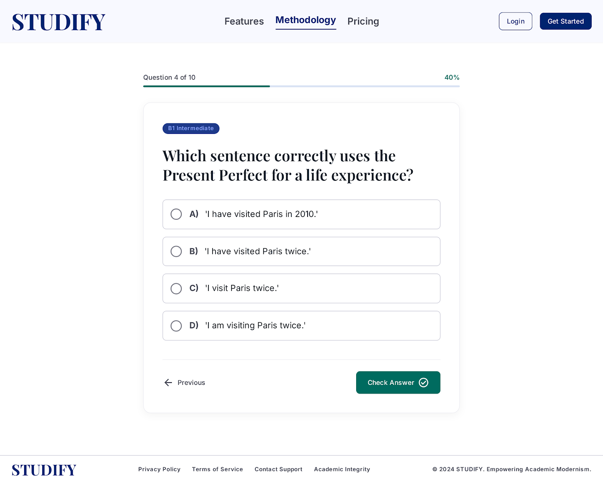

*Figure 6.1: Multiple Choice question (single-answer, radio button format) showing four answer options with a "Check Answer" action.*

---

## 2. Flow of Events

### 2.1 Basic Flow

1. The use case begins when the quiz engine (UC5) loads a question designated as the "Multiple Choice" type.
2. The system displays the question prompt text and/or media (images, audio).
3. The system displays a list of predefined answer options below the prompt.
   * If the question allows only **one** correct answer, the options are presented as mutually exclusive radio buttons.
   * If the question allows **multiple** correct answers, the options are presented as independent checkboxes.
4. The Learner selects their desired option(s) by clicking or tapping on them.
5. The system visually highlights the selected option(s) to confirm the input.
6. The system temporarily stores the Learner's selection in the active quiz session.
7. The use case ends when the Learner navigates to another question or proceeds to submit the quiz (returning control to UC5).

### 2.2 Alternative Flows

#### 2.2.1 Changing Selection

If the Learner changes their mind before navigating away or submitting:

1. **Single-answer format:** The Learner selects a different radio button. The system automatically deselects the previously chosen option and highlights the new one.
2. **Multiple-answer format:** The Learner clicks an already selected checkbox to deselect it, or clicks unselected checkboxes to add to their choices. The system updates the visual state and session storage accordingly.

#### 2.2.2 Maximum Selection Limit Reached (Multiple Answers)

If a multiple-answer question has a predefined maximum number of allowed selections (e.g., "Select the 2 correct statements"):

1. The Learner selects the maximum allowed number of options.
2. If the Learner attempts to select an additional option, the system ignores the input and briefly displays a tooltip or message stating, "You can only select up to [X] options."
3. The Learner must deselect a currently chosen option before selecting a new one.

---

## 3. Special Requirements

### 3.1 Accessibility Requirement

The multiple-choice interface must be fully navigable using a keyboard (e.g., using `Tab` to move between options and `Space` to select/deselect). The options must also be readable by standard screen readers.

### 3.2 Visual Distinction

The user interface must clearly differentiate between single-answer questions (using standard circular radio buttons) and multiple-answer questions (using standard square checkboxes) so the Learner immediately understands the expected interaction.

---

## 4. Preconditions

### 4.1 Question Instantiation

The Learner must be actively executing UC5 (Take Quiz), and the system must have successfully retrieved a question payload from the database explicitly flagged as a "Multiple Choice" type.

---

## 5. Postconditions

### 5.1 Answer Recorded

The state of the system is updated to reflect the Learner's selected options for this specific question within the temporary quiz session memory. The system is ready to evaluate these answers once the overall quiz is submitted in UC5.

---

## 6. Extension Points

### 6.1 None

There are no extension points for this specific use case.

---

# UC7: Fill in the Blank

**Version:** 1.0

---

### Revision History

| Date | Version | Description | Author |
| :--- | :--- | :--- | :--- |
| 23/Jul/26 | 1.0 | Initial draft for UC7: Fill in the Blank | `Lê Kim Hằng` |

---

## 1. Use-Case Name

**UC7: Fill in the Blank**

### 1.1 Brief Description

This use case describes the specific interaction when a Learner encounters a Fill in the Blank question during a quiz. As a specialization (generalization relationship) of UC5: Take Quiz, it details how the system presents a sentence or paragraph containing missing words (blanks) and how the Learner utilizes text input fields to provide the missing information.

*Figure 7.1: Fill in the Blank question showing a sentence with an embedded text input field for the missing verb form.*

---

## 2. Flow of Events

### 2.1 Basic Flow

1. The use case begins when the quiz engine (UC5) loads a question designated as the "Fill in the Blank" type.
2. The system displays a text prompt (sentence or paragraph) with one or more embedded text input fields representing the "blanks".
3. The Learner clicks or taps on an input field to bring it into focus.
4. The Learner types their textual answer into the field using their keyboard.
5. If there are multiple blanks in the same question, the Learner navigates to the next input field (e.g., using the `Tab` key or clicking) and repeats step 4.
6. The system automatically captures and temporarily stores the typed text in the active quiz session memory as the Learner types or when the input field loses focus.
7. The use case ends when the Learner navigates to another question or proceeds to submit the quiz (returning control to UC5).

### 2.2 Alternative Flows

#### 2.2.1 Clearing Input

If the Learner realizes they have made a mistake and wishes to remove their answer before submission:

1. The Learner focuses on the populated input field.
2. The Learner uses the `Backspace` or `Delete` key to remove the text, leaving the field empty.
3. The system updates the session storage to reflect a null or empty string for that specific blank.

#### 2.2.2 Exceeding Character Limit

If the system has a predefined maximum character limit for a specific blank to prevent formatting issues or spam inputs:

1. The Learner types characters up to the maximum limit.
2. If the Learner attempts to type additional characters, the system prevents the input from registering in the field.
3. The system may optionally display a brief visual cue (e.g., a red outline or tooltip) indicating that the character limit has been reached.

---

## 3. Special Requirements

### 3.1 Data Sanitization

The system must sanitize all text inputs provided by the Learner to prevent malicious injections (e.g., Cross-Site Scripting - XSS) before storing or evaluating the answers. Leading and trailing white spaces should also be automatically trimmed during the evaluation phase to prevent false negatives.

### 3.2 Accessibility Requirement

Screen readers must be able to read the surrounding text contextually and clearly announce the presence of a text input field (e.g., "Blank 1", "Blank 2") so visually impaired Learners understand exactly where their input belongs within the sentence structure.

---

## 4. Preconditions

### 4.1 Question Instantiation

The Learner must be actively executing UC5 (Take Quiz), and the system must have successfully retrieved a question payload from the database explicitly flagged as a "Fill in the Blank" type.

---

## 5. Postconditions

### 5.1 Answer Recorded

The state of the system is updated to reflect the Learner's inputted text for the corresponding blanks within the temporary quiz session memory. The system is ready to evaluate these text strings against the correct answer keys (including acceptable variations or synonyms, if configured) once the overall quiz is submitted in UC5.

---

## 6. Extension Points

### 6.1 None

There are no explicit extension points for this specific use case.

---

# UC8: View Quiz/Assessment Result

**Version:** 1.1

---

### Revision History

| Date | Version | Description | Author |
| :--- | :--- | :--- | :--- |
| 23/Jul/26 | 1.0 | Initial draft for UC8 | `Lê Kim Hằng` |
| 23/Jul/26 | 1.1 | Updated to handle Level Assessment results and Level Advancement rules (F2.2) | `Lê Kim Hằng` |

---

## 1. Use-Case Name

**UC8: View Quiz/Assessment Result**

### 1.1 Brief Description

This use case presents the calculated results, score, and detailed feedback to the Learner after submitting either a lesson practice quiz (UC5) or a comprehensive Level Assessment Test (UC12). It evaluates compliance with pass/fail criteria and triggers progress updates (UC9) or level advancement (UC1).

*Figure 8.1: "Quiz Complete!" result screen showing final score, accuracy ratio, time expended, and detailed per-question feedback.*

---

## 2. Flow of Events

### 2.1 Basic Flow

1. The use case begins automatically when UC5 (Take Practice Quiz) or UC12 (Take Level Assessment Test) submits answers for evaluation.
2. The system retrieves evaluated answers, calculates score percentage, and identifies correct vs. incorrect responses.
3. The system displays the summary score board (score %, correct ratio, time taken).
4. The system presents a detailed question-by-question review showing submitted choices, correct keys, and explanation notes.
5. The Learner clicks "Continue".
6. The use case ends, returning the Learner to the lesson overview or roadmap interface.

### 2.2 Alternative Flows

#### 2.2.1 Level Assessment Passed (>= 90%)

If the submission originates from UC12 (Level Assessment Test) and the score is 90% or higher:

1. The system displays a prominent "Level Mastery Achieved!" celebration dialog.
2. The system triggers the extension point **6.2 Unlock Next CEFR Level** to unlock the subsequent level on the roadmap (UC1).
3. The flow proceeds to step 4 of the Basic Flow.

#### 2.2.2 Level Assessment Failed (< 90%)

If the submission originates from UC12 and the score is below 90%:

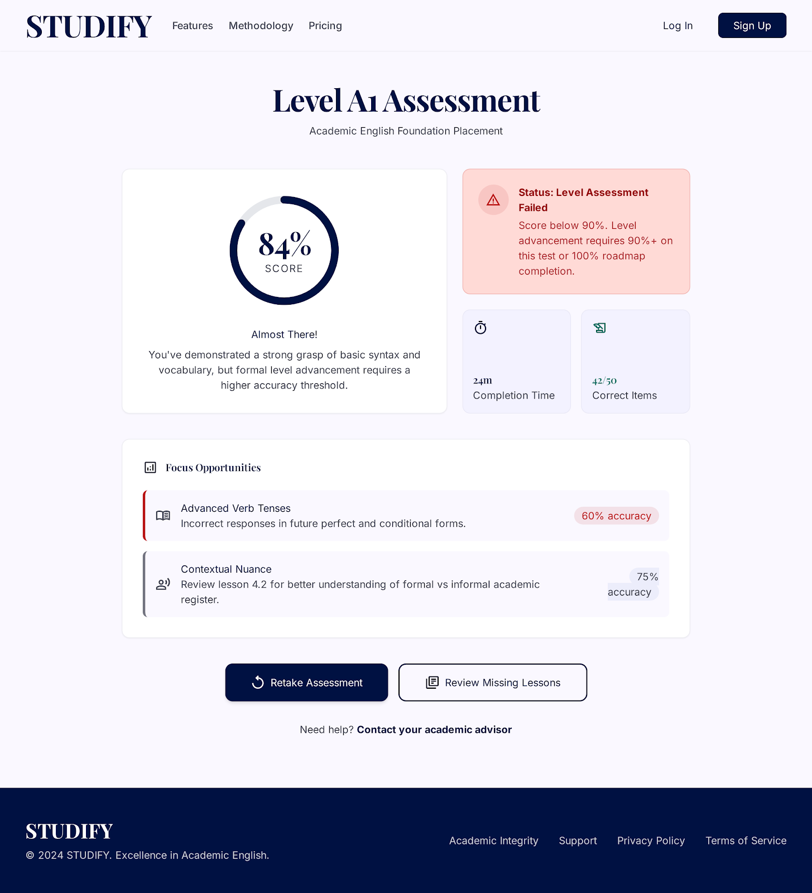

1. The system displays a message: "Score below 90%. Level advancement requires 90%+ on this test or 100% roadmap completion."
2. The system offers options to "Retake Assessment" or "Review Missing Lessons".
3. The flow proceeds to step 4 of the Basic Flow.

---

## 3. Special Requirements

### 3.1 Visual Feedback Requirement

Score indicators must clearly display pass/fail status using distinct visual hierarchy (e.g., Green/Badge for >=90% level pass, Yellow/Red for retake required).

---

## 4. Preconditions

### 4.1 Submission Completed

The Learner must have submitted answers via UC5 or UC12, and the system grading engine must have completed processing the submission.

---

## 5. Postconditions

### 5.1 Session Resolution

Assessment attempt data is archived in the user profile, and progression rules are updated.

---

## 6. Extension Points

### 6.1 Update Learning Progress

**Location:** Step 3 of Basic Flow.
**Description:** Extends to **UC9: Track Learning Progress** to update real-time statistics.

### 6.2 Unlock Next CEFR Level

**Location:** Step 2 of Alternative Flow 2.2.1.
**Description:** Extends to **UC1: View Learning Roadmap** to change the lock status of the next CEFR level from "Locked" to "Available".

---

# UC9: Track Learning Progress

**Version:** 1.0

---

### Revision History

| Date | Version | Description | Author |
| :--- | :--- | :--- | :--- |
| 23/Jul/26 | 1.0 | Initial draft for UC9: Track Learning Progress | `Lê Kim Hằng` |

---

## 1. Use-Case Name

**UC9: Track Learning Progress**

### 1.1 Brief Description

This use case allows the Learner to monitor their overall educational journey within the Self-Study Dashboard. It aggregates data from completed lessons, study time, and quiz scores to provide a comprehensive view of the Learner's performance. It inherently relies on calculating and visualizing the roadmap completion percentage (UC10) and can be extended to view specific past quiz results (UC8).

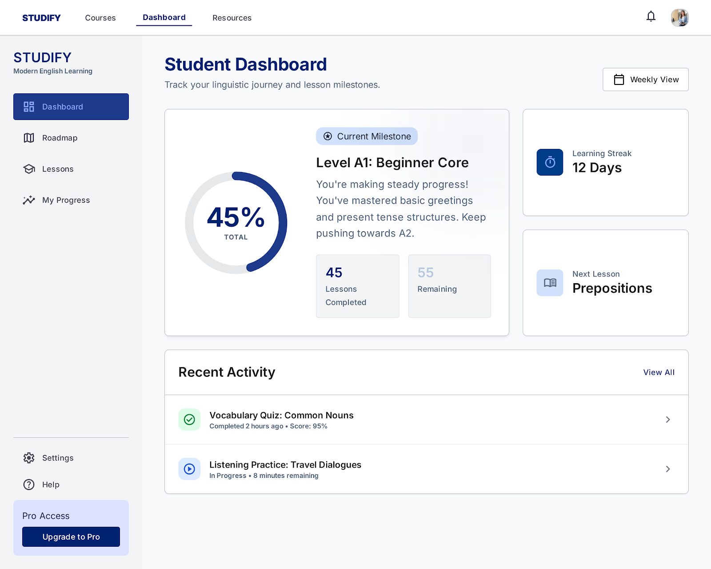

*Figure 9.1: Student Dashboard showing overall completion percentage, current milestone, learning streak, and recent activity.*

---

## 2. Flow of Events

### 2.1 Basic Flow

1. The Learner selects the "My Progress" or "Dashboard" tab from the main navigation menu.
2. The system queries the database to retrieve the Learner's historical learning data, including completed lessons, total study hours, and recent quiz scores.
3. The system executes **UC10: View Roadmap Completion %** (*<<include>> relationship*) to display the primary visual progress bar representing the Learner's journey through their current level (e.g., A1, A2).
4. The system populates the rest of the progress interface with detailed metrics (e.g., learning streaks, average quiz scores, and recent activities).
5. The Learner reviews their statistical data and overall progress.
6. The use case ends when the Learner navigates away from the progress dashboard.

### 2.2 Alternative Flows

#### 2.2.1 New Learner (No Data)

If the system detects that the Learner has not yet started any lessons or completed any quizzes:

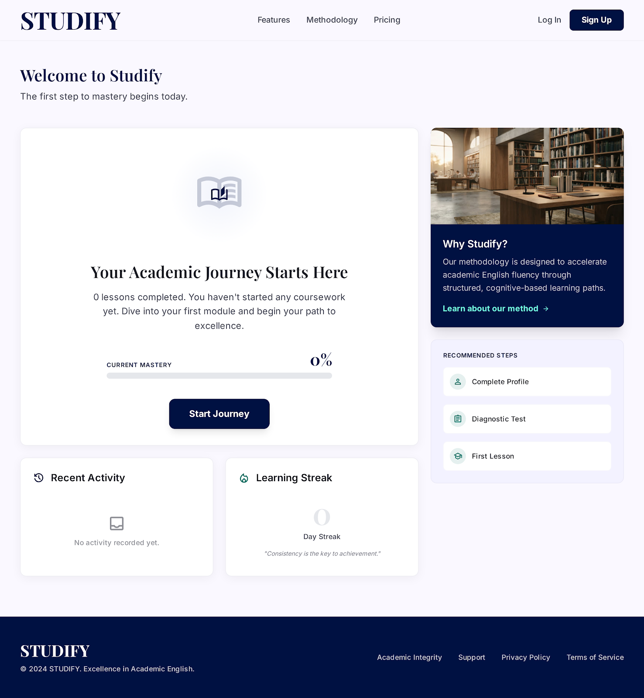

1. Instead of displaying empty charts or "0%" metrics, the system displays a welcoming "Get Started" state.
2. The system prompts the Learner with a call-to-action button to navigate to the Learning Roadmap (UC1) to begin their first lesson.
3. The flow ends.

---

## 3. Special Requirements

### 3.1 Real-Time Data Accuracy

The data presented in the progress dashboard must accurately reflect the Learner's most recent activities. Any quizzes completed (UC5) or lessons marked as done (UC3) must immediately reflect in this dashboard upon reload.

---

## 4. Preconditions

### 4.1 User Authentication

The Learner must be logged into the Self-Study Dashboard system and have an active profile with an assigned learning level (e.g., A1, A2).

---

## 5. Postconditions

### 5.1 Dashboard Rendered

The system successfully renders the progress metrics on the screen. The state of the database remains unchanged as this is a read-only operation for the Learner.

---

## 6. Extension Points

### 6.1 Review Past Assessments

**Location:** Step 4 of the Basic Flow.
**Description:** While viewing the list of recent activities and scores within their progress dashboard, the Learner can click on a specific completed quiz. This action triggers the extension use case **UC8: View Quiz/Assessment Result** (`<<extend>>` relationship), allowing the Learner to dive deeper into the detailed breakdown of their past performance without leaving the context of their overall progress tracking.

---

# UC10: View Roadmap Completion % (Progress Bar)

**Version:** 1.0

---

### Revision History

| Date | Version | Description | Author |
| :--- | :--- | :--- | :--- |
| 23/Jul/26 | 1.0 | Initial draft for UC10: View Roadmap Completion % | `Lê Kim Hằng` |

---

## 1. Use-Case Name

**UC10: View Roadmap Completion % (Progress Bar)**

### 1.1 Brief Description

This use case defines the presentation of the Learner's progress across their current learning level (e.g., Level A1 Roadmap). It is invoked as an included use case by UC9 (Track Learning Progress). Its primary responsibility is to render a visual progress bar and display the exact percentage of completion, which it retrieves by triggering UC11 (Calculate Completion %).

*Figure 10.1: Circular progress indicator (45% Total) with lessons-completed summary, part of the Student Dashboard rendered by this use case.*

---

## 2. Flow of Events

### 2.1 Basic Flow

1. The use case begins when UC9 (Track Learning Progress) or another relevant dashboard view requests the display of the overall roadmap progress.
2. The system invokes **UC11: Calculate Completion % (real-time)** (*<<include>> relationship*) to compute the exact numerical value based on the Learner's completed lessons versus total lessons in the roadmap.
3. UC11 returns the calculated percentage (e.g., 45%) to this use case.
4. The system renders the visual progress bar component on the user interface.
   * The bar is filled proportionally to represent the calculated percentage.
   * The exact numerical percentage (e.g., "45%") is displayed either inside or immediately adjacent to the progress bar.
   * The system displays a text summary (e.g., "45 of 100 lessons completed").
5. The use case ends, and the system continues rendering the rest of the parent dashboard (UC9).

### 2.2 Alternative Flows

#### 2.2.1 Roadmap Fully Completed (100%)

If UC11 returns a value of 100%:

1. The system renders the progress bar completely filled.
2. The system applies a distinct visual styling (e.g., a gold color, a glowing effect, or a "completed" badge) to signify mastery of the level.
3. The system may display a "Level Completed!" congratulatory message alongside the progress bar.

#### 2.2.2 Roadmap Just Started (0%)

If UC11 returns a value of 0% (the Learner has not completed any lessons in this roadmap):

1. The system renders an empty progress bar track.
2. The exact percentage is displayed as "0%".
3. The system displays an encouraging prompt, such as "0 lessons completed. Start your first lesson today!"

---

## 3. Special Requirements

### 3.1 Visual Accessibility

The progress bar must utilize a color contrast ratio that meets standard accessibility guidelines (e.g., WCAG 2.1 AA) so that visually impaired users can easily distinguish the "filled" portion of the bar from the "unfilled" background track.

### 3.2 Responsive Design

The progress bar component must be responsive. It should dynamically resize its width to fit perfectly within the constraints of mobile screens, tablets, and desktop monitors without distorting or clipping the percentage text.

---

## 4. Preconditions

### 4.1 Active Roadmap Context

The Learner must be enrolled in a specific learning level/roadmap, and the parent use case (UC9) must pass the specific roadmap identifier to this use case so that progress can be visualized accurately.

---

## 5. Postconditions

### 5.1 UI Component Rendered

The visual progress bar and text summary are successfully drawn on the user interface, reflecting the most up-to-date completion status. The underlying database state remains unchanged.

---

## 6. Extension Points

### 6.1 None

There are no extension points for this specific use case.

---

# UC11: Calculate Completion % (real-time)

**Version:** 1.0

---

### Revision History

| Date | Version | Description | Author |
| :--- | :--- | :--- | :--- |
| 23/Jul/26 | 1.0 | Initial draft for UC11 (System Calculation Logic) | `Lê Kim Hằng` |

---

## 1. Use-Case Name

**UC11: Calculate Completion % (real-time)**

### 1.1 Brief Description

This is an internal system use case invoked by **UC10 (View Roadmap Completion %)**. Its sole responsibility is to query the database for the Learner's progress within a specific CEFR level roadmap and compute the exact completion percentage in real-time.

*Figure 11.1: Dashboard skeleton loading state — "Syncing progress in real-time..." — visually representing this background calculation.*

---

## 2. Flow of Events

### 2.1 Basic Flow

1. The use case receives a request from UC10, containing the `Learner_ID` and the active `Roadmap_ID` (e.g., Level A1).
2. The system queries the database to count the total number of mandatory lessons in the specified roadmap.
3. The system queries the database to count the total number of lessons the Learner has successfully completed in that roadmap.
4. The system calculates the completion percentage using the following formula:
   $$\text{Completion Percentage} = \left( \frac{\text{Completed Lessons}}{\text{Total Lessons}} \right) \times 100$$
5. The system rounds the calculated value to the nearest whole number (e.g., 45.6% becomes 46%).
6. The system returns the calculated integer value to UC10.
7. The use case ends.

### 2.2 Alternative Flows

#### 2.2.1 Division by Zero Prevention (Empty Roadmap)

If the system detects that the requested roadmap has 0 total lessons configured (to prevent a division-by-zero backend error):

1. The system catches the zero-value condition before performing the calculation in step 4 of the Basic Flow.
2. The system automatically sets the completion percentage to 0%.
3. The flow proceeds to step 6 of the Basic Flow, returning 0% to UC10.

---

## 3. Special Requirements

### 3.1 Performance Requirement

Because this calculation blocks the rendering of the progress bar in UC10, the query and calculation must execute in under 100ms.

---

## 4. Preconditions

### 4.1 Invocation Request

This use case must be called by UC10 with valid `Learner_ID` and `Roadmap_ID` parameters.

---

## 5. Postconditions

### 5.1 Percentage Returned

An integer representing the completion percentage is returned to the UI layer. The database state remains unchanged.

---

## 6. Extension Points

### 6.1 None

No extension points for this system operation.

---

# UC12: Take Level Assessment Test

**Version:** 1.0

---

### Revision History

| Date | Version | Description | Author |
| :--- | :--- | :--- | :--- |
| 23/Jul/26 | 1.0 | Initial draft for UC12 (F2.2 Level Test requirement) | `Lê Kim Hằng` |

---

## 1. Use-Case Name

**UC12: Take Level Assessment Test**

### 1.1 Brief Description

This use case enables a Learner to take a comprehensive assessment test for a specific CEFR level (e.g., A1, A2). Scoring >= 90% on this test allows the Learner to skip directly to the next CEFR level without completing all individual lessons. It utilizes Multiple Choice (UC6) and Fill in the Blank (UC7) question formats.

*Figure 12.1: CEFR Level A1 Formal Assessment — "Reading Comprehension & Grammar" question 7 of 20, with countdown progress bar.*

---

## 2. Flow of Events

### 2.1 Basic Flow

1. The Learner selects "Take Level Assessment Test" from the Roadmap overview (UC1).
2. The system retrieves a randomized test pool containing both Multiple Choice (UC6) and Fill in the Blank (UC7) questions for the active level.
3. The system initiates a countdown timer and renders the test interface.
4. The Learner completes the questions.
5. The Learner clicks "Submit Assessment".
6. The system executes **UC8: View Quiz/Assessment Result** (*<<include>> relationship*).

### 2.2 Alternative Flows

#### 2.2.1 Test Timer Expiration

If the allocated time for the assessment expires before the Learner clicks "Submit Assessment":

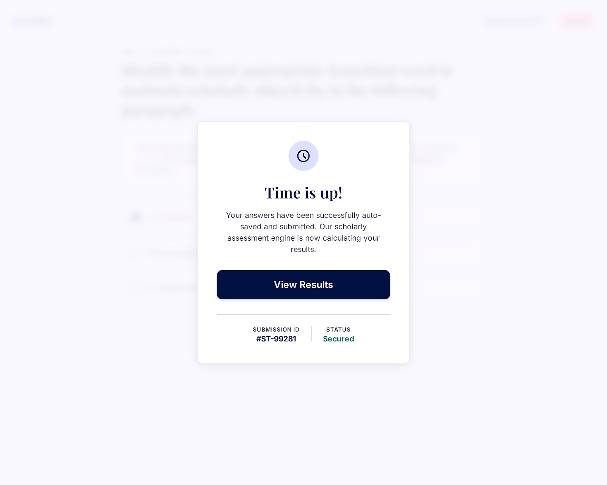

1. The system automatically locks the test interface.
2. The system force-submits all currently answered questions.
3. The flow proceeds to step 6 of the Basic Flow (UC8).

---

## 3. Special Requirements

### 3.1 Timer and Anti-Cheating Controls

The test session must enforce a strict server-side timer (e.g., 30 minutes) to prevent local client clock manipulation.

---

## 4. Preconditions

### 4.1 Level Selected

The Learner must have selected an active or accessible CEFR level from the Roadmap (UC1).

---

## 5. Postconditions

### 5.1 Submission Initiated

The assessment attempt is logged, and results are handed over to UC8 for evaluation against the 90% threshold rule.

---

## 6. Extension Points

### 6.1 None

No extension points for this use case.

---

# UC13: Set Study Commitment Hours

**Version:** 1.0

---

### Revision History

| Date | Version | Description | Author |
| :--- | :--- | :--- | :--- |
| 23/Jul/26 | 1.0 | Initial draft for UC13 (F2.5 Commitment Settings) | `Lê Kim Hằng` |

---

## 1. Use-Case Name

**UC13: Set Study Commitment Hours**

### 1.1 Brief Description

This use case allows the Learner to input or modify their committed daily/weekly English study time (e.g., 30 mins/day, 1.5 hours/day). The system uses this setting to dynamically calculate daily task targets on the dashboard widget (F2.5).

*Figure 13.1: "Study Commitment" screen showing Casual / Steady / Intensive presets and a custom minutes-per-day input field.*

---

## 2. Flow of Events

### 2.1 Basic Flow

1. The Learner opens the Settings or Study Preference modal from the Dashboard.
2. The system displays options to select target study duration per day or week.
3. The Learner selects or inputs their desired commitment hours (e.g., 1 hour per day).
4. The Learner clicks "Save Schedule Preference".
5. The system validates and saves the commitment settings to the Learner's profile.
6. The system notifies the widget engine to recalculate daily task quotas.
7. The use case ends.

### 2.2 Alternative Flows

#### 2.2.1 Invalid Input Values

If the Learner inputs 0 or an unrealistically high number (e.g., > 16 hours/day):

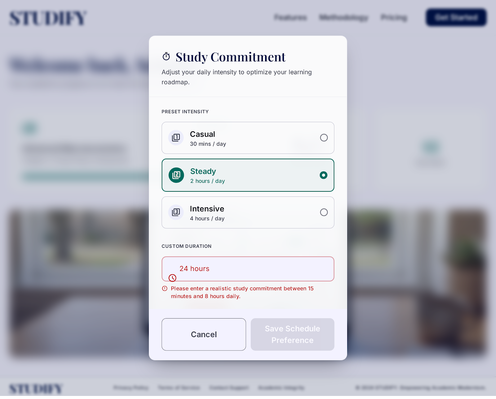

1. The system displays a validation warning: "Please enter a realistic study commitment between 15 minutes and 8 hours daily."
2. The Learner updates the input value and retries saving.

---

## 3. Special Requirements

### 3.1 Input Usability

The UI should provide intuitive presets (e.g., "Casual: 15m/day", "Regular: 30m/day", "Intensive: 1h+/day") alongside custom numeric inputs.

---

## 4. Preconditions

### 4.1 Profile Active

The Learner must be logged into the system.

---

## 5. Postconditions

### 5.1 Settings Saved

The user's daily time budget is stored in the database, triggering dynamic task scheduling for UC14/UC15.

---

## 6. Extension Points

### 6.1 None

No extension points for this use case.

---

# UC14: View Daily Study Widget

**Version:** 1.0

---

### Revision History

| Date | Version | Description | Author |
| :--- | :--- | :--- | :--- |
| 23/Jul/26 | 1.0 | Initial draft for UC14 (F2.5 Dashboard Widget) | `Lê Kim Hằng` |

---

## 1. Use-Case Name

**UC14: View Daily Study Widget**

### 1.1 Brief Description

This use case presents a dedicated schedule widget on the main Self-Study Dashboard. Based on the Learner's committed study hours (UC13), the widget displays assigned daily lessons, calculated session durations, and real-time completion checklists for the current day.

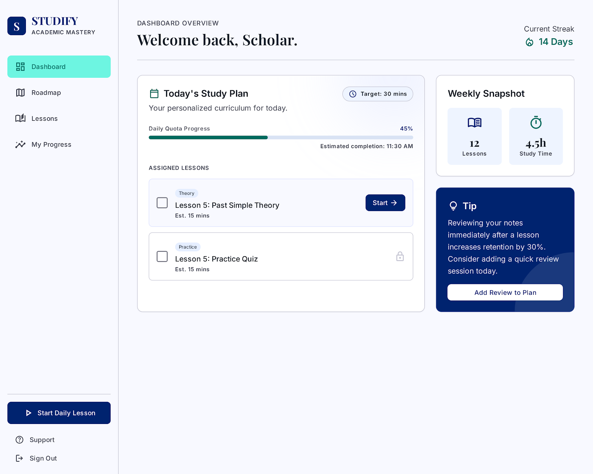

*Figure 14.1: "Today's Study Plan" widget showing daily quota progress, assigned lessons (Theory/Practice), and a contextual study tip.*

---

## 2. Flow of Events

### 2.1 Basic Flow

1. The Learner lands on the Self-Study Dashboard page.
2. The widget invokes **UC15: Calculate Daily Tasks Schedule** (*<<include>> relationship*) to compute today's target lessons based on user commitment.
3. UC15 returns the list of daily assigned lessons and estimated total time.
4. The system renders the Daily Study Widget displaying:
   * Target time for today (e.g., "30 mins target").
   * Assigned lesson cards (e.g., "Lesson 3: Grammar Focus").
   * Completion checkboxes and start buttons for each task.
5. The Learner views their daily schedule or clicks a lesson task to jump directly into **UC3: Study Lesson**.
6. The use case ends.

### 2.2 Alternative Flows

#### 2.2.1 No Commitment Set

If the Learner has not yet configured their commitment hours via UC13:

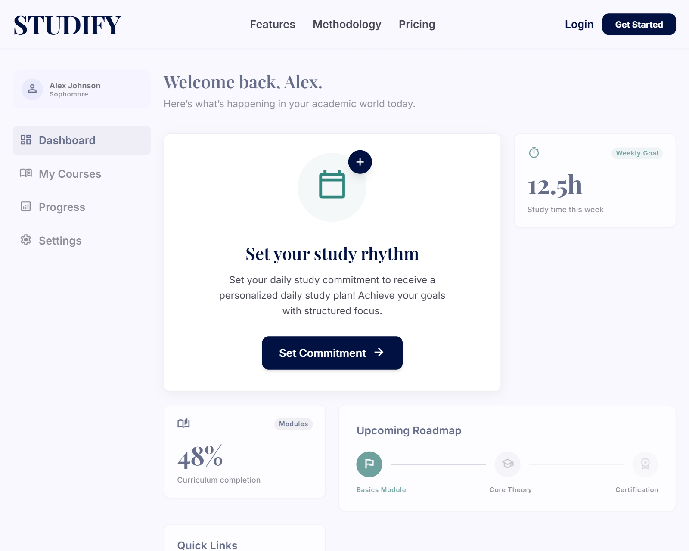

1. The widget displays a default banner: "Set your daily study commitment to receive a personalized daily study plan!"
2. Clicking the banner redirects the Learner to **UC13: Set Study Commitment Hours**.

---

## 3. Special Requirements

### 3.1 Widget Responsiveness

The widget must render cleanly at the top of the mobile and desktop dashboard layout, allowing one-tap access to launch today's lessons.

---

## 4. Preconditions

### 4.1 Dashboard Access

The Learner must be authenticated and viewing the main dashboard interface.

---

## 5. Postconditions

### 5.1 Tasks Displayed

The Learner's daily agenda is visually presented without modifying underlying data.

---

## 6. Extension Points

### 6.1 None

No extension points for this use case.

---

# UC15: Calculate Daily Tasks Schedule

**Version:** 1.0

---

### Revision History

| Date | Version | Description | Author |
| :--- | :--- | :--- | :--- |
| 23/Jul/26 | 1.0 | Initial draft for UC15 (F2.5 Calculation Logic) | `Lê Kim Hằng` |

---

## 1. Use-Case Name

**UC15: Calculate Daily Tasks Schedule**

### 1.1 Brief Description

This is an internal system use case invoked by UC14 (View Daily Study Widget). It calculates how many lessons and practice exercises should be assigned to the Learner for today based on their committed study time (UC13) and estimated average lesson completion times.

*Figure 15.1: Dashboard loading state — "Calculating your personalized daily schedule..." — representing this internal calculation use case in progress.*

---

## 2. Flow of Events

### 2.1 Basic Flow

1. The use case receives `Learner_ID`, active `CEFR_Level`, and `Commitment_Hours` parameters from UC14.
2. The system queries the average completion time stored for upcoming uncompleted lessons in the Learner's current roadmap.
3. The system maps available lessons against the daily time budget:
   $$\text{Daily Lesson Quota} = \left\lfloor \frac{\text{Commitment Minutes}}{\text{Average Minutes Per Lesson}} \right\rfloor$$
4. If the quota is less than 1, the system assigns at least 1 lesson section or theory unit to maintain daily learning momentum.
5. The system constructs a daily payload containing the specific `Lesson_IDs` assigned for the current date.
6. The system returns the payload to UC14.
7. The use case ends.

### 2.2 Alternative Flows

#### 2.2.1 All Level Tasks Completed

If the system detects that all lessons in the active level roadmap are already completed:

1. The system sets the daily task payload to recommend taking **UC12: Take Level Assessment Test** or advancing to the next level on UC1.
2. The system returns this recommendation payload to UC14.

---

## 3. Special Requirements

### 3.1 Sub-Second Execution

The task allocation algorithm must run in under 50ms to prevent lag when rendering the dashboard widget.

---

## 4. Preconditions

### 4.1 Invocation Request

Must be called with valid user profile and active roadmap parameters from UC14.

---

## 5. Postconditions

### 5.1 Task List Returned

A structured array of assigned daily tasks is passed back to the UI widget layer.

---

## 6. Extension Points

### 6.1 None

No extension points for this system operation.
