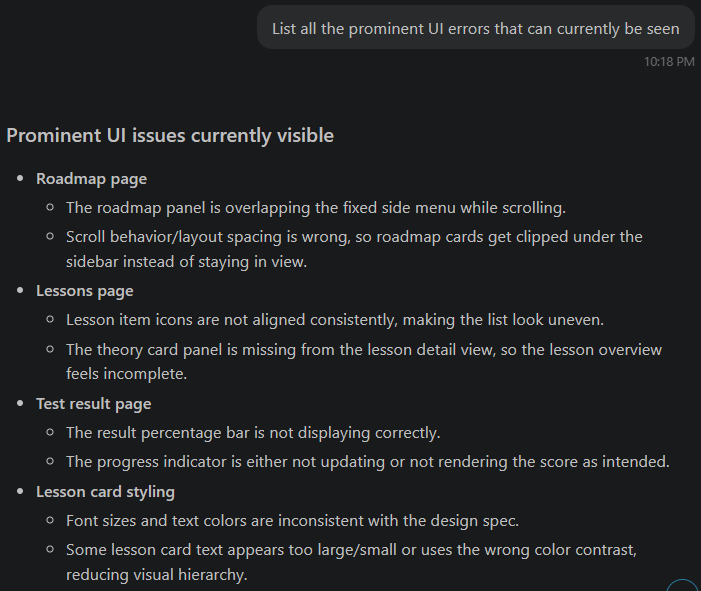
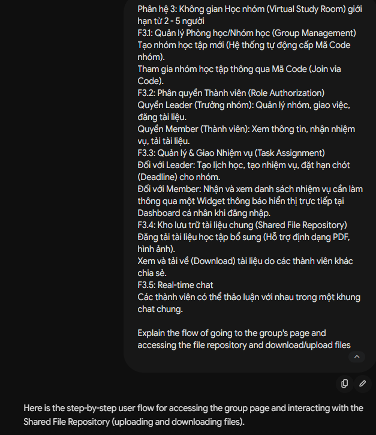
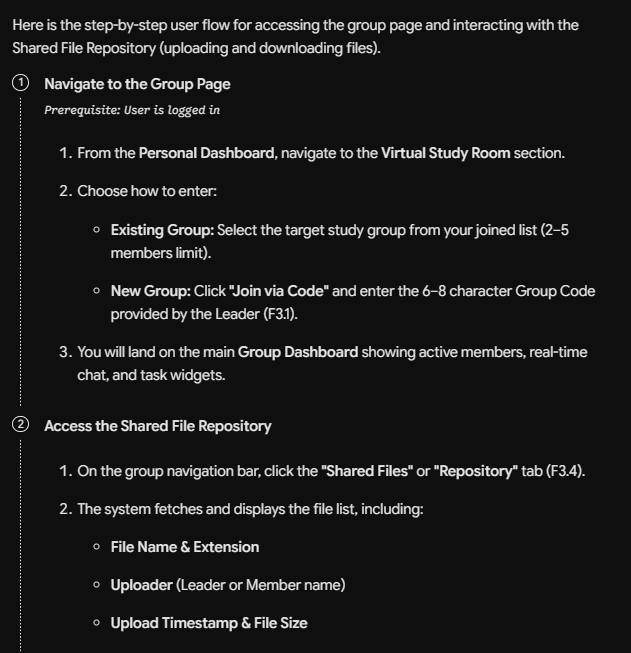
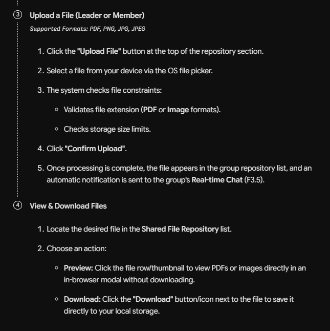
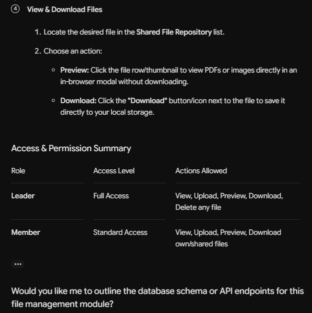
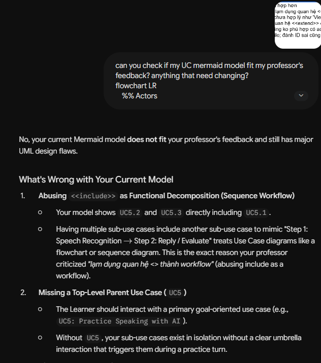

# AI Usage Report

## Table of Contents

- [AI Usage Report](#ai-usage-report)
  - [Table of Contents](#table-of-contents)
  - [Kim Hằng's AI Usage:](#kim-hằngs-ai-usage)
  - [Khánh Linh's AI Usage:](#khánh-linhs-ai-usage)
  - [Gia Phúc's AI Usage:](#gia-phúcs-ai-usage)
  - [Thiên Phước's AI Usage:](#thiên-phướcs-ai-usage)
  - [Minh Thư's AI Usage:](#minh-thưs-ai-usage)
- [Appendix: AI Usage Proof](#appendix-ai-usage-proof)
  - [Kim Hằng](#kim-hằng)
  - [Khánh Linh](#khánh-linh)
  - [Gia Phúc](#gia-phúc)
  - [Thiên Phước](#thiên-phước)
- [Minh Thư](#minh-thư)

---

## Kim Hằng's AI Usage:

* Tool:
* Purpose:
* Prompt used:
* AI-generated content: (brief description)
* Student's work and validation:

**Screenshots/Chat History:** *See Appendix*

---

## Khánh Linh's AI Usage:

* Tool:
* Purpose:
* Prompt used:
* AI-generated content: (brief description)
* Student's work and validation:

**Screenshots/Chat History:** *See Appendix*

---

## Gia Phúc's AI Usage:

**Prompt 1**
* Tool: Copilot, GitHub via Visual Studio Code
* Purpose: Perform a rapid UI check across the codebase to identify visual bugs, broken components, and rendering defects without manually clicking through every individual page.
* Prompt used: List all the prominent UI errors that can currently be seen
* AI-generated content: Generated a list of detected visual defects and layout inconsistencies, along with their corresponding page.
* Student's work and validation: Manually navigate to each reported page to verify the errors flagged. Filtered out any false reports and created a plan to fix valid layout and styling issues.

**Prompt 2**
* Tool: Google Gemini
* Purpose: Analyze functional requirement F3.4 (Shared File Repository) within the Virtual Study Room module to get an idea of user interactions, file format restrictions, and role-based permissions.
* Prompt used: Phân hệ 3: Không gian Học nhóm (Virtual Study Room) giới hạn từ 2 - 5 người

F3.1: Quản lý Phòng học/Nhóm học (Group Management)
Tạo nhóm học tập mới (Hệ thống tự động cấp Mã Code nhóm).
Tham gia nhóm học tập thông qua Mã Code (Join via Code).

F3.2: Phân quyền Thành viên (Role Authorization)
Quyền Leader (Trưởng nhóm): Quản lý nhóm, giao việc, đăng tài liệu.
Quyền Member (Thành viên): Xem thông tin, nhận nhiệm vụ, tải tài liệu.

F3.3: Quản lý & Giao Nhiệm vụ (Task Assignment)
Đối với Leader: Tạo lịch học, tạo nhiệm vụ, đặt hạn chót (Deadline) cho nhóm.
Đối với Member: Nhận và xem danh sách nhiệm vụ cần làm thông qua một Widget thông báo hiển thị trực tiếp tại Dashboard cá nhân khi đăng nhập.

F3.4: Kho lưu trữ tài liệu chung (Shared File Repository)
Đăng tải tài liệu học tập bổ sung (Hỗ trợ định dạng PDF, hình ảnh).
Xem và tải về (Download) tài liệu do các thành viên khác chia sẻ.

F3.5: Real-time chat
Các thành viên có thể thảo luận với nhau trong một khung chat chung.

Explain the flow of going to the group's page and accessing the file repository and download/upload files

* AI-generated content: Generated a 4-step user interaction flow detailing group navigation, file repository views, upload constraints/validation (PDF/image formats, storage limits), preview/download mechanics, and real-time chat notification triggers.
* Student's work and validation: Verified the process steps to define the UI structure (Shared Files tab, previews , upload UI).

**Prompt 3**
* Tool: Google Gemini
* Purpose: Check a Mermaid UC diagram with a feedback to identify any violations and align the new model with standard UML practices.
* Prompt used: can you check if my UC mermaid model fit my professor's feedback? anything that need changing?
flowchart LR
    %% Actors
    Learner(["Learner"])
    AI["AI Engine"]

    %% System Boundary
    subgraph AI_Speaking_Assistant ["AI Speaking Assistant"]
        UC51(("UC5.1: Speech recognition"))
        UC52(("UC5.2: Generate appropriate reply"))
        UC53(("UC5.3: Evaluate performance on specific criteria"))
        UC54(("UC5.4: Provide guidance on how to improve"))
    end

    %% Primary Interactions
    Learner --> UC51
    Learner --> UC52

    %% Relationships
    UC52 -. "<<include>>" .-> UC51
    UC53 -. "<<include>>" .-> UC51
    UC54 -. "<<extend>>" .-> UC53

    %% Secondary Actor Interactions
    UC51 --> AI
    UC52 --> AI
    UC53 --> AI
    UC54 --> AIcan you check this feedback if my mermaid model fit the criticise?
flowchart LR
    %% Actors
    Learner(["Learner"])
    AI["AI Engine"]

    %% System Boundary
    subgraph AI_Speaking_Assistant ["AI Speaking Assistant"]
        UC51(("UC5.1: Speech recognition"))
        UC52(("UC5.2: Generate appropriate reply"))
        UC53(("UC5.3: Evaluate performance on specific criteria"))
        UC54(("UC5.4: Provide guidance on how to improve"))
    end

    %% Primary Interactions
    Learner --> UC51
    Learner --> UC52

    %% Relationships
    UC52 -. "<<include>>" .-> UC51
    UC53 -. "<<include>>" .-> UC51
    UC54 -. "<<extend>>" .-> UC53

    %% Secondary Actor Interactions
    UC51 --> AI
    UC52 --> AI
    UC53 --> AI
    UC54 --> AI 
* AI-generated content: Analyzed the diagram against standard UML rules, identified anti-patterns such as functional decomposition and overuse of <<include>> relationships. Provided concrete refactoring suggestions to group low-level mechanics into goal-oriented use cases.
* Student's work and validation: Reviewed the critique against the current diagram. Verified which suggestions addressed the correct design flaws, updated the Mermaid diagram.

**Screenshots/Chat History:** *See Appendix*

---

## Thiên Phước's AI Usage:

* Tool:
* Purpose:
* Prompt used:
* AI-generated content: (brief description)
* Student's work and validation:

**Screenshots/Chat History:** *See Appendix*

---

## Minh Thư's AI Usage:

* Tool:
* Purpose:
* Prompt used:
* AI-generated content: (brief description)
* Student's work and validation:

**Screenshots/Chat History:** *See Appendix*

---

# Appendix: AI Usage Proof

## Kim Hằng

--

## Khánh Linh

--

## Gia Phúc
**Prompt 1**

**Prompt 2**

**Prompt 3**

--

## Thiên Phước

--

# Minh Thư
