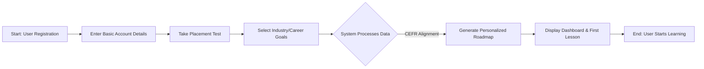
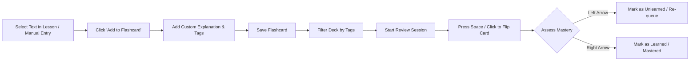
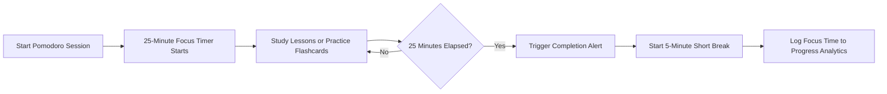

# Vision Document

**Project Name:** `Studify`
**Document Version:** `2.0`
**Date:** `24/Jul/2026`

---

## Revision History

| Date          | Version | Description                                            | Author     |
| :------------ | :------ | :----------------------------------------------------- | :--------- |
| `11/Jul/2026` | `1.0`   | Initial version of the Vision Document                 | `Minh Thư, Kim Hằng, Thiên Phước, Gia Phúc, Khánh Linh` |
| `24/Jul/2026` | `2.0`   | Revised the Vision Document based on the TA's feedback | `Minh Thư, Kim Hằng, Thiên Phước, Gia Phúc, Khánh Linh` |

---

## Table of Contents

- [Vision Document](#vision-document)
  - [Revision History](#revision-history)
  - [Table of Contents](#table-of-contents)
- [1. Introduction](#1-introduction)
    - [1.1 Purpose](#11-purpose)
    - [1.2 References](#12-references)
- [2. Positioning](#2-positioning)
  - [2.1 Problem Statement](#21-problem-statement)
  - [2.2 Product Position Statement](#22-product-position-statement)
- [3. Stakeholder and User Descriptions](#3-stakeholder-and-user-descriptions)
  - [3.1 Stakeholder Summary](#31-stakeholder-summary)
  - [3.2 User Summary](#32-user-summary)
  - [3.3 User Environment](#33-user-environment)
  - [3.4 Summary of Key Stakeholder or User Needs](#34-summary-of-key-stakeholder-or-user-needs)
  - [3.5 Alternatives and Competition](#35-alternatives-and-competition)
- [4. Product Overview](#4-product-overview)
  - [4.1 Product Perspective](#41-product-perspective)
  - [4.2 Assumptions and Dependencies](#42-assumptions-and-dependencies)
    - [Assumptions](#assumptions)
    - [Dependencies](#dependencies)
  - [4.3 Applicable Standards](#43-applicable-standards)
- [5. Product Features](#5-product-features)
  - [5.1 Authentication \& Onboarding](#51-authentication--onboarding)
  - [5.2 Adaptive Placement and CEFR Tracking](#52-adaptive-placement-and-cefr-tracking)
  - [5.3 Personalized Learning Roadmap](#53-personalized-learning-roadmap)
  - [5.4 IT Track](#54-it-track)
  - [5.5 Self-Study Dashboard](#55-self-study-dashboard)
  - [5.6 Interactive Roleplay and AI Speaking Assistant](#56-interactive-roleplay-and-ai-speaking-assistant)
  - [5.7 Virtual Study Room](#57-virtual-study-room)
  - [5.8 Flashcards](#58-flashcards)
  - [5.9 Pomodoro](#59-pomodoro)
  - [5.10 Progress Analytics](#510-progress-analytics)
  - [5.11 Future Features](#511-future-features)
- [6. Other Product Requirements (Non-Functional Requirements)](#6-other-product-requirements-non-functional-requirements)
  - [6.1 Performance Requirements](#61-performance-requirements)
  - [6.2 Security Requirements](#62-security-requirements)
  - [6.3 Platform Requirements](#63-platform-requirements)
  - [6.4 Reliability and Availability Requirements](#64-reliability-and-availability-requirements)
  - [6.5 Usability Requirements](#65-usability-requirements)
  - [6.6 Scope Constraints](#66-scope-constraints)
  - [6.7 AI and External Service Requirements](#67-ai-and-external-service-requirements)
  - [6.8 Maintainability Requirements](#68-maintainability-requirements)
  - [6.9 Scalability Requirements](#69-scalability-requirements)
  - [6.10 Accessibility Requirements](#610-accessibility-requirements)
  - [6.11 Data Quality Requirements](#611-data-quality-requirements)

---

# 1. Introduction
> **Authors:** [Thiên Phước] | **Reviewer:** [Minh Thư] | **Editor:** [Thiên Phước]

### 1.1 Purpose

The purpose of this Vision Document is to collect, analyze, and define the high-level needs and core features of the **Studify** system. This initial draft establishes the fundamental expectations and product positioning for our English learning platform. It focuses on the capabilities needed by stakeholders and the target users, outlining the problem it solves and what the product will do, rather than delving into technical implementation details. 

### 1.2 References

The following documents and artifacts were referenced in the creation of this Vision Document:
* **CS300 - CSC13002 - Introduction to Software Engineering - Project Assignment 2 (PA2-2026)**: The core requirement specifications for this document[cite: 3, 4].
* **PA1-2026 Project Proposal & App Survey**: The initial project outline, including the preliminary competitor survey and key features of Studify[cite: 48, 50].
* **Spec Kit Constitution (`constitution.md`)**: The foundational rules and configuration generated for the Studify repository[cite: 60].

---

# 2. Positioning
> **Authors:** [Gia Phúc] | **Reviewer:** [Minh Thư] | **Editor:** [Gia Phúc]

## 2.1 Problem Statement

| The Problem | Affects | Impact | Successful Solution |
| :--- | :--- | :--- | :--- |
| Students have no one to practice speaking with or feel too anxious to practice with real people. | New learners trying to build conversational fluency. | They can read and write well but freeze up or stutter when trying to hold a conversation, limiting their speaking confidence and fluency. | An AI speaking assistant that provides real-time feedback, constructive advice, and a judgment-free environment for speaking practice. |
| Learners are overwhelmed by the abundance of learning materials and lack a clear starting point or study plan. | Students learning independently without guidance. | High abandonment rates, wasted time, and inconsistent progress due to uncertainty about what to study next. | Personalized learning roadmaps with CEFR-based placement, structured lessons, and recommended practice activities. |
| Studying English online alone can feel isolating and demotivating. | Online learners who cannot attend offline classes due to financial or transportation barriers. | Learners are more likely to procrastinate, lose motivation, or quit before reaching their goals. | Community study groups and chat spaces where learners can discuss, share study resources, and encourage one another. |
| Traditional language-learning apps focus on one-time lessons with little or no review. | Students aiming to build and retain long-term English vocabulary. | Poor long-term retention results in learners repeatedly forgetting and relearning the same vocabulary. | An integrated spaced-repetition flashcard system that automatically reinforces vocabulary and lesson content over time. |

## 2.2 Product Position Statement

| For | Who | Product Name | That | Unlike | Our Product |
| :--- | :--- | :--- | :--- | :--- | :--- |
| School and university students preparing for exams and English qualifications (IELTS, TOEIC, etc.) | Experience test anxiety and lack opportunities to practice speaking with native speakers. | **Studify** | Provides structured learning roadmaps, collaborative study groups, and an AI speaking assistant that offers instant, judgment-free feedback. | Traditional language-learning apps that rely on repetitive vocabulary drills and leave learners to study independently. | Enables students to communicate with classmates, share learning resources, and improve their English speaking skills through AI-powered practice. |
| Postgraduates and working professionals seeking to advance their global careers. | Have a basic understanding of English but lack fluency in industry-specific vocabulary and workplace communication. | **Studify** | Offers personalized learning plans with adjustable study pace and specialized content tailored to professional fields. | Traditional language-learning apps that provide generic content primarily designed for students. | Delivers customized lessons and vocabulary based on the learner's profession, helping them efficiently develop practical workplace English skills. |

---

# 3. Stakeholder and User Descriptions
> **Authors:** [Kim Hằng] | **Reviewer:** [Minh Thư] | **Editor:** [Kim Hằng]

## 3.1 Stakeholder Summary

| Stakeholder | Description | Role |
| :--- | :--- | :--- |
| **Admin** | System administrator | Manage user accounts, monitor system health, moderate platform content, and oversee overall system operations. |
| **Teacher / Group Master** | Content provider and study group leader | Create and assign learning tasks, upload study materials, manage study groups, and monitor members' progress. |
| **Student** | Primary end user | Complete lessons, take quizzes, practice speaking, track learning progress, and join or create study groups. |
| **Development Team** | Project owner and technical team | Design, develop, test, deploy, and maintain the platform while ensuring system reliability and continuous improvement. |

## 3.2 User Summary

| User Type | Description | Responsibilities |
| :--- | :--- | :--- |
| **Student** | University students learning English for academic or professional purposes. | Complete lessons, submit quizzes, practice speaking, review vocabulary, and participate in study groups. |
| **Working Professional** | IT professionals or office workers improving English for career advancement. | Follow personalized learning roadmaps, practice with AI, review vocabulary using flashcards, and monitor progress. |
| **Teacher / Group Master** | A user with elevated permissions within a study group. | Assign tasks, upload learning materials, manage group members, and monitor learners' performance. |

## 3.3 User Environment

**Platform:** Web application, accessible via modern desktop browsers. No mobile support in the current scope. 

**Primary device:** Laptop or desktop computer.

**Connectivity:** Requires a stable internet connection; real-time features (group chat, Pomodoro timer) require low-latency network.

## 3.4 Summary of Key Stakeholder or User Needs

| Stakeholder / User | Needs |
| :--- | :--- |
| **Students / Working Professionals** | A structured, CEFR-aligned learning roadmap that adapts to each learner's proficiency level and career goals. |
| **Students** | Real-time progress tracking, performance analytics, and achievement milestones to maintain motivation and learning consistency. |
| **Teachers / Group Masters** | The ability to create and manage study groups, assign learning tasks, monitor member progress, and provide feedback. |
| **Teachers / Students** | A collaborative workspace for uploading, sharing, and accessing learning materials and documents within study groups. |
| **Students** | Built-in productivity tools such as Pomodoro timers, flashcards, vocabulary review, and AI speaking practice to support effective learning habits. |
| **Admin / All Users** | Secure authentication, role-based access control, data privacy, and reliable system performance. |

## 3.5 Alternatives and Competition

| Alternative | Strengths | Weaknesses |
| :--- | :--- | :--- |
| **Duolingo** | Engaging user experience, gamified learning, large user base, and mobile-first design. | No collaborative group learning features; limited support for professional or IT-specific English learning. |
| **ELSA Speak** | Excellent AI-powered pronunciation assessment and speaking feedback. | Lacks a structured learning roadmap and collaborative study features; many advanced features require a paid subscription. |
| **British Council Apps** | High-quality, CEFR-aligned learning content developed by language experts. | Primarily supports self-paced learning with limited collaboration, progress tracking, or personalized learning paths. |
| **Anki** | Highly effective spaced-repetition flashcard system with extensive customization. | No guided learning roadmap, no integrated lessons, and a relatively steep learning curve for new users. |

---

# 4. Product Overview
> **Authors:** [Khánh Linh] | **Reviewer:** [Minh Thư] | **Editor:** [Khánh Linh]

## 4.1 Product Perspective

Studify is a standalone web application designed to provide English learning support for tech students, graduates, and active IT professionals.

The product combines the following major capabilities:

* **Adaptive Placement:** Provides an AI-driven diagnostic test upon registration to establish the user's baseline CEFR level.
* **The IT Track:** Provides specialized modules covering Agile terminology, client communication, and cross-cultural technology collaboration.
* **Interactive Roleplay:** Provides scenario-based conversational exercises, including software deployment crisis simulations and job interview simulations.
* **Progress Analytics:** Provides visual data tracking for daily streaks, vocabulary retention, and CEFR sub-skill milestones for Speaking, Reading, and Writing.
* **Self-Study Dashboard:** Provides a structured learning environment with learning roadmaps, lesson content, quizzes, and progress tracking.
* **Virtual Study Room:** Supports collaborative study activities.
* **Pomodoro:** Supports focused study sessions.
* **Flashcards:** Supports vocabulary and learning content review.
* **AI Speaking Assistant:** Supports speaking practice and feedback.

The project is planned as five incremental builds:

| Build         | Description                                                                                           |
| :------------ | :---------------------------------------------------------------------------------------------------- |
| **Build 1.0** | Baseline system with User Registration, Login, and Onboarding classification flow.                    |
| **Build 2.0** | Self-Study Dashboard, visual roadmap, lesson/quiz modules, and Pomodoro widgets.                      |
| **Build 3.0** | Virtual Study Room including RBAC, file sharing, real-time chat via WebSocket, and Flashcard feature. |
| **Build 4.0** | Full system integration including the AI Speaking Assistant with STT and LLM processing.              |
| **Build 5.0** | Fully tested, bug-free final production build ready for the final semester demo.                      |

## 4.2 Assumptions and Dependencies

### Assumptions

* The project will be developed by a team of five members consisting of a PM/BA/UI-UX, Backend Lead, Backend Developer, Frontend Lead, and Frontend Developer.
* The team will produce five incremental builds for testing and review.
* The final sprint will include a demo of all project features.
* Cross-functional pairing will be used so that no single team member holds exclusive knowledge of critical areas.
* Centralized and up-to-date project documentation will be maintained to enable other team members to take over responsibilities with minimal disruption.
* If Speech-to-Text or LLM services are unavailable, the application will fall back to standard multiple-choice or text-based assessments.
* Pre-tested, deterministic rule-based evaluation will be used for initial diagnostic tests before relying on AI-generated grading.

### Dependencies

* The AI Speaking Assistant depends on Speech-to-Text and LLM-related services.
* The project depends on external APIs and services for AI-related functionality.
* The system depends on database services for storing application data.
* The project depends on cloud-based services for relevant application functionality.
* The project depends on WebSocket-based real-time communication for real-time chat functionality.
* The system depends on API monitoring, billing alerts, and daily usage caps to prevent unexpected downtime and cost overruns.

**Missing:** The Project Plan does not specify the exact third-party service providers, cloud storage providers, authentication providers, or database service providers used by the product.

## 4.3 Applicable Standards

The Studify project uses the **Common European Framework of Reference for Languages (CEFR)** as the framework for English proficiency tracking and the structure of personalized learning paths.

The project focuses on the IT track and core CEFR proficiency tracking as part of the MVP scope. The CEFR framework is used to support proficiency benchmarking and learning progression across the target users.

---

# 5. Product Features
> **Authors:** [Thiên Phước] | **Reviewer:** [Minh Thư] | **Editor:** [Thiên Phước]

## 5.1 Authentication & Onboarding

This feature evaluates the user’s career objectives and professional background during the initial registration process. It is needed to automatically construct a customized learning trajectory that adheres strictly to CEFR standards, ensuring that content remains highly relevant to the user's specific industry. Consequently, university students and working professionals benefit from a targeted curriculum that directly supports their real-world career goals rather than wasting time on generic vocabulary.

## 5.2 Adaptive Placement and CEFR Tracking

The Study Group feature allows users to establish or join public and private micro-communities using unique group codes, complete with hierarchical roles such as Leader and Member. This system is critical for mitigating the feelings of boredom and isolation that typically lead to early dropouts in solitary online learning platforms. By fostering an environment of peer motivation and organized accountability, all group members benefit from a structured and highly interactive learning experience.

## 5.3 Personalized Learning Roadmap

This feature provides a dedicated cloud storage space integrated directly into each study group, allowing members and leaders to seamlessly upload, view, and download supplementary educational materials such as PDFs and industry templates. It is necessary to centralize all learning assets in one secure location, effectively eliminating the cumbersome reliance on fragmented, third-party messaging applications. Group leaders and members benefit immensely from having instant, organized access to shared resources necessary for their collaborative tasks.

## 5.4 IT Track

Leveraging advanced natural language processing and voice recognition, this feature generates dynamic, industry-specific roleplay scenarios, such as IT project pitches or mock interviews. It is essential for providing learners with a safe, pressure-free environment to practice high-stakes professional verbal communication before facing real-world clients or employers. Working professionals and students preparing for the job market benefit from realistic conversational practice that actively builds their confidence and spoken fluency.

## 5.5 Self-Study Dashboard

This integrated toolset combines time-managed study sessions with interactive flashcard reviews directly within the learning interface. It is needed to help users maintain deep focus and prevent cognitive burnout while systematically improving their long-term memory retention of specialized terminology. Self-paced learners who struggle with digital distractions benefit significantly from this structured approach to studying and memorization.

## 5.6 Interactive Roleplay and AI Speaking Assistant

This feature utilizes visual analytical dashboards and progress bars to monitor a user's daily goals, completed tasks, and overall learning milestones. It is necessary to establish consistent study habits by sending timely reminders and nudges to users who might otherwise lose track of their academic objectives. Goal-oriented users benefit from clear, quantifiable feedback on their progress, helping them stay motivated and disciplined throughout their language learning journey.

## 5.7 Virtual Study Room

**Workflow 1: User Onboarding & Personalized Roadmap Generation**
This diagram illustrates how a new user interacts with the system to receive their customized learning path.

**Workflow 2: Collaborative Study Group & AI Roleplay Practice** 
This diagram demonstrates the core loop of joining a group, accessing shared materials, and practicing with the AI assistant 

## 5.8 Flashcards

The Flashcard feature supports vocabulary and learning content review as part of the overall learning environment. The Flashcard system enables users to dynamically generate study cards manually or by simply highlighting vocabulary directly within lesson materials, exercises, or tests. Each flashcard supports custom explanations and a flexible, multi-tag system, allowing users to organize their vocabulary by topic or difficulty and filter specific tag combinations for target practice

This feature is needed to lower the barrier of card creation and facilitate active recall and spaced repetition directly within the learning flow. Self-directed language learners and students preparing for high-stakes exams benefit most from this fast, personalized review ecosystem.

## 5.9 Pomodoro

The Pomodoro feature provides a productivity tool to support focused study sessions. Built directly into the study interface, this integrated timer structures learning into standardized cycles of 25 minutes of high-intensity focus followed by 5-minute restorative short breaks.

It is essential for combating mental fatigue, preventing burnout, and maintaining optimal cognitive engagement during long study blocks. Students who struggle with time management, procrastination, or attention retention benefit significantly from these structured intervals.

## 5.10 Progress Analytics

The Progress Analytics feature aggregates and visualizes user activity metrics, offering a comprehensive overview of learning habits and achievements over time. It continuously tracks critical metrics, including flashcard mastery percentages, tag-specific accuracy, lesson completion rates, and total focus time completed via the Pomodoro timer. 

This functionality is crucial for giving learners objective feedback, helping them identify weak vocabulary tags or concepts that require extra attention, and keeping them accountable to their goals. Goal-oriented students and independent learners benefit by gaining actionable insights to optimize their daily study plans and track their growth transparently.

## 5.11 Future Features

The Project Plan identifies additional features for future development, including:

* AI Speaking Assistant.
* Teacher/Group Master roles.
* Study groups.
* Group chat.
* Additional learning capabilities beyond the initial MVP scope.

---

# 6. Other Product Requirements (Non-Functional Requirements)
> **Authors:** [Kim Hằng] | **Reviewer:** [Minh Thư] | **Editor:** [Kim Hằng]

## 6.1 Performance Requirements

* Page load time must not exceed **2 seconds** under normal network conditions.
* API response time must be **under 500 ms** for standard CRUD operations.
* The system must support at least **100 concurrent users** without significant performance degradation.

## 6.2 Security Requirements

* The system must use **JWT tokens** for authentication.
* Access tokens must expire after **15 minutes**.
* Refresh tokens must expire after **7 days**.
* Role-Based Access Control (RBAC) must be implemented.
* Protected resources must require appropriate authentication and authorization.
* The system must support role-based permissions for relevant user roles.

## 6.3 Platform Requirements

* The application is a web application.
* The application is intended for desktop browsers.
* The backend must be containerized using **Docker**.
* The system must be deployable using **Docker Compose**.

## 6.4 Reliability and Availability Requirements

* The system must support at least **100 concurrent users**.
* API monitoring, billing alerts, and daily usage caps are required to prevent unexpected downtime and cost overruns.
* The system should provide fallback behavior if Speech-to-Text or LLM services are unavailable.
* AI-generated CEFR scores must be regularly validated against human-reviewed samples to ensure grading accuracy and consistency.

## 6.5 Usability Requirements

* The user interface should follow a **consistent layout and navigation structure** across all pages.
* Users should be able to complete common tasks (e.g., joining a study group, starting a lesson, creating a flashcard) with **no more than 3–5 interactions**.
* Error messages should clearly describe the problem and provide guidance for resolving it.
* The application should provide visual feedback (e.g., loading indicators, success notifications, error alerts) within **1 second** of user actions.
* Fonts, buttons, and interactive elements should remain readable and usable at browser zoom levels between **100% and 200%**.
* The interface should use consistent colors, icons, and terminology throughout the application to reduce the learning curve.

## 6.6 Scope Constraints

* The MVP is focused solely on the **IT track** and **core CEFR proficiency tracking**.
* New feature requests must undergo a formal change-impact assessment before approval.
* A dedicated **Nice-to-Have backlog** is maintained for Phase 2 features.
* The feature scope is frozen for each sprint to prevent mid-sprint additions.
* The project is developed through five incremental builds.

## 6.7 AI and External Service Requirements

* If Speech-to-Text or LLM services are unavailable, the application must fall back to standard multiple-choice or text-based assessments.
* Pre-tested, deterministic rule-based evaluation will be used for initial diagnostic tests before relying on AI-generated grading.
* API monitoring, billing alerts, and daily usage caps are required to prevent unexpected downtime and cost overruns.
* AI-generated CEFR scores must be regularly validated against human-reviewed samples to ensure grading accuracy and consistency.

## 6.8 Maintainability Requirements

* Code Quality & Test Coverage: The codebase must maintain an automated unit and integration test coverage of at least 70%, enforcing static code analysis (linting) with zero critical or blocking errors prior to code merging.
* Documentation Currency: Centralized project documentation (including API specifications, architecture diagrams, and onboarding guides) must be updated within 24 hours of any major release to ensure new team members can onboard and achieve productivity within 3 business days.
* Knowledge Distribution: Core system modules must utilize cross-functional pair programming and code reviews, ensuring a minimum "Bus Factor" of 2 for all critical system components to prevent single points of operational failure.
* Continuous Integration & Delivery (CI/CD): The project must utilize automated CI/CD pipelines supporting incremental builds, automated testing, and staging deployments, with pull-request build and validation cycles completing in under 10 minutes.

## 6.9 Scalability Requirements

* Concurrent User Load: The system must support at least 100 concurrent active users maintaining sustained study, timer, and quiz sessions without exceeding a peak CPU usage of 75% on application servers.
* Performance Under Load: Under normal operating load (100 concurrent users), the average system API response time must remain below 2.0 seconds ($p_{95} < 2.0\text{s}$) for general requests and below 500 ms for static asset delivery.
* API Rate Limiting & Cost Management: The system must implement rate-limiting at 60 requests/minute per user for standard endpoints and enforce strict daily usage caps on external AI/LLM API calls to prevent service unexpected rate limits and keep external API costs within the allocated budget.

## 6.10 Accessibility Requirements

* Accessibility Compliance: The Studify web interface must comply with the Web Content Accessibility Guidelines (WCAG) 2.1 Level AA standards.
* Keyboard Navigation: 100% of key user interactive flows—including Flashcard navigation, card flipping, and Pomodoro timer toggles—must be fully functional via standard keyboard shortcuts (e.g., Spacebar, Arrow keys, Tab) without requiring mouse interaction.
* Visual Standards & Contrast: All text content must maintain a minimum color contrast ratio of 4.5:1 (and 3:1 for large text/UI components). The interface must support text scaling up to 200% without loss of content or functional overlap.

## 6.11 Data Quality Requirements

* AI Grading Accuracy & Validation: AI-generated CEFR proficiency scores must be continuously benchmarked against human-evaluated control samples, requiring a minimum score alignment rate of 85% (or within $\pm1$ sublevel threshold, e.g., B1.1 to B1.2).
* Deterministic Baseline Evaluation: Diagnostic placement tests must rely on pre-tested, rule-based deterministic evaluation mechanisms before initializing AI adaptive grading, guaranteeing 100% deterministic consistency for static multiple-choice diagnostic components.
* Proficiency Standard Uniformity: The system must strictly enforce standardized CEFR framework definitions (A1 through C2) across all progress tracking, ensuring data mapping accuracy and zero data loss during user score aggregation or report generation.
* Data Recovery & Loss Limits: System data stores must enforce a Recovery Point Objective (RPO) $\le$ 1 hour and a Recovery Time Objective (RTO) $\le$ 2 hours to protect user study history, flashcard decks, and progress metrics against data corruption.