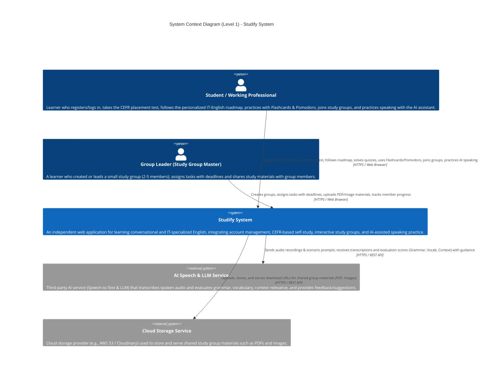

# Software Architecture Document — Studify

## 2. C4 Model — Level 1: System Context Diagram

The System Context diagram is the highest-level view in the C4 Model. It treats Studify as a single black-box system, and shows only: (1) who the human actors are, and (2) which external systems it depends on. Internal structure (frontend, backend, database) is intentionally *not* shown at this level — that level of detail belongs to the Level 2 Container diagram.

### 2.1 Written Explanation

**Actors (Person elements)**
Studify is used by a single underlying actor role — the registered learner — but the diagram separates two usage patterns because they interact with the system differently:
- **Student / Working Professional:** the primary end-user across every sprint of the project — registering and completing onboarding (PA1), following their personalized roadmap and self-study dashboard (PA2), joining virtual study rooms and reviewing flashcards (PA3), and practicing speaking with the AI assistant (PA4).
- **Group Leader (Study Group Master):** the same type of user account, but acting in an elevated role *within a specific study group* — creating the group, assigning tasks/deadlines, and uploading shared materials (PA3). This is a permission distinction (RBAC), not a separate account type, which is why both actors connect to the same central system rather than to different systems.

**The System (Studify)**
Drawn as a single box because, at Context level, we deliberately hide implementation detail. Whether it's built with React, NestJS, or PostgreSQL is irrelevant here — what matters is that it is one cohesive system responsible for authentication, learning content delivery, group collaboration, and AI-assisted speaking practice.

**External Systems (System_Ext)**
Two systems sit outside Studify's boundary because they are operated by third parties, not by the team:
- **AI Speech & LLM Service:** Studify does not implement its own speech recognition or language model. It sends recorded audio/prompts out to a third-party AI service and receives back a transcription plus a structured evaluation (grammar, vocabulary, relevance, suggestions), which powers the PA4 AI Speaking Assistant feature.
- **Cloud Storage Service:** shared documents and images uploaded in a Virtual Study Room (PA3) are not stored inside Studify's own database; they are pushed to and retrieved from an external object storage provider, with only metadata/URLs kept internally.

Notably, PostgreSQL and the JWT/bcrypt authentication mechanism are **not** represented as external systems, because they are internal components that Studify itself owns and operates — they will instead appear as containers in the Level 2 Container Diagram, not as external dependencies at this Context level.

