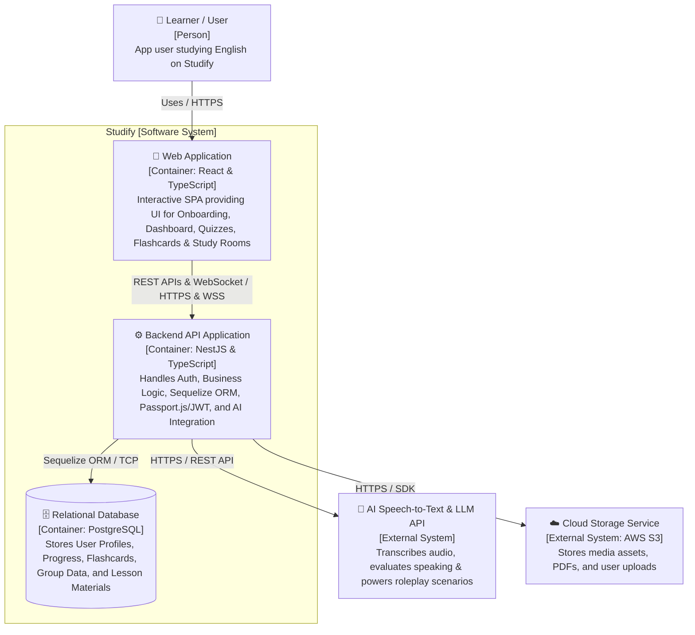

**1\. Web Application**  
\- Responsibility: Serves as the single-page application client interface for learners. Handles user interactions for the Onboarding Survey, Self-Study Dashboard, Quizzes, Flashcard system with keyboard shortcuts, Pomodoro Timer, Group Study Rooms, and AI Speaking Assistant.

\- Technology / Framework: React & TypeScript.

\- Communication:  
Communicates with Backend API Application via HTTP/HTTPS (REST API) for business operations and WebSocket (WSS) for Virtual Study Room real-time features (Chat & Task updates).

**2\. Backend API Application**  
\- Responsibility: Core backend server containing all business logic. Handles authentication & security (Passport.js, JWT, Bcryptjs password hashing), smart roadmap assignment, quiz grading, flashcard creation/tagging, RBAC access control for study groups (Leader/Member), proxying requests to external AI APIs, and database interactions using Sequelize ORM.

\- Technology / Framework: NestJS (Node.js framework) with TypeScript, Passport.js, JWT, Bcryptjs, and Sequelize ORM.

\- Communication:  
Receives REST API & WebSocket requests from Web Application over HTTPS / WSS.  
Reads/writes persistent application data to PostgreSQL via Sequelize ORM / TCP.  
Connects to AI Speech-to-Text & LLM API via HTTPS REST APIs.  
Interacts with Cloud Storage Service via HTTPS SDK for file upload/download operations.

**3\. PostgreSQL Database**   
\- Responsibility: Persistently stores all relational data across the Studify platform, including user accounts, hashed passwords, CEFR roadmap nodes, quiz records, user progress percentage, flashcards and tags, study room codes, task deadlines, and chat logs.

\- Technology: PostgreSQL.

\- Communication:  
Connected to and queried exclusively by Backend API Application via Sequelize ORM over TCP/IP.

**4\. External Systems**

* AI Speech-to-Text & LLM API 

\- Responsibility: Transcribes user speech audio to text, simulates roleplay scenarios, analyzes grammar and vocabulary selection, checks context adherence, and generates actionable English feedback.

\- Technology / Framework: External SaaS API (e.g., OpenAI API, Google Gemini API, or Whisper).

\- Communication Protocol: HTTPS / REST API triggered directly by the NestJS Backend API.

* Cloud Storage Service 

\- Responsibility: Stores media assets such as group PDF documents, user upload files, and images for shared repositories.

\- Technology / Framework: External Cloud Storage (e.g., AWS S3).

\- Communication: HTTPS using AWS SDK / pre-signed URLs from the NestJS Backend API.

