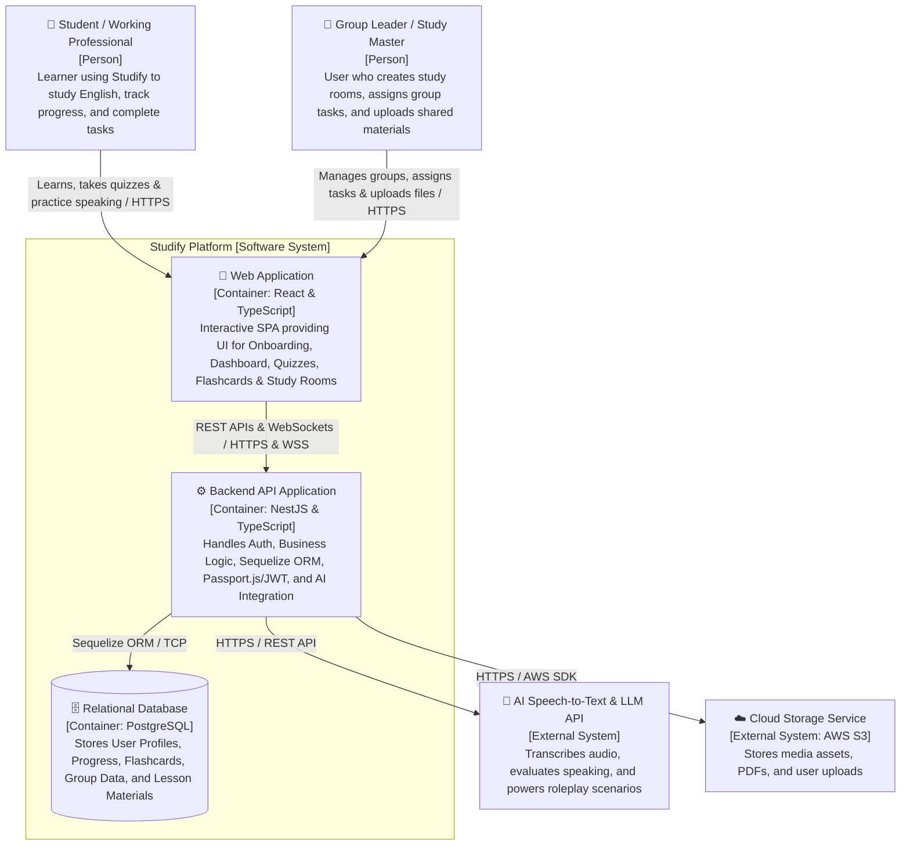

**1\. Web Application**  
**Responsibility:** Serves as the single-page application (SPA) client interface for all users.

* **For Students / Working Professionals:** Renders the Onboarding Survey (F1.2), Self-Study Dashboard (F2), Quizzes (F2.3), Flashcard system with interactive shortcuts (F4.2), Pomodoro Timer (F4.1), and AI Speaking Assistant UI (F5).  
* **For Group Leaders:** Renders Group Management controls (F3.1), Task Assignment interfaces (F3.3), and Shared File Upload utilities (F3.4).

**Technology / Framework:** React & TypeScript.  
**Communication:**

* Communicates with **Backend API Application** via **HTTP/HTTPS (REST API)** for standard business operations.  
* Connects via **WebSocket (WSS)** for Virtual Study Room real-time features (Real-time Chat & Task updates).

**2\. Backend API Application**  
**Responsibility:** Core server application encapsulating all business logic and system workflows:

* Authentication & authorization (Passport.js, JWT, Bcryptjs password hashing, and RBAC validation for Leader vs. Member permissions).  
* Smart Roadmap assignment algorithms, quiz grading, and progress tracking calculation.  
* Flashcard CRUD, tagging mechanisms, and explanation storage.  
* Serving as a proxy to send audio and prompts to external AI services.  
* Database operations abstraction using **Sequelize ORM**.

**Technology / Framework:** NestJS (Node.js framework) with TypeScript, Passport.js, JWT, Bcryptjs, and Sequelize ORM.  
**Communication:**

* Receives REST API requests and WebSocket connections from **Web Application** over **HTTPS / WSS**.  
* Reads/writes persistent relational data to **PostgreSQL** via **Sequelize ORM / TCP**.  
* Sends audio streams and evaluation requests to **AI Speech-to-Text & LLM API** via **HTTPS REST APIs**.  
* Handles file upload/download stream signing with **Cloud Storage Service** via **HTTPS (AWS SDK)**.

**3\. PostgreSQL Database**   
**Responsibility:** Provides persistent, relational data storage across the platform. Stores user accounts, hashed credentials, CEFR roadmap nodes, quiz question banks and user records, progress percentages, flashcards/tags, study room codes, group task deadlines, and chat logs.  
**Technology:** PostgreSQL.  
**Communication:**

* Connected to and queried exclusively by **Backend API Application** via **Sequelize ORM over TCP/IP**.

**4\. External Systems**

#### **A. AI Speech-to-Text & LLM API**

* **Responsibility:** Transcribes user speech audio to text, simulates roleplay scenarios, analyzes grammar and vocabulary selection, checks context adherence, and returns actionable feedback and scoring for F5.  
* **Technology / Framework:** External SaaS API (e.g., OpenAI API / Google Gemini API).  
* **Communication Protocol:** **HTTPS / REST API** triggered directly by the NestJS Backend API.

#### **B. Cloud Storage Service**

* **Responsibility:** Stores media assets such as group PDF documents, study room attachments, user uploads, and images for shared repositories (F3.4).  
* **Technology / Framework:** External Cloud Storage (e.g., AWS S3).  
* **Communication Protocol:** **HTTPS** using AWS SDK / pre-signed URLs managed by the NestJS Backend API.

