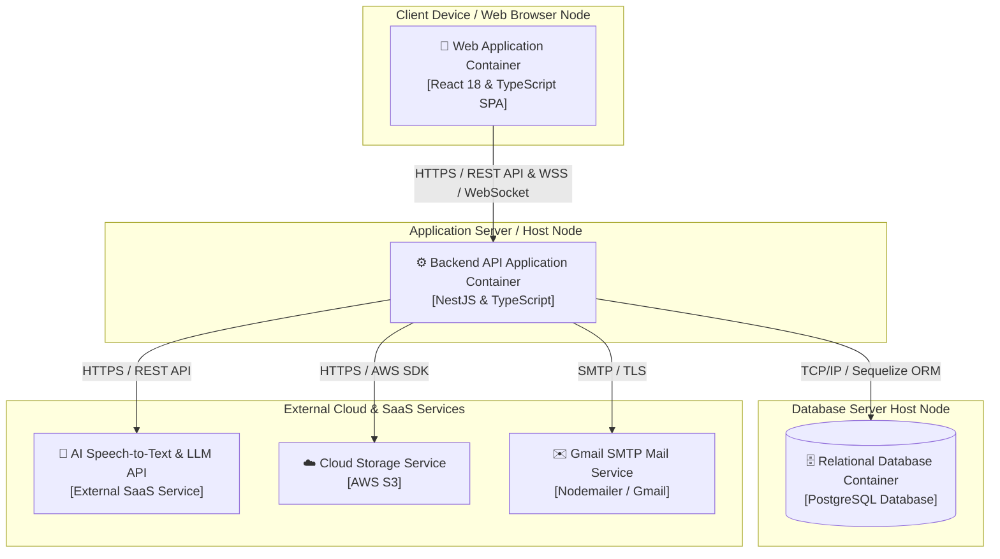

# System Deployment & Level 3 Component Specification Document

## 1. System Deployment Architecture

This section describes how the system is deployed by mapping the containers defined in Section C (Container Diagram) to the logical/physical infrastructure nodes that run them. Each container is hosted on its dedicated runtime node environment to maintain logical separation, scalability, and security boundaries.

### 1.1 System Deployment Diagram (Mermaid)

---

### 1.2 Infrastructure Nodes Description

#### Node 1: Client Device / Web Browser Node
* **Hardware or Cloud Service Used:** Client workstation/mobile device running a modern web browser (Google Chrome, Mozilla Firefox, Safari, Edge) in the client host environment.
* **Containers or Components Running:** **Web Application Container** (React 18 & TypeScript Single Page Application).
* **Technology / Framework Used:** React 18, TypeScript, Vite bundler, React Router DOM (client-side routing), Zustand (global state store), Axios (HTTP client), TailwindCSS (styling).
* **Responsibility and Services Provided:**
  * Serves as the interactive SPA client interface for Students, Working Professionals, and Group Leaders.
  * Renders authentication screens (Login, Register, Forgot Password), Onboarding Survey & Placement Test flow, Dashboard, Roadmap, Quizzes, Flashcards with interactive keyboard shortcuts, Pomodoro Timer, AI Speaking Assistant UI, and Group Management controls.
  * Enforces client-side route protection (`OnboardingGuard`) to redirect un-onboarded users to `/onboarding`.
* **Communication Protocols Between Nodes:**
  * **HTTPS / REST API:** Sends asynchronous HTTP requests to the Backend API Application for authentication, fetching placement test questions, submitting test answers, tracking progress, and profile management.
  * **WSS (WebSocket Secure):** Establishes real-time persistent connections with the Backend API Application for Virtual Study Room chat and live task updates.
* **How It Communicates with Other Containers:** Communicates exclusively with the **Backend API Application** container via HTTPS and WSS protocols. It does not communicate directly with the database or third-party cloud services.

---

#### Node 2: Application Server / Host Node
* **Hardware or Cloud Service Used:** Local Machine / Application Server Node (Node.js runtime environment).
* **Containers or Components Running:** **Backend API Application Container** (NestJS core application).
* **Technology / Framework Used:** NestJS (Node.js framework) with TypeScript, Passport.js (JWT strategy), `@nestjs/jwt`, Bcryptjs (password hashing), Nodemailer (email service), Sequelize ORM (database abstraction layer).
* **Responsibility and Services Provided:**
  * Core server application encapsulating all business logic and system workflows.
  * Manages authentication, token issuance, password reset OTP flows, and RBAC permission checks (Leader vs. Member).
  * Executes Smart Roadmap assignment algorithms (70% accuracy threshold per CEFR level), placement test grading, and progress tracking logic.
  * Manages Flashcard CRUD, tagging mechanisms, and study room task/chat logic.
  * Acts as a secure proxy to process audio files and send prompts to external AI services.
  * Handles database abstraction and object-relational mapping using Sequelize ORM.
* **Communication Protocols Between Nodes:**
  * Receives **HTTPS / REST API** requests and **WSS / WebSocket** connections from the **Web Application**.
  * **TCP/IP:** Connects to the **PostgreSQL Database** via **Sequelize ORM over TCP/IP** (port 5432).
  * **HTTPS / REST API:** Dispatches audio recordings and scenario prompts to the **AI Speech-to-Text & LLM API**.
  * **HTTPS / AWS SDK:** Handles file upload/download stream signing with **Cloud Storage Service (AWS S3)**.
  * **SMTP / TLS:** Delivers password reset OTP emails via **Gmail SMTP (Nodemailer)**.
* **How It Communicates with Other Containers:** Accepts incoming client requests from the **Web Application**, performs relational queries with the **PostgreSQL Database** container, and connects outbound to external SaaS/cloud providers.

---

#### Node 3: Database Server Host Node
* **Hardware or Cloud Service Used:** Local Database Server Node / Database Instance (PostgreSQL Database Host).
* **Containers or Components Running:** **Relational Database Container** (PostgreSQL).
* **Technology / Framework Used:** PostgreSQL relational database engine.
* **Responsibility and Services Provided:**
  * Provides persistent, relational data storage across the platform.
  * Stores user profiles, hashed credentials, reset OTP hashes, CEFR roadmap nodes, quiz question banks, user progress records, flashcards/tags, study room codes, group task deadlines, and chat logs.
* **Communication Protocols Between Nodes:**
  * **TCP/IP:** Accepts persistent database connections from the **Backend API Application** container via Sequelize ORM over TCP/IP.
* **How It Communicates with Other Containers:** Communicates strictly and solely with the **Backend API Application** container. Direct access from the Web Application or external networks is blocked.

---

#### Node 4: External Cloud & SaaS Services
* **Hardware or Cloud Service Used:** External Third-Party Cloud Infrastructure (AWS, AI SaaS Providers, Gmail SMTP Infrastructure).
* **Containers or Components Running / Integrated:**
  1. **AI Speech-to-Text & LLM API** (External SaaS API - e.g., OpenAI API / Google Gemini API).
  2. **Cloud Storage Service** (External Object Storage - AWS S3).
  3. **Gmail SMTP Mail Service** (External Email Service - Nodemailer / Gmail).
* **Technology / Framework Used:** AWS SDK, Third-Party REST APIs, SMTP / Nodemailer.
* **Responsibility and Services Provided:**
  * **AI Speech-to-Text & LLM API:** Transcribes user speech audio to text, simulates roleplay scenarios, analyzes grammar and vocabulary selection, checks context adherence, and returns actionable feedback and scoring.
  * **Cloud Storage Service:** Stores media assets such as group PDF documents, study room attachments, user uploads, and images for shared repositories.
  * **Gmail SMTP Service:** Delivers outbound password reset OTP emails.
* **Communication Protocols Between Nodes:**
  * **HTTPS / REST API:** Triggered by Backend API for speech recognition and language evaluation.
  * **HTTPS / AWS SDK:** Triggered by Backend API for uploading/retrieving media files and generating pre-signed URLs.
  * **SMTP / TLS:** Triggered by Backend API for emailing OTP codes.
* **How It Communicates with Other Containers:** Directly interacts only with the **Backend API Application** container via secure outbound HTTPS and SMTP calls.

---

## 2. Level 3 Diagram Component Descriptions

This section details every component inside the **Web Application Container (Frontend)** and **Backend API Application Container (Backend)**, describing their specific responsibilities and relationships with other components as defined in the Level 3 Component Diagrams.

---

### 2.1 Web Application Container (Frontend Components)

#### Routing Layer

##### 1. `App.tsx` / `BrowserRouter` (React Router)
* **Responsibility:** Defines all client-side routes (`/login`, `/register`, `/onboarding`, `/dashboard`, `/roadmap`, `/lessons`, etc.). Wraps protected routes inside `<OnboardingGuard>` and `<MainLayout>`. Acts as the top-level shell of the application.
* **Relationships:** Renders all Feature Module components on their respective routes. Delegates route-protection logic to `OnboardingGuard`.

##### 2. `OnboardingGuard` (Route Guard Component)
* **Responsibility:** A custom React component that reads the `user.hasCompletedOnboarding` flag directly from `useAuthStore`. If the flag is `false` or the user object is absent, it redirects the user to `/onboarding` using `<Navigate>`, preventing access to all protected learning pages.
* **Relationships:** Reads state from `useAuthStore`. Wraps all post-login protected routes defined in `App.tsx`.

---

#### Auth Feature Module (`auth/`)

##### 3. `LoginForm.tsx` (React Component)
* **Responsibility:** Renders the login form UI with email and password fields. On submission, delegates to `loginAction` in `useAuthStore`. Displays loading and error states read from the store.
* **Relationships:** Calls `loginAction` on `useAuthStore`. Does not call the API directly; all HTTP logic is encapsulated in the store.

##### 4. `RegisterForm.tsx` (React Component)
* **Responsibility:** Renders the user registration form. On submission, calls `POST /auth/register` directly via Axios. On success, calls `setAuthSession` on `useAuthStore` to hydrate the session and navigates to `/onboarding`.
* **Relationships:** Calls `POST /auth/register` on the **Backend API Application** via HTTPS. Calls `setAuthSession` on `useAuthStore`.

##### 5. `ForgotPasswordForm.tsx` (React Component)
* **Responsibility:** Implements a multi-step forgot password flow: Step 1 enters email; Step 2 verifies OTP; Step 3 resets password. Each step calls the corresponding backend endpoint directly via Axios.
* **Relationships:** Calls `POST /auth/forgot-password` and `POST /auth/reset-password` on the **Backend API Application** via HTTPS.

##### 6. `useAuthStore.ts` (Zustand Store)
* **Responsibility:** Central global state store for authentication. Manages `user`, `token`, `isLoading`, and `error` state. Implements `loginAction` (calls `POST /auth/login` via Axios, persists token and user to `localStorage`), `logoutAction` (clears state and localStorage), `setAuthSession` (hydrates state from external login flows), and `markOnboardingCompleted` (updates `user.hasCompletedOnboarding` flag in both in-memory state and localStorage).
* **Relationships:** Called by `LoginForm`, `RegisterForm`, `PlacementTest`, and `OnboardingGuard`. Sends HTTPS requests to the **Backend API Application**.

---

#### Onboarding Feature Module (`onboarding/`)

##### 7. `OnboardingApp.tsx` (React Component)
* **Responsibility:** Multi-step UI component managing two onboarding steps via local React state: (1) "Set Your Pace" — user selects a weekly study hours commitment (2h / 4h / 6h / 8+h); (2) "English Level" — user either self-selects a CEFR level or triggers the Placement Test. Navigates to `/dashboard` upon completion.
* **Relationships:** Conditionally renders `PlacementTest` component when user selects to take the placement test.

##### 8. `PlacementTest.tsx` (React Component)
* **Responsibility:** Fetches placement test questions from the backend (`GET /placement-test/questions`) on component mount via Axios (no auth required). Displays questions one-by-one with navigation controls. On final submission, sends all answers to `POST /placement-test/submit` with the Bearer token. Calls `markOnboardingCompleted` on `useAuthStore` to update the global session state after a successful submission.
* **Relationships:** Reads `token` from `useAuthStore`. Sends HTTPS requests to the **Backend API Application** for both fetching questions and submitting answers. Calls `markOnboardingCompleted` on `useAuthStore` after success.

---

### 2.2 Backend API Application Container (Backend Components)

#### Auth Module (`modules/auth/`)

##### 1. `AuthController` (`auth.controller.ts`)
* **Responsibility:** Exposes all authentication REST endpoints: `POST /auth/login`, `POST /auth/register`, `POST /auth/forgot-password`, `POST /auth/reset-password`, `POST /auth/logout`. Validates incoming DTOs via NestJS pipes. The `/auth/logout` route is additionally protected by `JwtGuard`.
* **Relationships:** Receives HTTPS requests from the **Web Application**. Delegates all logic to `AuthService`.

##### 2. `AuthService` (`auth.service.ts`)
* **Responsibility:** Core authentication business logic. `login`: calls `UserService.validateUser` (bcrypt comparison), then generates an accessToken (15m) + refreshToken (7d) pair using `JwtService`. `register`: creates a user via `UserService` then immediately calls `login`. `forgotPassword`: generates a 6-digit numeric OTP, hashes it with bcrypt, stores it with a 15-minute expiry via `UserService`, and dispatches the raw OTP via `MailService`. `resetPassword`: verifies OTP has not expired and matches the stored bcrypt hash, then updates the password.
* **Relationships:** Calls `UserService` for all user data operations. Calls `MailService` to dispatch OTP emails. Uses `JwtService` for token generation.

##### 3. `JwtGuard` (`guards/jwt.guard.ts`)
* **Responsibility:** A NestJS Guard extending Passport's `AuthGuard('jwt')`. Intercepts requests on protected routes and triggers `JwtStrategy` to extract and validate the Bearer token. Overrides `handleRequest` to throw specific `UnauthorizedException` messages for `TokenExpiredError` and `JsonWebTokenError`.
* **Relationships:** Delegates token verification to `JwtStrategy`. Applied via `@UseGuards(JwtGuard)` to `POST /auth/logout`, all `UserController` routes, `POST /placement-test/submit`, `GET /placement-test/my-roadmap`, and all `ProgressController` routes.

##### 4. `JwtStrategy` (`strategies/jwt.strategy.ts`)
* **Responsibility:** Implements the Passport.js JWT strategy. Configures extraction from the Authorization Bearer header and verification using the `JWT_SECRET` environment variable. On successful verification, the decoded payload (`id`, `email`, `role`) is injected into `req.user` for use by downstream controllers.
* **Relationships:** Invoked by `JwtGuard` during token verification.

---

#### User Module (`modules/user/`)

##### 5. `UserController` (`user.controller.ts`)
* **Responsibility:** Exposes user management endpoints: `GET /user/profile` (fetch own profile by ID extracted from JWT), `PATCH /user/profile` (update name, email, avatar, phone), `PATCH /user/onboarding` (persist weekly study hours commitment). All routes are protected by `JwtGuard`.
* **Relationships:** Receives HTTPS requests from the **Web Application**. Delegates all logic to `UserService`.

##### 6. `UserService` (`user.service.ts`)
* **Responsibility:** Data access and business logic layer for the `User` Sequelize model. Provides: `findByEmail`, `validateUser` (bcrypt password comparison), `registerUser` (bcrypt hashing then model create with duplicate email guard), `updateProfile` (with duplicate email guard), `updateOnboarding` (saves `weeklyStudyHours`), `markOnboardingComplete` (sets `hasCompletedOnboarding = true`), `updateResetOtp` (stores hashed OTP and expiry).
* **Relationships:** Interacts with the **PostgreSQL Database** via Sequelize ORM. Called by `AuthService`, `UserController`, and `PlacementTestService`.

---

#### Placement Test Module (`features/placement-test/`)

##### 7. `PlacementTestController` (`placement-test.controller.ts`)
* **Responsibility:** Exposes four endpoints: `GET /placement-test/questions` (public): retrieves questions without revealing correct answers; `POST /placement-test/submit` (JWT-guarded): receives user answers and triggers grading; `GET /placement-test/my-roadmap` (JWT-guarded): retrieves the user's assigned CEFR roadmap; `GET /placement-test/lesson-detail` (public): retrieves detailed lesson content by ID and type.
* **Relationships:** Receives HTTPS requests from the **Web Application**. Delegates all logic to `PlacementTestService`.

##### 8. `PlacementTestService` (`placement-test.service.ts`)
* **Responsibility:** On startup (`OnModuleInit`), reads `placementtest.json` and `lesson.json` from the `database/data/` directory into memory. `getQuestions()`: returns question list with `correct_answer` fields stripped to prevent cheating. `submitTest()`: grades all answers, aggregates per-level accuracy stats (A1 to C2), runs the **Smart Onboarding algorithm** (if accuracy >= 70% for a level, the user advances to the next level; otherwise the current level is assigned), calls `UserService.markOnboardingComplete()`, and returns a detailed result payload including score, feedback title/message, and per-question correctness breakdown.
* **Relationships:** Calls `UserService.markOnboardingComplete` after successful submission. Reads question and lesson data from in-memory JSON loaded from the filesystem at startup.

---

#### Progress Module (`modules/progress/`)

##### 9. `ProgressController` (`progress.controller.ts`)
* **Responsibility:** Exposes lesson progress endpoints: `POST /progress/lesson/:lessonId/complete` (marks a lesson as completed for the authenticated user), `GET /progress/level/:levelId` (returns completion percentage for a given level and lesson type), `GET /progress/level/:levelId/lessons` (returns lesson list with per-lesson completion status). All routes are protected by `JwtGuard`.
* **Relationships:** Receives HTTPS requests from the **Web Application**. Delegates to `ProgressService`.

##### 10. `ProgressService` (`progress.service.ts`)
* **Responsibility:** Manages lesson completion tracking for both `vocabulary` and `grammar` lesson types. `completeLesson`: uses `findOrCreate` on `UserProgress` to idempotently mark a lesson complete, then returns updated level progress. `getLevelProgress`: counts total and completed lessons for a level and computes a percentage. `getLessonsWithStatus`: fetches all lessons in a level and merges completion flags from `UserProgress` records into a combined response.
* **Relationships:** Interacts with the **PostgreSQL Database** via Sequelize ORM using the `UserProgress`, `VocabularyLesson`, and `GrammarLesson` models.

---

#### Shared Service (`messages/`)

##### 11. `MailService` (`messages/mail.service.ts`)
* **Responsibility:** Provides a single method `sendResetOtp(to, otp)` that composes and sends an HTML OTP reset email via Nodemailer. Configured at construction time with Gmail SMTP using `GMAIL_USER` and `GMAIL_APP_PASSWORD` environment variables.
* **Relationships:** Called exclusively by `AuthService` during the `forgotPassword` flow. Communicates externally with **Gmail SMTP** as the mail delivery service.