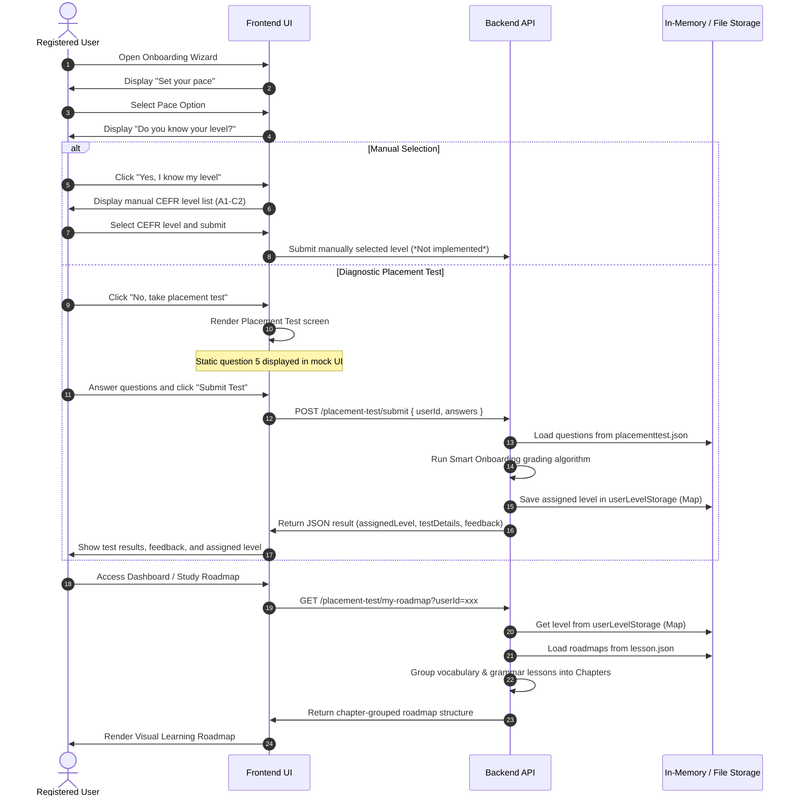

# Feature Specification: Placement Test & Onboarding

**Feature Branch**: `[placement-test]`

**Created**: 2026-07-25

**Status**: Draft

**Input**: User description: "Analyze the existing codebase thoroughly to align the placement test and onboarding feature with a spec-driven development workflow. Create spec, plan, and task files without modifying existing source code, reflecting the actual current implementation."

---

## 1. Feature Overview & Purpose

The **Placement Test & Onboarding** feature is designed to guide newly registered users through a personalization sequence upon their first login. The goal is to determine their study commitment level and assess their English proficiency level (CEFR: A1 to C2) through either self-assessment or a diagnostic placement test. Based on this information, the system automatically assigns a personalized learning roadmap consisting of sequential chapters that bundle vocabulary and grammar lessons.

Currently, the feature is implemented as a prototype:
- The **Backend** provides REST endpoints that calculate the CEFR level using a rule-based smart onboarding algorithm, structure the roadmap into chapters, and load lesson details. However, it relies on static JSON files and an in-memory storage Map, bypassing actual database persistence despite having Sequelize models defined.
- The **Frontend** provides an interactive onboarding UI and a 10-question placement test UI. However, it uses hardcoded static questions and lacks API communication layer integration.

---

## 2. User Roles Involved

- **Registered User / Learner**: A user who has signed up and is completing onboarding or studying their personalized roadmap.
- **Guest / Anonymous User**: Not authorized to access onboarding, though current backend endpoints lack auth checks (*Not identified in the current implementation*).

---

## 3. User Stories

### User Story 1 - Set Study Commitment Pace (Priority: P1)
As a user completing onboarding, I want to select my weekly study commitment pace so that the system can structure my daily study schedule.
* **Why this priority**: It is the first step of the onboarding survey and is essential for tracking commitment.
* **Independent Test**: Select a pace option (e.g., "4 hours/week") on the UI and check if it navigates to the next page.
* **Acceptance Scenarios**:
  1. **Given** a user is on the "Set your pace" page, **When** they click one of the commitment options (e.g., "4 hours/week"), **Then** the UI saves this state locally and navigates to the proficiency selection step.
  2. **Given** a user select a commitment pace, **When** the page advances, **Then** the progress bar updates to 50%.

---

### User Story 2 - Manually Select Starting English Level (Priority: P1)
As a user who already knows my CEFR level, I want to manually select my level so that I can immediately skip the diagnostic test and generate my roadmap.
* **Why this priority**: High-level or returning users should not be forced to take a 15-minute diagnostic test.
* **Independent Test**: Select "Yes, I know my level", pick a level (e.g., "B2"), and verify that the system generates a B2 roadmap.
* **Acceptance Scenarios**:
  1. **Given** a user chooses "Yes, I know my level", **When** they submit a specific level, **Then** the system assigns that CEFR level and generates the corresponding roadmap.
  2. **Given** a manual level selection is submitted, **When** the user accesses their dashboard, **Then** they are presented with chapters containing lessons for the selected level.

---

### User Story 3 - Take Diagnostic Placement Test (Priority: P1)
As a user who is unsure of my current level, I want to take a short diagnostic test so that the system can automatically and accurately assess my level.
* **Why this priority**: Core value proposition for personalized learning, ensuring users start at an appropriate difficulty level.
* **Independent Test**: Submit a 10-question answer sheet to `/placement-test/submit` and check if the returned level matches the rule-based grading expectations.
* **Acceptance Scenarios**:
  1. **Given** a user selects "No, I want to take a placement test", **When** they complete the 10 questions and click submit, **Then** the backend calculates their score and assigns a CEFR level.
  2. **Given** a test submission is processed, **When** the backend evaluates accuracy per CEFR level, **Then** it returns the assigned level, score percentage, personalized feedback headers (e.g., "OUTSTANDING WORK!"), and question explanations.

---

### User Story 4 - View Personalized Chapter-Grouped Roadmap (Priority: P1)
As a learner, I want to view my study path organized into chapters with vocabulary and grammar lessons so that I can learn systematically.
* **Why this priority**: The roadmap is the main page that users interact with for their daily self-study.
* **Independent Test**: Fetch `/placement-test/my-roadmap?userId=xxx` and verify that the response contains chapters with paired vocabulary and grammar lessons.
* **Acceptance Scenarios**:
  1. **Given** a user has completed onboarding, **When** they request their roadmap, **Then** the system returns a chapter-wise group where Chapter 1 is unlocked/in-progress and subsequent chapters are locked.
  2. **Given** a chapter-wise response, **When** lessons are rendered, **Then** they display clear labels showing the lesson type (Vocabulary or Grammar) and item counts.

---

## 4. Functional Requirements

### Onboarding Survey & Placement Test UI
- **FR-001**: The UI must display a multi-step onboarding wizard:
  1. Step 1: Commitment Pace selection (4 choices).
  2. Step 2: Proficiency Pathway selection ("Know Level" vs "Take Test").
  3. Step 3: Diagnostic test interface or manual selector (*Manual selector UI is not identified in the current frontend implementation*).
- **FR-002**: The Placement Test UI must show a progress bar, a Question Map (1 to 10 indicator), navigation buttons ("Next Question", "Previous Question"), and a "Submit Test" button.
- **FR-003**: The UI must display multiple-choice questions with choices A, B, C, D and highlight the selected choice.
- **FR-004**: The UI must calculate live accuracy during the test (*Currently hardcoded to 80% on UI*).

### Grading & Level Assessment (Backend)
- **FR-005**: The backend must load placement test questions on startup from `database/data/placementtest.json`.
- **FR-006**: The backend must expose a submission endpoint that accepts `userId` and a key-value record of answers (`Record<number, string>`).
- **FR-007**: The backend must calculate correctness for each question and group statistics by CEFR level (`A1`, `A2`, `B1`, `B2`, `C1`, `C2`).
- **FR-008**: The backend must apply a hierarchical Smart Onboarding algorithm:
  - Evaluate levels sequentially from A1 to C2.
  - If a level has accuracy >= 70%, evaluate the next level.
  - The first level with < 70% accuracy is assigned to the user. If all levels are passed with >= 70% accuracy, assign C2.
- **FR-009**: The backend must return feedback metadata containing:
  - Total correct questions, overall percentage, and assigned level.
  - A feedback object with a title and message (e.g., "OUTSTANDING WORK!" for >= 90%, "EXCELLENT JOB!" for >= 75%, "GOOD EFFORT!" for >= 50%, and "KEEP TRYING!" for < 50%).
  - An array of `testDetails` containing the question text, options, user's answer, correct answer, and correctness flag for review.

### Roadmap Generation & Details (Backend)
- **FR-010**: The backend must load learning paths from `database/data/lesson.json` on startup.
- **FR-011**: The backend must generate a structured chapter roadmap for the user's level where:
  - Lessons are paired: one Vocabulary lesson and one Grammar lesson form a single Chapter.
  - Chapter 1 is unlocked (`isChapterUnlocked: true`) and its first lesson is marked `IN_PROGRESS` with a mock progress of 25%.
  - All subsequent chapters and lessons are marked `LOCKED`.
- **FR-012**: The backend must return details of a specific lesson (either vocabulary items or grammar details) based on `lessonId` and `type` (VOCABULARY or GRAMMAR).

---

## 5. Main User Flows

---

## 6. Alternative & Exception Flows

### Alternative Flow 1: User Already Has Assigned Level
- **Condition**: A user who has already completed the placement test or manual level selection accesses onboarding.
- **Flow**: The system redirects them directly to the visual learning roadmap instead of showing the survey (*Currently not implemented in frontend/backend flow check*).

### Exception Flow 1: Missing User Identifier
- **Condition**: Request to `/placement-test/my-roadmap` is missing the `userId` parameter.
- **Flow**: Backend throws a `400 Bad Request` with message: `"Vui lòng cung cấp tham số userId để lấy lộ trình học."`.

### Exception Flow 2: In-Memory State Loss
- **Condition**: The backend server restarts, wiping the in-memory `userLevelStorage` Map.
- **Flow**: Subsequent calls to `/placement-test/my-roadmap` will fall back to returning the default `A1` roadmap for the user.

---

## 7. Technical Requirements

### UI Requirements
- Inline-styled React component layout utilizing flexbox and grid layouts.
- Question navigation: Allow jumping to different questions via the "Question Map" panel or "Next/Previous" buttons.
- Display a progress bar reflecting current answered questions / total questions.

### API & Backend Requirements
- The endpoints are grouped under the `@Controller('placement-test')` prefix:
  1. `POST /placement-test/submit`: Validates input with `SubmitTestDto`.
  2. `GET /placement-test/my-roadmap`: Queries parameters for `userId`.
  3. `GET /placement-test/lesson-detail`: Queries parameters for `lessonId` and `type`.

### Data Persistence Requirements
- **Test Questions**: Read-only static load from `database/data/placementtest.json` containing `test_title` and `questions` array.
- **Lessons & Chapters**: Read-only static load from `database/data/lesson.json`.
- **User States**: Kept in volatile `Map<string, string>` memory. No PostgreSQL database tables are queried or updated.

---

## 8. Success Criteria & Metrics

- **Grading Accuracy**: 100% compliance of level assignment with the hierarchical 70% correctness algorithm.
- **Roadmap Structuring**: Roadmap generation must always succeed in pairing vocabulary and grammar lessons, outputting the chapter format expected by the frontend.
- **Response Latency**: Core grading and chapter grouping logic must complete within <100ms under standard loads.

---

## 9. Assumptions & Constraints

- **Auth Constraints**: Endpoint access is currently open. There are no authentication decorators (e.g. `@UseGuards(JwtGuard)`) enforcing that the `userId` matches the logged-in user session.
- **Database Bypassed**: Sequelize models exist for `PlacementTest` and `PlacementQuestion` but are not synced or populated.
- **Hardcoded Questions on Frontend**: The frontend does not currently fetch the questions dynamically, meaning it only displays a mock preposition question.
- **Volatile Storage**: User roadmap settings are lost on server restart due to the lack of Postgres persistence.
