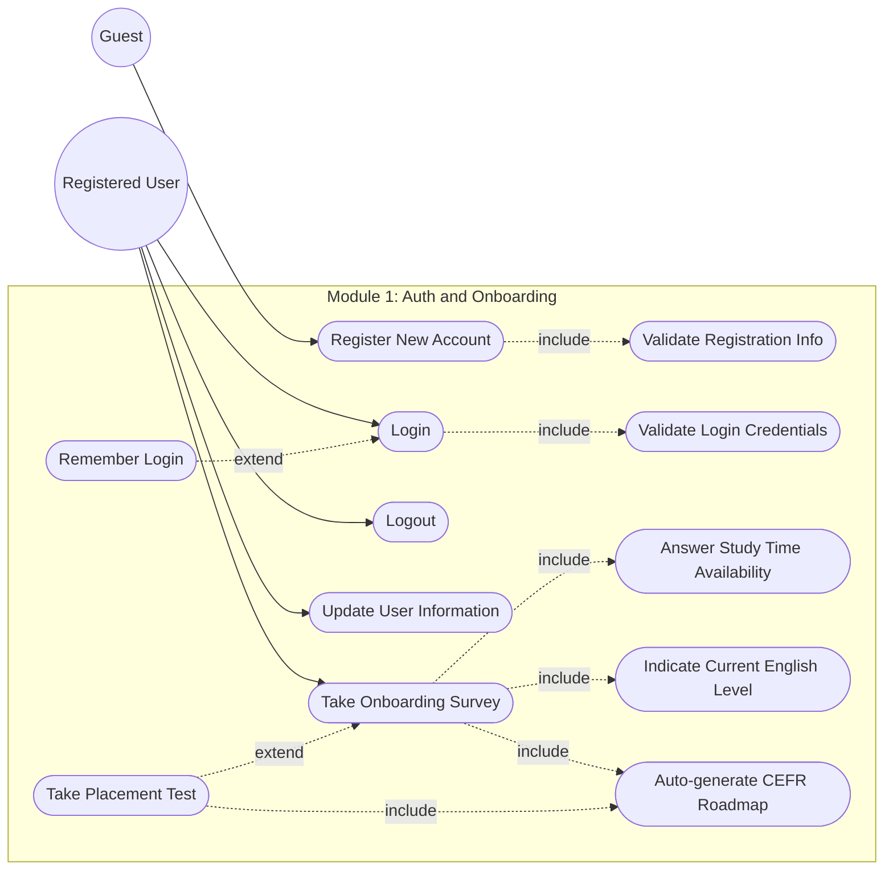
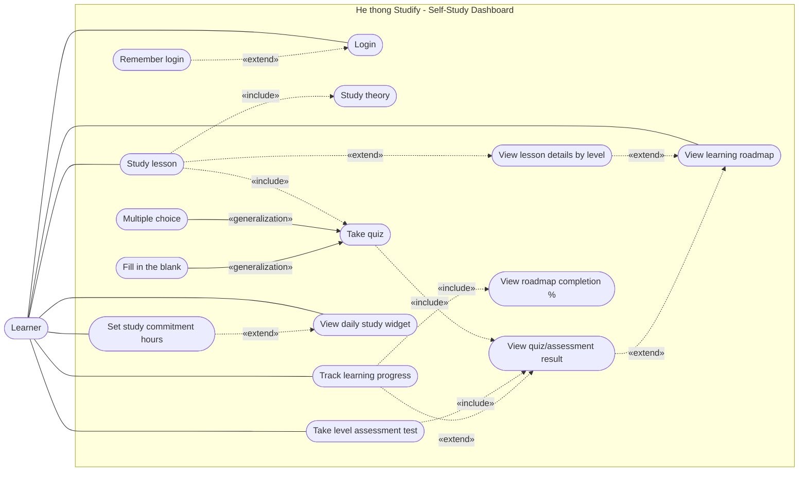
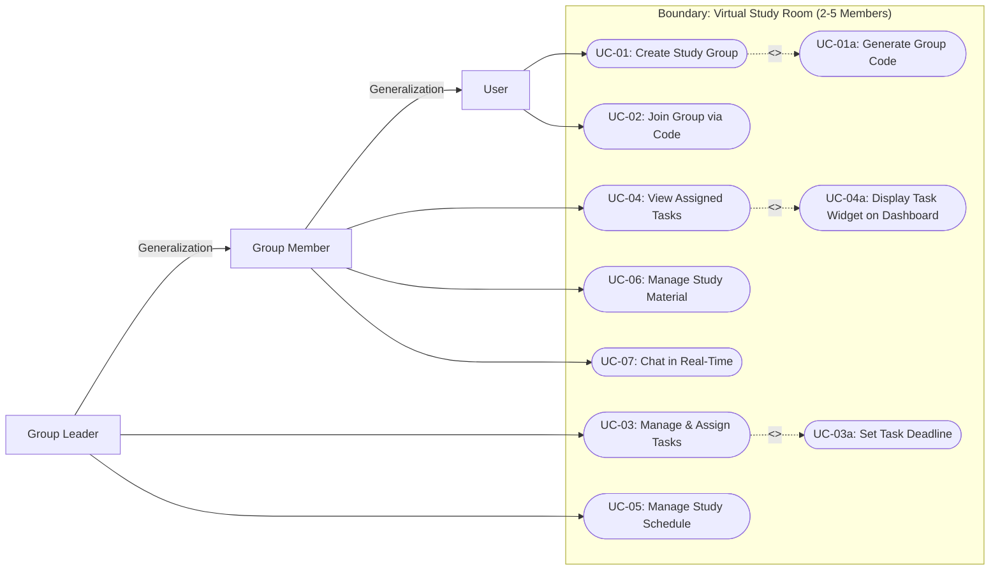
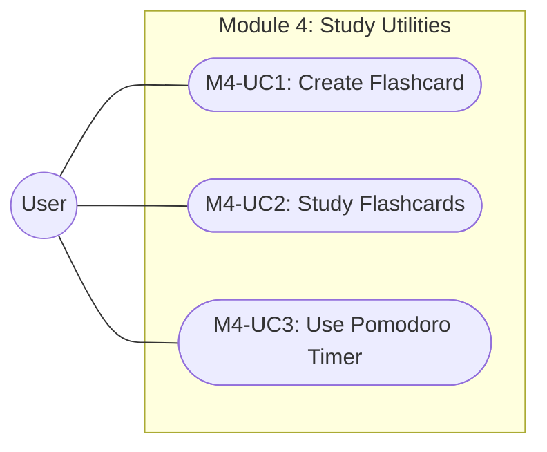
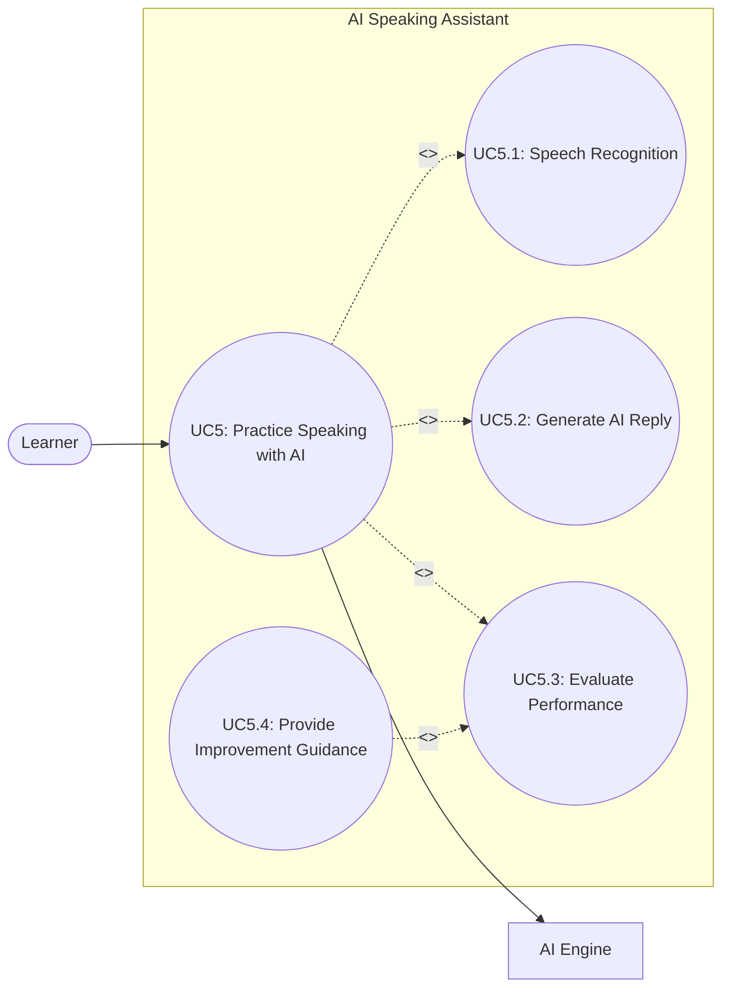
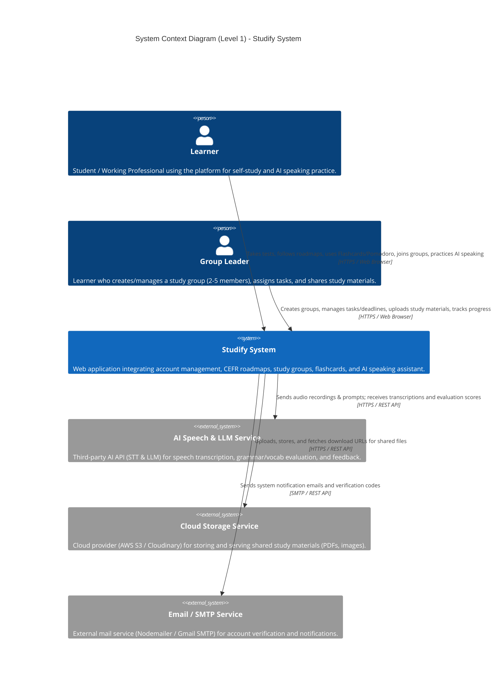
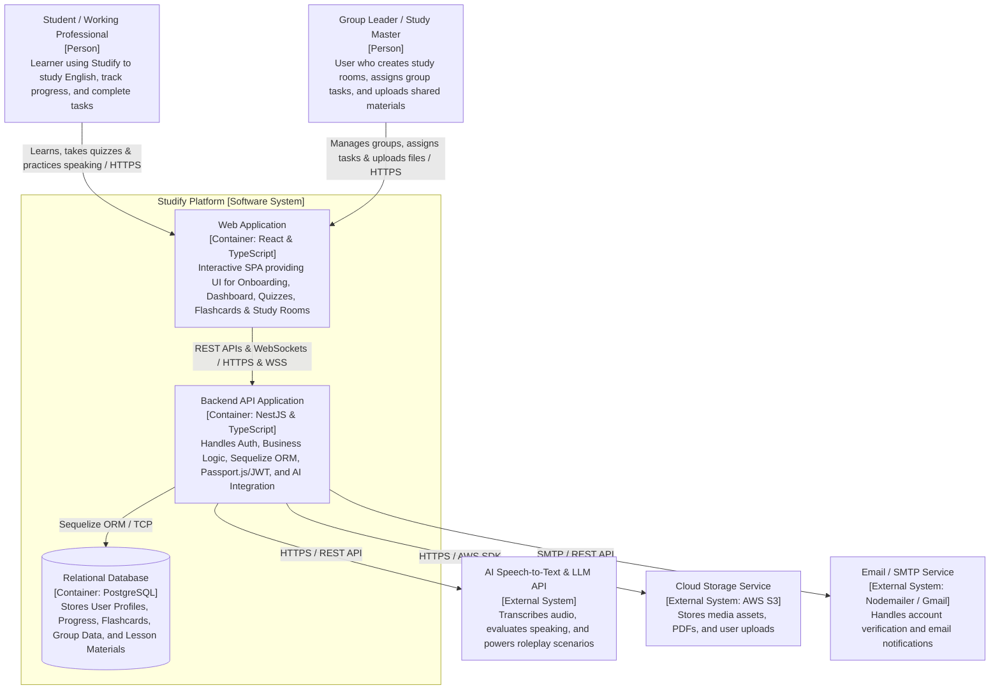
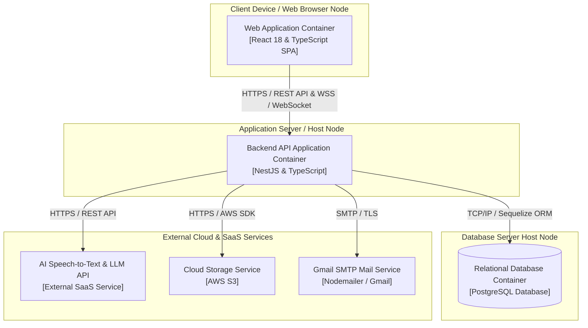
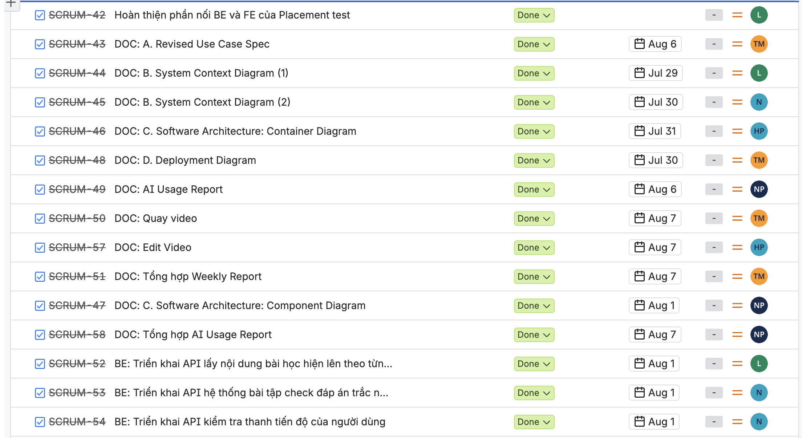

## Project Assignment 4 (PA4-2026)

**Group ID:** Group 9  
**Project Name:** Công Ty TNHH 5 thành viên  
**Video Demo Link:** [YouTube Unlisted/Public Link](https://www.youtube.com/watch?v=VaBwFC_cYxw)   
**Table of contents:**
- [A - Revised Use-Case Specification - 2nd submission](#a---revised-use-case-specification---2nd-submission)
  - [Use-Case Models Revision](#use-case-models-revision)
    - [1. Authentication \& Personalization Use-Case Model](#1-authentication--personalization-use-case-model)
    - [2. Self-Study Dashboard Use-Case Model](#2-self-study-dashboard-use-case-model)
    - [3. Virtual Study Room Use-Case Model](#3-virtual-study-room-use-case-model)
    - [4. Study Utilities Use-Case Model](#4-study-utilities-use-case-model)
    - [5. AI Speaking Assistant Use-Case Model](#5-ai-speaking-assistant-use-case-model)
  - [Use-Case Specifications Revision:](#use-case-specifications-revision)
- [B - Software Architecture: System Context Diagram](#b---software-architecture-system-context-diagram)
  - [Tech Stack](#tech-stack)
  - [C4 Model — Level 1: System Context Diagram](#c4-model--level-1-system-context-diagram)
    - [2.1 Written Explanation](#21-written-explanation)
- [C - Software Architecture: Container Diagram and Component Diagram](#c---software-architecture-container-diagram-and-component-diagram)
  - [C4 Model - Level 2 (Container Diagram):](#c4-model---level-2-container-diagram)
    - [A. AI Speech-to-Text \& LLM API](#a-ai-speech-to-text--llm-api)
    - [B. Cloud Storage Service](#b-cloud-storage-service)
  - [C4 Model - Level 3 (Component Diagram):](#c4-model---level-3-component-diagram)
    - [1. Web Application Container (Frontend)](#1-web-application-container-frontend)
      - [Container Description](#container-description)
      - [Component Diagram — Authentication \& Onboarding Feature](#component-diagram--authentication--onboarding-feature)
      - [Component Descriptions](#component-descriptions)
        - [Routing Layer](#routing-layer)
        - [Auth Feature Module](#auth-feature-module)
        - [Onboarding Feature Module](#onboarding-feature-module)
    - [2. Backend API Application Container (Backend)](#2-backend-api-application-container-backend)
      - [Container Description](#container-description-1)
      - [Component Diagram — Authentication \& Placement Test Feature](#component-diagram--authentication--placement-test-feature)
      - [Component Descriptions](#component-descriptions-1)
        - [Auth Module](#auth-module)
        - [User Module](#user-module)
        - [Placement Test Module](#placement-test-module)
        - [Progress Module](#progress-module)
        - [Shared Service](#shared-service)
- [D - Deployment Diagram](#d---deployment-diagram)
  - [1. System Deployment Architecture](#1-system-deployment-architecture)
    - [1.1 System Deployment Diagram (Mermaid)](#11-system-deployment-diagram-mermaid)
    - [1.2 Infrastructure Nodes Description](#12-infrastructure-nodes-description)
      - [Node 1: Client Device / Web Browser Node](#node-1-client-device--web-browser-node)
      - [Node 2: Application Server / Host Node](#node-2-application-server--host-node)
      - [Node 3: Database Server Host Node](#node-3-database-server-host-node)
      - [Node 4: External Cloud \& SaaS Services](#node-4-external-cloud--saas-services)
- [E - Implement 2 Functional Groups using Spec Kit](#e---implement-2-functional-groups-using-spec-kit)
- [F - AI Usage Report and Weekly Report](#f---ai-usage-report-and-weekly-report)

# A - Revised Use-Case Specification - 2nd submission
[Click here to view the Changes.pdf](./Changes.pdf)

## Use-Case Models Revision
### 1. Authentication & Personalization Use-Case Model
> **Authors:** [Khánh Linh] | **Reviewer:** [Minh Thư] | **Editor:** [Khánh Linh]

### 2. Self-Study Dashboard Use-Case Model
> **Authors:** [Kim Hằng] | **Reviewer:** [Minh Thư] | **Editor:** [Kim Hằng]


### 3. Virtual Study Room Use-Case Model
> **Authors:** [Minh Thư] | **Reviewer:** [Thiên Phước] | **Editor:** [Minh Thư]

### 4. Study Utilities Use-Case Model
> **Authors:** [Thiên Phước] | **Reviewer:** [Minh Thư] | **Editor:** [Thiên Phước]


### 5. AI Speaking Assistant Use-Case Model
> **Authors:** [Gia Phúc] | **Reviewer:** [Minh Thư] | **Editor:** [Gia Phúc]


## Use-Case Specifications Revision:
* **Function 01**: Authentication and Onboarding: [Specs](./A.UseCaseSpecification/Module_1/M1_specs.pdf)
* **Function 02**: Self Study Dashboard: [Specs](./A.UseCaseSpecification/Module_2/M2_specs.pdf)
* **Function 03**: Virtual Study Room: [Specs](./A.UseCaseSpecification/Module_3/M3_specs.pdf)
* **Function 04**: Study Ultilites: [Specs](./A.UseCaseSpecification/Module_4/M4_specs.pdf)
* **Function 05**: AI Speaking: [Specs](./A.UseCaseSpecification/Module_5/M5_specs.pdf)

# B - Software Architecture: System Context Diagram
> **Authors:** [Kim Hằng] | **Reviewer:** [Minh Thư] | **Editor:** [Kim Hằng]

## Tech Stack
The Studify platform utilizes a modern web development stack to deliver a responsive user experience and handle its core functionalities. Below is the detailed breakdown of the technologies used, strictly reflecting the current project implementation:

*   **Frontend**: 
    *   **React & TypeScript:** Used to build the interactive, single-page application (SPA) and user interface for learners. TypeScript ensures robust, error-free client-side logic.
*   **Backend**: 
    *   **NestJS (Node.js framework):** Acts as the core server handling business logic, API requests, and seamless integration of features like Authentication, Flashcards, and Virtual Study Rooms.
    *   **TypeScript:** Used universally across the backend for strict static typing.
    *   **Sequelize (ORM):** Manages database operations and schema mappings efficiently.
*   **Database**: 
    *   **PostgreSQL:** Relational database used to store user profiles, learning progress, flashcards, group data, and lesson materials persistently.
*   **Authentication & Security**: 
    *   **Passport.js & JWT (JSON Web Tokens):** Handles secure user registration, login sessions, and Role-Based Access Control (RBAC) validation.
    *   **Bcryptjs:** Used for hashing and securing user passwords before storage.
*   **External Components & Services**: 
    *   **AI Speech-to-Text & LLM API:** Integrates external AI models to power the English speaking evaluation, simulate roleplay scenarios, and provide grammar/vocabulary feedback.
    *   **Cloud Storage Service:** (e.g., AWS S3) To store media assets such as group documents, PDFs, and user uploads.

## C4 Model — Level 1: System Context Diagram
> **Authors:** [Khánh Linh] | **Reviewer:** [Minh Thư] | **Editor:** [Khánh Linh]

The System Context diagram is the highest-level view in the C4 Model. It treats Studify as a single black-box system, and shows only: (1) who the human actors are, and (2) which external systems it depends on. Internal structure (frontend, backend, database) is intentionally *not* shown at this level — that level of detail belongs to the Level 2 Container diagram.



### 2.1 Written Explanation

**Actors (Person elements)**
Studify is used by a single underlying actor role — the registered learner — but the diagram separates two usage patterns because they interact with the system differently:
- **Student / Working Professional:** the primary end-user across every sprint of the project — registering and completing onboarding (PA1), following their personalized roadmap and self-study dashboard (PA2), joining virtual study rooms and reviewing flashcards (PA3), and practicing speaking with the AI assistant (PA4).
- **Group Leader (Study Group Master):** the same type of user account, but acting in an elevated role *within a specific study group* — creating the group, assigning tasks/deadlines, and uploading shared materials (PA3). This is a permission distinction (RBAC), not a separate account type, which is why both actors connect to the same central system rather than to different systems.

**The System (Studify)**
Drawn as a single box because, at Context level, we deliberately hide implementation detail. Whether it's built with React, NestJS, or PostgreSQL is irrelevant here — what matters is that it is one cohesive system responsible for authentication, learning content delivery, group collaboration, and AI-assisted speaking practice.

**External Systems (System_Ext)**
Two systems sit outside Studify's boundary because they are operated by third parties, not by the team:
- **AI Speech & LLM Service:** Studify does not implement its own speech recognition or language model. It sends recorded audio/prompts out to a third-party AI service and receives back a transcription plus a structured evaluation (grammar, vocabulary, relevance, suggestions), which powers the PA4 AI Speaking Assistant feature.
- **Cloud Storage Service:** shared documents and images uploaded in a Virtual Study Room (PA3) are not stored inside Studify's own database; they are pushed to and retrieved from an external object storage provider, with only metadata/URLs kept internally.

Notably, PostgreSQL and the JWT/bcrypt authentication mechanism are **not** represented as external systems, because they are internal components that Studify itself owns and operates — they will instead appear as containers in the Level 2 Container Diagram, not as external dependencies at this Context level.

# C - Software Architecture: Container Diagram and Component Diagram
## C4 Model - Level 2 (Container Diagram):
> **Authors:** [Gia Phúc] | **Reviewer:** [Minh Thư] | **Editor:** [Gia Phúc]



**1\. Web Application**  
**Responsibility:** Serves as the single-page application (SPA) client interface for all users.

* **For Students / Working Professionals:** Renders the Onboarding Survey (F1.2), Self-Study Dashboard (F2), Quizzes (F2.3), Flashcard system with interactive shortcuts (F4.2), Pomodoro Timer (F4.1), and AI Speaking Assistant UI (F5).  
* **For Group Leaders:** Renders Group Management controls (F3.1), Task Assignment interfaces (F3.3), and Shared File Upload utilities (F3.4).

**Technology / Framework:** React & TypeScript.  
**Communication:**

* Communicates with **Backend API Application** via **HTTP/HTTPS (REST API)** for standard business operations.  
* Connects via **WebSocket (WSS)** for Virtual Study Room real-time features (Real-time Chat & Task updates).

**2\. Backend API Application**  
**Responsibility:** Core server application encapsulating all business logic and system workflows:

* Authentication & authorization (Passport.js, JWT, Bcryptjs password hashing, and RBAC validation for Leader vs. Member permissions).  
* Smart Roadmap assignment algorithms, quiz grading, and progress tracking calculation.  
* Flashcard CRUD, tagging mechanisms, and explanation storage.  
* Serving as a proxy to send audio and prompts to external AI services.  
* Database operations abstraction using **Sequelize ORM**.

**Technology / Framework:** NestJS (Node.js framework) with TypeScript, Passport.js, JWT, Bcryptjs, and Sequelize ORM.  
**Communication:**

* Receives REST API requests and WebSocket connections from **Web Application** over **HTTPS / WSS**.  
* Reads/writes persistent relational data to **PostgreSQL** via **Sequelize ORM / TCP**.  
* Sends audio streams and evaluation requests to **AI Speech-to-Text & LLM API** via **HTTPS REST APIs**.  
* Handles file upload/download stream signing with **Cloud Storage Service** via **HTTPS (AWS SDK)**.

**3\. PostgreSQL Database**   
**Responsibility:** Provides persistent, relational data storage across the platform. Stores user accounts, hashed credentials, CEFR roadmap nodes, quiz question banks and user records, progress percentages, flashcards/tags, study room codes, group task deadlines, and chat logs.  
**Technology:** PostgreSQL.  
**Communication:**

* Connected to and queried exclusively by **Backend API Application** via **Sequelize ORM over TCP/IP**.

**4\. External Systems**

### A. AI Speech-to-Text & LLM API

* **Responsibility:** Transcribes user speech audio to text, simulates roleplay scenarios, analyzes grammar and vocabulary selection, checks context adherence, and returns actionable feedback and scoring for F5.  
* **Technology / Framework:** External SaaS API (e.g., OpenAI API / Google Gemini API).  
* **Communication Protocol:** **HTTPS / REST API** triggered directly by the NestJS Backend API.

### B. Cloud Storage Service

* **Responsibility:** Stores media assets such as group PDF documents, study room attachments, user uploads, and images for shared repositories (F3.4).  
* **Technology / Framework:** External Cloud Storage (e.g., AWS S3).  
* **Communication Protocol:** **HTTPS** using AWS SDK / pre-signed URLs managed by the NestJS Backend API.

## C4 Model - Level 3 (Component Diagram):
> **Authors:** [Thiên Phước] | **Reviewer:** [Minh Thư] | **Editor:** [Thiên Phước]

The following Level 3 Component Diagrams zoom into the internal structure of the **Web Application (Frontend)** and **Backend API Application (Backend)** containers. We focus on **two core features** that together best represent the internal structure of each container:

- **Authentication (Login / Register / Forgot Password)** — demonstrates the UI component layer, Zustand global state, Axios HTTP calls, client-side route guarding, and token persistence in the Frontend; and the Controller -> Service -> Guard -> UserService -> MailService -> Database pipeline in the Backend.
- **Onboarding & Placement Test** — demonstrates multi-step React state management, direct Axios API calls from leaf components, and the Smart Onboarding grading algorithm + `UserService` integration in the Backend.

### 1. Web Application Container (Frontend)

#### Container Description

- **Responsibility:** Serves as the Single-Page Application (SPA) client interface for all users. Renders authentication screens (Login, Register, Forgot Password), the multi-step Onboarding flow (goal-setting and Placement Test), and all post-login protected pages (Dashboard, Roadmap, Lessons, Profile). Enforces a client-side Onboarding Guard that redirects un-onboarded users before they can access the main learning content.
- **Technology / Framework:** React 19 with TypeScript, Vite bundler, React Router DOM v7 (client-side routing), Zustand (global state management), Axios (HTTP client), TailwindCSS v4 (styling).
- **Communication:**
  - Communicates with the **Backend API Application** via **HTTP/HTTPS (REST API)** for all operations (login, register, password reset, fetching placement test questions, submitting answers, tracking progress).
  - WebSocket (WSS) connection for real-time Virtual Study Room features is **planned in the target architecture** but not yet implemented in the current codebase.

#### Component Diagram — Authentication & Onboarding Feature

``````mermaid
---
config:
  layout: dagre
---
graph TB
    User["User / Learner<br/>[Person]"]

    subgraph FrontendContainer["Web Application [Container: React & TypeScript]"]
        direction TB

        subgraph Routing["React Router DOM [Client-Side Routing]"]
            AppRouter["App.tsx / BrowserRouter<br/>[React Router]<br/>Defines all application routes.<br/>Hosts the OnboardingGuard."]
            OnboardingGuard["OnboardingGuard<br/>[Route Guard Component]<br/>Checks user.hasCompletedOnboarding flag<br/>from AuthStore. Redirects to /onboarding<br/>if flag is false."]
        end

        subgraph AuthFeature["auth/ Feature Module"]
            LoginForm["LoginForm.tsx<br/>[React Component]<br/>Renders login form. Calls loginAction<br/>from AuthStore on submit."]
            RegisterForm["RegisterForm.tsx<br/>[React Component]<br/>Renders registration form. Calls<br/>register API via Axios directly."]
            ForgotPasswordForm["ForgotPasswordForm.tsx<br/>[React Component]<br/>Renders multi-step forgot-password /<br/>OTP verification / reset password form."]
            AuthStore["useAuthStore.ts<br/>[Zustand Store]<br/>Global state: user, token, isLoading, error.<br/>Persists accessToken and authUser<br/>to localStorage. Provides loginAction,<br/>logoutAction, setAuthSession,<br/>markOnboardingCompleted."]
        end

        subgraph OnboardingFeature["onboarding/ Feature Module"]
            OnboardingApp["OnboardingApp.tsx<br/>[React Component]<br/>Multi-step UI: Step 1 sets weekly pace,<br/>Step 2 presents level options<br/>or launches PlacementTest."]
            PlacementTest["PlacementTest.tsx<br/>[React Component]<br/>Fetches questions from GET /placement-test/questions.<br/>Collects answers, submits to POST /placement-test/submit.<br/>Calls markOnboardingCompleted on AuthStore after success."]
        end
    end

    BackendAPI["Backend API Application<br/>[Container: NestJS & TypeScript]"]

    User -->|Interacts with browser| AppRouter
    AppRouter -->|Renders auth pages| LoginForm
    AppRouter -->|Renders auth pages| RegisterForm
    AppRouter -->|Renders auth pages| ForgotPasswordForm
    AppRouter -->|Renders onboarding| OnboardingApp
    AppRouter -->|Guards protected routes| OnboardingGuard

    OnboardingGuard -->|Reads user state| AuthStore

    LoginForm -->|Calls loginAction| AuthStore
    RegisterForm -->|POST /auth/register via Axios / HTTPS| BackendAPI
    ForgotPasswordForm -->|POST /auth/forgot-password and /auth/reset-password via Axios / HTTPS| BackendAPI

    AuthStore -->|Stores accessToken and authUser in localStorage| AuthStore
    AuthStore -->|POST /auth/login via Axios / HTTPS| BackendAPI

    OnboardingApp -->|Conditionally renders| PlacementTest
    PlacementTest -->|Reads token from| AuthStore
    PlacementTest -->|GET /placement-test/questions via Axios / HTTPS| BackendAPI
    PlacementTest -->|POST /placement-test/submit with Bearer Token / HTTPS| BackendAPI
    PlacementTest -->|Calls markOnboardingCompleted| AuthStore
``````

#### Component Descriptions

##### Routing Layer

- **`App.tsx` / `BrowserRouter` (React Router)**
  - **Responsibility:** Defines all client-side routes (`/login`, `/register`, `/onboarding`, `/dashboard`, `/roadmap`, `/lessons`, etc.). Wraps protected routes inside `<OnboardingGuard>` and `<MainLayout>`. Acts as the top-level shell of the application.
  - **Relationships:** Renders all Feature Module components on their respective routes. Delegates route-protection logic to `OnboardingGuard`.

- **`OnboardingGuard` (Route Guard Component)**
  - **Responsibility:** A custom React component that reads the `user.hasCompletedOnboarding` flag directly from `useAuthStore`. If the flag is `false` or the user object is absent, it redirects the user to `/onboarding` using `<Navigate>`, preventing access to all protected learning pages.
  - **Relationships:** Reads state from `useAuthStore`. Wraps all post-login protected routes defined in `App.tsx`.

##### Auth Feature Module

- **`LoginForm.tsx` (React Component)**
  - **Responsibility:** Renders the login form UI with email and password fields. On submission, delegates to `loginAction` in `useAuthStore`. Displays loading and error states read from the store.
  - **Relationships:** Calls `loginAction` on `useAuthStore`. Does not call the API directly; all HTTP logic is encapsulated in the store.

- **`RegisterForm.tsx` (React Component)**
  - **Responsibility:** Renders the user registration form. On submission, calls `POST /auth/register` directly via Axios. On success, calls `setAuthSession` on `useAuthStore` to hydrate the session and navigates to `/onboarding`.
  - **Relationships:** Calls `POST /auth/register` on the **Backend API** via HTTPS. Calls `setAuthSession` on `useAuthStore`.

- **`ForgotPasswordForm.tsx` (React Component)**
  - **Responsibility:** Implements a multi-step forgot password flow: Step 1 enters email; Step 2 verifies OTP; Step 3 resets password. Each step calls the corresponding backend endpoint directly via Axios.
  - **Relationships:** Calls `POST /auth/forgot-password` and `POST /auth/reset-password` on the **Backend API** via HTTPS.

- **`useAuthStore.ts` (Zustand Store)**
  - **Responsibility:** Central global state store for authentication. Manages `user`, `token`, `isLoading`, and `error` state. Implements `loginAction` (calls `POST /auth/login` via Axios, persists token and user to `localStorage`), `logoutAction` (clears state and localStorage), `setAuthSession` (hydrates state from external login flows), and `markOnboardingCompleted` (updates `user.hasCompletedOnboarding` flag in both in-memory state and localStorage).
  - **Relationships:** Called by `LoginForm`, `RegisterForm`, `PlacementTest`, and `OnboardingGuard`. Sends HTTPS requests to the **Backend API Application**.

##### Onboarding Feature Module

- **`OnboardingApp.tsx` (React Component)**
  - **Responsibility:** Multi-step UI component managing two onboarding steps via local React state: (1) "Set Your Pace" — user selects a weekly study hours commitment (2h / 4h / 6h / 8+h); (2) "English Level" — user either self-selects a CEFR level or triggers the Placement Test. Navigates to `/dashboard` upon completion.
  - **Relationships:** Conditionally renders `PlacementTest` component when user selects to take the placement test.

- **`PlacementTest.tsx` (React Component)**
  - **Responsibility:** Fetches placement test questions from the backend (`GET /placement-test/questions`) on component mount via Axios (no auth required). Displays questions one-by-one with navigation controls. On final submission, sends all answers to `POST /placement-test/submit` with the Bearer token. Calls `markOnboardingCompleted` on `useAuthStore` to update the global session state after a successful submission.
  - **Relationships:** Reads `token` from `useAuthStore`. Sends HTTPS requests to the **Backend API Application** for both fetching questions and submitting answers. Calls `markOnboardingCompleted` on `useAuthStore` after success.


### 2. Backend API Application Container (Backend)

#### Container Description

- **Responsibility:** Core server application encapsulating all business logic. Currently implements: authentication (register, login, forgot/reset password with OTP via email), JWT-based route protection using Passport.js, user profile management and onboarding status updates, placement test delivery and smart-grading with CEFR level assignment, and lesson progress tracking (vocabulary and grammar).
- **Technology / Framework:** NestJS (Node.js framework) with TypeScript, Passport.js (JWT strategy via `@nestjs/passport`), `@nestjs/jwt` (JWT signing/verification), Bcryptjs (password hashing), Nodemailer with Gmail SMTP (OTP email delivery), Sequelize ORM (database abstraction layer).
- **Communication:**
  - Receives **HTTPS REST API** requests from the **Web Application**.
  - Connects to the **PostgreSQL Database** via **Sequelize ORM over TCP/IP**.
  - Sends OTP reset emails via **Gmail SMTP (Nodemailer)** as an external mail service.

#### Component Diagram — Authentication & Placement Test Feature

``````mermaid
---
config:
  layout: dagre
---
graph TB
    WebApp["Web Application<br/>[Container: React & TypeScript]"]

    subgraph BackendContainer["Backend API Application [Container: NestJS & TypeScript]"]
        direction TB

        subgraph AuthModule["Auth Module (modules/auth/)"]
            AuthCtrl["AuthController<br/>[NestJS Controller]<br/>Routes: POST /auth/login,<br/>/auth/register, /auth/forgot-password,<br/>/auth/reset-password, /auth/logout.<br/>Validates DTOs. Delegates to AuthService."]
            JwtGuard["JwtGuard<br/>[NestJS Guard - Passport.js]<br/>Extends AuthGuard('jwt').<br/>Extracts Bearer token, validates via JwtStrategy.<br/>Throws 401 on expired or invalid tokens."]
            JwtStrategy["JwtStrategy<br/>[Passport.js Strategy]<br/>Verifies JWT signature using JWT_SECRET env var.<br/>Injects decoded payload (id, email, role)<br/>into req.user for downstream controllers."]
            AuthSvc["AuthService<br/>[NestJS Service]<br/>Core auth business logic:<br/>login: validates credentials, generates tokens.<br/>register: creates user then logs in.<br/>forgotPassword: generates OTP, hashes it,<br/>stores via UserService, sends via MailService.<br/>resetPassword: verifies OTP expiry and hash.<br/>Generates accessToken (15m) and refreshToken (7d)."]
        end

        subgraph UserModule["User Module (modules/user/)"]
            UserCtrl["UserController<br/>[NestJS Controller]<br/>Routes: GET /user/profile,<br/>PATCH /user/profile,<br/>PATCH /user/onboarding.<br/>All routes protected by JwtGuard."]
            UserSvc["UserService<br/>[NestJS Service]<br/>Data access layer for User model.<br/>Methods: findByEmail, validateUser,<br/>registerUser, updateProfile,<br/>updateOnboarding (weeklyStudyHours),<br/>markOnboardingComplete, updateResetOtp."]
        end

        subgraph PlacementModule["Placement Test Module (features/placement-test/)"]
            PTCtrl["PlacementTestController<br/>[NestJS Controller]<br/>Routes: GET /placement-test/questions (public),<br/>POST /placement-test/submit (JWT-guarded),<br/>GET /placement-test/my-roadmap (JWT-guarded),<br/>GET /placement-test/lesson-detail (public)."]
            PTSvc["PlacementTestService<br/>[NestJS Service]<br/>Loads placementtest.json and lesson.json from disk on startup.<br/>getQuestions(): returns questions without correct_answer field.<br/>submitTest(): grades answers per level, runs<br/>Smart Onboarding algorithm (70% accuracy threshold<br/>per CEFR level A1 to C2), assigns level,<br/>calls UserService.markOnboardingComplete."]
        end

        subgraph ProgressModule["Progress Module (modules/progress/)"]
            ProgressCtrl["ProgressController<br/>[NestJS Controller]<br/>Routes: POST /progress/lesson/:id/complete,<br/>GET /progress/level/:id,<br/>GET /progress/level/:id/lessons.<br/>All routes protected by JwtGuard."]
            ProgressSvc["ProgressService<br/>[NestJS Service]<br/>Manages lesson completion tracking.<br/>Uses UserProgress, VocabularyLesson,<br/>GrammarLesson Sequelize models.<br/>Calculates completion percentage per level."]
        end

        MailSvc["MailService<br/>[NestJS Service - messages/]<br/>sendResetOtp(to, otp):<br/>Sends OTP email via Nodemailer / Gmail SMTP.<br/>Used exclusively by AuthService."]
    end

    DB[("PostgreSQL Database<br/>[Container: PostgreSQL]")]
    GmailSMTP["Gmail SMTP<br/>[External Mail Service - Nodemailer]"]

    WebApp -->|POST /auth/login, /auth/register, /auth/forgot-password, /auth/reset-password / HTTPS| AuthCtrl
    WebApp -->|POST /auth/logout with Bearer Token / HTTPS| JwtGuard
    WebApp -->|GET and PATCH /user/profile, PATCH /user/onboarding / HTTPS| UserCtrl
    WebApp -->|GET /placement-test/questions / HTTPS| PTCtrl
    WebApp -->|POST /placement-test/submit with Bearer Token / HTTPS| PTCtrl
    WebApp -->|POST and GET /progress/ endpoints with Bearer Token / HTTPS| ProgressCtrl

    AuthCtrl -->|Delegates all auth logic| AuthSvc
    JwtGuard -->|Delegates token validation to| JwtStrategy
    JwtGuard -.->|Protects logout route in| AuthCtrl
    JwtGuard -.->|Protects all routes in| UserCtrl
    JwtGuard -.->|Protects submit and my-roadmap in| PTCtrl
    JwtGuard -.->|Protects all routes in| ProgressCtrl

    AuthSvc -->|findByEmail, validateUser, registerUser, updateResetOtp| UserSvc
    AuthSvc -->|sendResetOtp| MailSvc
    MailSvc -->|Sends OTP email / SMTP| GmailSMTP

    UserSvc -->|Reads and Writes User model / Sequelize ORM| DB

    PTCtrl -->|Delegates grading and data retrieval| PTSvc
    PTSvc -->|markOnboardingComplete| UserSvc

    UserCtrl -->|Delegates to| UserSvc

    ProgressCtrl -->|Delegates to| ProgressSvc
    ProgressSvc -->|Reads and Writes UserProgress, VocabularyLesson, GrammarLesson / Sequelize ORM| DB
``````

#### Component Descriptions

##### Auth Module

- **`AuthController` (`auth.controller.ts`)**
  - **Responsibility:** Exposes all authentication REST endpoints: `POST /auth/login`, `POST /auth/register`, `POST /auth/forgot-password`, `POST /auth/reset-password`, `POST /auth/logout`. Validates incoming DTOs via NestJS pipes. The `/auth/logout` route is additionally protected by `JwtGuard`.
  - **Relationships:** Receives HTTPS requests from the **Web Application**. Delegates all logic to `AuthService`.

- **`AuthService` (`auth.service.ts`)**
  - **Responsibility:** Core authentication business logic. `login`: calls `UserService.validateUser` (bcrypt comparison), then generates an accessToken (15m) + refreshToken (7d) pair using `JwtService`. `register`: creates a user via `UserService` then immediately calls `login`. `forgotPassword`: generates a 6-digit numeric OTP, hashes it with bcrypt, stores it with a 15-minute expiry via `UserService`, and dispatches the raw OTP via `MailService`. `resetPassword`: verifies OTP has not expired and matches the stored bcrypt hash, then updates the password.
  - **Relationships:** Calls `UserService` for all user data operations. Calls `MailService` to dispatch OTP emails. Uses `JwtService` for token generation.

- **`JwtGuard` (`guards/jwt.guard.ts`)**
  - **Responsibility:** A NestJS Guard extending Passport's `AuthGuard('jwt')`. Intercepts requests on protected routes and triggers `JwtStrategy` to extract and validate the Bearer token. Overrides `handleRequest` to throw specific `UnauthorizedException` messages for `TokenExpiredError` and `JsonWebTokenError`.
  - **Relationships:** Delegates token verification to `JwtStrategy`. Applied via `@UseGuards(JwtGuard)` to `POST /auth/logout`, all `UserController` routes, `POST /placement-test/submit`, `GET /placement-test/my-roadmap`, and all `ProgressController` routes.

- **`JwtStrategy` (`strategies/jwt.strategy.ts`)**
  - **Responsibility:** Implements the Passport.js JWT strategy. Configures extraction from the Authorization Bearer header and verification using the `JWT_SECRET` environment variable. On successful verification, the decoded payload (`id`, `email`, `role`) is injected into `req.user` for use by downstream controllers.
  - **Relationships:** Invoked by `JwtGuard` during token verification.

##### User Module

- **`UserController` (`user.controller.ts`)**
  - **Responsibility:** Exposes user management endpoints: `GET /user/profile` (fetch own profile by ID extracted from JWT), `PATCH /user/profile` (update name, email, avatar, phone), `PATCH /user/onboarding` (persist weekly study hours commitment). All routes are protected by `JwtGuard`.
  - **Relationships:** Receives HTTPS requests from the **Web Application**. Delegates all logic to `UserService`.

- **`UserService` (`user.service.ts`)**
  - **Responsibility:** Data access and business logic layer for the `User` Sequelize model. Provides: `findByEmail`, `validateUser` (bcrypt password comparison), `registerUser` (bcrypt hashing then model create with duplicate email guard), `updateProfile` (with duplicate email guard), `updateOnboarding` (saves `weeklyStudyHours`), `markOnboardingComplete` (sets `hasCompletedOnboarding = true`), `updateResetOtp` (stores hashed OTP and expiry).
  - **Relationships:** Interacts with the **PostgreSQL Database** via Sequelize ORM. Called by `AuthService`, `UserController`, and `PlacementTestService`.

##### Placement Test Module

- **`PlacementTestController` (`placement-test.controller.ts`)**
  - **Responsibility:** Exposes four endpoints. `GET /placement-test/questions` (public): retrieves questions without revealing correct answers. `POST /placement-test/submit` (JWT-guarded): receives user answers and triggers grading. `GET /placement-test/my-roadmap` (JWT-guarded): retrieves the user's assigned CEFR roadmap. `GET /placement-test/lesson-detail` (public): retrieves detailed lesson content by ID and type.
  - **Relationships:** Receives HTTPS requests from the **Web Application**. Delegates all logic to `PlacementTestService`.

- **`PlacementTestService` (`placement-test.service.ts`)**
  - **Responsibility:** On startup (`OnModuleInit`), reads `placementtest.json` and `lesson.json` from the `database/data/` directory into memory. `getQuestions()`: returns question list with `correct_answer` fields stripped to prevent cheating. `submitTest()`: grades all answers, aggregates per-level accuracy stats (A1 to C2), runs the **Smart Onboarding algorithm** (if accuracy >= 70% for a level, the user advances to the next level; otherwise the current level is assigned), calls `UserService.markOnboardingComplete()`, and returns a detailed result payload including score, feedback title/message, and per-question correctness breakdown.
  - **Relationships:** Calls `UserService.markOnboardingComplete` after successful submission. Reads question and lesson data from in-memory JSON loaded from the filesystem at startup.

##### Progress Module

- **`ProgressController` (`progress.controller.ts`)**
  - **Responsibility:** Exposes lesson progress endpoints: `POST /progress/lesson/:lessonId/complete` (marks a lesson as completed for the authenticated user), `GET /progress/level/:levelId` (returns completion percentage for a given level and lesson type), `GET /progress/level/:levelId/lessons` (returns lesson list with per-lesson completion status). All routes are protected by `JwtGuard`.
  - **Relationships:** Receives HTTPS requests from the **Web Application**. Delegates to `ProgressService`.

- **`ProgressService` (`progress.service.ts`)**
  - **Responsibility:** Manages lesson completion tracking for both `vocabulary` and `grammar` lesson types. `completeLesson`: uses `findOrCreate` on `UserProgress` to idempotently mark a lesson complete, then returns updated level progress. `getLevelProgress`: counts total and completed lessons for a level and computes a percentage. `getLessonsWithStatus`: fetches all lessons in a level and merges completion flags from `UserProgress` records into a combined response.
  - **Relationships:** Interacts with the **PostgreSQL Database** via Sequelize ORM using the `UserProgress`, `VocabularyLesson`, and `GrammarLesson` models.

##### Shared Service

- **`MailService` (`messages/mail.service.ts`)**
  - **Responsibility:** Provides a single method `sendResetOtp(to, otp)` that composes and sends an HTML OTP reset email via Nodemailer. Configured at construction time with Gmail SMTP using `GMAIL_USER` and `GMAIL_APP_PASSWORD` environment variables.
  - **Relationships:** Called exclusively by `AuthService` during the `forgotPassword` flow. Communicates externally with **Gmail SMTP** as the mail delivery service.

# D - Deployment Diagram
> **Authors:** [Minh Thư] | **Reviewer:** [Thiên Phước] | **Editor:** [Minh Thư]

## 1. System Deployment Architecture

This section describes how the system is deployed by mapping the containers defined in Section C (Container Diagram) to the logical/physical infrastructure nodes that run them. Each container is hosted on its dedicated runtime node environment to maintain logical separation, scalability, and security boundaries.

### 1.1 System Deployment Diagram (Mermaid)



---

### 1.2 Infrastructure Nodes Description

#### Node 1: Client Device / Web Browser Node
* **Hardware or Cloud Service Used:** Client workstation/mobile device running a modern web browser (Google Chrome, Mozilla Firefox, Safari, Edge) in the client host environment.
* **Containers or Components Running:** **Web Application Container** (React 18 & TypeScript Single Page Application).
* **Technology / Framework Used:** React 18, TypeScript, Vite bundler, React Router DOM (client-side routing), Zustand (global state store), Axios (HTTP client), TailwindCSS (styling).
* **Responsibility and Services Provided:**
  * Serves as the interactive SPA client interface for Students, Working Professionals, and Group Leaders.
  * Renders authentication screens (Login, Register, Forgot Password), Onboarding Survey & Placement Test flow, Dashboard, Roadmap, Quizzes, Flashcards with interactive keyboard shortcuts, Pomodoro Timer, AI Speaking Assistant UI, and Group Management controls.
  * Enforces client-side route protection (`OnboardingGuard`) to redirect un-onboarded users to `/onboarding`.
* **Communication Protocols Between Nodes:**
  * **HTTPS / REST API:** Sends asynchronous HTTP requests to the Backend API Application for authentication, fetching placement test questions, submitting test answers, tracking progress, and profile management.
  * **WSS (WebSocket Secure):** Establishes real-time persistent connections with the Backend API Application for Virtual Study Room chat and live task updates.
* **How It Communicates with Other Containers:** Communicates exclusively with the **Backend API Application** container via HTTPS and WSS protocols. It does not communicate directly with the database or third-party cloud services.

---

#### Node 2: Application Server / Host Node
* **Hardware or Cloud Service Used:** Local Machine / Application Server Node (Node.js runtime environment).
* **Containers or Components Running:** **Backend API Application Container** (NestJS core application).
* **Technology / Framework Used:** NestJS (Node.js framework) with TypeScript, Passport.js (JWT strategy), `@nestjs/jwt`, Bcryptjs (password hashing), Nodemailer (email service), Sequelize ORM (database abstraction layer).
* **Responsibility and Services Provided:**
  * Core server application encapsulating all business logic and system workflows.
  * Manages authentication, token issuance, password reset OTP flows, and RBAC permission checks (Leader vs. Member).
  * Executes Smart Roadmap assignment algorithms (70% accuracy threshold per CEFR level), placement test grading, and progress tracking logic.
  * Manages Flashcard CRUD, tagging mechanisms, and study room task/chat logic.
  * Acts as a secure proxy to process audio files and send prompts to external AI services.
  * Handles database abstraction and object-relational mapping using Sequelize ORM.
* **Communication Protocols Between Nodes:**
  * Receives **HTTPS / REST API** requests and **WSS / WebSocket** connections from the **Web Application**.
  * **TCP/IP:** Connects to the **PostgreSQL Database** via **Sequelize ORM over TCP/IP** (port 5432).
  * **HTTPS / REST API:** Dispatches audio recordings and scenario prompts to the **AI Speech-to-Text & LLM API**.
  * **HTTPS / AWS SDK:** Handles file upload/download stream signing with **Cloud Storage Service (AWS S3)**.
  * **SMTP / TLS:** Delivers password reset OTP emails via **Gmail SMTP (Nodemailer)**.
* **How It Communicates with Other Containers:** Accepts incoming client requests from the **Web Application**, performs relational queries with the **PostgreSQL Database** container, and connects outbound to external SaaS/cloud providers.

---

#### Node 3: Database Server Host Node
* **Hardware or Cloud Service Used:** Local Database Server Node / Database Instance (PostgreSQL Database Host).
* **Containers or Components Running:** **Relational Database Container** (PostgreSQL).
* **Technology / Framework Used:** PostgreSQL relational database engine.
* **Responsibility and Services Provided:**
  * Provides persistent, relational data storage across the platform.
  * Stores user profiles, hashed credentials, reset OTP hashes, CEFR roadmap nodes, quiz question banks, user progress records, flashcards/tags, study room codes, group task deadlines, and chat logs.
* **Communication Protocols Between Nodes:**
  * **TCP/IP:** Accepts persistent database connections from the **Backend API Application** container via Sequelize ORM over TCP/IP.
* **How It Communicates with Other Containers:** Communicates strictly and solely with the **Backend API Application** container. Direct access from the Web Application or external networks is blocked.

---

#### Node 4: External Cloud & SaaS Services
* **Hardware or Cloud Service Used:** External Third-Party Cloud Infrastructure (AWS, AI SaaS Providers, Gmail SMTP Infrastructure).
* **Containers or Components Running / Integrated:**
  1. **AI Speech-to-Text & LLM API** (External SaaS API - e.g., OpenAI API / Google Gemini API).
  2. **Cloud Storage Service** (External Object Storage - AWS S3).
  3. **Gmail SMTP Mail Service** (External Email Service - Nodemailer / Gmail).
* **Technology / Framework Used:** AWS SDK, Third-Party REST APIs, SMTP / Nodemailer.
* **Responsibility and Services Provided:**
  * **AI Speech-to-Text & LLM API:** Transcribes user speech audio to text, simulates roleplay scenarios, analyzes grammar and vocabulary selection, checks context adherence, and returns actionable feedback and scoring.
  * **Cloud Storage Service:** Stores media assets such as group PDF documents, study room attachments, user uploads, and images for shared repositories.
  * **Gmail SMTP Service:** Delivers outbound password reset OTP emails.
* **Communication Protocols Between Nodes:**
  * **HTTPS / REST API:** Triggered by Backend API for speech recognition and language evaluation.
  * **HTTPS / AWS SDK:** Triggered by Backend API for uploading/retrieving media files and generating pre-signed URLs.
  * **SMTP / TLS:** Triggered by Backend API for emailing OTP codes.
* **How It Communicates with Other Containers:** Directly interacts only with the **Backend API Application** container via secure outbound HTTPS and SMTP calls.

---

> **Note:** Detailed Level 3 Component Descriptions for both the Web Application Container (Frontend) and the Backend API Application Container (Backend) are documented under **[Section C — C4 Model Level 3 (Component Diagram)](#c4-model---level-3-component-diagram)** above, in accordance with standard C4 Model documentation structure.

# E - Implement 2 Functional Groups using Spec Kit
> **Authors:** [Minh Thư] | **Reviewer:** [Thiên Phước] | **Editor:** [Minh Thư]

**Video Demo Link:** [YouTube Unlisted/Public Link](https://www.youtube.com/watch?v=VaBwFC_cYxw)

**Source code:** See in folder `/SourceCode`

# F - AI Usage Report and Weekly Report
> **Authors:** [Thiên Phước] | **Reviewer:** [Minh Thư] | **Editor:** [Thiên Phước]

* AI Usage Report: [AI Usage](./AIUsageReport/AI_UsageReport_PA4.pdf)
* Weekly Reports: [Weekly Reports](./WeeklyReports.pdf)
* Jira Task Assignment and Progress for Sprint 4: 

