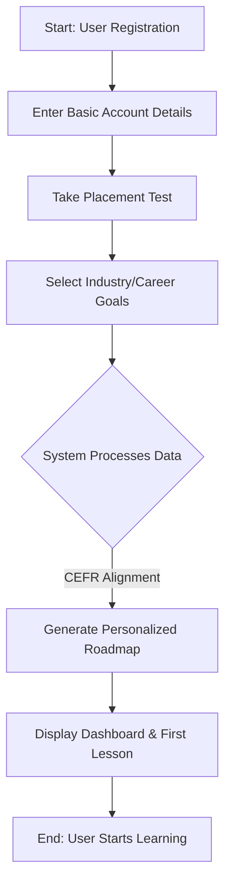
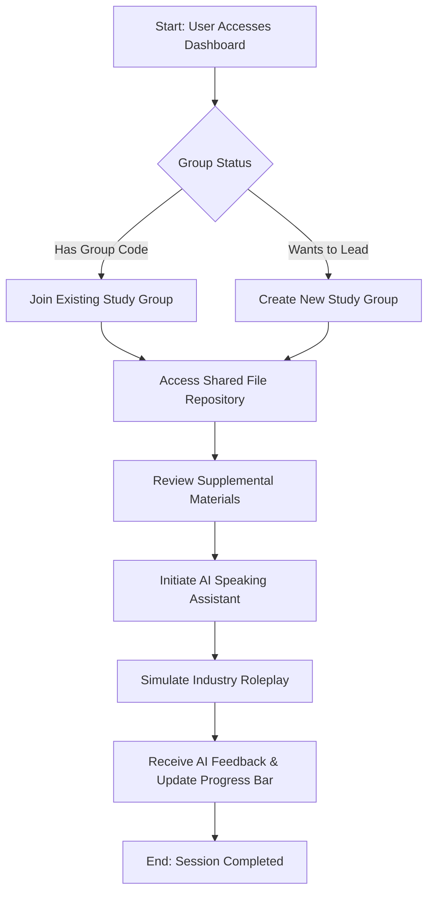

**Table of contents**
- [A. Project Plan](#a-project-plan)
  - [Introduction:](#introduction)
  - [Project Overview:](#project-overview)
    - [Core Objectives](#core-objectives)
    - [Key Features \& Scope](#key-features--scope)
    - [Target Audience](#target-audience)
  - [Project Organization:](#project-organization)
    - [Team Structure and Member's Role:](#team-structure-and-members-role)
    - [Risk management:](#risk-management)
  - [Project Plan](#project-plan)
    - [1. Sprint Schedule Overview](#1-sprint-schedule-overview)
  - [2. Build Plan](#2-build-plan)
  - [3. Detailed Plan for Upcoming Sprint (Sprint 2)](#3-detailed-plan-for-upcoming-sprint-sprint-2)
  - [4. High-Level Plan for Future Sprints](#4-high-level-plan-for-future-sprints)
    - [Sprint 3: Virtual Study Room, Flashcard](#sprint-3-virtual-study-room-flashcard)
    - [Sprint 4: AI Speaking Assistant](#sprint-4-ai-speaking-assistant)
    - [Sprint 5: Testing, Bug Fixing \& Demo Preparation](#sprint-5-testing-bug-fixing--demo-preparation)
- [B. Vision Document](#b-vision-document)
  - [1. Introduction:](#1-introduction)
    - [Purpose of the Document](#purpose-of-the-document)
    - [References](#references)
  - [2. Positioning:](#2-positioning)
    - [Problem Statement:](#problem-statement)
    - [Product Position Statement:](#product-position-statement)
  - [3. Stakeholder and User Descriptions:](#3-stakeholder-and-user-descriptions)
    - [Stakeholders Summary](#stakeholders-summary)
    - [User Summary](#user-summary)
    - [User environment](#user-environment)
    - [Summary of Key Stakeholder and User Needs](#summary-of-key-stakeholder-and-user-needs)
    - [Alternatives and Competitors](#alternatives-and-competitors)
  - [4. Product Overview:](#4-product-overview)
    - [Product perspective](#product-perspective)
    - [Assumptions](#assumptions)
    - [Dependencies](#dependencies)
  - [5. Product Features](#5-product-features)
  - [6. Non-Functional Requirements](#6-non-functional-requirements)
    - [Performance Requirements](#performance-requirements)
    - [Security Requirements](#security-requirements)
    - [Platform Requirements](#platform-requirements)
    - [Reliability and Availability Requirements](#reliability-and-availability-requirements)
    - [Usability Requirements](#usability-requirements)
- [C. Speckit Initialization](#c-speckit-initialization)
- [D. AI Usage Report and Weekly Report](#d-ai-usage-report-and-weekly-report)
  - [AI Usage Report:](#ai-usage-report)
  - [Weekly Report:](#weekly-report)
- [E. Other resources](#e-other-resources)

# A. Project Plan

## Introduction:
_Performer: Minh Thư._ 
_Reviewer: Other members of the team._
_Editor: Minh Thư._

**Studify** is a web application tailored for students and working professionals looking to master conversational and specialized English. The platform aligns its content with the Common European Framework of Reference for Languages (**CEFR**) and customizes learning paths for specific industries such as **IT**. 

## Project Overview:
_Performer: Minh Thư._ 
_Reviewer: Other members of the team._
_Editor: Minh Thư._

**Studify** project aims to design and develop a dynamic, responsive web application that bridges the gap between traditional language learning and practical, career-oriented communication. By merging **CEFR proficiency standards** with data-driven personalization, the platform will offer users a structured yet flexible ecosystem to accelerate their language acquisition.

The primary phase of the project focuses on delivering a robust Minimum Viable Product (MVP) that features adaptive general conversation modules alongside a highly specialized curriculum tailored for the **Information Technology (IT)** sector.

### Core Objectives
* **Standardized Benchmarking:** Integrate automated diagnostic tools to accurately map user proficiency against CEFR levels (A1 to C2).
* **Contextualized Learning:** Replace generic vocabulary with high-utility, industry-specific language tracks, starting with IT-focused communication (e.g., technical stand-ups, client pitches, code documentation review).
* **Micro-Learning Architecture:** Deliver bite-sized, interactive lessons optimized for the busy schedules of students and working professionals.
* **Measurable Progression:** Provide transparent dashboard analytics to show skill growth and readiness for real-world professional scenarios.

### Key Features & Scope
| Module | Functional Description | Target Output |
| --- | --- | --- |
| **Adaptive Placement** | AI-driven diagnostic test upon registration. | Establishes user's baseline CEFR level. |
| **The IT Track** | Specialized modules covering Agile terminologies, client communication, and cross-cultural tech collaboration. | Mastery of industry-specific jargon and soft skills. |
| **Interactive Roleplay** | Scenario-based conversational exercises (e.g., simulating a software deployment crisis or a job interview). | Improved verbal fluency and situational confidence. |
| **Progress Analytics** | Visual data tracking daily streaks, vocabulary retention, and CEFR sub-skill milestones (Speaking, Reading, Writing). | Actionable insights for targeted improvement. |

### Target Audience
* **Tech Students & Graduates:** Individuals looking to pass international language benchmarks or secure internships in multinational corporations.
* **Active IT Professionals:** Software engineers, product managers, and QA leads who need to articulate complex technical concepts clearly to non-technical global stakeholders.

## Project Organization:
_Performer: Minh Thư._ 
_Reviewer: Other members of the team._
_Editor: Minh Thư._

### Team Structure and Member's Role:
| Student ID | Name | Email | Role |
| :--- | :--- | :--- | :--- |
| **24127164** | Lê Kim Hằng | lkhang2429@clc.fitus.edu.vn | Backend Lead |
| **24127550** | Phạm Minh Thư | pmthu2417@clc.fitus.edu.vn | PM/BA/UI-UX |
| **24127510** | Nguyễn Kim Thiên Phước | nktphuoc2412@clc.fitus.edu.vn | Frontend Lead |
| **24127217** | Hồ Gia Phúc | hgphuc2425@clc.fitus.edu.vn | Frontend Developer |
| **24127198** | Nguyễn Khánh Linh | nklinh2421@clc.fitus.edu.vn | Backend Developer |

### Risk management:
| Potential Risk | Impact | Mitigation Strategy |
| :--- | :---: | :--- |
| **Member Unavailability & Bottlenecks** | Medium | • Establish cross-functional pairing so no single team member holds exclusive knowledge of critical areas (e.g., backend or content pipeline).<br>• Allocate a 20% buffer in all major sprint milestones to accommodate unexpected delays.<br>• Maintain centralized and up-to-date project documentation, enabling other team members to take over responsibilities with minimal disruption. |
| **Scope Creep ("Just One More Feature" Trap)** | High | • Define a strict Minimum Viable Product (MVP) focused solely on the IT track and core CEFR proficiency tracking.<br>• Maintain a dedicated "Nice-to-Have" backlog for Phase 2 features.<br>• Require all new feature requests to undergo a formal change-impact assessment before approval.<br>• Freeze the feature scope for each sprint to prevent mid-sprint additions. |
| **API Failures or Inaccurate CEFR Grading** | High | • Design a graceful degradation mechanism so that if Speech-to-Text or LLM services are unavailable, the application falls back to standard multiple-choice or text-based assessments.<br>• Use pre-tested, deterministic rule-based evaluation for initial diagnostic tests before relying on AI-generated grading.<br>• Implement API monitoring, billing alerts, and daily usage caps to prevent unexpected downtime and cost overruns.<br>• Regularly validate AI-generated CEFR scores against human-reviewed samples to ensure grading accuracy and consistency. |

## Project Plan
_Performer: Minh Thư._ 
_Reviewer: Thiên Phước._
_Editor: Minh Thư._

### 1. Sprint Schedule Overview
* **Sprint 1 (PA1) - 3 weeks:** Authentication & Onboarding
* **Sprint 2 (PA2) - 2 weeks:** Self-Study Dashboard, Pomodoro
* **Sprint 3 (PA3) - 2 weeks:** Virtual Study Room, Flash Card
* **Sprint 4 (PA4) - 2 weeks:** AI Speaking Assistant
* **Sprint 5 (PA5) - 1 week:** System Testing, Bug Fixing & Final Demo

## 2. Build Plan
Our team will produce 5 incremental builds for testing and review. The final sprint includes a demo of all project features.

* **Build 1.0 (End of Sprint 1):** Baseline system with User Registration, Login, and Onboarding classification flow.
* **Build 2.0 (End of Sprint 2):** Integration of Self-Study Dashboard, visual roadmap, lesson/quiz modules, and Pomodoro widgets.
* **Build 3.0 (End of Sprint 3):** Addition of the Virtual Study Room including RBAC, file sharing, real-time chat via WebSocket, and Flashcard feature.
* **Build 4.0 (End of Sprint 4 - Release Candidate):** Full system integration including the AI Speaking Assistant (STT & LLM processing).
* **Build 5.0 (End of Sprint 5 - Final Production):** Fully tested, bug-free build ready for the final semester demo.

## 3. Detailed Plan for Upcoming Sprint (Sprint 2)
**Focus:** Self-Study Dashboard & Utilities
**Duration:** 2 Weeks (e.g., July 17, 2026 - July 31, 2026)

Here is the complete task breakdown for **Sprint 2 (July 17, 2026 - July 31, 2026)** mapped into the requested table format in English:

| Task Description | Assignee (Doer) | Reviewer | Due Date |
| --- | --- | --- | --- |
| **[UI/UX]** Create UI-UX interface for Self-Study Dashboard, Pomodoro, and Flashcard features, with detailed descriptions of button functionalities and user flows. | Minh Thư (PM/BA/UI-UX) | Thiên Phước (Frontend Lead), Kim Hằng (Backend Lead) | July 20, 2026 |
| **[FE]** Research and build the Visual Tree Roadmap Component (using Canvas, SVG, or React Flow library) to ensure smooth visualization. | Thiên Phước (Frontend Lead) | Minh Thư (PM/BA/UI-UX) | July 24, 2026 |
| **[BE]** Develop API to return the lesson tree structure categorized by CEFR Levels. | Khánh Linh (Backend Dev) | Kim Hằng (Backend Lead) | July 24, 2026 |
| **[BE]** Design database schema for Lessons and Quizzes; write APIs for lesson content retrieval and instant auto-grading results. | Khánh Linh (Backend Dev) | Kim Hằng (Backend Lead) | July 26, 2026 |
| **[FE]** Build interfaces for lesson content and Quiz system (handling selection states, submission, and result rendering). | Gia Phúc (Frontend Dev) | Thiên Phước (Frontend Lead) | July 28, 2026 |
| **[BE]** Develop the core algorithm for the daily study schedule: calculate lesson distribution based on committed hours and output data for the Widget. | Kim Hằng (Backend Lead) | Minh Thư (PM/BA/UI-UX) | July 25, 2026 |
| **[BE]** Write real-time API to update learning progress instantly upon test/exercise completion. | Khánh Linh (Backend Dev) | Kim Hằng (Backend Lead) | July 27, 2026 |
| **[FE]** Implement the real-time Progress Bar and Daily Schedule Widget on the Dashboard using API data. | Gia Phúc (Frontend Dev) | Thiên Phước (Frontend Lead) | July 30, 2026 |
| **[FE]** Develop countdown logic (25-min focus / 5-min break) and client-side audio notifications for the Pomodoro Timer. | Gia Phúc (Frontend Dev) | Thiên Phước (Frontend Lead) | July 28, 2026 |
| **[BE]** Develop CRUD APIs for Flashcards, Tag management, and Flashcard filtering by Tags. | Khánh Linh (Backend Dev) | Kim Hằng (Backend Lead) | July 26, 2026 |
| **[FE]** Implement Selection API to handle text highlighting for quick-add vocabulary pop-ups; program keyboard shortcuts (Space to flip, Left/Right arrows to sort cards). | Thiên Phước (Frontend Lead) | Minh Thư (PM/BA/UI-UX) | July 29, 2026 |
| **[FE]** Build UI components for the Flashcard collection list, Tag management system, and basic Flashcard study interface. | Gia Phúc (Frontend Dev) | Thiên Phước (Frontend Lead) | July 31, 2026 |

## 4. High-Level Plan for Future Sprints

### Sprint 3: Virtual Study Room, Flashcard

* **Design:** UI for Group Management, Task Widget, Document Repository, Chat Box and Flashcard.
* **Backend:** * Implement RBAC for Group Leader/Member.
* Develop unique Group Code generation algorithm.
* Build APIs for Create/Join Group, Task Assignment.
* Configure AWS S3/Cloudinary and build Upload/Download APIs.
* Setup WebSocket (Socket.io) architecture for real-time chat.

* **Frontend:** * Build UI for Group Management, Task Assignment, and File drag-and-drop.
* Connect WebSocket client and manage real-time chat state.

* **Documentation:** Weekly Report and AI Usage Report for the recent Sprint.

### Sprint 4: AI Speaking Assistant

* **Self-Training & R&D:** Research STT APIs, Web Audio API, and LLM Prompt Engineering.
* **Design:** UI for AI Voice Chat interface and detailed evaluation display.
* **Backend:** * Integrate third-party STT API.
* Design and test Prompt Engineering for LLM (GPT-4o/Claude) to output strict JSON (Grammar, Vocab, Relevance, Suggestions).
* Build APIs to receive audio streams, process via AI, and save history/scores.


* **Frontend:** * Implement Web Audio API/MediaRecorder for precise voice recording.
* Build Chat UI with loading animations and render JSON evaluation data.

* **Documentation:** Weekly Report and AI Usage Report for the recent Sprint.

### Sprint 5: Testing, Bug Fixing & Demo Preparation

* **Testing:** Conduct End-to-End (E2E) user flow testing across all modules.
* **Bug Fixing:** Resolve issues identified in UI, Backend logic, and Real-time connections.
* **Optimization:** Refactor code and optimize Database queries.
* **Deployment:** Finalize production environment deployment.
* **Documentation & Demo:** Prepare final presentation slides, rehearse the product demo, and finalize the PA5 Project Report.

# B. Vision Document
## 1. Introduction: 
_Performer: Thiên Phước._ 
_Reviewer: Minh Thư._
_Editor: Thiên Phước._

### Purpose of the Document
The purpose of this Vision Document is to collect, analyze, and define the high-level needs and core features of the **Studify** system. This initial draft establishes the fundamental expectations and product positioning for our English learning platform. It focuses on the capabilities needed by stakeholders and the target users, outlining the problem it solves and what the product will do, rather than delving into technical implementation details. 

### References
The following documents and artifacts were referenced in the creation of this Vision Document:
* [cite_start]**CS300 - CSC13002 - Introduction to Software Engineering - Project Assignment 2 (PA2-2026)**: The core requirement specifications for this document[cite: 3, 4].
* [cite_start]**PA1-2026 Project Proposal & App Survey**: The initial project outline, including the preliminary competitor survey and key features of Studify[cite: 48, 50].
* [cite_start]**Spec Kit Constitution (`constitution.md`)**: The foundational rules and configuration generated for the Studify repository[cite: 60].

## 2. Positioning:
_Performer: Gia Phúc._ 
_Reviewer: Minh Thư._
_Editor: Gia Phúc._

### Problem Statement:
| The Problem | Affects | Impact | Successful Solution |
| :--- | :--- | :--- | :--- |
| Students have no one to practice speaking with or feel too anxious to practice with real people. | New learners trying to build conversational fluency. | They can read and write well but freeze up or stutter when trying to hold a conversation, limiting their speaking confidence and fluency. | An AI speaking assistant that provides real-time feedback, constructive advice, and a judgment-free environment for speaking practice. |
| Learners are overwhelmed by the abundance of learning materials and lack a clear starting point or study plan. | Students learning independently without guidance. | High abandonment rates, wasted time, and inconsistent progress due to uncertainty about what to study next. | Personalized learning roadmaps with CEFR-based placement, structured lessons, and recommended practice activities. |
| Studying English online alone can feel isolating and demotivating. | Online learners who cannot attend offline classes due to financial or transportation barriers. | Learners are more likely to procrastinate, lose motivation, or quit before reaching their goals. | Community study groups and chat spaces where learners can discuss, share study resources, and encourage one another. |
| Traditional language-learning apps focus on one-time lessons with little or no review. | Students aiming to build and retain long-term English vocabulary. | Poor long-term retention results in learners repeatedly forgetting and relearning the same vocabulary. | An integrated spaced-repetition flashcard system that automatically reinforces vocabulary and lesson content over time. |

### Product Position Statement:
| For | Who | Product Name | That | Unlike | Our Product |
| :--- | :--- | :--- | :--- | :--- | :--- |
| School and university students preparing for exams and English qualifications (IELTS, TOEIC, etc.) | Experience test anxiety and lack opportunities to practice speaking with native speakers. | **Studify** | Provides structured learning roadmaps, collaborative study groups, and an AI speaking assistant that offers instant, judgment-free feedback. | Traditional language-learning apps that rely on repetitive vocabulary drills and leave learners to study independently. | Enables students to communicate with classmates, share learning resources, and improve their English speaking skills through AI-powered practice. |
| Postgraduates and working professionals seeking to advance their global careers. | Have a basic understanding of English but lack fluency in industry-specific vocabulary and workplace communication. | **Studify** | Offers personalized learning plans with adjustable study pace and specialized content tailored to professional fields. | Traditional language-learning apps that provide generic content primarily designed for students. | Delivers customized lessons and vocabulary based on the learner's profession, helping them efficiently develop practical workplace English skills. |

## 3. Stakeholder and User Descriptions:
_Performer: Kim Hằng._ 
_Reviewer: Minh Thư._
_Editor: Kim Hằng._

### Stakeholders Summary
| Stakeholder | Description | Role |
| :--- | :--- | :--- |
| **Admin** | System administrator | Manage user accounts, monitor system health, moderate platform content, and oversee overall system operations. |
| **Teacher / Group Master** | Content provider and study group leader | Create and assign learning tasks, upload study materials, manage study groups, and monitor members' progress. |
| **Student** | Primary end user | Complete lessons, take quizzes, practice speaking, track learning progress, and join or create study groups. |
| **Development Team** | Project owner and technical team | Design, develop, test, deploy, and maintain the platform while ensuring system reliability and continuous improvement. |

### User Summary
| User Type | Description | Responsibilities |
| :--- | :--- | :--- |
| **Student** | University students learning English for academic or professional purposes. | Complete lessons, submit quizzes, practice speaking, review vocabulary, and participate in study groups. |
| **Working Professional** | IT professionals or office workers improving English for career advancement. | Follow personalized learning roadmaps, practice with AI, review vocabulary using flashcards, and monitor progress. |
| **Teacher / Group Master** | A user with elevated permissions within a study group. | Assign tasks, upload learning materials, manage group members, and monitor learners' performance. |

### User environment
**Platform:** Web application, accessible via modern desktop browsers. No mobile support in the current scope. 

**Primary device:** Laptop or desktop computer.

**Connectivity:** Requires a stable internet connection; real-time features (group chat, Pomodoro timer) require low-latency network.


### Summary of Key Stakeholder and User Needs
| Stakeholder / User | Needs |
| :--- | :--- |
| **Students / Working Professionals** | A structured, CEFR-aligned learning roadmap that adapts to each learner's proficiency level and career goals. |
| **Students** | Real-time progress tracking, performance analytics, and achievement milestones to maintain motivation and learning consistency. |
| **Teachers / Group Masters** | The ability to create and manage study groups, assign learning tasks, monitor member progress, and provide feedback. |
| **Teachers / Students** | A collaborative workspace for uploading, sharing, and accessing learning materials and documents within study groups. |
| **Students** | Built-in productivity tools such as Pomodoro timers, flashcards, vocabulary review, and AI speaking practice to support effective learning habits. |
| **Admin / All Users** | Secure authentication, role-based access control, data privacy, and reliable system performance. |

### Alternatives and Competitors
| Alternative | Strengths | Weaknesses |
| :--- | :--- | :--- |
| **Duolingo** | Engaging user experience, gamified learning, large user base, and mobile-first design. | No collaborative group learning features; limited support for professional or IT-specific English learning. |
| **ELSA Speak** | Excellent AI-powered pronunciation assessment and speaking feedback. | Lacks a structured learning roadmap and collaborative study features; many advanced features require a paid subscription. |
| **British Council Apps** | High-quality, CEFR-aligned learning content developed by language experts. | Primarily supports self-paced learning with limited collaboration, progress tracking, or personalized learning paths. |
| **Anki** | Highly effective spaced-repetition flashcard system with extensive customization. | No guided learning roadmap, no integrated lessons, and a relatively steep learning curve for new users. |

## 4. Product Overview: 
_Performer: Khánh Linh._ 
_Reviewer: Minh Thư._
_Editor: Khánh Linh._

### Product perspective
Studify  is a standalone web application for learning English, particularly targeted at those in IT fields rather than a component or extension of existing platforms. The system is designed as an independent product with five main functional features that work together as one cohesive learning environment:
- An authentication and onboarding module: It determines identify each learner proficiency through a placement test and time commitment before granting access to the rest of the system.
- A self-study dashboard: This dashboard presents learning roadmap with lesson content, quizzes, and progress checking  based on CEFR framework.
- A virtual study room: The feature supports task assignment, file sharing and real-time chat to make the individual progress better within a group of learning context..
- A set of supporting utilities: 
    + Pomodoro to help learners get away from distraction.
    + Flashcards to help learners memorize vocabulary and grammar.
    An AI speaking assistant: provides voice-based conversational practice and feedback along with immediate feedback regarding grammar, vocabulary usage, and relevance.

### Assumptions
- Users have a stable internet connection while using the application, since core features (onboarding test, quiz grading, AI Speaking Assistant, real-time chat) require active communication with the backend/AI services.
- Users have access to a working microphone and speakers/headphones when using the AI Speaking Assistant.
- Users are willing to complete a short placement test (10–15 questions) if they do not already know their CEFR level.
- Group/study rooms are assumed to be small, informal study groups (2–5 members), not large classes; the system is not designed to support classroom-scale management.
- Users self-report their available study time honestly during onboarding, since this directly drives the system's lesson-pacing calculation .
- The CEFR framework (A1–C2) is assumed to be an acceptable and sufficient standard for structuring the roadmap for the target user group.
- Shared documents uploaded by group members are assumed to be limited to PDF and image formats, and of reasonable file size (exact limit to be defined in Non-Functional Requirements).

### Dependencies
- **Speech recognition / NLP service:** the AI Speaking Assistant depends on a third-party speech-to-text and language-evaluation API (e.g., a cloud AI provider) to transcribe user speech and assess grammar, vocabulary, and contextual relevance. The team has not yet finalized which provider will be used.
- **Cloud file storage:** the Shared File Repository  depends on a cloud storage service to host and serve uploaded PDFs and images.
- **Authentication provider:** depends on a secure authentication mechanism (e.g., email/password with hashed credentials, or a third-party auth service) for account registration, login, and password reset.
- **Database service:** all user progress data, flashcards, quiz results, and group data depend on a persistent database backend.
- **Real-time communication infrastructure:** the group chat feature and the task-notification widget  depend on a real-time messaging mechanism (e.g., WebSocket service).

## 5. Product Features
_Performer: Thiên Phước._ 
_Reviewer: Minh Thư._
_Editor: Thiên Phước._

**5.1. Placement Test and Personalized Roadmap**
This feature evaluates the user’s career objectives and professional background during the initial registration process. It is needed to automatically construct a customized learning trajectory that adheres strictly to CEFR standards, ensuring that content remains highly relevant to the user's specific industry. Consequently, university students and working professionals benefit from a targeted curriculum that directly supports their real-world career goals rather than wasting time on generic vocabulary.

**5.2. Study Group System**
The Study Group feature allows users to establish or join public and private micro-communities using unique group codes, complete with hierarchical roles such as Leader and Member. This system is critical for mitigating the feelings of boredom and isolation that typically lead to early dropouts in solitary online learning platforms. By fostering an environment of peer motivation and organized accountability, all group members benefit from a structured and highly interactive learning experience.

**5.3. Shared File Repository**
This feature provides a dedicated cloud storage space integrated directly into each study group, allowing members and leaders to seamlessly upload, view, and download supplementary educational materials such as PDFs and industry templates. It is necessary to centralize all learning assets in one secure location, effectively eliminating the cumbersome reliance on fragmented, third-party messaging applications. Group leaders and members benefit immensely from having instant, organized access to shared resources necessary for their collaborative tasks.

**5.4. AI Speaking Assistant**
Leveraging advanced natural language processing and voice recognition, this feature generates dynamic, industry-specific roleplay scenarios, such as IT project pitches or mock interviews. It is essential for providing learners with a safe, pressure-free environment to practice high-stakes professional verbal communication before facing real-world clients or employers. Working professionals and students preparing for the job market benefit from realistic conversational practice that actively builds their confidence and spoken fluency.

**5.5. Pomodoro Timer and Flashcards**
This integrated toolset combines time-managed study sessions with interactive flashcard reviews directly within the learning interface. It is needed to help users maintain deep focus and prevent cognitive burnout while systematically improving their long-term memory retention of specialized terminology. Self-paced learners who struggle with digital distractions benefit significantly from this structured approach to studying and memorization.

**5.6. Progress Tracking and Notification Widget**
This feature utilizes visual analytical dashboards and progress bars to monitor a user's daily goals, completed tasks, and overall learning milestones. It is necessary to establish consistent study habits by sending timely reminders and nudges to users who might otherwise lose track of their academic objectives. Goal-oriented users benefit from clear, quantifiable feedback on their progress, helping them stay motivated and disciplined throughout their language learning journey

**5.7. Core User Workflows**

**Workflow 1: User Onboarding & Personalized Roadmap Generation**
This diagram illustrates how a new user interacts with the system to receive their customized learning path.


**Workflow 2: Collaborative Study Group & AI Roleplay Practice** 
This diagram demonstrates the core loop of joining a group, accessing shared materials, and practicing with the AI assistant 


## 6. Non-Functional Requirements
_Performer: Kim Hằng._ 
_Reviewer: Minh Thư._
_Editor: Kim Hằng._

### Performance Requirements
- Page load time must not exceed **2 seconds** under normal network conditions.
- API response time must be **under 500 ms** for standard CRUD operations.
- The progress bar must update **within 1 second** after a lesson is marked as completed.
- The system must support at least **100 concurrent users** without significant performance degradation.

### Security Requirements
- All passwords must be hashed using **bcrypt** before being stored in the database.
- Authentication must be implemented using **JWT**, with:
  - Access token expiry: **15 minutes**
  - Refresh token expiry: **7 days**
- All protected API endpoints must require a valid JWT token. Unauthorized requests must return **HTTP 401 (Unauthorized)**.
- Role-Based Access Control (RBAC) must be enforced:
  - Only **Group Masters** can create tasks.
  - Only **Group Masters** can upload group documents.
- All uploaded files must be validated for both **file type** and **file size** before being stored.

### Platform Requirements
- The application must run on modern desktop browsers (e.g., Chrome, Edge, Firefox, and Safari).
- Mobile browser support is **not** required in the current project scope.
- The backend must be containerized using **Docker** and deployable using **Docker Compose**.
- The system requires a stable internet connection; **offline mode is not supported**.

### Reliability and Availability Requirements
- The system must achieve at least **95% uptime** during the academic semester.
- The database must be backed up **at least once every 24 hours** to minimize the risk of data loss.
- In the event of an unexpected server failure, the system should be recoverable from the latest backup.

### Usability Requirements
- The user interface should follow a **consistent layout and navigation structure** across all pages.
- Users should be able to complete common tasks (e.g., joining a study group, starting a lesson, creating a flashcard) with **no more than 3–5 interactions**.
- Error messages should clearly describe the problem and provide guidance for resolving it.
- The application should provide visual feedback (e.g., loading indicators, success notifications, error alerts) within **1 second** of user actions.
- Fonts, buttons, and interactive elements should remain readable and usable at browser zoom levels between **100% and 200%**.
- The interface should use consistent colors, icons, and terminology throughout the application to reduce the learning curve.

# C. Speckit Initialization
_Performer: Minh Thư._ 
_Reviewer: Other members of the team._
_Editor: Minh Thư._

*Gia Phúc*


*Khánh Linh*


*Kim Hằng*


*Minh Thư*


*Thiên Phước*


**Constitution file:** See

`C.SpecKit Initialization/constitution/constitution.pdf`

# D. AI Usage Report and Weekly Report
_Performer: Minh Thư._ 
_Reviewer: Other members of the team._
_Editor: Minh Thư._

## AI Usage Report: 

See

`D. AI Usage Report/AI_UsageReport.pdf`

## Weekly Report:

See

`D. Weekly Reports/WeeklyReports.pdf`

# E. Other resources
_Performer: Minh Thư._ 
_Reviewer: Other members of the team._
_Editor: Minh Thư._

**Gitlog:**

```text
b1f0dde (HEAD -> main, origin/main, origin/HEAD) Merge pull request #12 from mthupham/Backend_lkhang
c0d7069 (origin/Backend_lkhang) Merge pull request #7 from mthupham/main
4aae8e6 hotfix: FE-App.tsx & MainLayout.jsx
7c74232 Merge pull request #11 from mthupham/PM/BA/UIUX-mthu
d4aff3c (origin/PM/BA/UIUX-mthu, PM/BA/UIUX-mthu) Merge branch 'main' into PM/BA/UIUX-mthu
70abfb3 Merge pull request #10 from mthupham/FE/feat/learning_lesson
f5dcde0 (origin/FE/feat/learning_lesson) Added Practice Lessons
7d38296 feat: Enhance MainLayout with dynamic SVG icons and improved sidebar navigation
0a73779 Add landing page and user profile components with SVG icons
5cfa618 hotfix: Chỉnh placement của icon ổ khóa
ef479bc feat: add LessonPage and LessonCard components, update MainLayout with navigation icons
7d93e86 Merge pull request #8 from mthupham/PM/BA/UIUX-mthu
b88adb2 feat: Enhance implementation templates with detailed checklists and structured tasks
54b80a3 Merge remote-tracking branch 'origin' into PM/BA/UIUX-mthu
f3d2d65 Merge branch 'Backend_lkhang' into main
753c9f2 feat: Add speckit workflow and templates for feature development
7eae852 progress API
05a70f9 (origin/hotfix/FE/UI-connecting) feat: complete login and signup flow with tailwind v4
04363f5 chore: update dependencies for Tailwind CSS integration
9b96d6e (origin/FE/roadmap,onboarding) temporary commit
5b8c628 add database
56856af nối API register/login
1e28853 Merge pull request #6 from mthupham/FE/roadmap,onboarding
4f86862 Merge remote-tracking branch 'origin/Backend_klinh' into FE/roadmap,onboarding
c966829 add missing files
0cf1123 update Backend
6e1fdab Merge pull request #4 from mthupham/Backend_lkhang
c893850 Merge branch 'main' into Backend_lkhang
5bb06aa Merge branch 'main' of https://github.com/mthupham/STUDIFY
a850a75 docs: update FE README to reflect project structure and development guidelines
957d41d Merge pull request #5 from mthupham/FE/roadmap,onboarding
c062837 feat Designed: Roadmap, ProgressBar, Onboarding (semi)
3294da1 update login/register after testing
5491585 update
b0d4d9a Merge pull request #3 from mthupham/feat/Frontend/Authentication
08b4311 (origin/Backend_klinh) feat: thêm module placement-test
7416ee5 Add placement test data, update question bank lesson IDs, and create required level test questions
445a266 user_model
a5fcdfa (origin/feat/Frontend/Authentication) feat: add authentication forms for login and registration
83d19c3 Adding questionbank (~ 400 questions in multiple choice and short answers input from users)
f148432 Session a0825c09-5366-4ca4-8f88-b8b124c922aa - checkpoint turn 0
035f02e (agents/it-english-question-bank-a1) delete redundant module
b79123d install and connect database
cda33cf (origin/Backend) chore: reorganize feature directories and add .gitkeep files
e0bda92 complete file structure
1becd33 Merge pull request #1 from mthupham/FE-init
7951531 (origin/FE-init) chore: initial project structure and core tech stack setup
0ffa3d4 set up framework
ac1632d Initial commit

```