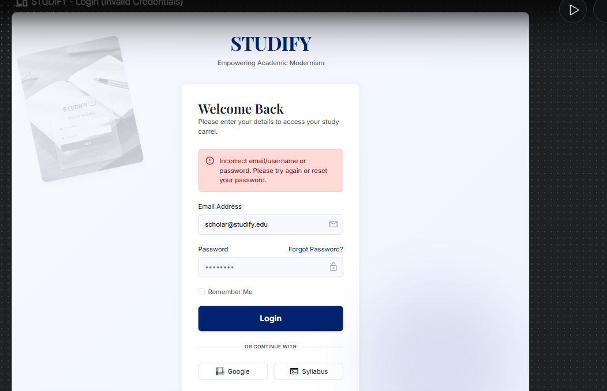

# Studify
## Use-Case Specification: Login

**Version:** 1.0

---

### Revision History

| Date | Version | Description | Author |
| :--- | :--- | :--- | :--- |
| 23/Jul/26 | 1.0 | Initial version of UC2 | Khanh Linh |

---

### Table of Contents

- [1. Use-Case Name](#1-use-case-name)
  - [1.1 Brief Description](#11-brief-description)
- [2. Flow of Events](#2-flow-of-events)
  - [2.1 Basic Flow](#21-basic-flow)
  - [2.2 Alternative Flows](#22-alternative-flows)
    - [2.2.1 Invalid Credentials](#221-invalid-credentials)
    - [2.2.2 Remember Login Selected](#222-remember-login-selected)
- [3. Special Requirements](#3-special-requirements)
- [4. Preconditions](#4-preconditions)
- [5. Postconditions](#5-postconditions)
- [6. Extension Points](#6-extension-points)

---

## 1. Use-Case Name

**UC2 — Login**

### 1.1 Brief Description

This use case allows a Registered User to authenticate into the Studify system using their email/username and password, granting access to personalized features such as the self-study dashboard, flashcards, virtual study rooms, and the AI speaking assistant. This use case includes UC8 — Validate Login Credentials, and may optionally extend into UC6 — Remember Login if the user chooses to stay signed in.

---

## 2. Flow of Events

### 2.1 Basic Flow

This use case begins when the Registered User navigates to the Login screen.

1. The Registered User selects the "Login" option.
2. The system displays the login form, requesting Email/Username and Password, along with a "Remember Login" checkbox.
3. The Registered User enters their Email/Username and Password.
4. The system performs UC8 — Validate Login Credentials to check that the submitted credentials match a stored account.
5. If the Registered User checked "Remember Login," the system performs UC6 — Remember Login (see Alternative Flow 2.2.2).
6. The system grants the Registered User an authenticated session and redirects them to their personal dashboard.
7. The use case ends successfully.

### 2.2 Alternative Flows

#### 2.2.1 Invalid Credentials

At step 4 of the Basic Flow, if the submitted Email/Username or Password does not match any stored account:

1. The system displays a generic error message (e.g., "Incorrect email/username or password") without indicating which specific field is wrong, to avoid revealing account existence.
2. The system does not disclose whether the email/username exists or the password is wrong, for security reasons.
3. The Registered User may retry entering their credentials, or select "Forgot Password" to initiate password recovery.
4. If retrying, the flow resumes at step 3 of the Basic Flow.

#### 2.2.2 Remember Login Selected

At step 5 of the Basic Flow, if the "Remember Login" checkbox was selected:

1. The system generates a long-lived authentication token and stores it securely on the Registered User's device (e.g., as an HTTP-only cookie).
2. On subsequent visits, the system automatically authenticates the Registered User using this token, without requiring the login form to be re-submitted, until the token expires or is revoked.
3. The flow resumes at step 6 of the Basic Flow.

---

## 3. Special Requirements

### 3.1 Account Lockout Policy

After a defined number of consecutive failed login attempts (e.g., 5), the system should temporarily lock the account or require additional verification (e.g., CAPTCHA) to mitigate brute-force attacks.

### 3.2 Session Security

Authentication tokens (including "Remember Login" tokens) must be transmitted and stored securely (e.g., HTTPS only, HTTP-only cookies) to prevent session hijacking.

### 3.3 Response Time

The login process (from form submission to dashboard redirect) should complete within 2 seconds under normal network conditions.

---

## 4. Preconditions

### 4.1 Existing Account

The user attempting to log in must already have a registered account in the Studify system (see UC1 — Register New Account).

### 4.2 Account Not Locked

The user's account must not currently be in a locked or suspended state.

---

## 5. Postconditions

### 5.1 User Authenticated

The Registered User has an active, authenticated session and can access personalized features of Studify.

### 5.2 Login Persisted (if applicable)

If "Remember Login" was selected, a persistent authentication token exists on the user's device for future automatic login.

---

## 6. Extension Points

### 6.1 Remember Login Trigger

*Location: Basic Flow, step 5.* This is the point at which control optionally passes from UC2 to UC6 — Remember Login, executed only if the Registered User selected the "Remember Login" option during login.
