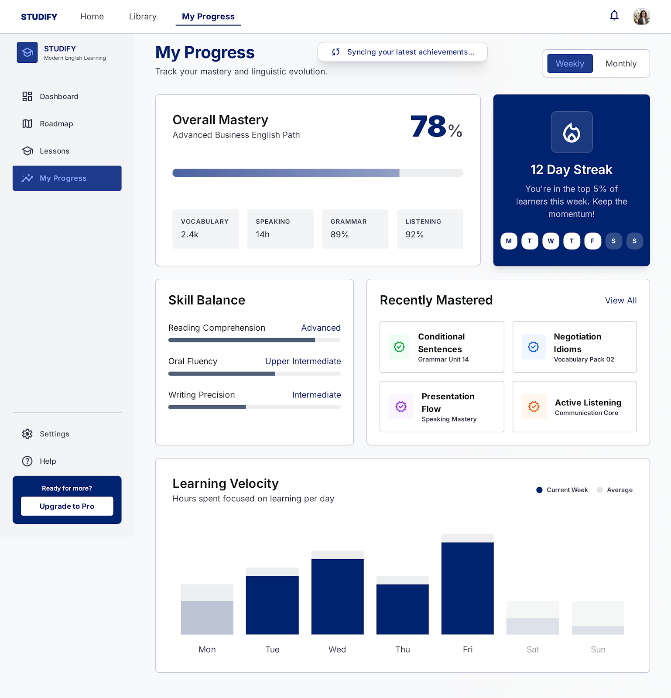

# Self-Study Dashboard
## Use-Case Specification: UC11 - Calculate Completion % (real-time)

**Version:** 1.0

---

### Revision History

| Date | Version | Description | Author |
| :--- | :--- | :--- | :--- |
| 23/Jul/26 | 1.0 | Initial draft for UC11 (System Calculation Logic) | `Lê Kim Hằng` |

---

### Table of Contents

- [1. Use-Case Name](#1-use-case-name)
  - [1.1 Brief Description](#11-brief-description)
- [2. Flow of Events](#2-flow-of-events)
  - [2.1 Basic Flow](#21-basic-flow)
  - [2.2 Alternative Flows](#22-alternative-flows)
    - [2.2.1 Division by Zero Prevention (Empty Roadmap)](#221-division-by-zero-prevention)
- [3. Special Requirements](#3-special-requirements)
  - [3.1 Performance Requirement](#31-performance-requirement)
- [4. Preconditions](#4-preconditions)
  - [4.1 Invocation Request](#41-invocation-request)
- [5. Postconditions](#5-postconditions)
  - [5.1 Percentage Returned](#51-percentage-returned)
- [6. Extension Points](#6-extension-points)
  - [6.1 None](#61-none)

---

## 1. Use-Case Name
**UC11: Calculate Completion % (real-time)**

### 1.1 Brief Description
This is an internal system use case invoked by **UC10 (View Roadmap Completion %)**. Its sole responsibility is to query the database for the Learner's progress within a specific CEFR level roadmap and compute the exact completion percentage in real-time. 

*Figure 11.1: Dashboard skeleton loading state — "Syncing progress in real-time..." — visually representing this background calculation.*

---

## 2. Flow of Events

### 2.1 Basic Flow
1. The use case receives a request from UC10, containing the `Learner_ID` and the active `Roadmap_ID` (e.g., Level A1).
2. The system queries the database to count the total number of mandatory lessons in the specified roadmap.
3. The system queries the database to count the total number of lessons the Learner has successfully completed in that roadmap.
4. The system calculates the completion percentage using the following formula:
   $$\text{Completion Percentage} = \left( \frac{\text{Completed Lessons}}{\text{Total Lessons}} \right) \times 100$$
5. The system rounds the calculated value to the nearest whole number (e.g., 45.6% becomes 46%).
6. The system returns the calculated integer value to UC10.
7. The use case ends.

### 2.2 Alternative Flows

#### 2.2.1 Division by Zero Prevention (Empty Roadmap)
If the system detects that the requested roadmap has 0 total lessons configured (to prevent a division-by-zero backend error):
1. The system catches the zero-value condition before performing the calculation in step 4 of the Basic Flow.
2. The system automatically sets the completion percentage to 0%.
3. The flow proceeds to step 6 of the Basic Flow, returning 0% to UC10.

---

## 3. Special Requirements

### 3.1 Performance Requirement
Because this calculation blocks the rendering of the progress bar in UC10, the query and calculation must execute in under 100ms.

---

## 4. Preconditions

### 4.1 Invocation Request
This use case must be called by UC10 with valid `Learner_ID` and `Roadmap_ID` parameters.

---

## 5. Postconditions

### 5.1 Percentage Returned
An integer representing the completion percentage is returned to the UI layer. The database state remains unchanged.

---

## 6. Extension Points

### 6.1 None
No extension points for this system operation.