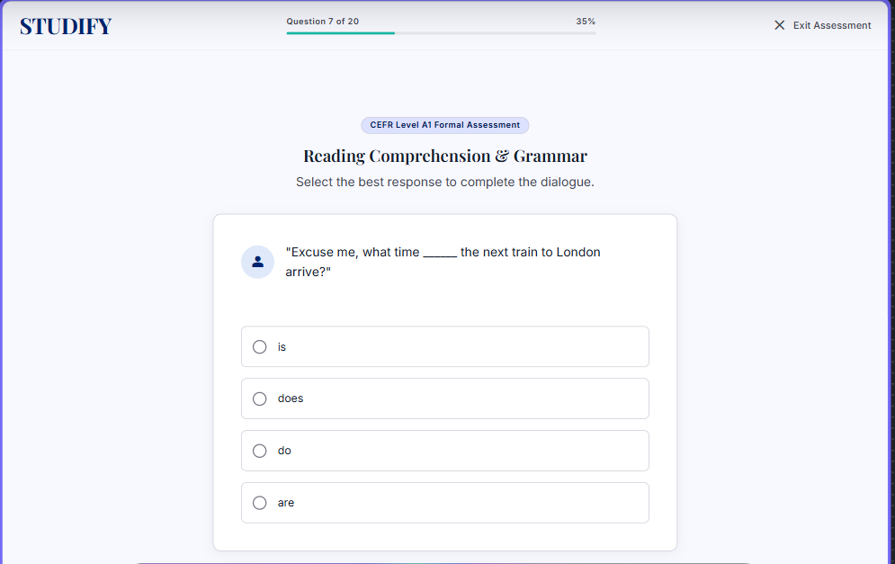

# Self-Study Dashboard
## Use-Case Specification: UC12 - Take Level Assessment Test

**Version:** 1.0

---

### Revision History

| Date | Version | Description | Author |
| :--- | :--- | :--- | :--- |
| 23/Jul/26 | 1.0 | Initial draft for UC12 (F2.2 Level Test requirement) | System Analyst |

---

### Table of Contents

- [Self-Study Dashboard](#self-study-dashboard)
  - [Use-Case Specification: UC12 - Take Level Assessment Test](#use-case-specification-uc12---take-level-assessment-test)
    - [Revision History](#revision-history)
    - [Table of Contents](#table-of-contents)
  - [1. Use-Case Name](#1-use-case-name)
    - [1.1 Brief Description](#11-brief-description)
  - [2. Flow of Events](#2-flow-of-events)
    - [2.1 Basic Flow](#21-basic-flow)
    - [2.2 Alternative Flows](#22-alternative-flows)
      - [2.2.1 Test Timer Expiration](#221-test-timer-expiration)
  - [3. Special Requirements](#3-special-requirements)
    - [3.1 Timer and Anti-Cheating Controls](#31-timer-and-anti-cheating-controls)
  - [4. Preconditions](#4-preconditions)
    - [4.1 Level Selected](#41-level-selected)
  - [5. Postconditions](#5-postconditions)
    - [5.1 Submission Initiated](#51-submission-initiated)
  - [6. Extension Points](#6-extension-points)
    - [6.1 None](#61-none)

---

## 1. Use-Case Name
**UC12: Take Level Assessment Test**

### 1.1 Brief Description
This use case enables a Learner to take a comprehensive assessment test for a specific CEFR level (e.g., A1, A2). Scoring >= 90% on this test allows the Learner to skip directly to the next CEFR level without completing all individual lessons. It utilizes Multiple Choice (UC6) and Fill in the Blank (UC7) question formats.

*Figure 12.1: CEFR Level A1 Formal Assessment — "Reading Comprehension & Grammar" question 7 of 20, with countdown progress bar.*

---

## 2. Flow of Events

### 2.1 Basic Flow
1. The Learner selects "Take Level Assessment Test" from the Roadmap overview (UC1).
2. The system retrieves a randomized test pool containing both Multiple Choice (UC6) and Fill in the Blank (UC7) questions for the active level.
3. The system initiates a countdown timer and renders the test interface.
4. The Learner completes the questions.
5. The Learner clicks "Submit Assessment".
6. The system executes **UC8: View Quiz/Assessment Result** (*<<include>> relationship*).

### 2.2 Alternative Flows

#### 2.2.1 Test Timer Expiration
If the allocated time for the assessment expires before the Learner clicks "Submit Assessment":
1. The system automatically locks the test interface.
2. The system force-submits all currently answered questions.
3. The flow proceeds to step 6 of the Basic Flow (UC8).

---

## 3. Special Requirements

### 3.1 Timer and Anti-Cheating Controls
The test session must enforce a strict server-side timer (e.g., 30 minutes) to prevent local client clock manipulation.

---

## 4. Preconditions

### 4.1 Level Selected
The Learner must have selected an active or accessible CEFR level from the Roadmap (UC1).

---

## 5. Postconditions

### 5.1 Submission Initiated
The assessment attempt is logged, and results are handed over to UC8 for evaluation against the 90% threshold rule.

---

## 6. Extension Points

### 6.1 None
No extension points for this use case.