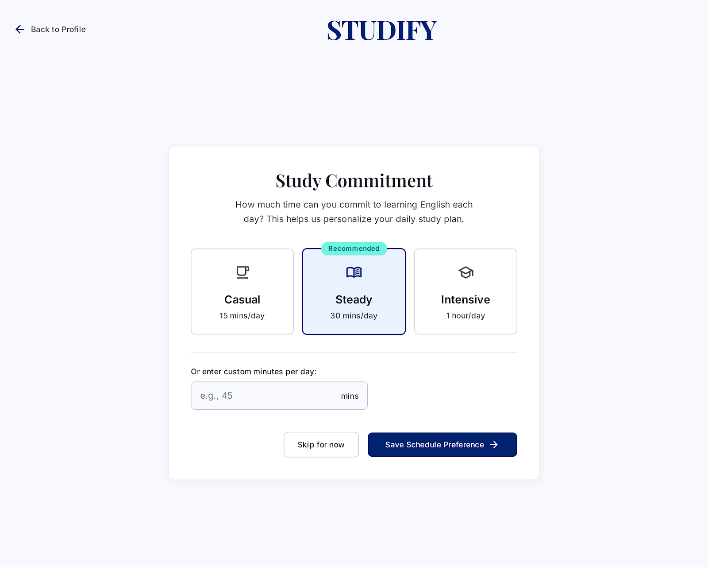

# Self-Study Dashboard
## Use-Case Specification: UC13 - Set Study Commitment Hours

**Version:** 1.0

---

### Revision History

| Date | Version | Description | Author |
| :--- | :--- | :--- | :--- |
| 23/Jul/26 | 1.0 | Initial draft for UC13 (F2.5 Commitment Settings) | System Analyst |

---

### Table of Contents

- [Self-Study Dashboard](#self-study-dashboard)
  - [Use-Case Specification: UC13 - Set Study Commitment Hours](#use-case-specification-uc13---set-study-commitment-hours)
    - [Revision History](#revision-history)
    - [Table of Contents](#table-of-contents)
  - [1. Use-Case Name](#1-use-case-name)
    - [1.1 Brief Description](#11-brief-description)
  - [2. Flow of Events](#2-flow-of-events)
    - [2.1 Basic Flow](#21-basic-flow)
    - [2.2 Alternative Flows](#22-alternative-flows)
      - [2.2.1 Invalid Input Values](#221-invalid-input-values)
  - [3. Special Requirements](#3-special-requirements)
    - [3.1 Input Usability](#31-input-usability)
  - [4. Preconditions](#4-preconditions)
    - [4.1 Profile Active](#41-profile-active)
  - [5. Postconditions](#5-postconditions)
    - [5.1 Settings Saved](#51-settings-saved)
  - [6. Extension Points](#6-extension-points)
    - [6.1 None](#61-none)

---

## 1. Use-Case Name
**UC13: Set Study Commitment Hours**

### 1.1 Brief Description
This use case allows the Learner to input or modify their committed daily/weekly English study time (e.g., 30 mins/day, 1.5 hours/day). The system uses this setting to dynamically calculate daily task targets on the dashboard widget (F2.5).

*Figure 13.1: "Study Commitment" screen showing Casual / Steady / Intensive presets and a custom minutes-per-day input field.*

---

## 2. Flow of Events

### 2.1 Basic Flow
1. The Learner opens the Settings or Study Preference modal from the Dashboard.
2. The system displays options to select target study duration per day or week.
3. The Learner selects or inputs their desired commitment hours (e.g., 1 hour per day).
4. The Learner clicks "Save Schedule Preference".
5. The system validates and saves the commitment settings to the Learner's profile.
6. The system notifies the widget engine to recalculate daily task quotas.
7. The use case ends.

### 2.2 Alternative Flows

#### 2.2.1 Invalid Input Values
If the Learner inputs 0 or an unrealistically high number (e.g., > 16 hours/day):
1. The system displays a validation warning: "Please enter a realistic study commitment between 15 minutes and 8 hours daily."
2. The Learner updates the input value and retries saving.

---

## 3. Special Requirements

### 3.1 Input Usability
The UI should provide intuitive presets (e.g., "Casual: 15m/day", "Regular: 30m/day", "Intensive: 1h+/day") alongside custom numeric inputs.

---

## 4. Preconditions

### 4.1 Profile Active
The Learner must be logged into the system.

---

## 5. Postconditions

### 5.1 Settings Saved
The user's daily time budget is stored in the database, triggering dynamic task scheduling for UC14/UC15.

---

## 6. Extension Points

### 6.1 None
No extension points for this use case.