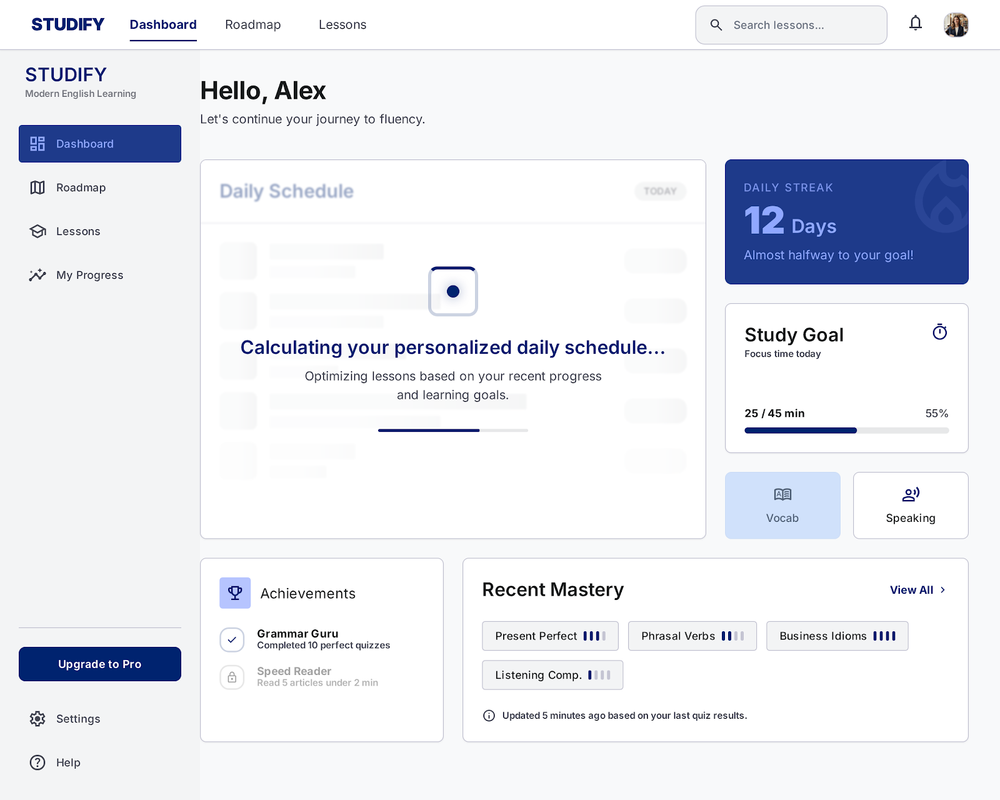

# Self-Study Dashboard
## Use-Case Specification: UC15 - Calculate Daily Tasks Schedule

**Version:** 1.0

---

### Revision History

| Date | Version | Description | Author |
| :--- | :--- | :--- | :--- |
| 23/Jul/26 | 1.0 | Initial draft for UC15 (F2.5 Calculation Logic) | System Analyst |

---

### Table of Contents

- [Self-Study Dashboard](#self-study-dashboard)
  - [Use-Case Specification: UC15 - Calculate Daily Tasks Schedule](#use-case-specification-uc15---calculate-daily-tasks-schedule)
    - [Revision History](#revision-history)
    - [Table of Contents](#table-of-contents)
  - [1. Use-Case Name](#1-use-case-name)
    - [1.1 Brief Description](#11-brief-description)
  - [2. Flow of Events](#2-flow-of-events)
    - [2.1 Basic Flow](#21-basic-flow)
    - [2.2 Alternative Flows](#22-alternative-flows)
      - [2.2.1 All Level Tasks Completed](#221-all-level-tasks-completed)
  - [3. Special Requirements](#3-special-requirements)
    - [3.1 Sub-Second Execution](#31-sub-second-execution)
  - [4. Preconditions](#4-preconditions)
    - [4.1 Invocation Request](#41-invocation-request)
  - [5. Postconditions](#5-postconditions)
    - [5.1 Task List Returned](#51-task-list-returned)
  - [6. Extension Points](#6-extension-points)
    - [6.1 None](#61-none)

---

## 1. Use-Case Name
**UC15: Calculate Daily Tasks Schedule**

### 1.1 Brief Description
This is an internal system use case invoked by UC14 (View Daily Study Widget). It calculates how many lessons and practice exercises should be assigned to the Learner for today based on their committed study time (UC13) and estimated average lesson completion times.

*Figure 15.1: Dashboard loading state — "Calculating your personalized daily schedule..." — representing this internal calculation use case in progress.*

---

## 2. Flow of Events

### 2.1 Basic Flow
1. The use case receives `Learner_ID`, active `CEFR_Level`, and `Commitment_Hours` parameters from UC14.
2. The system queries the average completion time stored for upcoming uncompleted lessons in the Learner's current roadmap.
3. The system maps available lessons against the daily time budget:
   $$\text{Daily Lesson Quota} = \left\lfloor \frac{\text{Commitment Minutes}}{\text{Average Minutes Per Lesson}} \right\rfloor$$
4. If the quota is less than 1, the system assigns at least 1 lesson section or theory unit to maintain daily learning momentum.
5. The system constructs a daily payload containing the specific `Lesson_IDs` assigned for the current date.
6. The system returns the payload to UC14.
7. The use case ends.

### 2.2 Alternative Flows

#### 2.2.1 All Level Tasks Completed
If the system detects that all lessons in the active level roadmap are already completed:
1. The system sets the daily task payload to recommend taking **UC12: Take Level Assessment Test** or advancing to the next level on UC1.
2. The system returns this recommendation payload to UC14.

---

## 3. Special Requirements

### 3.1 Sub-Second Execution
The task allocation algorithm must run in under 50ms to prevent lag when rendering the dashboard widget.

---

## 4. Preconditions

### 4.1 Invocation Request
Must be called with valid user profile and active roadmap parameters from UC14.

---

## 5. Postconditions

### 5.1 Task List Returned
A structured array of assigned daily tasks is passed back to the UI widget layer.

---

## 6. Extension Points

### 6.1 None
No extension points for this system operation.