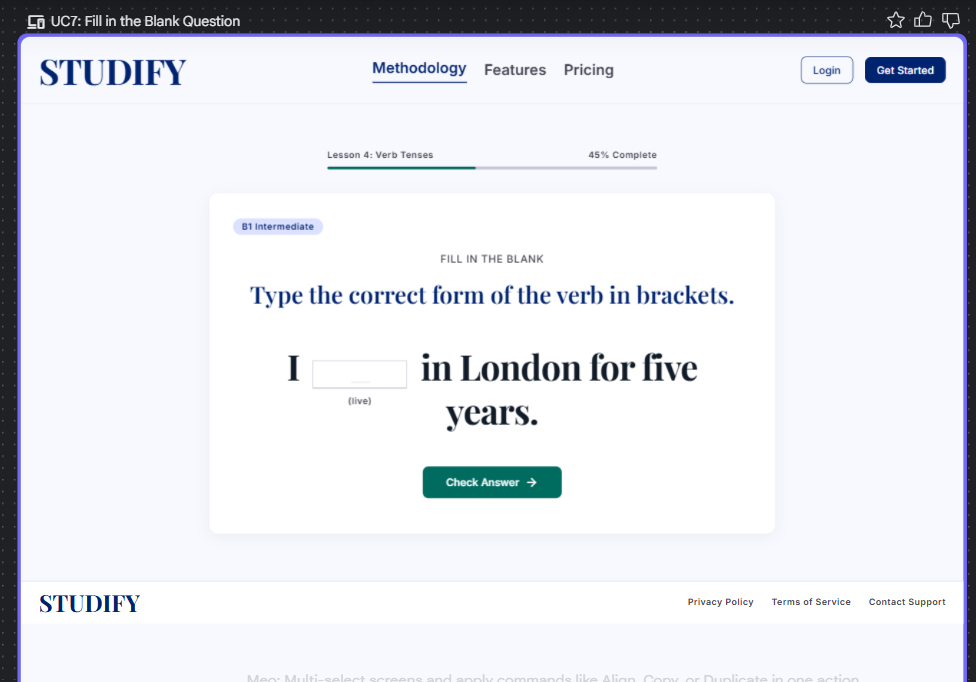

# Self-Study Dashboard
## Use-Case Specification: UC7 - Fill in the Blank

**Version:** 1.0

---

### Revision History

| Date | Version | Description | Author |
| :--- | :--- | :--- | :--- |
| 23/Jul/26 | 1.0 | Initial draft for UC7: Fill in the Blank | System Analyst |

---

### Table of Contents

- [Self-Study Dashboard](#self-study-dashboard)
  - [Use-Case Specification: UC7 - Fill in the Blank](#use-case-specification-uc7---fill-in-the-blank)
    - [Revision History](#revision-history)
    - [Table of Contents](#table-of-contents)
  - [1. Use-Case Name](#1-use-case-name)
    - [1.1 Brief Description](#11-brief-description)
  - [2. Flow of Events](#2-flow-of-events)
    - [2.1 Basic Flow](#21-basic-flow)
    - [2.2 Alternative Flows](#22-alternative-flows)
      - [2.2.1 Clearing Input](#221-clearing-input)
      - [2.2.2 Exceeding Character Limit](#222-exceeding-character-limit)
  - [3. Special Requirements](#3-special-requirements)
    - [3.1 Data Sanitization](#31-data-sanitization)
    - [3.2 Accessibility Requirement](#32-accessibility-requirement)
  - [4. Preconditions](#4-preconditions)
    - [4.1 Question Instantiation](#41-question-instantiation)
  - [5. Postconditions](#5-postconditions)
    - [5.1 Answer Recorded](#51-answer-recorded)
  - [6. Extension Points](#6-extension-points)
    - [6.1 None](#61-none)

---

## 1. Use-Case Name
**UC7: Fill in the Blank**

### 1.1 Brief Description
This use case describes the specific interaction when a Learner encounters a Fill in the Blank question during a quiz. As a specialization (generalization relationship) of UC5: Take Quiz, it details how the system presents a sentence or paragraph containing missing words (blanks) and how the Learner utilizes text input fields to provide the missing information. 

*Figure 7.1: Fill in the Blank question showing a sentence with an embedded text input field for the missing verb form.*

---

## 2. Flow of Events

### 2.1 Basic Flow
1. The use case begins when the quiz engine (UC5) loads a question designated as the "Fill in the Blank" type.
2. The system displays a text prompt (sentence or paragraph) with one or more embedded text input fields representing the "blanks".
3. The Learner clicks or taps on an input field to bring it into focus.
4. The Learner types their textual answer into the field using their keyboard.
5. If there are multiple blanks in the same question, the Learner navigates to the next input field (e.g., using the `Tab` key or clicking) and repeats step 4.
6. The system automatically captures and temporarily stores the typed text in the active quiz session memory as the Learner types or when the input field loses focus.
7. The use case ends when the Learner navigates to another question or proceeds to submit the quiz (returning control to UC5).

### 2.2 Alternative Flows

#### 2.2.1 Clearing Input
If the Learner realizes they have made a mistake and wishes to remove their answer before submission:
1. The Learner focuses on the populated input field.
2. The Learner uses the `Backspace` or `Delete` key to remove the text, leaving the field empty.
3. The system updates the session storage to reflect a null or empty string for that specific blank.

#### 2.2.2 Exceeding Character Limit
If the system has a predefined maximum character limit for a specific blank to prevent formatting issues or spam inputs:
1. The Learner types characters up to the maximum limit.
2. If the Learner attempts to type additional characters, the system prevents the input from registering in the field.
3. The system may optionally display a brief visual cue (e.g., a red outline or tooltip) indicating that the character limit has been reached.

---

## 3. Special Requirements

### 3.1 Data Sanitization
The system must sanitize all text inputs provided by the Learner to prevent malicious injections (e.g., Cross-Site Scripting - XSS) before storing or evaluating the answers. Leading and trailing white spaces should also be automatically trimmed during the evaluation phase to prevent false negatives.

### 3.2 Accessibility Requirement
Screen readers must be able to read the surrounding text contextually and clearly announce the presence of a text input field (e.g., "Blank 1", "Blank 2") so visually impaired Learners understand exactly where their input belongs within the sentence structure.

---

## 4. Preconditions

### 4.1 Question Instantiation
The Learner must be actively executing UC5 (Take Quiz), and the system must have successfully retrieved a question payload from the database explicitly flagged as a "Fill in the Blank" type.

---

## 5. Postconditions

### 5.1 Answer Recorded
The state of the system is updated to reflect the Learner's inputted text for the corresponding blanks within the temporary quiz session memory. The system is ready to evaluate these text strings against the correct answer keys (including acceptable variations or synonyms, if configured) once the overall quiz is submitted in UC5.

---

## 6. Extension Points

### 6.1 None
There are no explicit extension points for this specific use case.