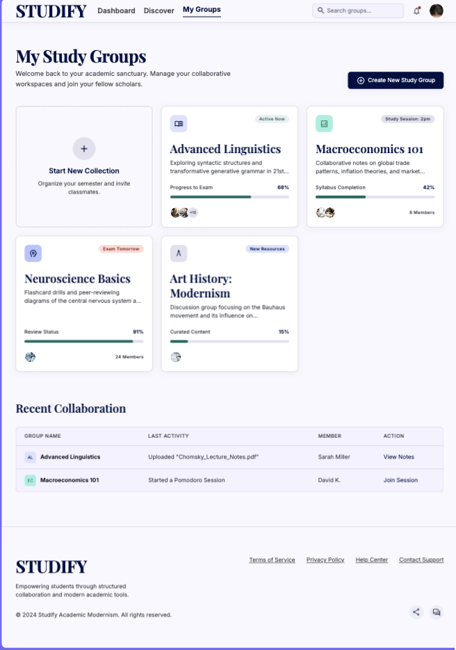
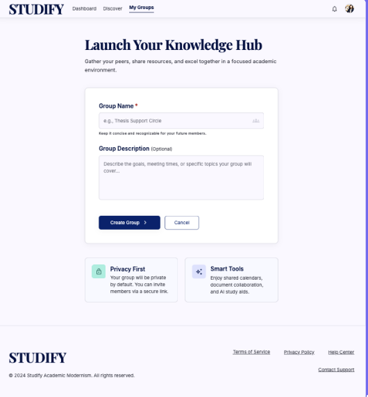
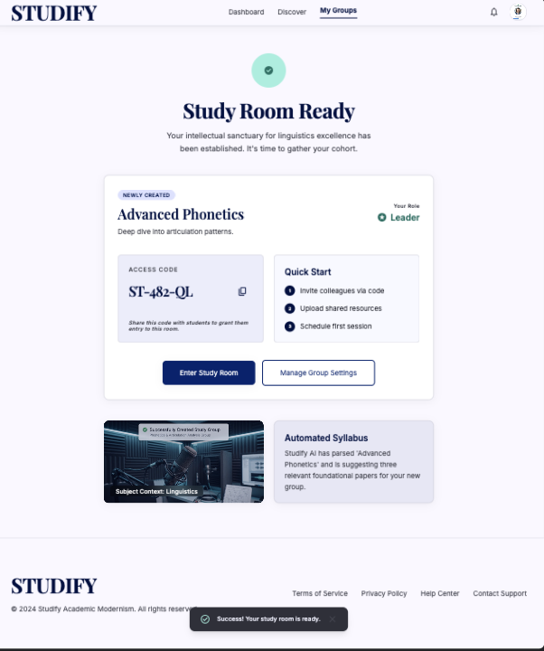
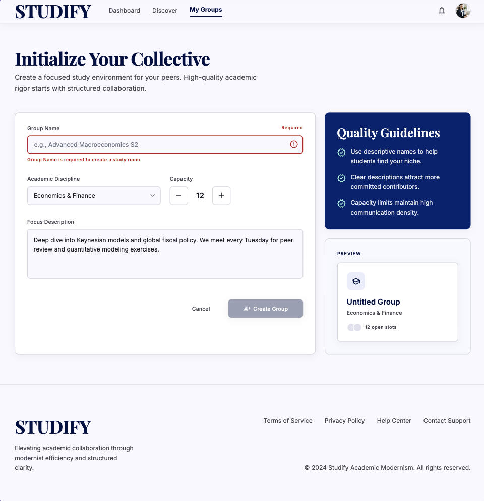
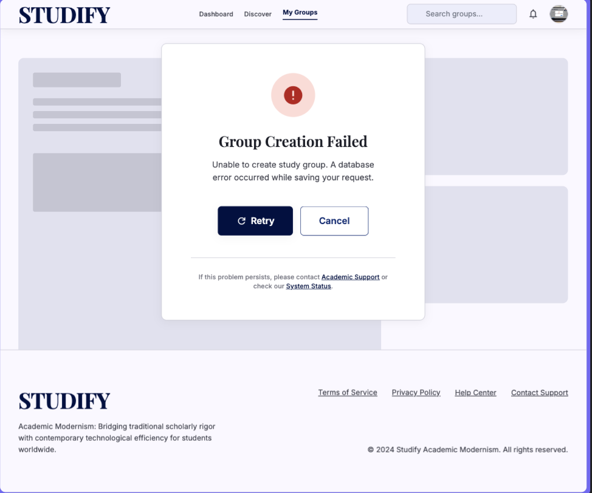

# Studify

## Use-Case Specification: Create New Study Group

**Version:** 1.0

---

### Revision History

| Date        | Version | Description                                                          | Author |
| :---------- | :------ | :------------------------------------------------------------------- | :----- |
| `23/Jul/26` | `1.0`   | Initial version of the Create New Study Group use-case specification | `Minh Thư` |

---

### Table of Contents

- [Studify](#studify)
  - [Use-Case Specification: Create New Study Group](#use-case-specification-create-new-study-group)
    - [Revision History](#revision-history)
    - [Table of Contents](#table-of-contents)
  - [1. Use-Case Name](#1-use-case-name)
    - [1.1 Brief Description](#11-brief-description)
  - [2. Flow of Events](#2-flow-of-events)
    - [2.1 Basic Flow](#21-basic-flow)
    - [2.2 Alternative Flows](#22-alternative-flows)
      - [2.2.1 Group Creation Cancelled](#221-group-creation-cancelled)
      - [2.2.2 Invalid Group Information](#222-invalid-group-information)
      - [2.2.3 Group Creation Failed](#223-group-creation-failed)
  - [3. Special Requirements](#3-special-requirements)
    - [3.1 Security](#31-security)
    - [3.2 Performance](#32-performance)
    - [3.3 Usability](#33-usability)
  - [4. Preconditions](#4-preconditions)
    - [4.1 User Authentication](#41-user-authentication)
  - [5. Postconditions](#5-postconditions)
    - [5.1 Study Group Successfully Created](#51-study-group-successfully-created)
  - [6. Extension Points](#6-extension-points)
    - [6.1 Auto-generate Group Code](#61-auto-generate-group-code)

---

## 1. Use-Case Name

**Create New Study Group**

### 1.1 Brief Description

This use case allows an authenticated System User to create a new Virtual Study Room for collaborative learning. The user provides the required group information, such as the study group name and optional description. The system validates the provided information, creates the study group, assigns the creating user as the group Leader, and automatically generates a unique group code that can be used by other users to join the study group. The newly created group is then displayed to the user.

---

## 2. Flow of Events

### 2.1 Basic Flow

1. The use case begins when the **System User** selects the **Create New Study Group** function from the Virtual Study Room interface.

2. The system displays the study group creation form.

3. The System User enters the required study group information:

   * Group name.
   * Group description (optional)

4. The System User submits the group creation form.

5. The system validates the provided group information.

6. The system creates a new study group with the provided information.

7. The system assigns the System User who created the group as the **Leader** of the newly created study group.

8. The system automatically generates a unique group code for the newly created study group.
   This step invokes the **Auto-generate Group Code** included use case.

9.  The system stores the study group information and the generated group code.

10. The system displays a success notification and the newly created study group's information to the System User.

11. The System User can view the group name, group description, generated group code, and their role as **Leader**.

12. The use case ends successfully.

---

### 2.2 Alternative Flows

#### 2.2.1 Group Creation Cancelled

1. At any point before submitting the group creation form, the System User selects the **Cancel** option.

2. The system cancels the group creation process.

3. The system returns the System User to the Virtual Study Room page.

4. No new study group is created.

5. The use case ends.

---

#### 2.2.2 Invalid Group Information

1. At Step 5 of the Basic Flow, the system detects that the provided group information is invalid.

2. The system displays an appropriate validation message indicating the invalid or missing information.

3. The System User corrects the provided information.

4. The System User resubmits the group creation form.

5. The system validates the updated information again.

6. If the information is valid, the system resumes the Basic Flow at Step 6.

---

#### 2.2.3 Group Creation Failed

1. At Step 6 or Step 9 of the Basic Flow, the system fails to create or save the study group due to a system or database error.

2. The system displays an error message informing the System User that the study group could not be created.

3. The system does not create a partially completed study group.

4. The System User may retry the creation process.

5. The use case ends.

---

## 3. Special Requirements

### 3.1 Security

* Only authenticated System Users can create a new study group.
* The system must associate the newly created study group with the authenticated user's account.
* The system must assign the creator the **Leader** role automatically.
* The generated group code must be unique and difficult to guess to prevent unauthorized access to private study groups.

### 3.2 Performance

* The system should complete the group creation process and display the result within **2 seconds** under normal operating conditions.
* The system must generate the group code without requiring additional input from the user.

### 3.3 Usability

* The group creation form must clearly identify required and optional fields.
* The system must provide clear validation messages when the entered information is invalid.
* The generated group code must be clearly displayed after successful group creation so that the Leader can share it with other users.

---

## 4. Preconditions

### 4.1 User Authentication

* The System User must have a valid registered account.
* The System User must be successfully authenticated and logged into the system.
* The System User must have access to the **Virtual Study Room** subsystem.
* The system must be available and able to access the database.

---

## 5. Postconditions

### 5.1 Study Group Successfully Created

If the use case completes successfully:

* A new study group is created and stored in the system.
* The provided group name and description are associated with the study group.
* A unique group code is generated and associated with the study group.
* The System User who created the group is assigned the **Leader** role.
* The newly created study group is available in the user's study group list.
* The generated group code can be shared with other users so they can join the study group.

If the use case is cancelled or fails:

* No new study group is created.
* No incomplete study group record is stored in the system.

---

## 6. Extension Points

### 6.1 Auto-generate Group Code

The extension point occurs after the system has validated the provided group information and before the newly created study group is presented to the System User.

The system automatically generates a unique group code for the newly created study group. The generated code is stored with the study group and is subsequently displayed to the group Leader. The group code is used by other System Users to join the study group through the **Join Group via Code** use case.
