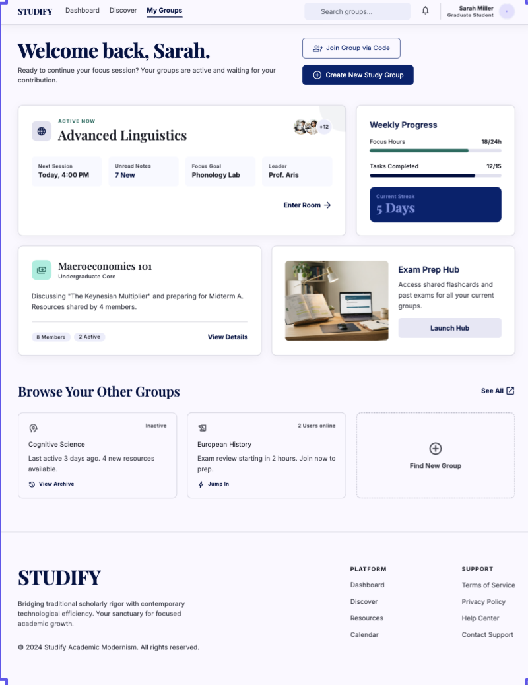
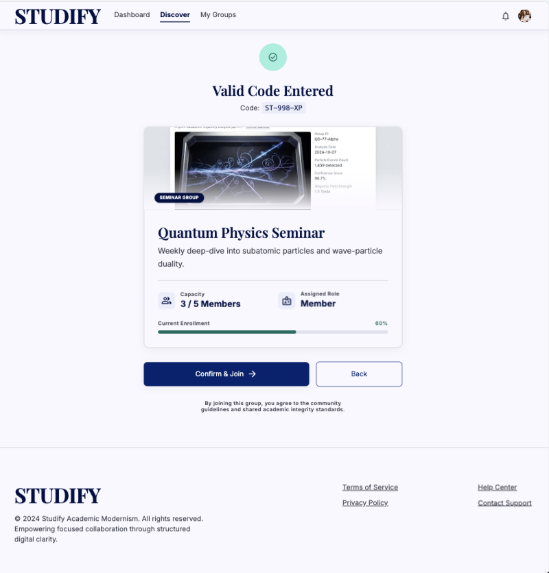
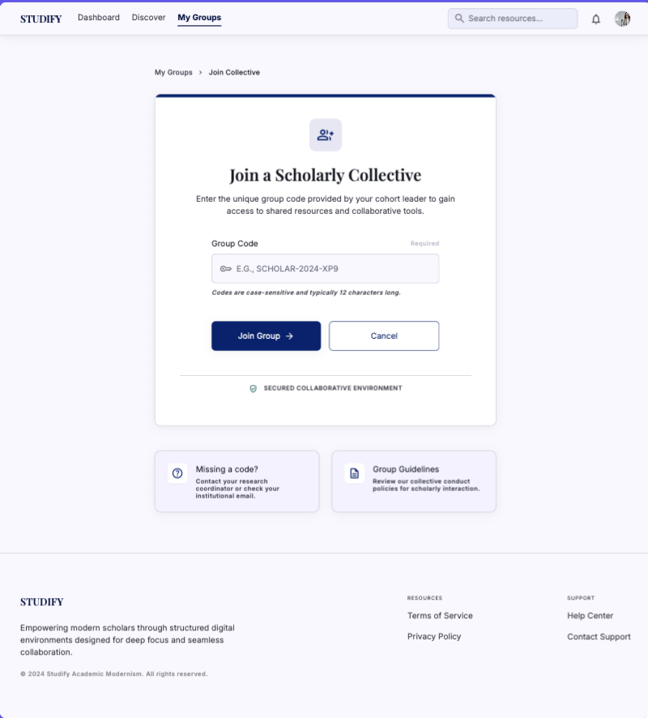
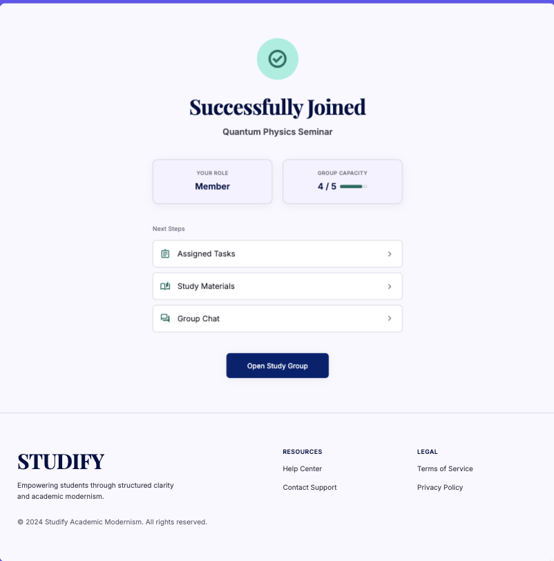
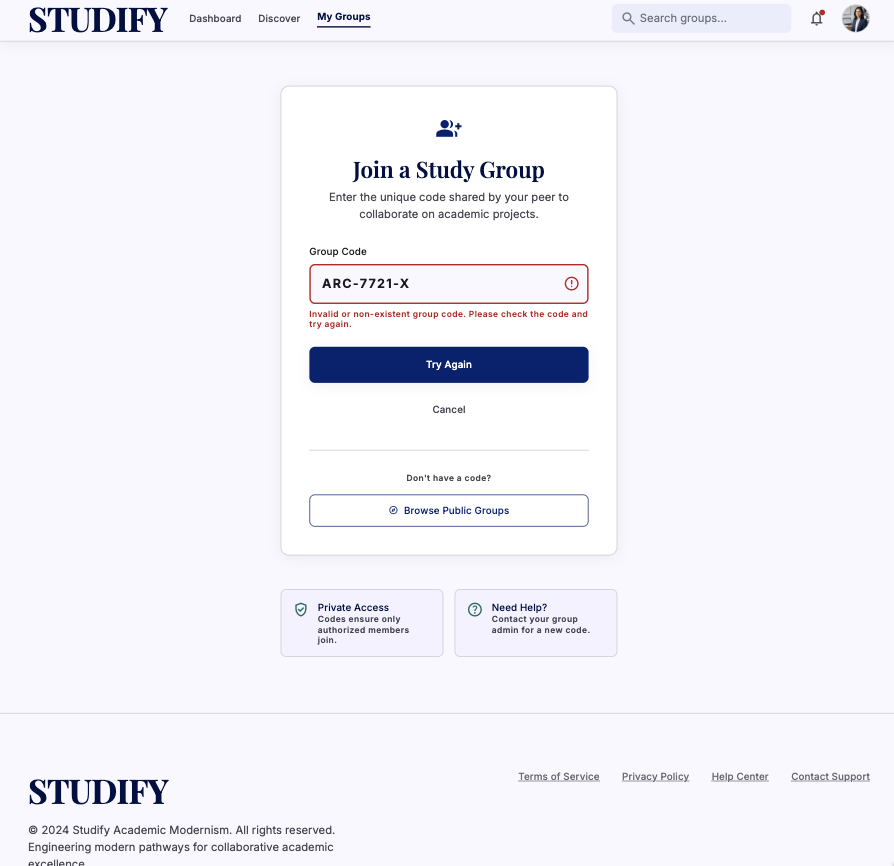
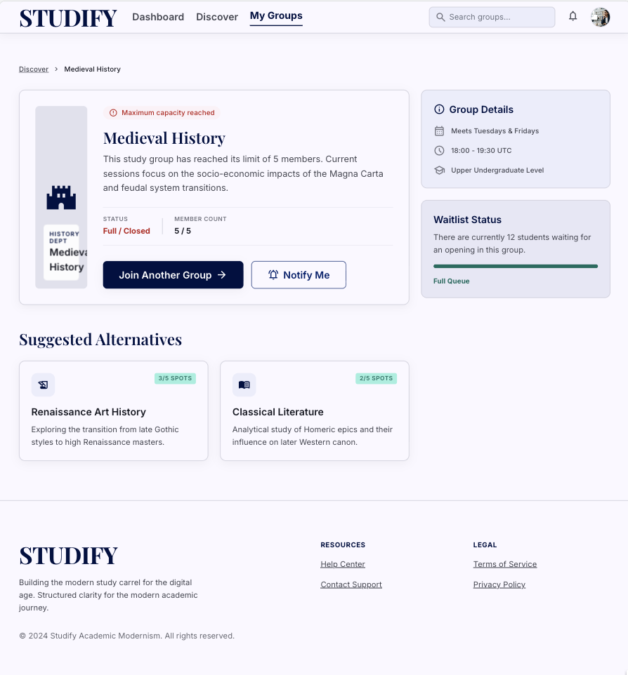
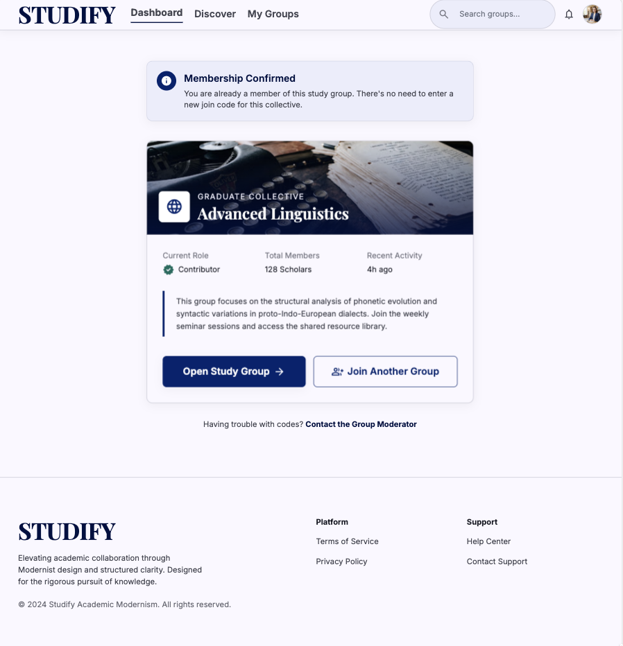
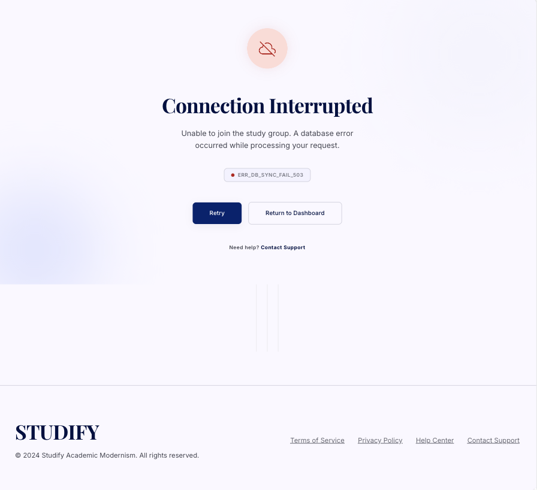

# Studify

## Use-Case Specification: Join Group via Code

**Version:** 1.0

---

### Revision History

| Date        | Version | Description                                                       | Author |
| :---------- | :------ | :---------------------------------------------------------------- | :----- |
| `23/Jul/26` | `1.0`   | Initial version of the Join Group via Code use-case specification | `Minh Thư` |

---

### Table of Contents

- [Studify](#studify)
  - [Use-Case Specification: Join Group via Code](#use-case-specification-join-group-via-code)
    - [Revision History](#revision-history)
    - [Table of Contents](#table-of-contents)
  - [1. Use-Case Name](#1-use-case-name)
    - [1.1 Brief Description](#11-brief-description)
  - [2. Flow of Events](#2-flow-of-events)
    - [2.1 Basic Flow](#21-basic-flow)
    - [2.2 Alternative Flows](#22-alternative-flows)
      - [2.2.1 Invalid or Non-existent Group Code](#221-invalid-or-non-existent-group-code)
      - [2.2.2 Group Has Reached Maximum Capacity](#222-group-has-reached-maximum-capacity)
      - [2.2.3 User Already Belongs to the Group](#223-user-already-belongs-to-the-group)
      - [2.2.4 Join Operation Failed](#224-join-operation-failed)
  - [3. Special Requirements](#3-special-requirements)
    - [3.1 Security](#31-security)
    - [3.2 Performance](#32-performance)
    - [3.3 Usability](#33-usability)
  - [4. Preconditions](#4-preconditions)
    - [4.1 User Authentication and Group Availability](#41-user-authentication-and-group-availability)
  - [5. Postconditions](#5-postconditions)
    - [5.1 User Successfully Joins the Study Group](#51-user-successfully-joins-the-study-group)
  - [6. Extension Points](#6-extension-points)
    - [6.1 Validate Group Code](#61-validate-group-code)

---

## 1. Use-Case Name

**Join Group via Code**

### 1.1 Brief Description

This use case allows an authenticated System User to join an existing Virtual Study Room by entering a valid group code provided by the group's Leader or another group member. The system verifies the entered group code, checks the availability and capacity of the study group, and adds the System User as a Member if all conditions are satisfied. The System User can then access the group's shared resources and collaborative study features.

---

## 2. Flow of Events

### 2.1 Basic Flow

1. The use case begins when the **System User** selects the **Join Group via Code** function from the Virtual Study Room interface.

1. The system displays a form requesting the group code.

2. The System User enters the group code received from the Leader or another member of the study group.

3. The System User submits the group code.

4. The system validates the entered group code.

5. The system identifies the study group associated with the provided group code.

6. The system checks whether the study group is available for new members and whether the current number of members is below the maximum capacity of **5 members**.

7. The system checks whether the System User is already a member of the identified study group.

8.  If all validation conditions are satisfied, the system adds the System User to the study group and assigns the **Member** role.

9.  The system updates the study group's member list.

10. The system displays a success notification to the System User.

11. The system displays the study group's information and makes the group's available features accessible to the newly joined Member.

12. The use case ends successfully.

---

### 2.2 Alternative Flows

#### 2.2.1 Invalid or Non-existent Group Code

1. At Step 5 of the Basic Flow, the system determines that the entered group code is invalid or does not correspond to any existing study group.

2. The system displays an error message indicating that the group code is invalid or does not exist.

3. The System User enters a valid group code.

4. The System User submits the group code again.

5. The system validates the new group code.

6. If the group code is valid, the system resumes the Basic Flow at Step 6.

---

#### 2.2.2 Group Has Reached Maximum Capacity

1. At Step 7 of the Basic Flow, the system determines that the study group already has **5 members**.

2. The system does not add the System User to the study group.

3. The system displays a notification informing the System User that the study group has reached its maximum capacity.

4. The System User may enter another group code to join a different study group.

5. The use case ends.

---

#### 2.2.3 User Already Belongs to the Group

1. At Step 8 of the Basic Flow, the system determines that the System User is already a member of the selected study group.

2. The system does not create a duplicate membership record.

3. The system displays a notification informing the System User that they have already joined the study group.

4. The system provides an option for the System User to access the existing study group.

5. If the System User chooses to access the group, the system displays the study group's main page.

6. The use case ends.

---

#### 2.2.4 Join Operation Failed

1. At Step 9 or Step 10 of the Basic Flow, the system fails to add the System User to the study group due to a system or database error.

2. The system displays an error message informing the System User that the join operation could not be completed.

3. The system does not create an incomplete or duplicate membership record.

4. The System User may retry the join operation.

5. The use case ends.

---

## 3. Special Requirements

### 3.1 Security

* Only authenticated System Users can join a study group.
* The system must validate the group code before granting access to the study group.
* The system must not expose sensitive information about a study group when an invalid group code is provided.
* The system must prevent duplicate membership records for the same user and study group.
* The system must assign the **Member** role to a user who successfully joins an existing study group through a group code.

### 3.2 Performance

* The system should validate the group code and complete the join operation within **2 seconds** under normal operating conditions.
* The system should immediately update the study group's member list after a successful join operation.

### 3.3 Usability

* The group code input field must be clearly visible and easy to use.
* The system must provide clear error messages for invalid codes, full groups, and duplicate membership.
* The system must clearly notify the System User when they have successfully joined a study group.
* After successfully joining the group, the system should provide direct access to the study group's main page.

---

## 4. Preconditions

### 4.1 User Authentication and Group Availability

* The System User must have a valid registered account.
* The System User must be successfully authenticated and logged into the system.
* The System User must have access to the **Virtual Study Room** subsystem.
* The study group that the System User wants to join must already exist.
* The study group must have a valid group code generated by the system.
* The system must be available and able to access the database.

---

## 5. Postconditions

### 5.1 User Successfully Joins the Study Group

If the use case completes successfully:

* The System User is added to the selected study group.
* The System User is assigned the **Member** role.
* The study group's member list is updated.
* The System User can access the study group's available features and resources.
* The System User can participate in group activities, such as viewing assigned tasks, accessing shared study materials, and participating in the group chat.

If the use case fails or is terminated due to an alternative flow:

* The System User is not added to the study group.
* No duplicate or incomplete membership record is created.
* The existing study group data remains unchanged.

---

## 6. Extension Points

### 6.1 Validate Group Code

The extension point occurs after the System User submits the group code and before the system adds the System User to the study group.

The system validates the provided group code and identifies the corresponding study group. The system also verifies that the group exists, is available for new members, has not reached the maximum capacity of **5 members**, and that the System User is not already a member of the group. If all conditions are satisfied, the Basic Flow continues. Otherwise, the appropriate Alternative Flow is triggered.