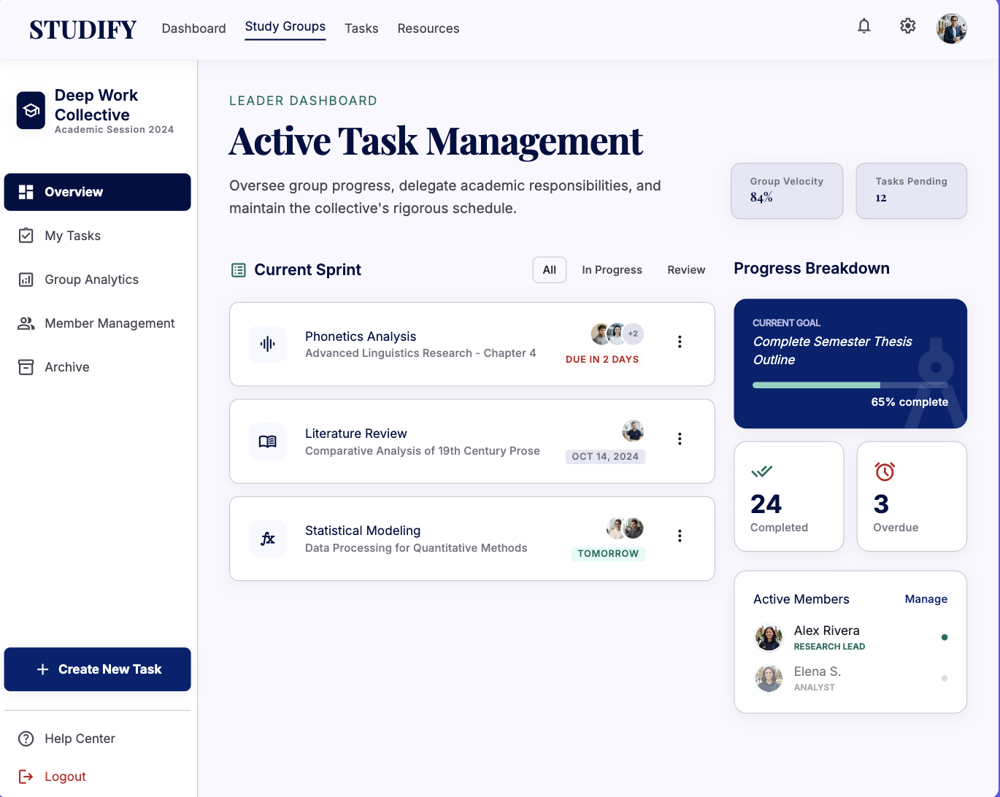
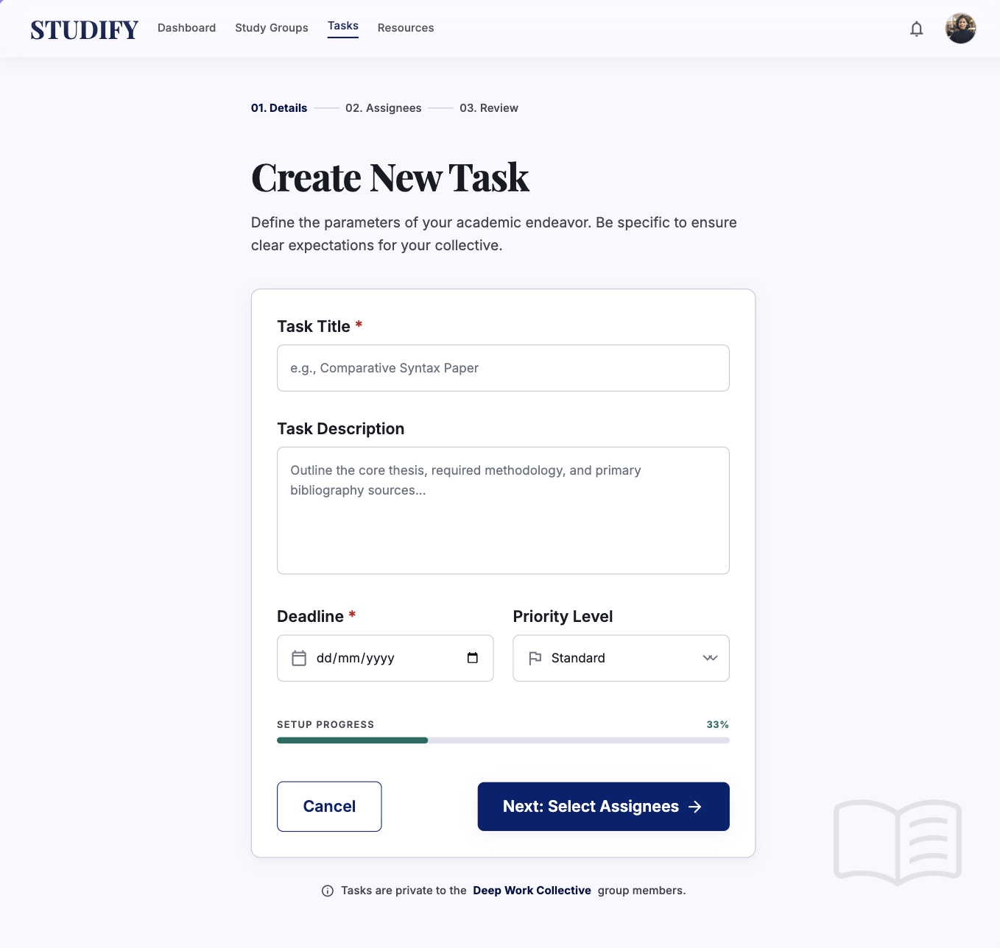
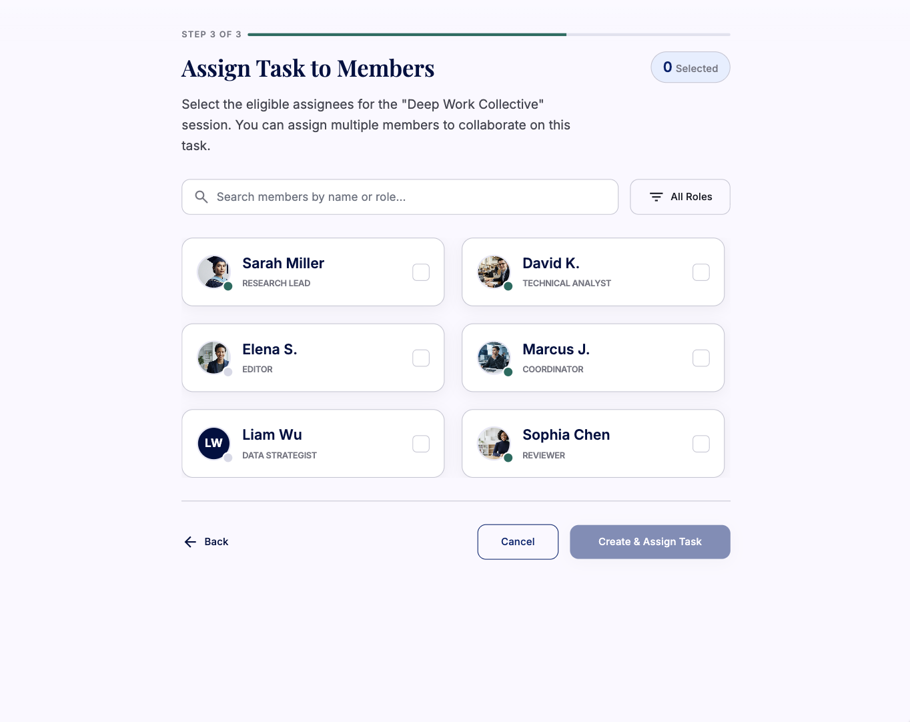
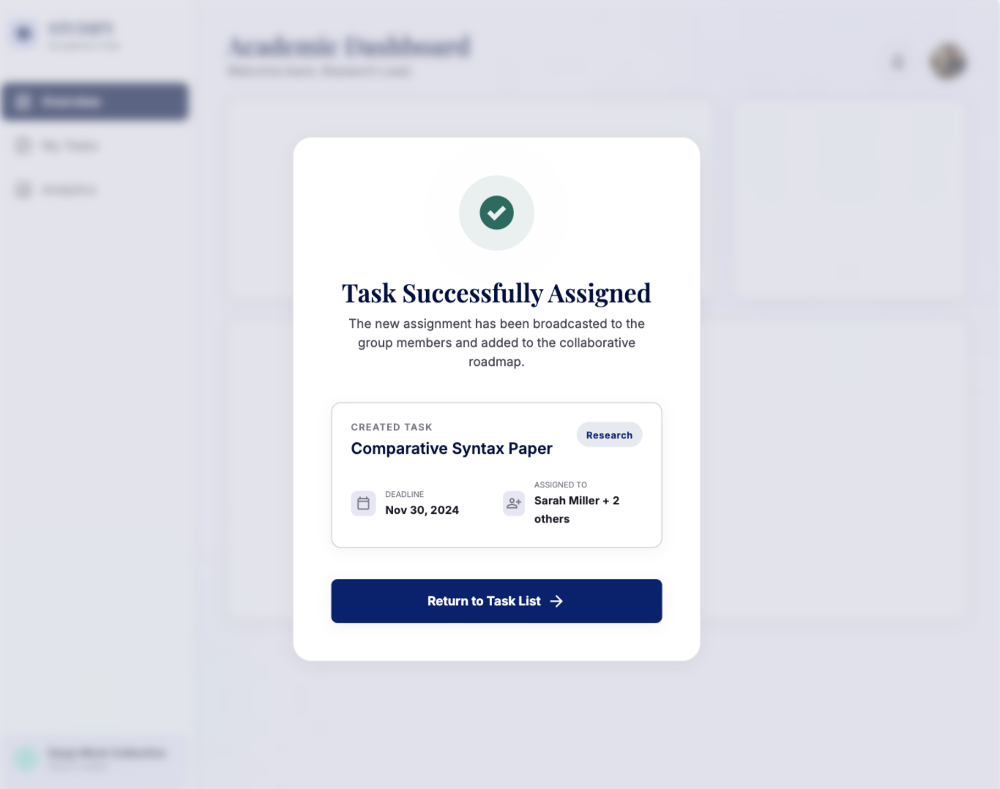
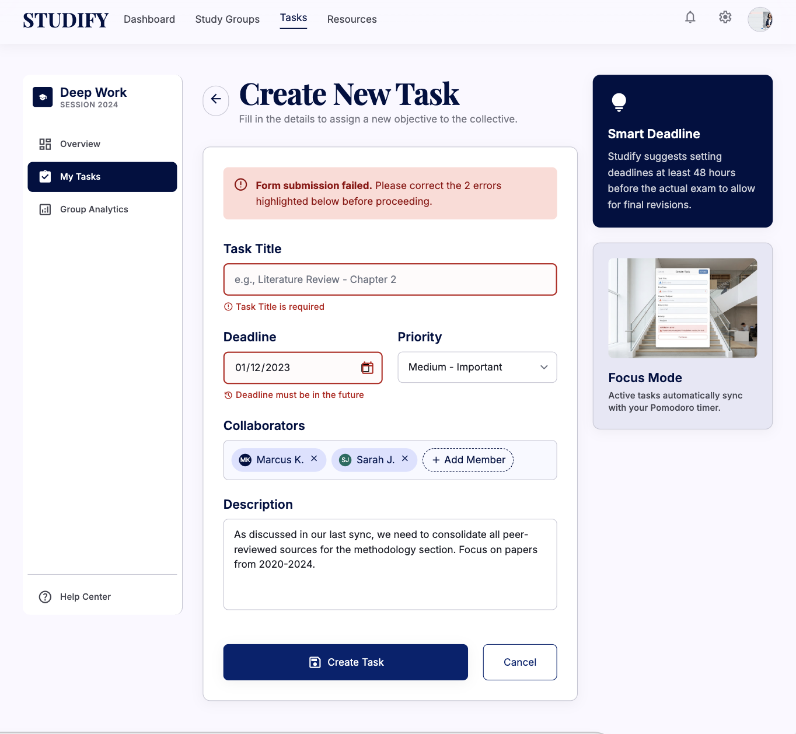
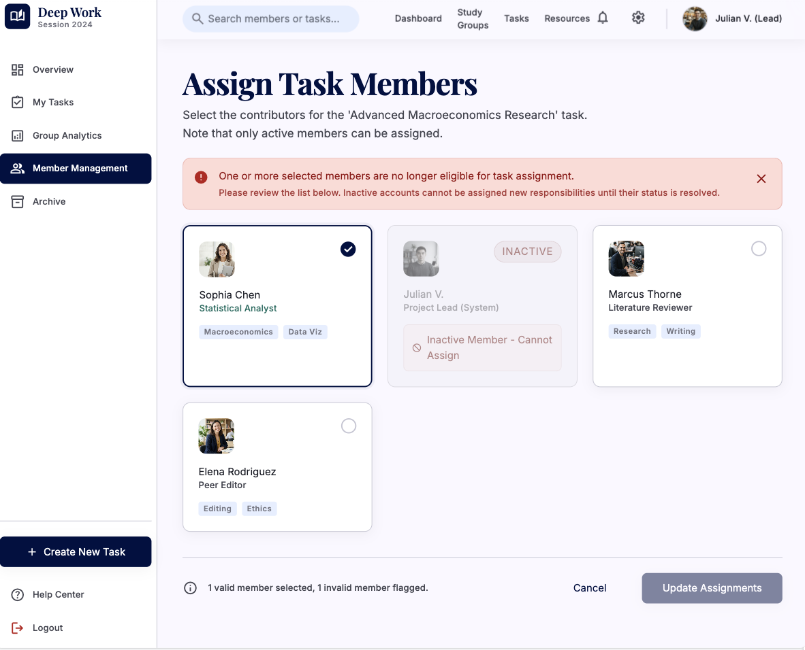
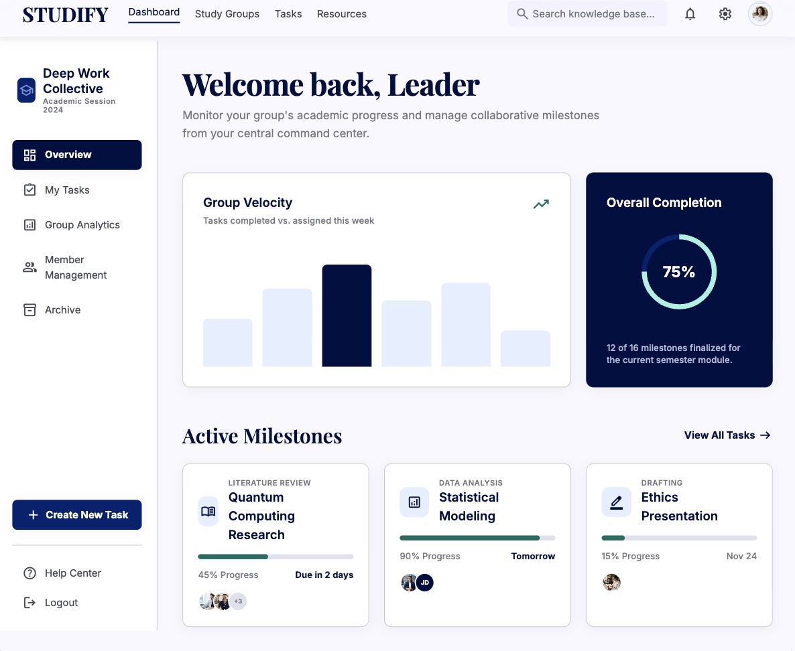
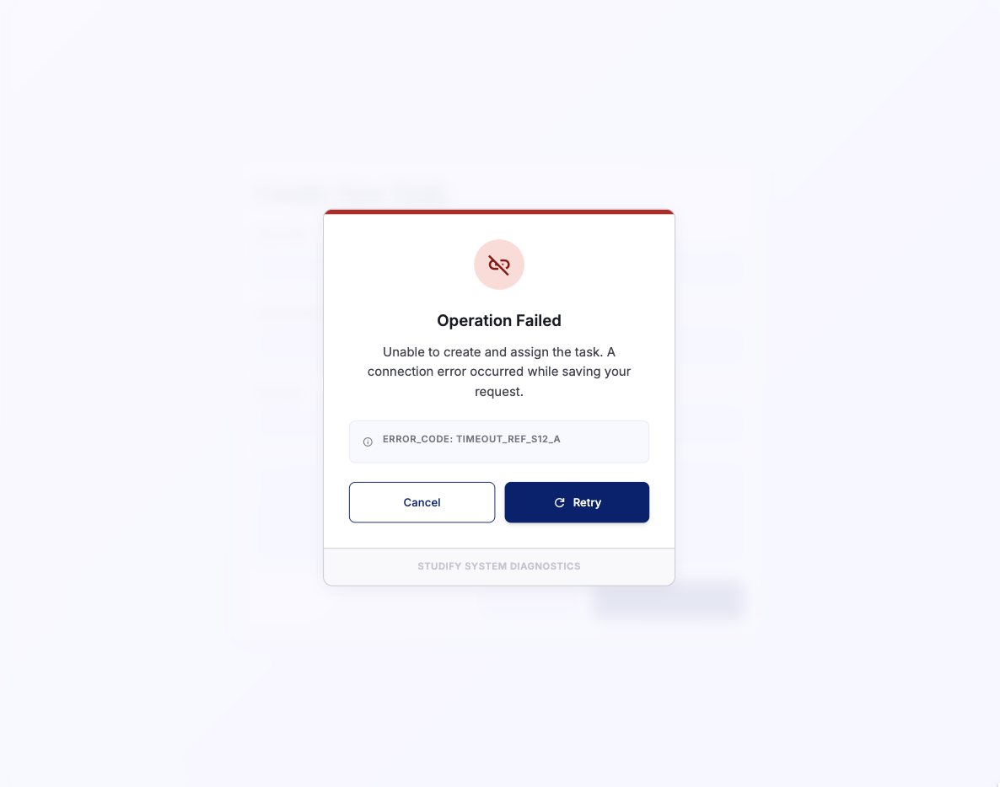

# Studify

## Use-Case Specification: Manage & Assign Tasks

**Version:** 1.0

---

### Revision History

| Date        | Version | Description                                                         | Author |
| :---------- | :------ | :------------------------------------------------------------------ | :----- |
| `23/Jul/26` | `1.0`   | Initial version of the Manage & Assign Tasks use-case specification | `Minh Thư` |

---

### Table of Contents

- [Studify](#studify)
  - [Use-Case Specification: Manage \& Assign Tasks](#use-case-specification-manage--assign-tasks)
    - [Revision History](#revision-history)
    - [Table of Contents](#table-of-contents)
  - [1. Use-Case Name](#1-use-case-name)
    - [1.1 Brief Description](#11-brief-description)
  - [2. Flow of Events](#2-flow-of-events)
    - [2.1 Basic Flow](#21-basic-flow)
    - [2.2 Alternative Flows](#22-alternative-flows)
      - [2.2.1 Invalid Task Information](#221-invalid-task-information)
      - [2.2.2 Invalid Task Assignee](#222-invalid-task-assignee)
      - [2.2.3 Task Assignment Cancelled](#223-task-assignment-cancelled)
      - [2.2.4 Task Management Operation Failed](#224-task-management-operation-failed)
  - [3. Special Requirements](#3-special-requirements)
    - [3.1 Security and Access Control](#31-security-and-access-control)
    - [3.2 Performance](#32-performance)
    - [3.3 Usability](#33-usability)
  - [4. Preconditions](#4-preconditions)
    - [4.1 Leader Authentication and Group Membership](#41-leader-authentication-and-group-membership)
  - [5. Postconditions](#5-postconditions)
    - [5.1 Task Successfully Created and Assigned](#51-task-successfully-created-and-assigned)
  - [6. Extension Points](#6-extension-points)
    - [6.1 Create Task \& Set Deadline](#61-create-task--set-deadline)

---

## 1. Use-Case Name

**Manage & Assign Tasks**

### 1.1 Brief Description

This use case allows the **Leader** of a Virtual Study Room to manage study tasks and assign them to group Members. The Leader can create a new task, define its details and deadline, and assign the task to one or more eligible Members of the study group. The system validates the task information and assignee, stores the task, and updates the assigned Member's task list. The task creation and deadline configuration process is handled through the included **Create Task & Set Deadline** use case.

---

## 2. Flow of Events

### 2.1 Basic Flow

1. The use case begins when the **Leader** selects the **Manage & Assign Tasks** function from the study group's interface.

2. The system displays the task management interface, including the existing tasks of the study group and available task management actions.

3. The Leader selects the option to create and assign a new task.

4. The system displays the task creation form.

5. The Leader initiates the **Create Task & Set Deadline** included use case.

6. The Leader provides the required task information, including:

   * Task title.
   * Task description.
   * Deadline.
   * Assigned Member or Members.

7. The system validates the provided task information and verifies that the selected assignee(s) belong to the current study group.

1. The system creates the task with the provided information and deadline.

2.  The system assigns the task to the selected Member or Members.

3.  The system stores the task and assignment information.

4.  The system updates the assigned Member's task list.

5.  The system displays a success notification to the Leader.

6.  The assigned Member or Members can view the newly assigned task through the **View Assigned Tasks** use case.

7.  The use case ends successfully.

---

### 2.2 Alternative Flows

#### 2.2.1 Invalid Task Information

1. At Step 7 of the Basic Flow, the system determines that one or more required task fields are missing or invalid.

2. The system displays an appropriate validation message identifying the invalid information.

3. The Leader corrects the task information.

4. The Leader submits the task information again.

5. The system validates the updated information.

6. If all information is valid, the system resumes the Basic Flow at Step 8.

---

#### 2.2.2 Invalid Task Assignee

1. At Step 7 of the Basic Flow, the system determines that the selected assignee is not a Member of the current study group or is no longer an active Member.

2. The system displays an error message informing the Leader that the selected user cannot be assigned the task.

3. The Leader selects another eligible Member of the study group.

4. The system validates the new assignee.

5. If the selected Member is valid, the system resumes the Basic Flow at Step 8.

---

#### 2.2.3 Task Assignment Cancelled

1. Before the task is successfully created, the Leader selects the **Cancel** option.

2. The system cancels the task creation and assignment operation.

3. The system does not create or assign the task.

4. The system returns the Leader to the task management interface.

5. The use case ends.

---

#### 2.2.4 Task Management Operation Failed

1. At Step 8, Step 9, or Step 10 of the Basic Flow, the system encounters an error while creating, assigning, or storing the task.

2. The system displays an error message informing the Leader that the task management operation could not be completed.

3. The system ensures that no incomplete or duplicate task assignment is stored.

4. The Leader may retry the task creation and assignment operation.

5. The use case ends.

---

## 3. Special Requirements

### 3.1 Security and Access Control

* Only the **Leader** of the study group can create and assign tasks through this use case.
* The system must verify the Leader's membership and role before allowing task management operations.
* The Leader can only assign tasks to Members who belong to the same study group.
* A Member must not be able to assign tasks to themselves or other Members through this use case unless explicitly authorized by the system's role permissions.

### 3.2 Performance

* The system should complete task creation and assignment within **2 seconds** under normal operating conditions.
* The updated task information should be immediately available to the assigned Member or Members after successful creation.

### 3.3 Usability

* The task creation form must clearly identify required and optional fields.
* The system must provide clear validation messages when task information is invalid.
* The system must provide a list of eligible Members when the Leader selects task assignees.
* The system must clearly display the task title, description, deadline, and assignee information.
* The Leader must receive clear confirmation after the task has been successfully created and assigned.

---

## 4. Preconditions

### 4.1 Leader Authentication and Group Membership

* The Leader must have a valid registered account.
* The Leader must be successfully authenticated and logged into the system.
* The Leader must belong to an existing Virtual Study Room.
* The authenticated user must have the **Leader** role in the selected study group.
* The study group must contain at least one eligible Member who can be assigned a task.
* The system must be available and able to access the database.

---

## 5. Postconditions

### 5.1 Task Successfully Created and Assigned

If the use case completes successfully:

* A new study task is created and stored in the system.
* The task contains the provided title and description.
* The task has a defined deadline.
* The task is assigned to the selected Member or Members.
* The task appears in the assigned Member's task list.
* The assigned Member or Members can view the task through the **View Assigned Tasks** use case.
* The Leader can view the created task in the study group's task management interface.

If the use case is cancelled or fails:

* No incomplete task is created.
* No invalid task assignment is stored.
* Existing tasks and task assignments remain unchanged.

---

## 6. Extension Points

### 6.1 Create Task & Set Deadline

The extension point occurs when the Leader chooses to create a new task during the task management process.

The system invokes the **Create Task & Set Deadline** use case to collect and validate the task's title, description, and deadline. After the task information is successfully created and validated, the **Manage & Assign Tasks** use case continues by assigning the task to the selected Member or Members and storing the assignment information.