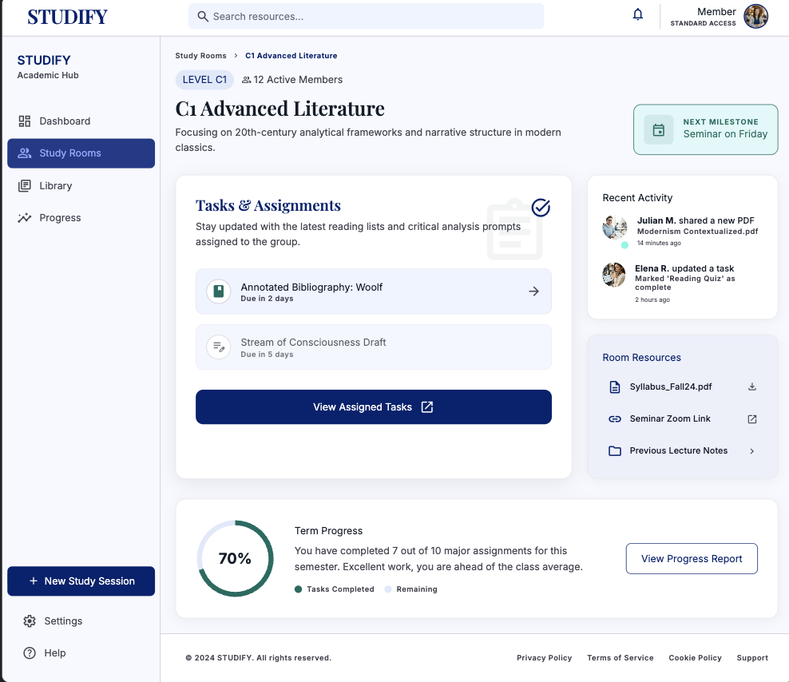
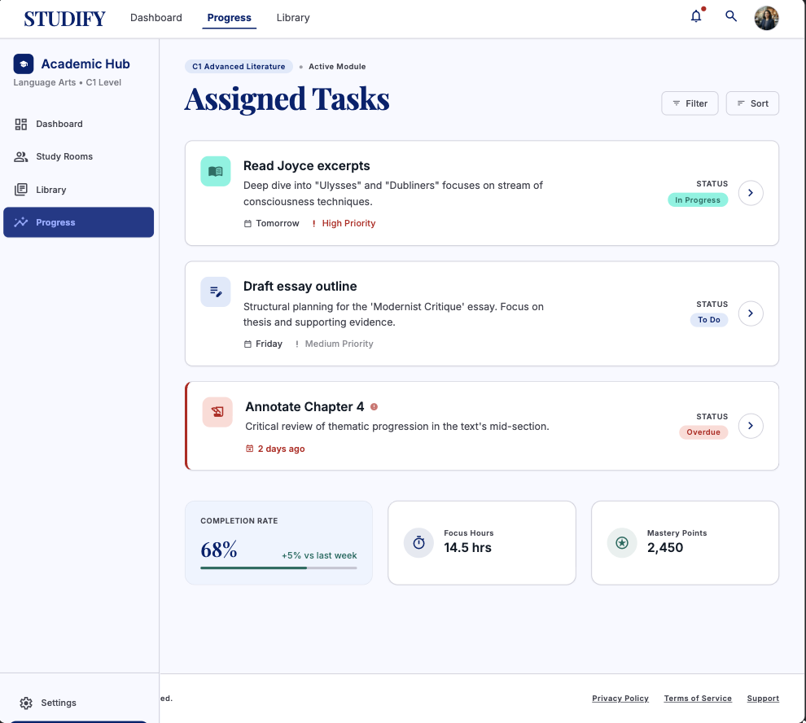
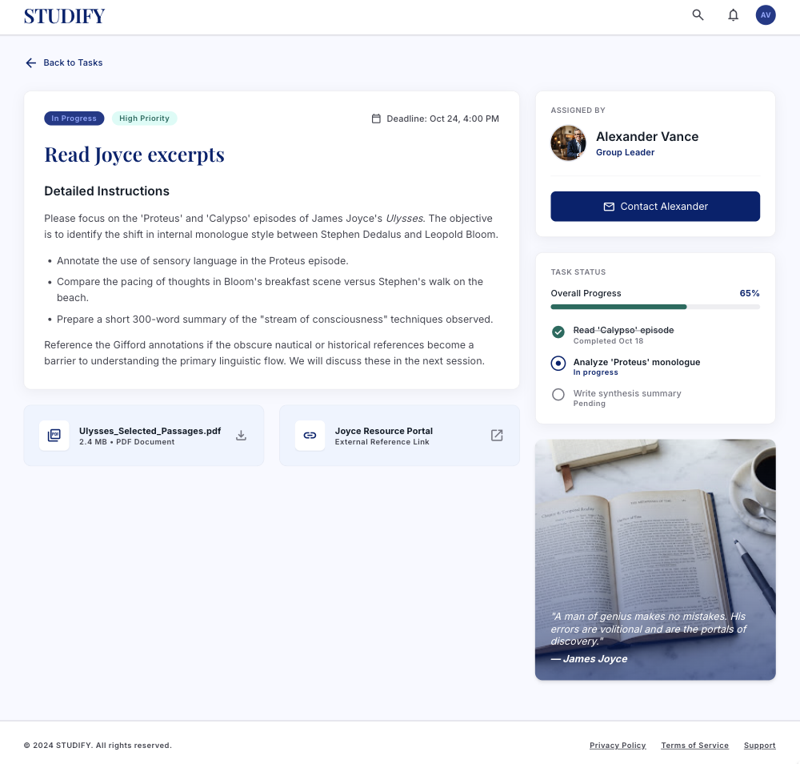
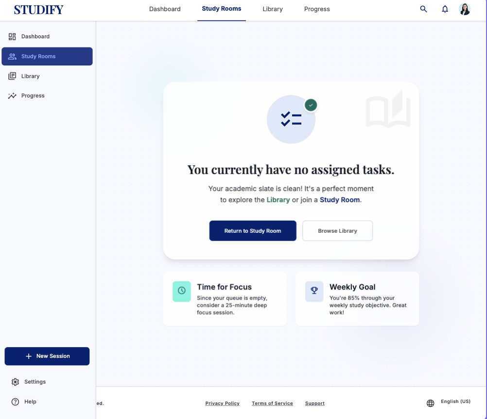
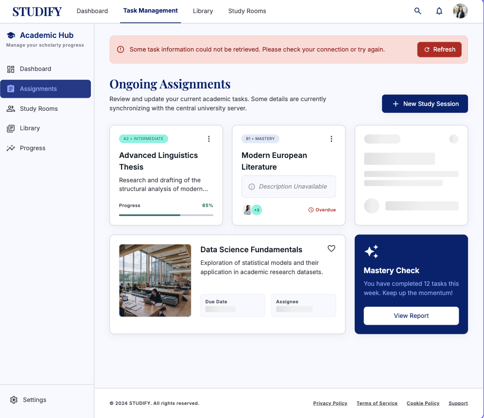
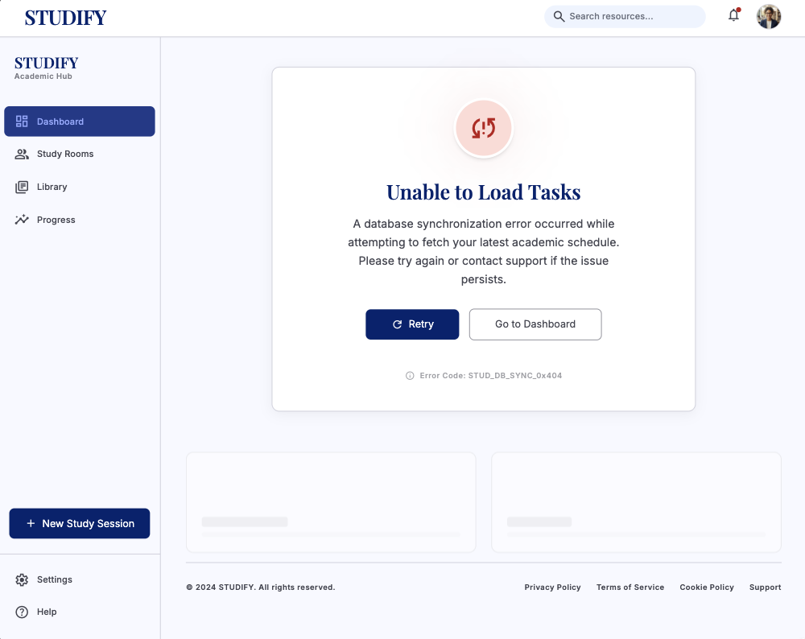

# Studify

## Use-Case Specification: View Assigned Tasks

**Version:** 1.0

---

### Revision History

| Date        | Version | Description                                                       | Author |
| :---------- | :------ | :---------------------------------------------------------------- | :----- |
| `23/Jul/26` | `1.0`   | Initial version of the View Assigned Tasks use-case specification | `Minh Thư` |

---

### Table of Contents

- [Studify](#studify)
  - [Use-Case Specification: View Assigned Tasks](#use-case-specification-view-assigned-tasks)
    - [Revision History](#revision-history)
    - [Table of Contents](#table-of-contents)
  - [1. Use-Case Name](#1-use-case-name)
    - [1.1 Brief Description](#11-brief-description)
  - [2. Flow of Events](#2-flow-of-events)
    - [2.1 Basic Flow](#21-basic-flow)
    - [2.2 Alternative Flows](#22-alternative-flows)
      - [2.2.1 No Assigned Tasks](#221-no-assigned-tasks)
      - [2.2.2 Task Information Unavailable](#222-task-information-unavailable)
      - [2.2.3 Task Retrieval Failed](#223-task-retrieval-failed)
  - [3. Special Requirements](#3-special-requirements)
    - [3.1 Security and Access Control](#31-security-and-access-control)
    - [3.2 Performance](#32-performance)
    - [3.3 Usability](#33-usability)
  - [4. Preconditions](#4-preconditions)
    - [4.1 User Authentication and Group Membership](#41-user-authentication-and-group-membership)
  - [5. Postconditions](#5-postconditions)
    - [5.1 Assigned Tasks Successfully Displayed](#51-assigned-tasks-successfully-displayed)
  - [6. Extension Points](#6-extension-points)
    - [6.1 Display Dashboard Notification Widget](#61-display-dashboard-notification-widget)

---

## 1. Use-Case Name

**View Assigned Tasks**

### 1.1 Brief Description

This use case allows a **Member** of a Virtual Study Room to view the study tasks assigned to them by the group's Leader. The system retrieves the Member's assigned tasks and displays relevant task information, including the task title, description, deadline, and current status. The Member can use this information to understand their assigned study responsibilities and track the tasks that need to be completed.

---

## 2. Flow of Events

### 2.1 Basic Flow

1. The use case begins when the **Member** selects the **View Assigned Tasks** function from the Virtual Study Room interface.

2. The system verifies the authenticated user's membership in the selected study group.

3. The system retrieves the tasks assigned to the current Member within the selected study group.

4. The system retrieves the relevant information for each assigned task, including:
   * Task title.
   * Task description.
   * Deadline.
   * Current task status.
   * Assignment information.

5. The system displays the list of assigned tasks to the Member.

6. The Member selects an assigned task to view its details.

7. The system displays the selected task's detailed information.

8. If applicable, the system displays the **Dashboard Notification Widget** to notify the Member about relevant task information, such as upcoming or overdue deadlines.
   This behavior is handled through the **Display Dashboard Notification Widget** extension point.

9.  The Member reviews the assigned task information.

10. The use case ends successfully.

---

### 2.2 Alternative Flows

#### 2.2.1 No Assigned Tasks

1. At Step 3 of the Basic Flow, the system determines that the Member has no tasks currently assigned to them.

2. The system displays a message informing the Member that there are currently no assigned tasks.

3. The system may provide an option for the Member to return to the Virtual Study Room main page.

4. The use case ends.

---

#### 2.2.2 Task Information Unavailable

1. At Step 4 of the Basic Flow, the system determines that some task information is unavailable or incomplete.

2. The system displays the available task information.

3. The system indicates that the unavailable information cannot currently be displayed.

4. The Member may refresh the task list to retrieve the latest information.

5. If the information becomes available, the system updates the displayed task information.

6. The use case continues or ends depending on the Member's action.

---

#### 2.2.3 Task Retrieval Failed

1. At Step 3 of the Basic Flow, the system fails to retrieve the Member's assigned tasks due to a system or database error.

2. The system displays an error message informing the Member that the assigned tasks could not be loaded.

3. The system does not display outdated or incomplete task information as current data.

4. The Member may retry the operation.

5. If the retry is successful, the system resumes the Basic Flow at Step 3.

6. Otherwise, the use case ends.

---

## 3. Special Requirements

### 3.1 Security and Access Control

* Only authenticated users who are Members or Leaders of the selected study group can access task information belonging to that group.
* A Member can only view tasks assigned to them through this use case.
* The system must prevent a Member from accessing private task information belonging to another study group.
* The system must ensure that task information displayed to the Member reflects the latest available data.

### 3.2 Performance

* The system should retrieve and display the assigned task list within **2 seconds** under normal operating conditions.
* Task information should be updated promptly when the Member refreshes the task list.

### 3.3 Usability

* The assigned task list must clearly display essential information such as task title, deadline, and status.
* Tasks should be presented in a clear and organized manner.
* The system should clearly indicate tasks that are approaching their deadlines or are overdue.
* The Member should be able to select a task to view its complete details.
* The system should provide a clear message when no tasks are assigned.

---

## 4. Preconditions

### 4.1 User Authentication and Group Membership

* The Member must have a valid registered account.
* The Member must be successfully authenticated and logged into the system.
* The Member must belong to an existing Virtual Study Room.
* The selected study group must contain task information accessible to the current Member.
* The system must be available and able to access the database.

---

## 5. Postconditions

### 5.1 Assigned Tasks Successfully Displayed

If the use case completes successfully:

* The Member can view the list of tasks assigned to them.
* The Member can view the details of an assigned task.
* The displayed task information includes the available task title, description, deadline, and status.
* The Member is informed about relevant upcoming or overdue task deadlines when applicable.
* No task data is modified by this use case.

If no tasks are assigned:

* The system informs the Member that no tasks are currently assigned.
* No task data is modified.

If the use case fails:

* No task data is modified.
* The system informs the Member that the task information could not be retrieved.

---

## 6. Extension Points

### 6.1 Display Dashboard Notification Widget

The extension point occurs after the system displays the assigned task list and when relevant task-related notifications are available.

The system may extend the **View Assigned Tasks** use case by displaying the **Dashboard Notification Widget** to notify the Member about important task information, such as newly assigned tasks, upcoming deadlines, or overdue tasks. The notification widget does not prevent the Member from viewing their assigned tasks and is only displayed when relevant notification conditions are met.
