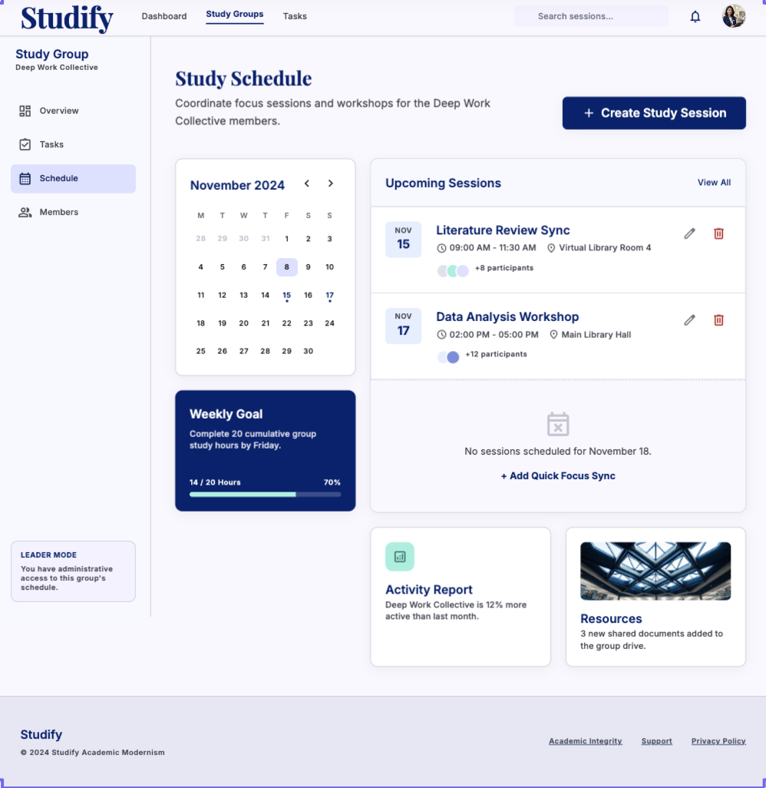
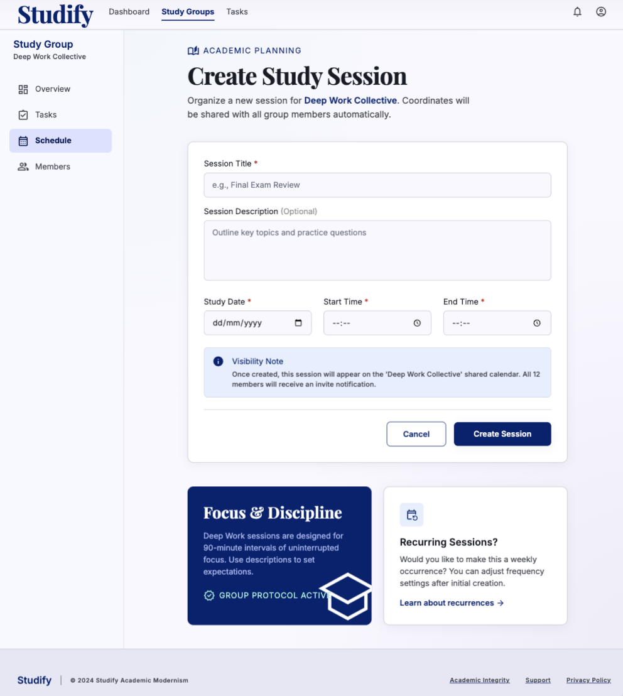
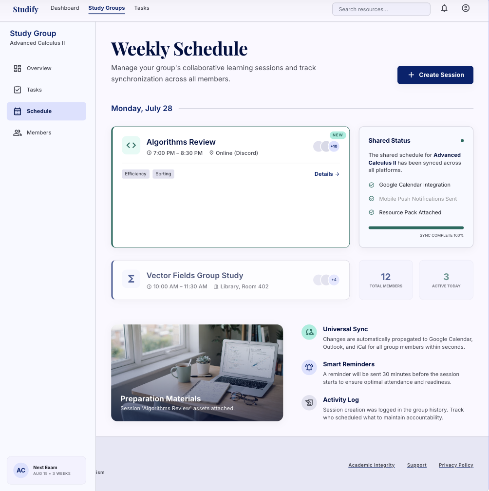
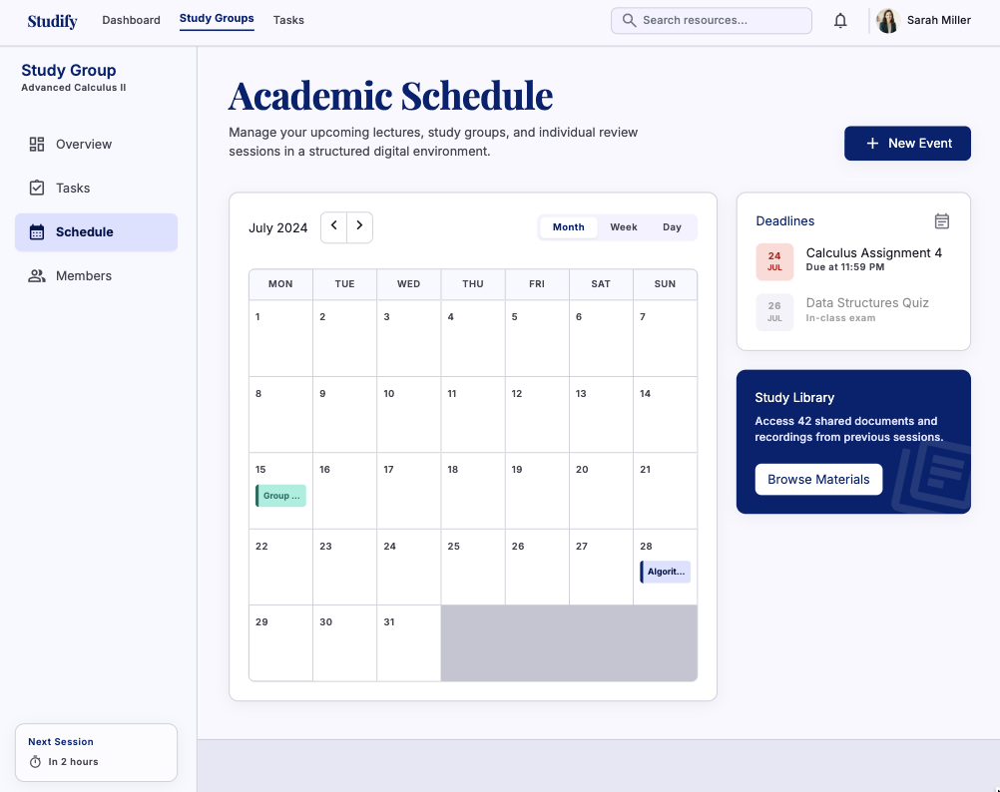
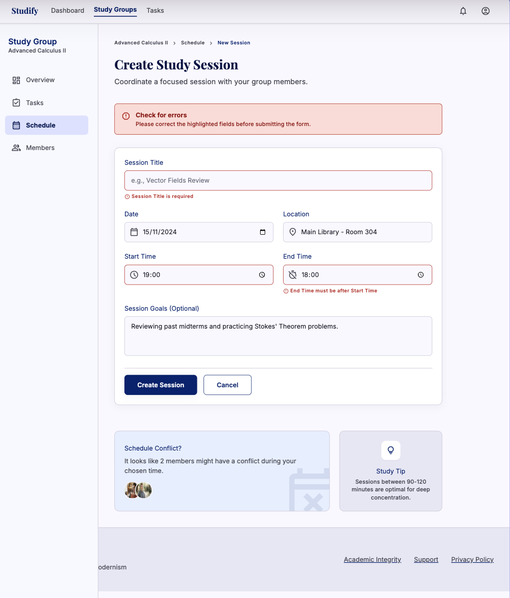
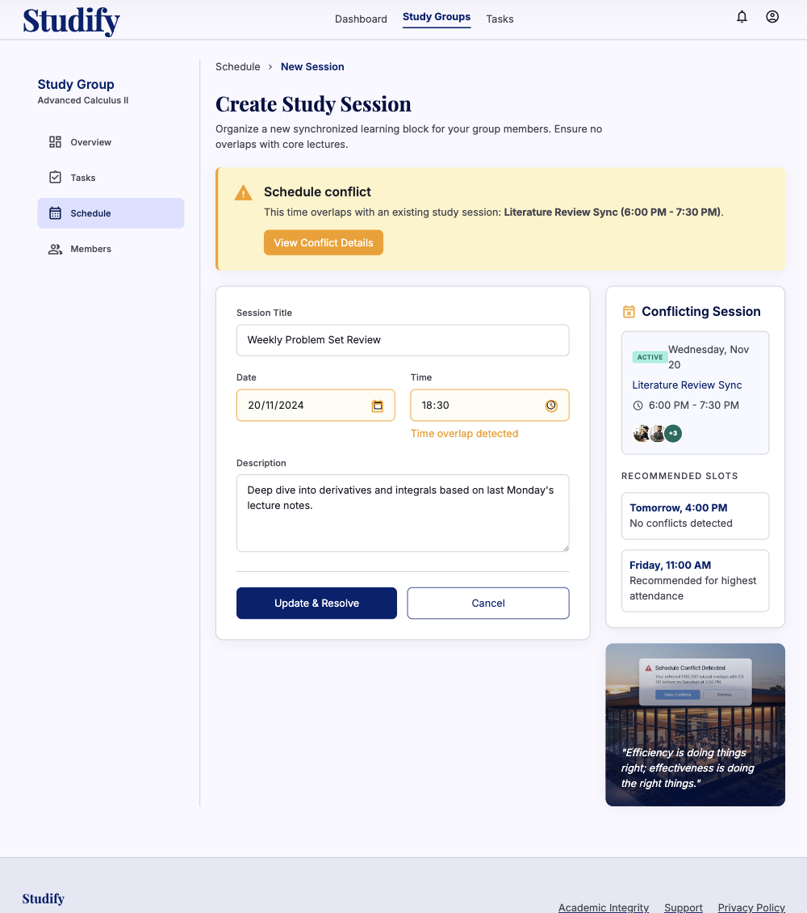
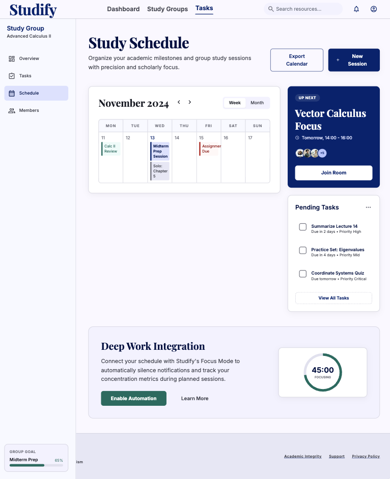
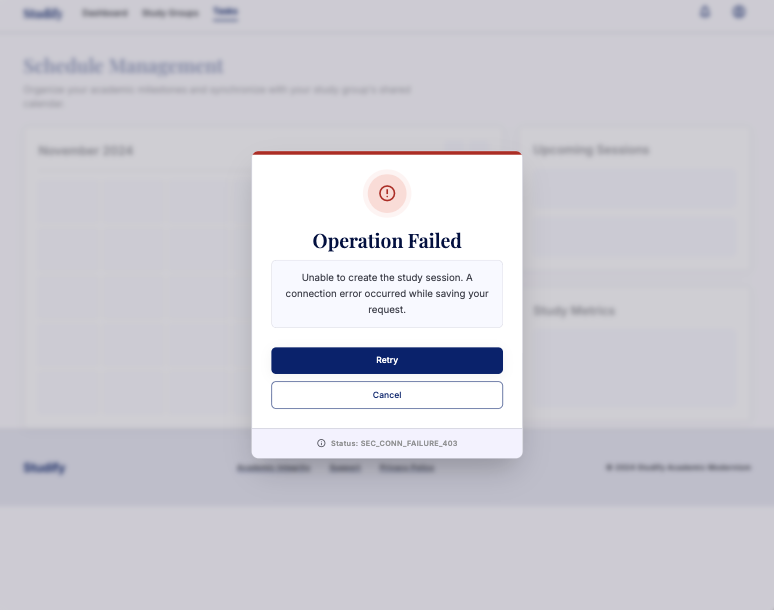

# Studify

## Use-Case Specification: Manage Study Schedule

**Version:** 1.0

---

### Revision History

| Date        | Version | Description                                                         | Author |
| :---------- | :------ | :------------------------------------------------------------------ | :----- |
| `23/Jul/26` | `1.0`   | Initial version of the Manage Study Schedule use-case specification | `Minh Thư` |

---

### Table of Contents

- [Studify](#studify)
  - [Use-Case Specification: Manage Study Schedule](#use-case-specification-manage-study-schedule)
    - [Revision History](#revision-history)
    - [Table of Contents](#table-of-contents)
  - [1. Use-Case Name](#1-use-case-name)
    - [1.1 Brief Description](#11-brief-description)
  - [2. Flow of Events](#2-flow-of-events)
    - [2.1 Basic Flow](#21-basic-flow)
    - [2.2 Alternative Flows](#22-alternative-flows)
      - [2.2.1 Invalid Schedule Information](#221-invalid-schedule-information)
      - [2.2.2 Schedule Conflict](#222-schedule-conflict)
      - [2.2.3 Schedule Management Cancelled](#223-schedule-management-cancelled)
      - [2.2.4 Schedule Management Operation Failed](#224-schedule-management-operation-failed)
  - [3. Special Requirements](#3-special-requirements)
    - [3.1 Security and Access Control](#31-security-and-access-control)
    - [3.2 Performance](#32-performance)
    - [3.3 Usability](#33-usability)
  - [4. Preconditions](#4-preconditions)
    - [4.1 Leader Authentication and Group Membership](#41-leader-authentication-and-group-membership)
  - [5. Postconditions](#5-postconditions)
    - [5.1 Study Schedule Successfully Created](#51-study-schedule-successfully-created)
  - [6. Extension Points](#6-extension-points)
    - [6.1 Notify Group Members of Schedule Changes](#61-notify-group-members-of-schedule-changes)

---

## 1. Use-Case Name

**Manage Study Schedule**

### 1.1 Brief Description

This use case allows the **Leader** of a Virtual Study Room to create and manage a shared study schedule for the group. The Leader can create a study session by specifying relevant information such as the session title, date, start time, end time, and optional description. The system validates the schedule information, checks for scheduling conflicts, stores the study schedule, and makes the updated schedule available to the group's Members.

---

## 2. Flow of Events

### 2.1 Basic Flow

1. The use case begins when the **Leader** selects the **Manage Study Schedule** function from the Virtual Study Room interface.

2. The system verifies that the authenticated user has the **Leader** role in the selected study group.

3. The system displays the study schedule management interface, including existing study sessions and available schedule management actions.

4. The Leader selects the option to create a new study session.

5. The system displays the study schedule creation form.

6. The Leader enters the study session information, including:

   * Session title.
   * Session description (optional).
   * Study date.
   * Start time.
   * End time.

7. The Leader submits the study schedule information.

8. The system validates the provided schedule information.

9.  The system checks whether the specified study date and time are valid and whether the new study session conflicts with an existing scheduled session in the same study group.

10. If the schedule information is valid and no conflict exists, the system creates and stores the new study session.

11. The system updates the shared study schedule of the study group.

12. The system displays a success notification to the Leader.

13. The updated study schedule becomes available for the group's Members to view.

14. The system may notify the group Members about the newly created study session.

15. The use case ends successfully.

---

### 2.2 Alternative Flows

#### 2.2.1 Invalid Schedule Information

1. At Step 8 of the Basic Flow, the system determines that one or more required schedule fields are missing or invalid.

2. The system displays an appropriate validation message identifying the invalid information.

3. The Leader corrects the schedule information.

4. The Leader submits the schedule information again.

5. The system validates the updated information.

6. If all information is valid, the system resumes the Basic Flow at Step 9.

---

#### 2.2.2 Schedule Conflict

1. At Step 9 of the Basic Flow, the system determines that the new study session overlaps with an existing study session in the same study group.

2. The system displays a notification informing the Leader about the scheduling conflict.

3. The Leader modifies the study date or time.

4. The Leader submits the updated schedule information.

5. The system checks the updated schedule for conflicts again.

6. If no conflict exists, the system resumes the Basic Flow at Step 10.

---

#### 2.2.3 Schedule Management Cancelled

1. Before the new study session is successfully created, the Leader selects the **Cancel** option.

2. The system cancels the schedule creation operation.

3. The system does not create or store the new study session.

4. The system returns the Leader to the study schedule management interface.

5. The use case ends.

---

#### 2.2.4 Schedule Management Operation Failed

1. At Step 10 or Step 11 of the Basic Flow, the system encounters an error while creating, storing, or updating the study schedule.

2. The system displays an error message informing the Leader that the schedule management operation could not be completed.

3. The system ensures that no incomplete or duplicate study session is stored.

4. The Leader may retry the schedule creation operation.

5. If the retry is successful, the system resumes the Basic Flow at Step 10.

6. Otherwise, the use case ends.

---

## 3. Special Requirements

### 3.1 Security and Access Control

* Only the **Leader** of the study group can create or modify the shared study schedule through this use case.
* The system must verify the Leader's role before allowing schedule management operations.
* The schedule must only be associated with the study group selected by the Leader.
* Members can view the shared study schedule but cannot modify it through this use case.

### 3.2 Performance

* The system should complete the creation or update of a study schedule within **2 seconds** under normal operating conditions.
* The updated study schedule should be immediately available to group Members after successful creation.

### 3.3 Usability

* The schedule creation form must clearly identify required and optional fields.
* The system must provide clear validation messages for invalid dates or times.
* The system must clearly indicate scheduling conflicts.
* The study schedule should be presented in an organized format that allows group Members to easily understand upcoming study sessions.
* Date and time information should be displayed consistently using the system's configured time zone and date format.

---

## 4. Preconditions

### 4.1 Leader Authentication and Group Membership

* The Leader must have a valid registered account.
* The Leader must be successfully authenticated and logged into the system.
* The Leader must belong to an existing Virtual Study Room.
* The authenticated user must have the **Leader** role in the selected study group.
* The system must be available and able to access the database.

---

## 5. Postconditions

### 5.1 Study Schedule Successfully Created

If the use case completes successfully:

* A new study session is created and stored in the system.
* The study session is associated with the selected study group.
* The study session contains the specified title, description, date, start time, and end time.
* The shared study schedule is updated.
* The group's Members can view the newly created study session.
* The group Members may be notified about the newly created study session.

If the use case is cancelled or fails:

* No incomplete or duplicate study session is stored.
* The existing study schedule remains unchanged.
* No notification is sent for an unsuccessful schedule creation operation.

---

## 6. Extension Points

### 6.1 Notify Group Members of Schedule Changes

The extension point occurs after a new study session has been successfully created or an existing study schedule has been modified.

The system may extend the **Manage Study Schedule** use case by notifying the group's Members about the newly created or updated study session. The notification may contain relevant information such as the session title, study date, start time, and end time. The notification behavior does not prevent the Leader from completing the schedule management operation.
