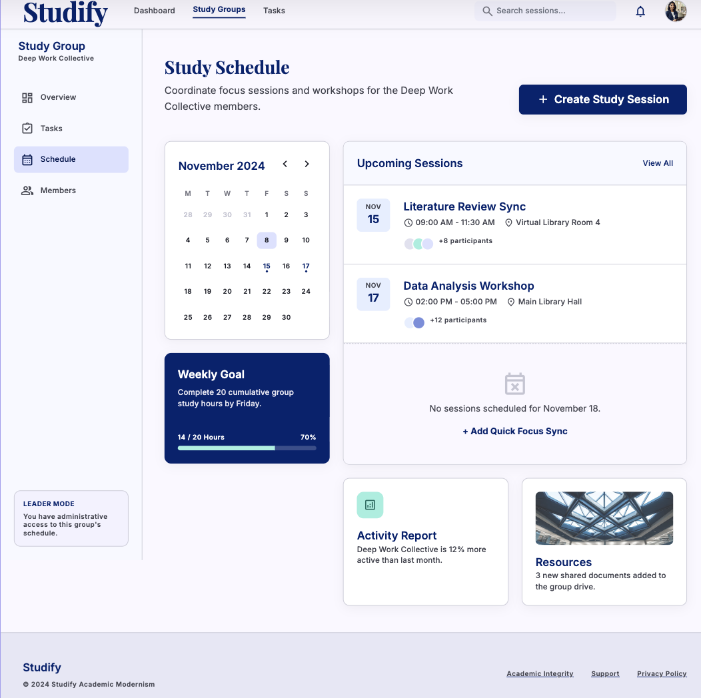
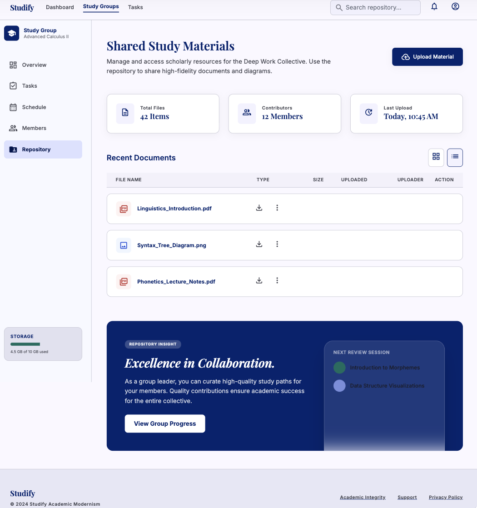
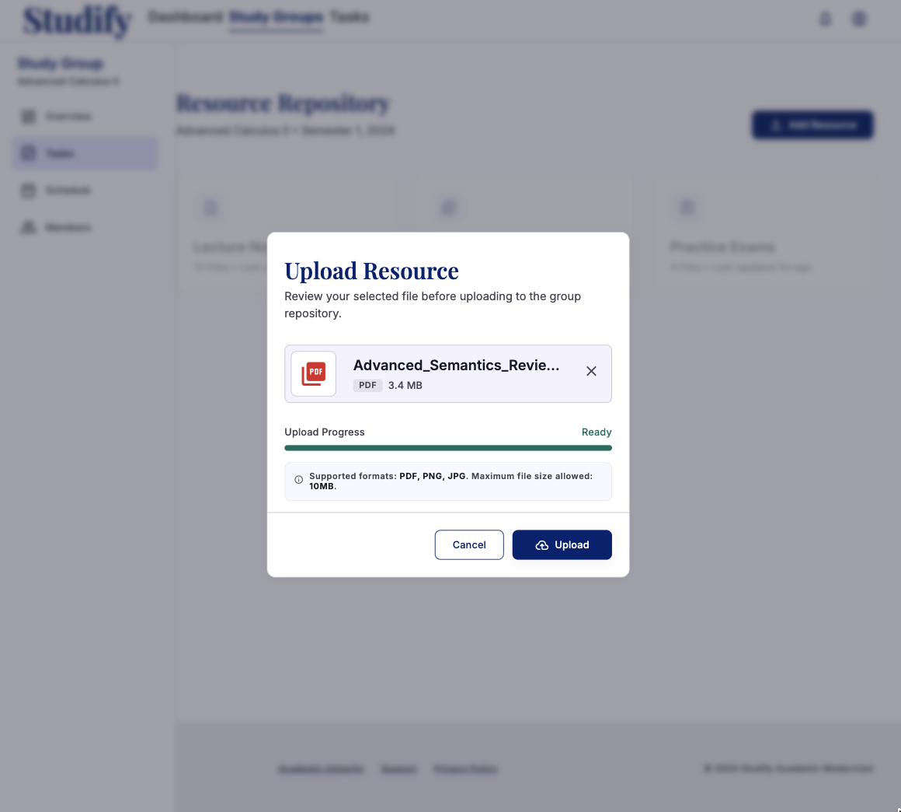
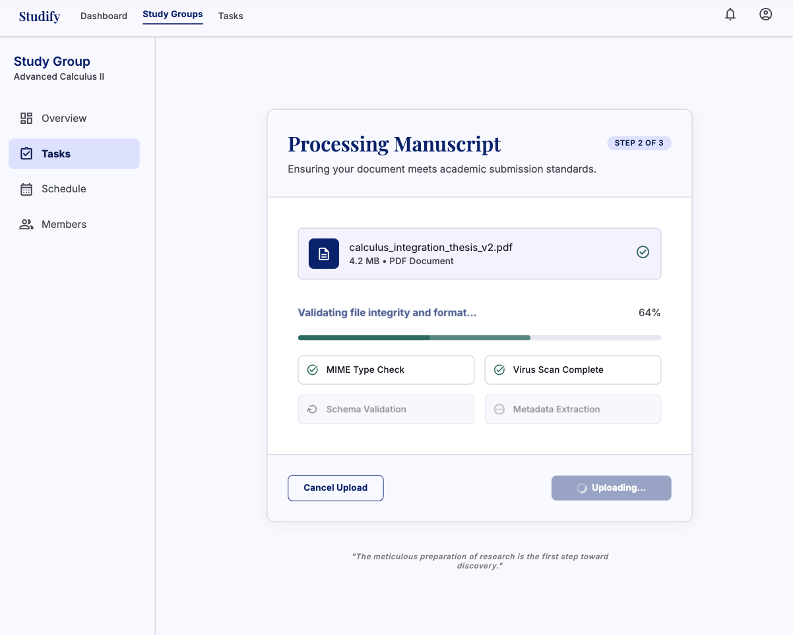
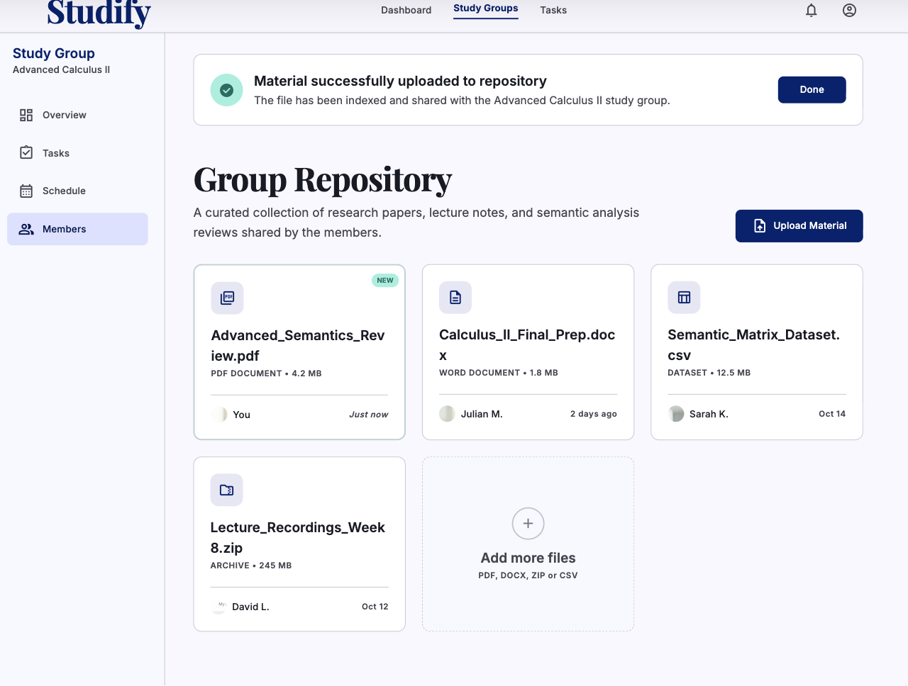
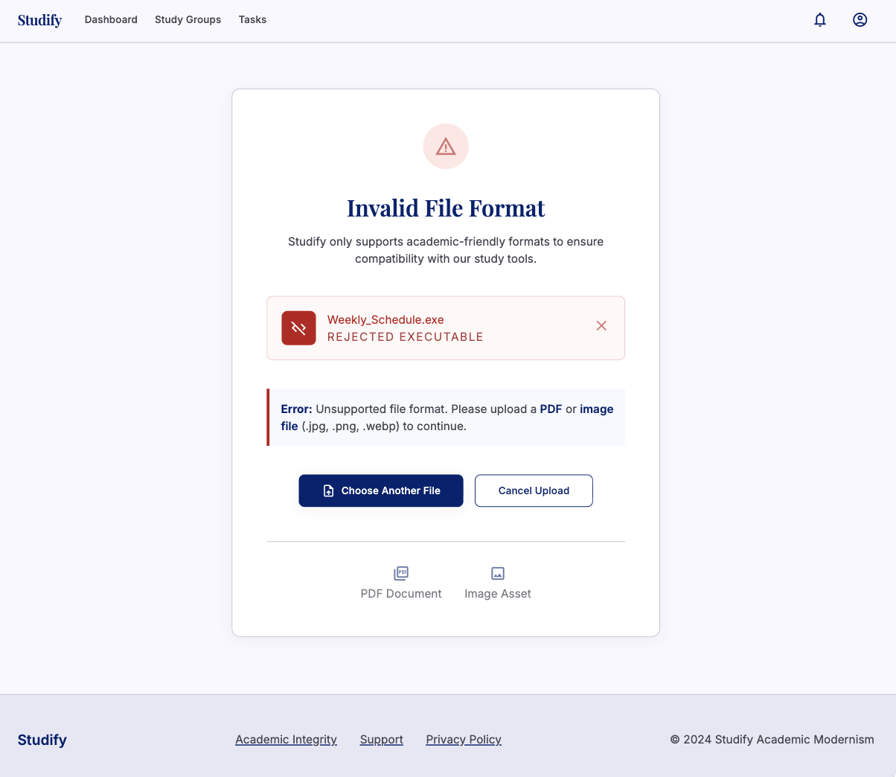
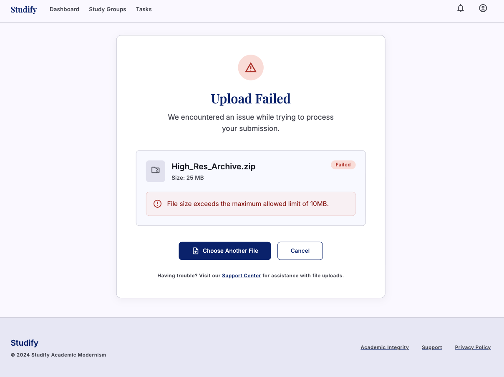
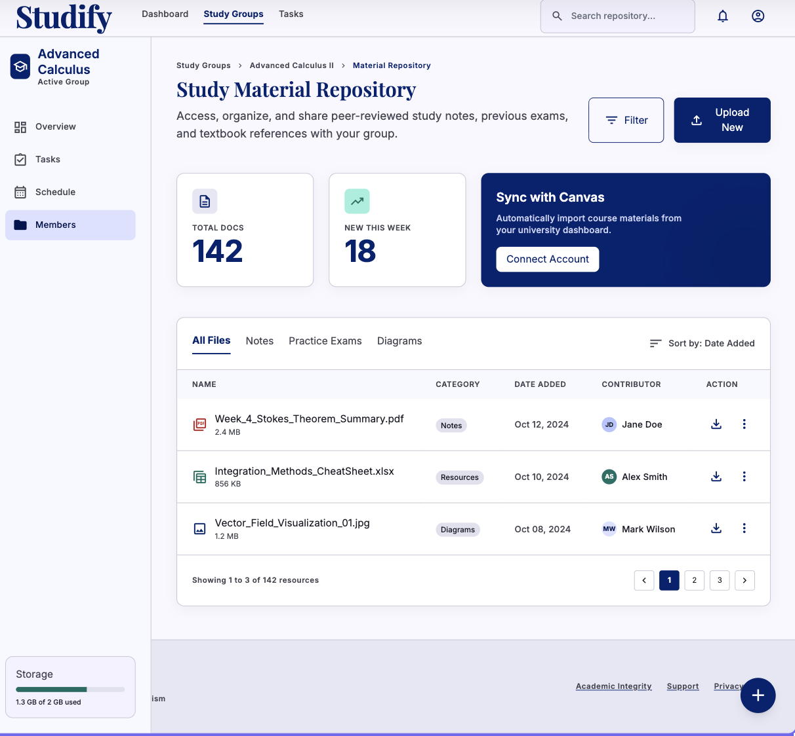
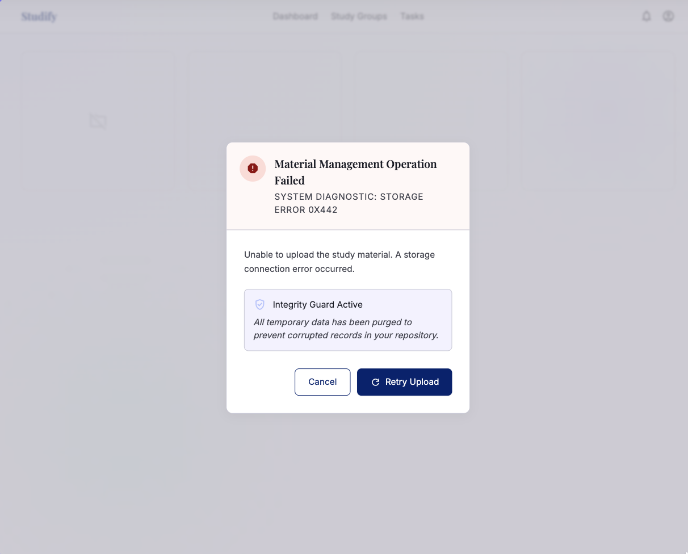

# Studify

## Use-Case Specification: Manage Study Material

**Version:** 1.0

---

### Revision History

| Date        | Version | Description                                                         | Author |
| :---------- | :------ | :------------------------------------------------------------------ | :----- |
| `23/Jul/26` | `1.0`   | Initial version of the Manage Study Material use-case specification | `Minh Thư` |

---

### Table of Contents

- [Studify](#studify)
  - [Use-Case Specification: Manage Study Material](#use-case-specification-manage-study-material)
    - [Revision History](#revision-history)
    - [Table of Contents](#table-of-contents)
  - [1. Use-Case Name](#1-use-case-name)
    - [1.1 Brief Description](#11-brief-description)
  - [2. Flow of Events](#2-flow-of-events)
    - [2.1 Basic Flow](#21-basic-flow)
    - [2.2 Alternative Flows](#22-alternative-flows)
      - [2.2.1 Invalid File Format](#221-invalid-file-format)
      - [2.2.2 Invalid File or File Size Exceeded](#222-invalid-file-or-file-size-exceeded)
      - [2.2.3 Upload Cancelled](#223-upload-cancelled)
      - [2.2.4 Material Management Operation Failed](#224-material-management-operation-failed)
  - [3. Special Requirements](#3-special-requirements)
    - [3.1 Security and Access Control](#31-security-and-access-control)
    - [3.2 Performance](#32-performance)
    - [3.3 Usability](#33-usability)
  - [4. Preconditions](#4-preconditions)
    - [4.1 Leader Authentication and Group Membership](#41-leader-authentication-and-group-membership)
  - [5. Postconditions](#5-postconditions)
    - [5.1 Study Material Successfully Uploaded](#51-study-material-successfully-uploaded)
  - [6. Extension Points](#6-extension-points)
    - [6.1 Validate File Format](#61-validate-file-format)

---

## 1. Use-Case Name

**Manage Study Material**

### 1.1 Brief Description

This use case allows the **Leader** of a Virtual Study Room to manage shared study materials for the group. The Leader can upload study materials in supported formats, such as PDF and image files, to the group's shared repository. The system validates the uploaded file, stores the material, and makes it available to the group's Members for viewing and downloading. The file validation process is handled through the included **Validate File Format** use case.

---

## 2. Flow of Events

### 2.1 Basic Flow

1. The use case begins when the **Leader** selects the **Manage Study Material** function from the Virtual Study Room interface.

2. The system verifies that the authenticated user has the **Leader** role in the selected study group.

3. The system displays the shared study material repository and available material management actions.

4. The Leader selects the option to upload a new study material.

5. The system displays the file upload interface.

6. The Leader selects a study material file from their device.

7. The Leader submits the selected file for upload.

8. The system invokes the **Validate File Format** included use case.

9.  The system validates that the uploaded file is in a supported format, such as **PDF or image**.

10. The system validates the uploaded file's basic properties, such as file integrity and file size.

11. If the file passes validation, the system uploads and stores the study material in the selected study group's shared repository.

12. The system associates the uploaded material with the current study group and the Leader who uploaded it.

13. The system updates the shared study material repository.

14. The system displays a success notification to the Leader.

15. The uploaded study material becomes available to authorized group users through the **View & Download Materials** use case.

16. The use case ends successfully.

---

### 2.2 Alternative Flows

#### 2.2.1 Invalid File Format

1. At Step 9 of the Basic Flow, the system determines that the uploaded file format is not supported.

2. The system rejects the uploaded file.

3. The system displays an error message informing the Leader that only supported file formats, such as PDF or image files, can be uploaded.

4. The Leader selects another file.

5. The system validates the newly selected file.

6. If the file format is valid, the system resumes the Basic Flow at Step 11.

---

#### 2.2.2 Invalid File or File Size Exceeded

1. At Step 10 of the Basic Flow, the system determines that the uploaded file is corrupted, invalid, or exceeds the maximum allowed file size.

2. The system rejects the uploaded file.

3. The system displays an appropriate error message informing the Leader about the upload problem.

4. The Leader selects another valid file or chooses to cancel the upload operation.

5. If the Leader selects another file, the system resumes the Basic Flow at Step 8.

6. If the Leader cancels the operation, the use case ends.

---

#### 2.2.3 Upload Cancelled

1. Before the file is successfully uploaded, the Leader selects the **Cancel** option.

2. The system cancels the upload operation.

3. The system does not store the selected file in the study group's repository.

4. The system returns the Leader to the shared study material repository.

5. The use case ends.

---

#### 2.2.4 Material Management Operation Failed

1. At Step 11 or Step 13 of the Basic Flow, the system encounters an error while uploading, storing, or updating the study material repository.

2. The system displays an error message informing the Leader that the study material could not be uploaded.

3. The system ensures that no incomplete or corrupted material record is stored in the repository.

4. The Leader may retry the upload operation.

5. If the retry is successful, the system resumes the Basic Flow at Step 11.

6. Otherwise, the use case ends.

---

## 3. Special Requirements

### 3.1 Security and Access Control

* Only the **Leader** of the study group can upload or manage study materials through this use case.
* The system must verify the Leader's role before allowing material management operations.
* Uploaded study materials must only be associated with the study group selected by the Leader.
* Only authorized users who belong to the study group can access shared study materials.
* The system must validate uploaded files before storing them in the repository.
* The system should prevent potentially unsafe or unsupported file types from being uploaded.

### 3.2 Performance

* The system should begin processing the uploaded file immediately after submission.
* The system should provide clear upload status feedback to the Leader.
* After a successful upload, the new material should become available in the shared repository without unnecessary delay.

### 3.3 Usability

* The file upload interface must clearly indicate supported file formats.
* The system must clearly display file validation and upload errors.
* The system should display the uploaded material's filename and upload status.
* The shared material repository should present uploaded materials in an organized and easily accessible manner.
* The Leader should receive clear confirmation after a material is successfully uploaded.

---

## 4. Preconditions

### 4.1 Leader Authentication and Group Membership

* The Leader must have a valid registered account.
* The Leader must be successfully authenticated and logged into the system.
* The Leader must belong to an existing Virtual Study Room.
* The authenticated user must have the **Leader** role in the selected study group.
* The shared study material repository must be available.
* The system must be available and able to access the file storage system and database.

---

## 5. Postconditions

### 5.1 Study Material Successfully Uploaded

If the use case completes successfully:

* A new study material is uploaded and stored in the shared repository.
* The uploaded material is associated with the selected study group.
* The uploaded material is associated with the Leader who uploaded it.
* The material appears in the group's shared study material repository.
* Authorized group users can view and download the material through the **View & Download Materials** use case.

If the use case is cancelled or fails:

* The invalid or cancelled file is not stored in the study material repository.
* No incomplete or corrupted material record is created.
* Existing study materials remain unchanged.

---

## 6. Extension Points

### 6.1 Validate File Format

The extension point occurs after the Leader submits a study material file for upload and before the system stores the file in the shared study material repository.

The system invokes the **Validate File Format** included use case to verify that the uploaded file uses a supported format, such as PDF or image. The system also verifies basic file properties before allowing the upload to proceed. If the file is valid, the **Manage Study Material** use case continues with storing the material. If the file is invalid, the system triggers the appropriate Alternative Flow and rejects the upload.
