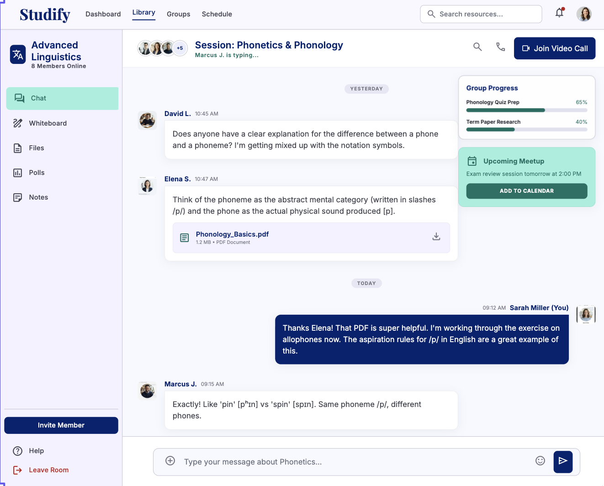
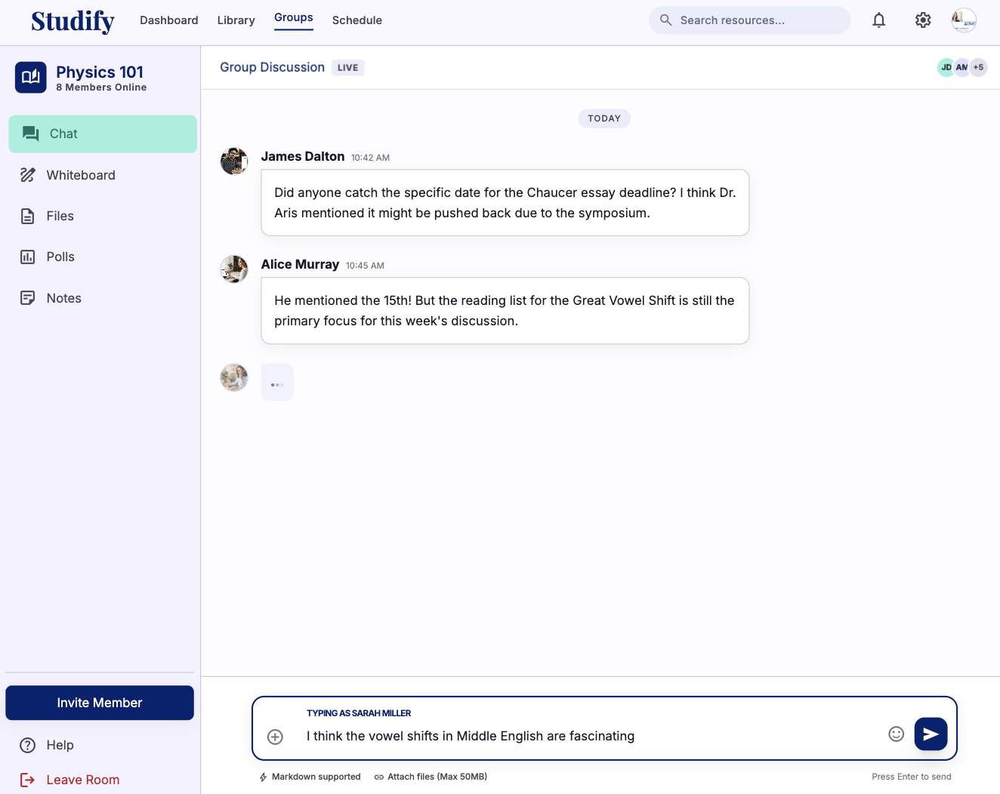
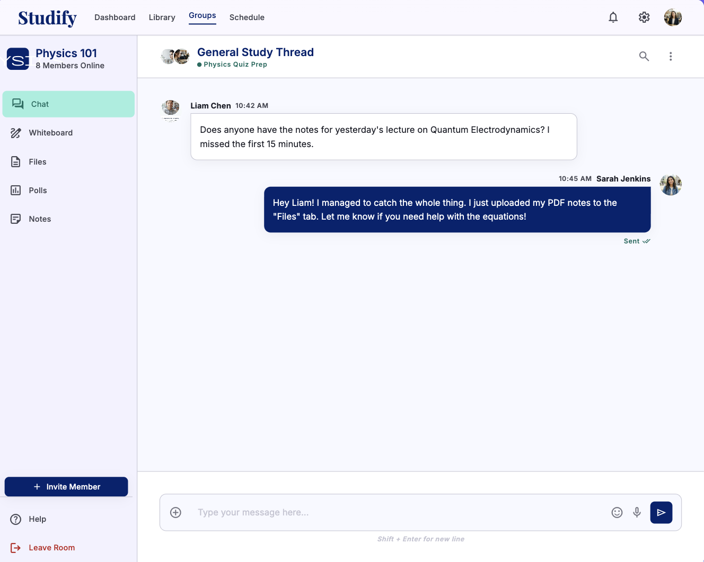
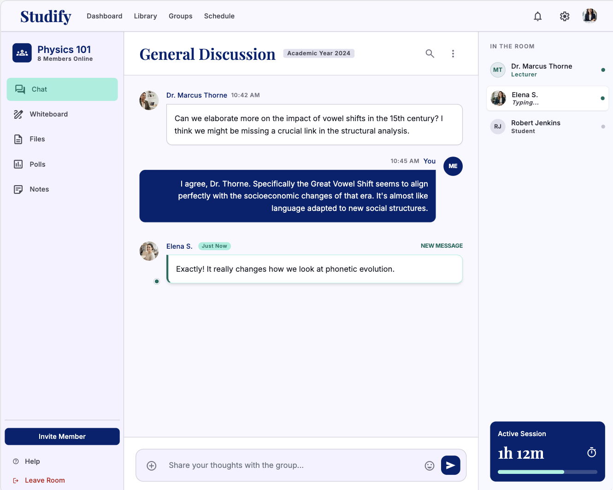
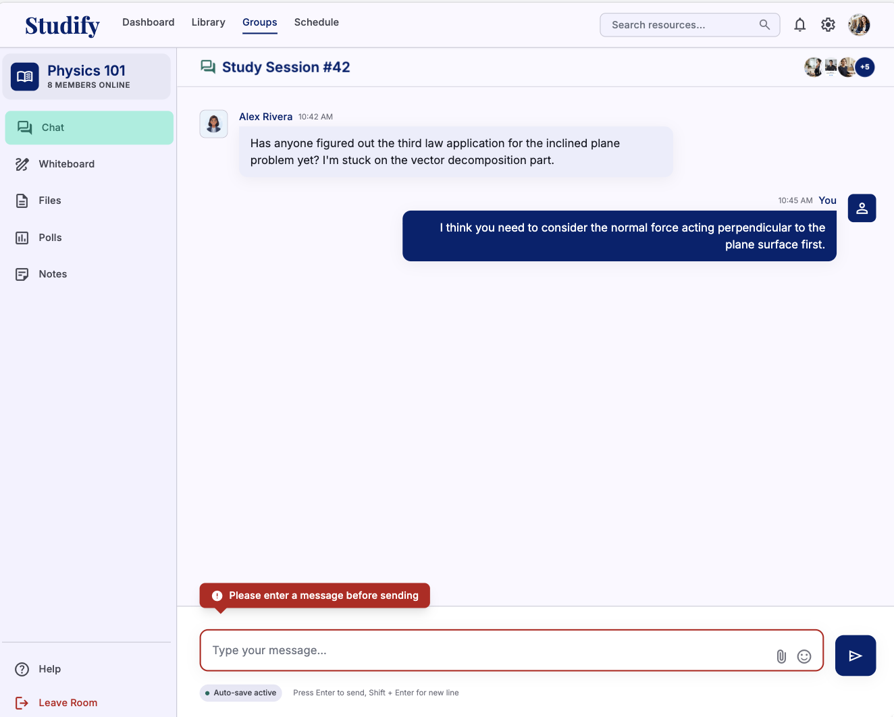
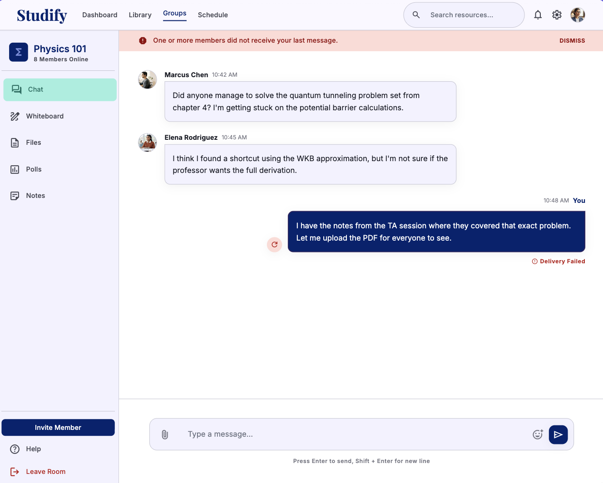
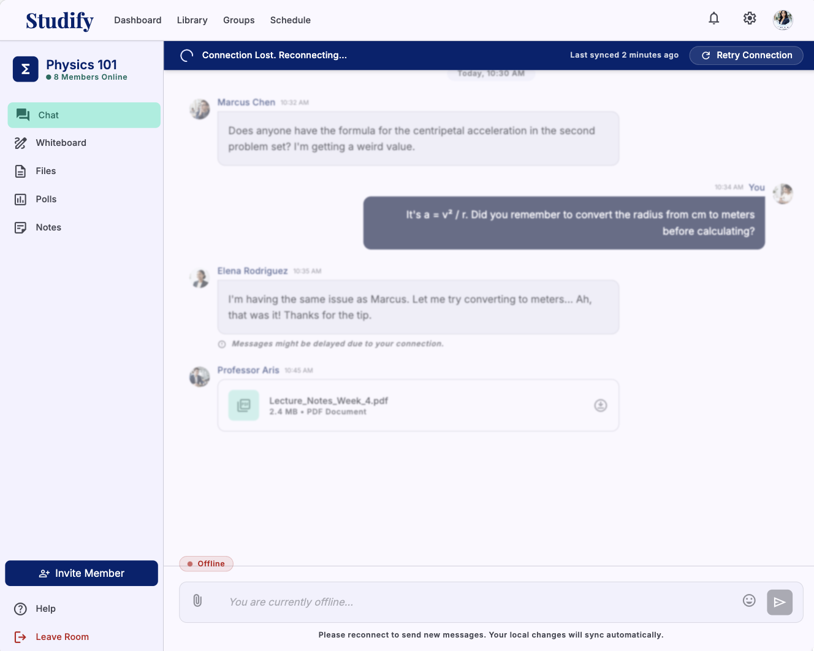
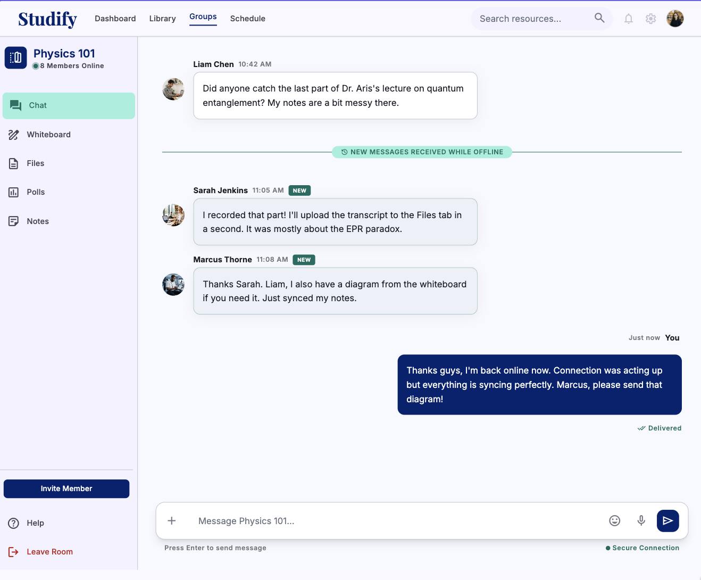
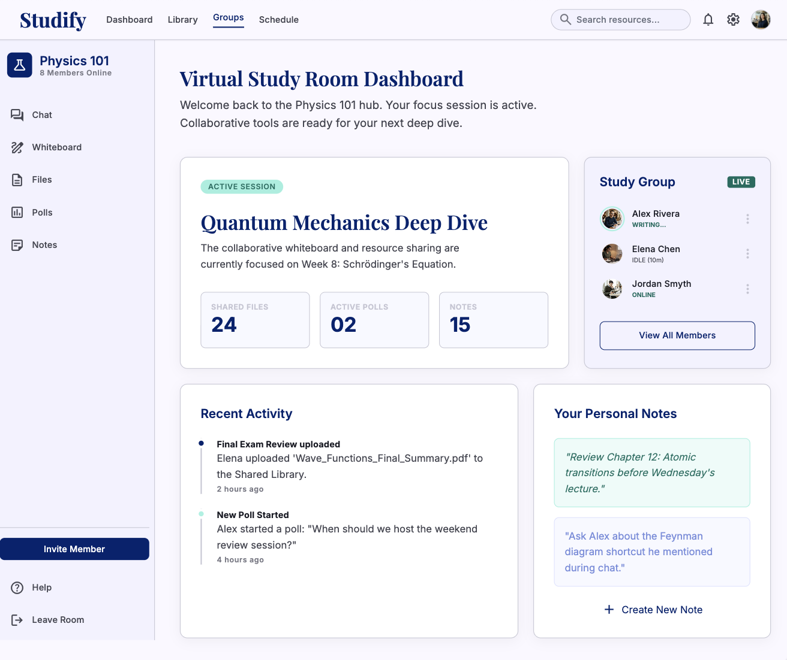

# Studify

## Use-Case Specification: Discuss via Group Chat (Real-time)

**Version:** 1.0

---

### Revision History

| Date        | Version | Description                                                                      | Author |
| :---------- | :------ | :------------------------------------------------------------------------------- | :----- |
| `23/Jul/26` | `1.0`   | Initial version of the Discuss via Group Chat (Real-time) use-case specification | `Minh Thư` |

---

### Table of Contents

- [Studify](#studify)
  - [Use-Case Specification: Discuss via Group Chat (Real-time)](#use-case-specification-discuss-via-group-chat-real-time)
    - [Revision History](#revision-history)
    - [Table of Contents](#table-of-contents)
  - [1. Use-Case Name](#1-use-case-name)
    - [1.1 Brief Description](#11-brief-description)
  - [2. Flow of Events](#2-flow-of-events)
    - [2.1 Basic Flow](#21-basic-flow)
    - [2.2 Alternative Flows](#22-alternative-flows)
      - [2.2.1 Empty or Invalid Message](#221-empty-or-invalid-message)
      - [2.2.2 Message Delivery Failed](#222-message-delivery-failed)
      - [2.2.3 Real-time Connection Lost](#223-real-time-connection-lost)
      - [2.2.4 User Leaves the Group Chat](#224-user-leaves-the-group-chat)
  - [3. Special Requirements](#3-special-requirements)
    - [3.1 Security and Access Control](#31-security-and-access-control)
    - [3.2 Performance](#32-performance)
    - [3.3 Usability](#33-usability)
    - [3.4 Real-time Communication](#34-real-time-communication)
  - [4. Preconditions](#4-preconditions)
    - [4.1 User Authentication and Group Membership](#41-user-authentication-and-group-membership)
  - [5. Postconditions](#5-postconditions)
    - [5.1 Message Successfully Sent and Received](#51-message-successfully-sent-and-received)
  - [6. Extension Points](#6-extension-points)
    - [6.1 Receive Real-time Message](#61-receive-real-time-message)

---

## 1. Use-Case Name

**Discuss via Group Chat (Real-time)**

### 1.1 Brief Description

This use case allows authenticated members of a Virtual Study Room, including the **Leader** and **Members**, to communicate and discuss study-related topics through a real-time group chat. Users can send text messages to the group, and the system delivers newly sent messages to other active group members in real time. The system also stores chat messages so that authorized group members can access the conversation history.

---

## 2. Flow of Events

### 2.1 Basic Flow

1. The use case begins when the **System User** selects the **Group Chat** function from the Virtual Study Room interface.

2. The system verifies that the authenticated user belongs to the selected study group.

3. The system establishes a real-time connection between the System User and the group chat service.

4. The system retrieves and displays the available group chat interface and recent chat messages.

5. The System User enters a text message into the message input field.

6. The System User submits the message.

7. The system validates the message content.

8. The system associates the message with:

   * The authenticated user who sent the message.
   * The selected study group.
   * The message timestamp.

9. The system stores the message in the group's chat history.

10. The system delivers the new message to the active members of the study group through the real-time communication channel.

11. The system displays the newly sent message in the sender's chat interface.

12. Other active group members receive and see the new message in their group chat interface in real time.

13. The System User can continue sending additional messages or viewing messages received from other group members.

14. The use case continues until the System User leaves the group chat or closes the group chat interface.

15. The use case ends.

---

### 2.2 Alternative Flows

#### 2.2.1 Empty or Invalid Message

1. At Step 7 of the Basic Flow, the system determines that the message is empty or does not satisfy the system's message validation rules.

2. The system does not send or store the invalid message.

3. The system displays an appropriate validation message to the System User.

4. The System User modifies the message content.

5. The System User submits the message again.

6. If the message is valid, the system resumes the Basic Flow at Step 8.

---

#### 2.2.2 Message Delivery Failed

1. At Step 10 of the Basic Flow, the system fails to deliver the message to one or more active group members.

2. The system retains the message in the chat history if it has been successfully stored.

3. The system attempts to deliver the message again when the recipient's real-time connection becomes available.

4. The System User is informed if the message cannot be delivered immediately.

5. The use case continues.

---

#### 2.2.3 Real-time Connection Lost

1. During the group chat session, the system detects that the System User's real-time connection has been interrupted.

2. The system displays a notification indicating that the real-time connection has been lost.

3. The system attempts to reconnect the System User to the group chat service automatically.

4. If the connection is successfully restored, the system synchronizes any messages that were sent during the interruption.

5. The system resumes real-time communication.

6. If the connection cannot be restored, the System User may retry the connection or leave the group chat.

7. The use case ends if the System User leaves the group chat.

---

#### 2.2.4 User Leaves the Group Chat

1. The System User selects the option to leave or close the group chat interface.

2. The system closes the user's active real-time chat connection.

3. The System User can no longer receive new messages in real time until they reopen the group chat.

4. Previously stored chat messages remain available to authorized group members.

5. The use case ends.

---

## 3. Special Requirements

### 3.1 Security and Access Control

* Only authenticated users who belong to the selected study group can access the group's chat.
* The system must prevent users who are not members of the study group from viewing or sending messages in the group's chat.
* Each message must be associated with the authenticated user who sent it.
* Chat messages must only be accessible to authorized members of the corresponding study group.
* The system should protect chat communication and stored messages from unauthorized access.

### 3.2 Performance

* New messages should be delivered to active group members with minimal delay.
* The system should support real-time communication for study groups containing **2–5 members**.
* The chat interface should remain responsive while messages are being sent and received.

### 3.3 Usability

* The group chat interface must clearly display the sender, message content, and timestamp.
* The message input field must be easily accessible.
* The system should provide clear feedback when a message is successfully sent.
* The system should clearly notify users when the real-time connection is lost.
* The system should automatically attempt to reconnect after a temporary connection failure.

### 3.4 Real-time Communication

* The system must support real-time message delivery between active members of the same study group.
* Newly received messages should appear in the chat interface without requiring the user to manually refresh the page.
* The system should maintain message ordering based on the server-side message timestamp.
* Messages sent while a user is temporarily disconnected should be synchronized when the connection is successfully restored, where applicable.

---

## 4. Preconditions

### 4.1 User Authentication and Group Membership

* The System User must have a valid registered account.
* The System User must be successfully authenticated and logged into the system.
* The System User must belong to an existing Virtual Study Room.
* The System User must have permission to access the selected study group's chat.
* The system must be available and able to access the chat service and database.
* The real-time communication service must be available for establishing a chat connection.

---

## 5. Postconditions

### 5.1 Message Successfully Sent and Received

If the use case completes successfully:

* The System User can access the group chat.
* A valid message sent by the System User is stored in the group's chat history.
* The message is associated with the correct sender and study group.
* Active members of the study group receive the message in real time.
* The message remains available in the group's chat history for authorized members.

If the use case is terminated due to a connection failure or the System User leaving the chat:

* Previously stored messages remain unchanged.
* The System User's real-time chat connection is closed.
* The System User can reconnect to the group chat later.

---

## 6. Extension Points

### 6.1 Receive Real-time Message

The extension point occurs when another active member of the study group sends a new message while the System User is connected to the group chat.

The system extends the **Discuss via Group Chat (Real-time)** use case by receiving the new message from the real-time communication service and displaying it in the System User's chat interface without requiring a manual page refresh. The received message is also stored in the group's chat history and remains available to authorized group members.