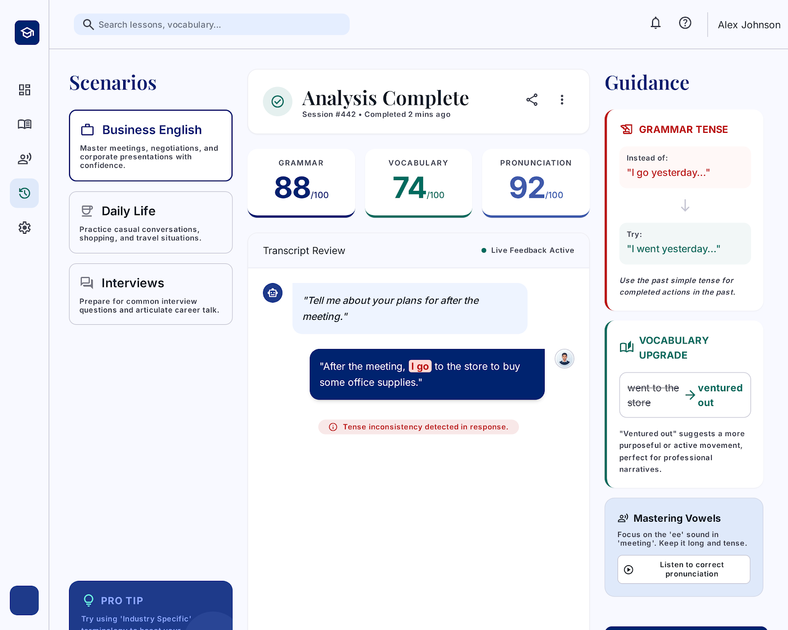
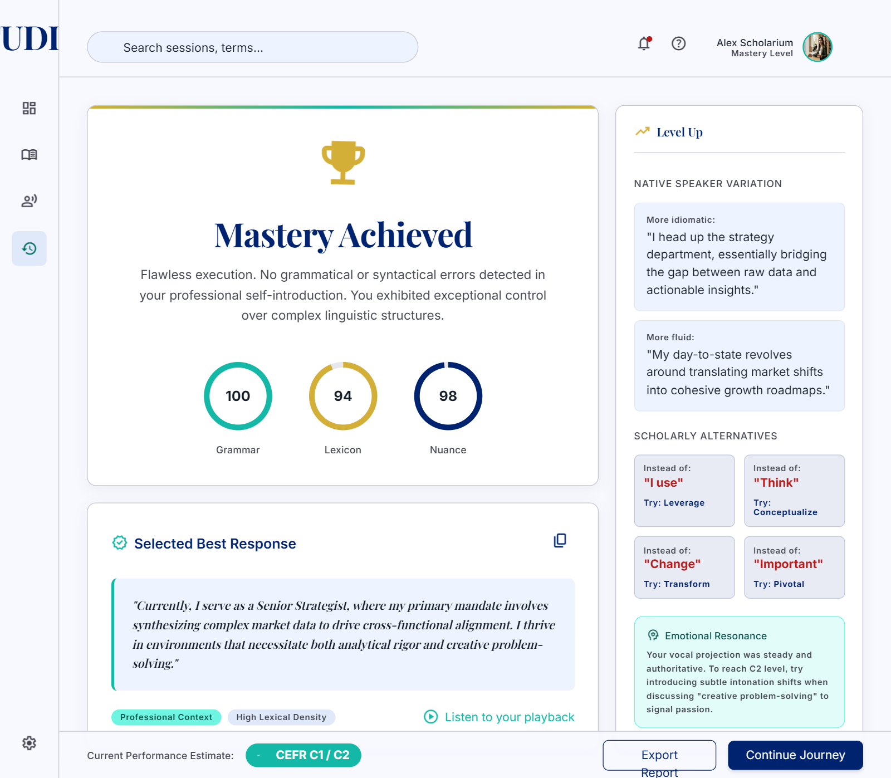
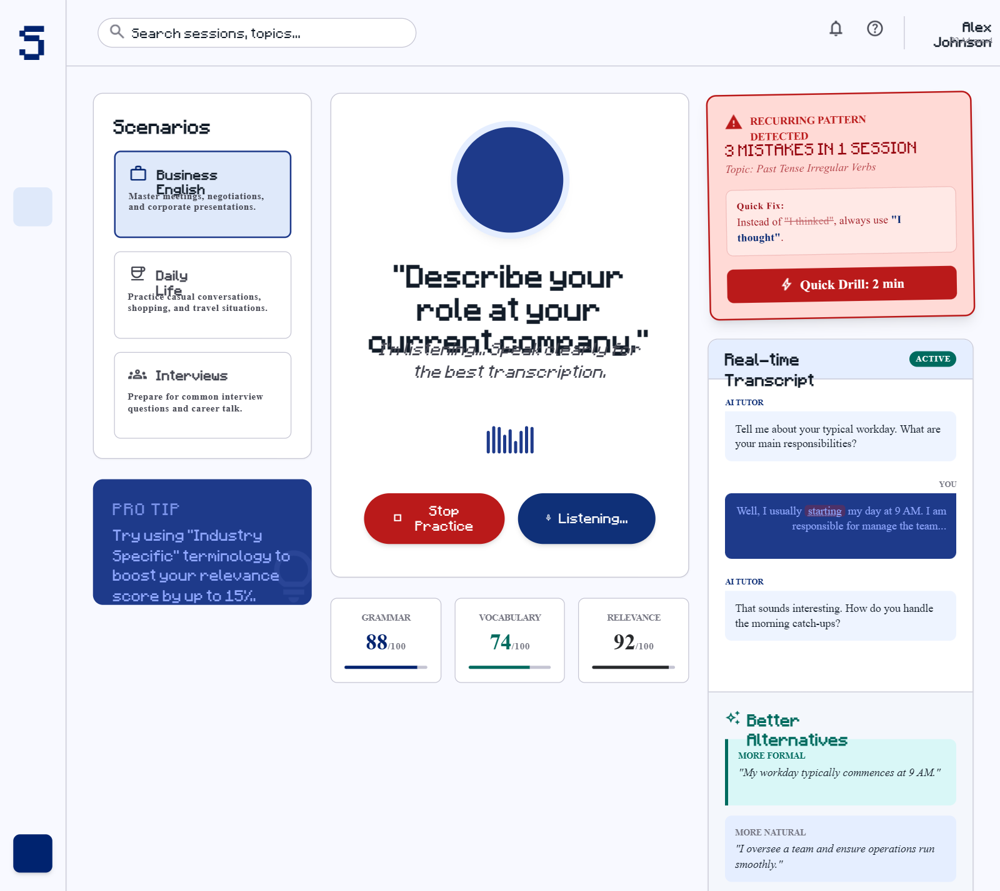
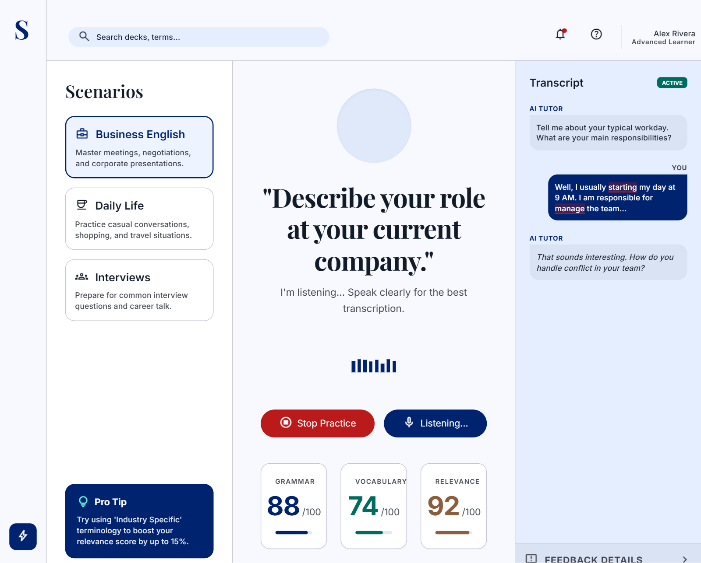

# AI Speaking Assistant
## Use-Case Specification: UC5.4 Provide Guidance on How to Improve

**Version:** 1.0

---

### Revision History

| Date | Version | Description | Author |
| :--- | :--- | :--- | :--- |
| 23/Jul/26 | 1.0 | Initial RUP specification draft for UC5.4 | Gia Phúc |

---

### Table of Contents

- [1. Use-Case Name](#1-use-case-name)
  - [1.1 Brief Description](#11-brief-description)
- [2. Flow of Events](#2-flow-of-events)
  - [2.1 Basic Flow](#21-basic-flow)
  - [2.2 Alternative Flows](#22-alternative-flows)
    - [2.2.1 Exceptional Performance Guidance](#221-exceptional-performance-guidance)
    - [2.2.2 Repetitive Error Detected](#222-repetitive-error-detected)
    - [2.2.3 Learner Dismisses Guidance Cards](#223-learner-dismisses-guidance-cards)
- [3. Special Requirements](#3-special-requirements)
  - [3.1 Actionable Feedback Formatting](#31-actionable-feedback-formatting)
  - [3.2 Pedagogical Tone](#32-pedagogical-tone)
  - [3.3 Visual Contrast and Readability](#33-visual-contrast-and-readability)
- [4. Preconditions](#4-preconditions)
  - [4.1 Evaluation Completed](#41-evaluation-completed)
  - [4.2 Weakness or Error Flagged](#42-weakness-or-error-flagged)
  - [4.3 Learner Profile History Loaded](#43-learner-profile-history-loaded)
- [5. Postconditions](#5-postconditions)
  - [5.1 Recommendations Saved](#51-recommendations-saved)
  - [5.2 Practice Deck Updated](#52-practice-deck-updated)
  - [5.3 Feedback Display Rendered](#53-feedback-display-rendered)
- [6. Extension Points](#6-extension-points)
  - [6.1 None](#61-none)

---

## 1. Use-Case Name
**UC5.4: Provide guidance on how to improve**

### 1.1 Brief Description
This use case extends **UC5.3: Evaluate performance on specific criteria** by analyzing flagged performance errors and generating personalized, actionable guidance—including corrected rephrasings and advanced vocabulary alternatives—to help the Learner rapidly improve their speaking skills.

---

## 2. Flow of Events

### 2.1 Basic Flow
1. This use case is triggered via the **Performance Weakness Detected** extension point in **UC5.3**.
2. The AI Engine receives the specific error logs and lower-scoring metrics flagged during evaluation.
3. The AI Engine constructs tailored improvement guidance, including:
   - Specific sentence corrections with highlighted revisions.
   - Alternative vocabulary recommendations tailored to the context.
   - Actionable tips for improving fluency, tone, and sentence structure.
4. The system displays the personalized guidance recommendations on the feedback panel alongside the evaluation metrics.

### 2.2 Alternative Flows

#### 2.2.1 Exceptional Performance Guidance
1. In step 2, if no grammatical or contextual errors were detected by **UC5.3** (flawless response):
2. The AI Engine skips corrective suggestions and instead generates high-level native speaker variations and idiomatic expressions to further elevate the user's proficiency.
3. The system displays these enhancement tips, and the flow completes.

#### 2.2.2 Repetitive Error Detected
1. In step 2, the AI Engine compares flagged errors against the user's session history and identifies a recurring error pattern (e.g., repeating past tense errors 3 times in one session).
2. The AI Engine prioritizes this specific error type and attaches a dedicated mini-grammar explanation card.
3. The execution resumes at step 4 of the Basic Flow.

#### 2.2.3 Learner Dismisses Guidance Cards
1. During step 4 of the Basic Flow, the Learner clicks "Hide Feedback" or "Skip Guidance".
2. The system minimizes the feedback panel, keeping only the high-level numerical score visible, and logs the user preference.

---

## 3. Special Requirements

### 3.1 Actionable Feedback Formatting
Guidance output must strictly provide clear "Before / After" rephrasing examples (e.g., *"Instead of: 'I go yesterday', try: 'I went yesterday'"*).

### 3.2 Pedagogical Tone
All corrective feedback must maintain an encouraging, constructive, and supportive tone.

### 3.3 Visual Contrast and Readability
Grammar corrections and vocabulary replacements must be highlighted using clear, high-contrast color coding (e.g., red strike-throughs for errors, green text for corrections).

---

## 4. Preconditions

### 4.1 Evaluation Completed
**UC5.3: Evaluate performance on specific criteria** must have executed and generated diagnostic outputs.

### 4.2 Weakness or Error Flagged
Specific areas for improvement or errors must be identified in the step outputs of **UC5.3**.

### 4.3 Learner Profile History Loaded
Prior session performance logs must be accessible to detect repeated mistake patterns.

---

## 5. Postconditions

### 5.1 Recommendations Saved
Personalized learning suggestions and rephrasing cards are appended to the user's history profile for future review.

### 5.2 Practice Deck Updated
Flagged grammar points and vocabulary items are automatically saved to the user's personal review list.

### 5.3 Feedback Display Rendered
The guidance cards are rendered on the user interface feedback panel.

---

## 6. Extension Points

### 6.1 None
This use case contains no extension points.