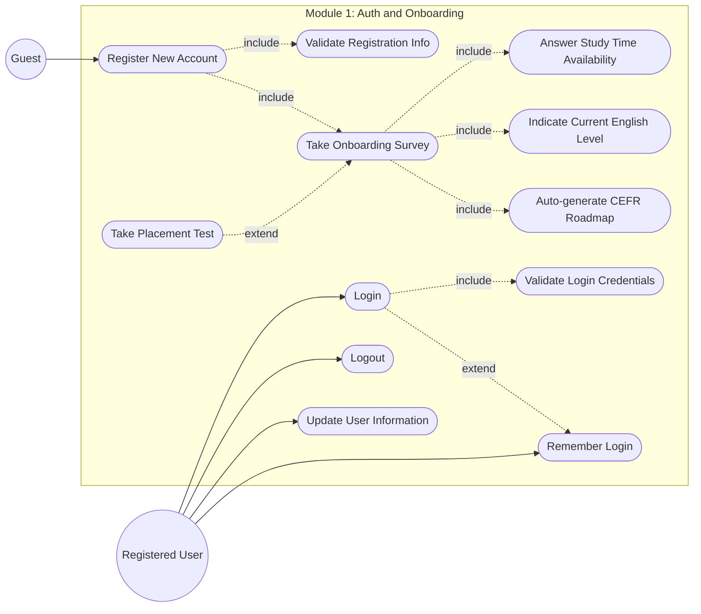
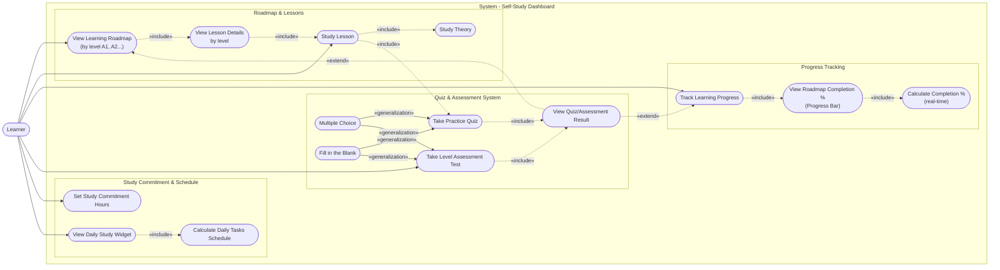
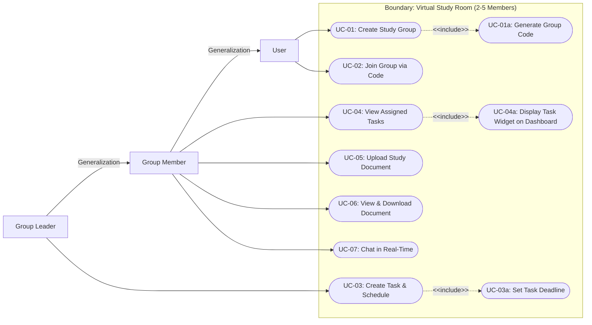
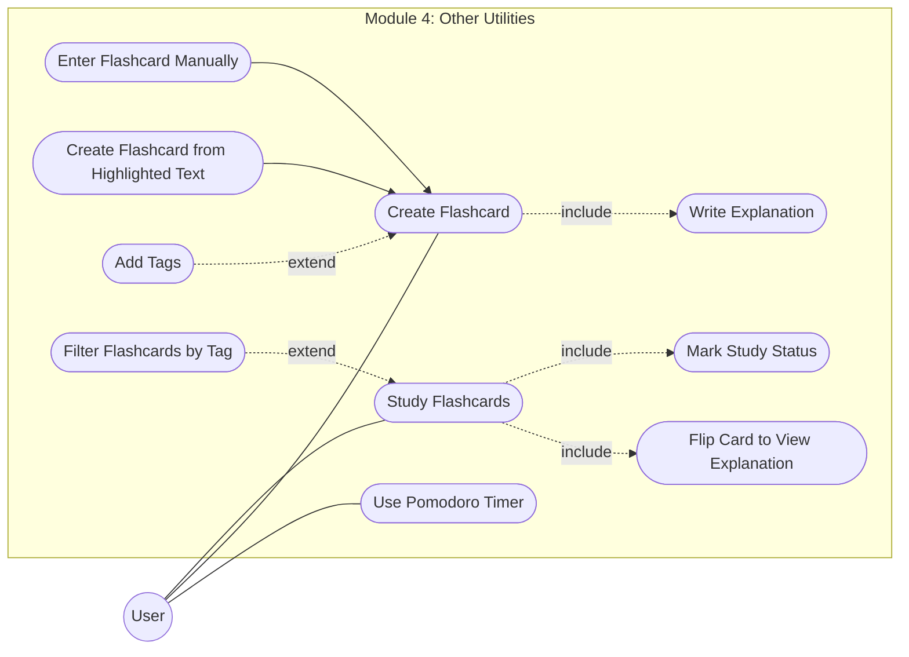
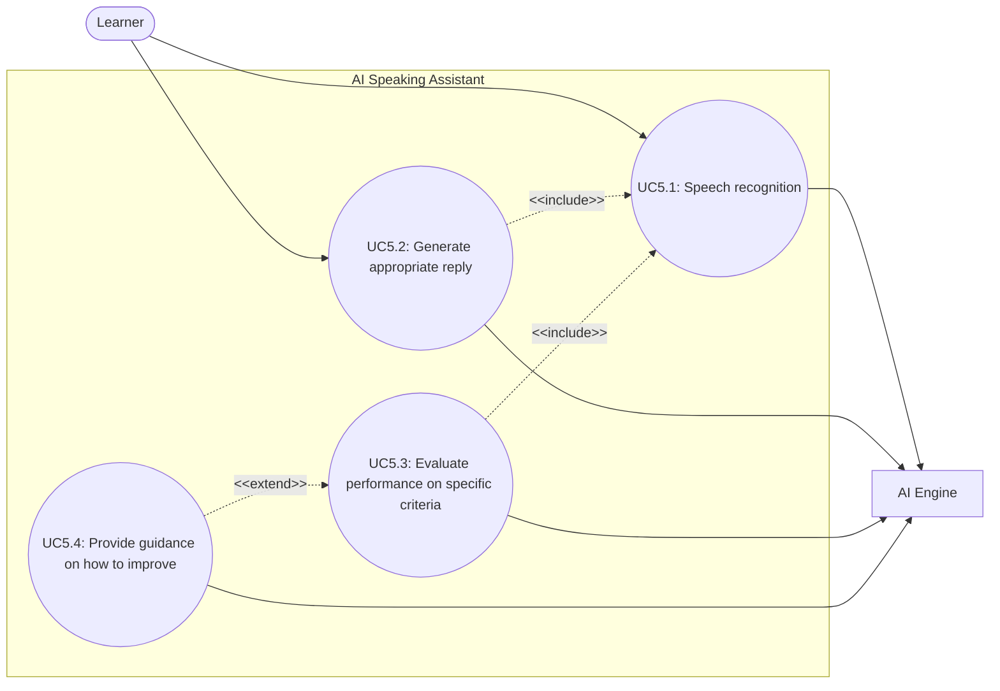

## Project Assignment 3 (PA3-2026)

**Group ID:** Group 9  
**Project Name:** Công Ty TNHH 5 thành viên  
**Video Demo Link:** [YouTube Unlisted/Public Link](https://www.youtube.com/watch?v=5A6_4DTtl3c)   
**Table of contents:**
- [A: Revised Project Plan (2nd Submission)](#a-revised-project-plan-2nd-submission)
- [B: Detailed Vision Document (2nd Submission)](#b-detailed-vision-document-2nd-submission)
- [C. Use-Case Model](#c-use-case-model)
  - [C.1 Overview](#c1-overview)
  - [C.2 Use-Case Diagrams](#c2-use-case-diagrams)
    - [1. Authentication \& Personalization Use-Case Model](#1-authentication--personalization-use-case-model)
    - [2. Self-Study Dashboard Use-Case Model](#2-self-study-dashboard-use-case-model)
    - [3. Virtual Study Room Use-Case Model](#3-virtual-study-room-use-case-model)
    - [4. Study Utilities Use-Case Model](#4-study-utilities-use-case-model)
    - [5. AI Speaking Assistant Use-Case Model](#5-ai-speaking-assistant-use-case-model)
- [D. Use-Case Specification](#d-use-case-specification)
  - [Feature 01: Authentication \& Personalization](#feature-01-authentication--personalization)
  - [Feature 02: Self-Study Dashboard](#feature-02-self-study-dashboard)
  - [Feature 03: Virtual Study Room](#feature-03-virtual-study-room)
  - [Feature 04: Study Utilities](#feature-04-study-utilities)
  - [Feature 05: AI Speaking Assistant](#feature-05-ai-speaking-assistant)
- [E. Implement 1 Functional Group using Spec Kit](#e-implement-1-functional-group-using-spec-kit)
- [F. AI Usage Report and Weekly Report](#f-ai-usage-report-and-weekly-report)
- [Appendix: Gitlog](#appendix-gitlog)

# A: Revised Project Plan (2nd Submission)
[Click here to view the Changes.pdf](./changes.md)

[Project Plan](./A.ProjectPlanChanges/projectplan.pdf)

# B: Detailed Vision Document (2nd Submission)
[Click here to view the Changes.pdf](./changes.pdf)

[Vision Document](./B.VisionDocumentChanges/visiondocument.pdf)

# C. Use-Case Model
> **Authors:** [Minh Thư] | **Reviewer:** [Thiên Phước, Kim Hằng, Gia Phúc, Khánh Linh] | **Editor:** [Minh Thư]

## C.1 Overview

The system's functional requirements are organized into five major use-case models. Each use-case model represents a major functional area of the Studify system and contains multiple detailed use cases that describe specific interactions between users and the system.

1. Authentication & Personalization

This use-case model covers the user authentication and initial personalization process. Users can register for a new account, log in, log out, reset their passwords, and update their personal information. After authentication, users complete an onboarding survey to provide information about their available study time and current English proficiency. Based on the survey results or the placement test, the system determines the user's CEFR level and automatically assigns an appropriate personalized learning roadmap.

2. Self-Study Dashboard

This use-case model provides users with a personalized environment for independent English learning. Users can view their visual learning roadmap organized according to CEFR levels, access lesson content, complete theoretical materials and exercises, and take tests to evaluate their learning outcomes. The system also tracks the user's learning progress in real time and provides a daily study schedule based on the user's committed learning time. Relevant lessons and study tasks are displayed through widgets on the user's personal dashboard.

3. Virtual Study Room

This use-case model supports collaborative learning in study groups of 2 to 5 members. Users can create a new study group or join an existing group using a group code. The system provides role-based access control for Leaders and Members. Leaders can manage the group, create study schedules, assign tasks, and share learning materials, while Members can view group information, receive assigned tasks, and access shared materials. Group members can also communicate and discuss with each other through a real-time group chat.

4. Study Utilities

This use-case model provides supporting tools that help users manage their study time and review English vocabulary. Users can use the integrated Pomodoro Timer to manage focused study sessions and break periods. The Flashcard feature allows users to create and manage personalized vocabulary flashcards by manually entering vocabulary or adding words directly from lesson content, exercises, or tests. Users can organize flashcards using tags, add explanations, and practice selected vocabulary based on their preferred tags and learning needs.

5. AI Speaking Assistant

This use-case model provides an AI-powered environment for practicing English speaking skills through contextual and specialized role-playing conversations. Users can interact with the AI using their voice, while the system recognizes the user's speech and converts it into text for analysis and response generation. The system evaluates the user's grammar, vocabulary usage, and relevance of responses to the given context. It then provides personalized feedback, identifies errors, and suggests improvements to help users enhance their English communication skills.

## C.2 Use-Case Diagrams

### 1. Authentication & Personalization Use-Case Model

### 2. Self-Study Dashboard Use-Case Model


### 3. Virtual Study Room Use-Case Model

### 4. Study Utilities Use-Case Model


### 5. AI Speaking Assistant Use-Case Model


# D. Use-Case Specification
Since each of the five high-level use-case models represents a broad functional area that encompasses multiple detailed user interactions, we have further decomposed each model into smaller, more specific use cases, as presented below.

## Feature 01: Authentication & Personalization
> **Authors:** [Khánh Linh] | **Reviewer:** [Minh Thư] | **Editor:** [Minh Thư]

* Register New Account: [Specification](./D.UseCaseSpecification/Module_1/UC1_spec.pdf)
* Login: [Specification](./D.UseCaseSpecification/Module_1/UC2_spec.pdf)
* Logout: [Specification](./D.UseCaseSpecification/Module_1/UC3_spec.pdf)
* Update User Information: [Specification](./D.UseCaseSpecification/Module_1/UC4_spec.pdf)
* Remember Login: [Specification](./D.UseCaseSpecification/Module_1/UC5_spec.pdf)
* Validate Registration Info: [Specification](./D.UseCaseSpecification/Module_1/UC6_spec.pdf)
* Validate Login Credentials: [Specification](./D.UseCaseSpecification/Module_1/UC7_spec.pdf)
* Take Onboarding Survey: [Specification](./D.UseCaseSpecification/Module_1/UC8_spec.pdf)

## Feature 02: Self-Study Dashboard
> **Authors:** [Kim Hằng] | **Reviewer:** [Minh Thư] | **Editor:** [Minh Thư]

* View Learning Roadmap: [Specification](./D.UseCaseSpecification/Module_2/UC1_spec.pdf)
* View Lesson Details by Level: [Specification](./D.UseCaseSpecification/Module_2/UC2_spec.pdf)
* Study Lesson: [Specification](./D.UseCaseSpecification/Module_2/UC3_spec.pdf)
* Study Theory: [Specification](./D.UseCaseSpecification/Module_2/UC4_spec.pdf)
* Take Quiz: [Specification](./D.UseCaseSpecification/Module_2/UC5_spec.pdf)
* Multiple Choice: [Specification](./D.UseCaseSpecification/Module_2/UC6_spec.pdf)
* Fill in the Blank: [Specification](./D.UseCaseSpecification/Module_2/UC7_spec.pdf)
* View Quiz/Assessment Result: [Specification](./D.UseCaseSpecification/Module_2/UC8_spec.pdf)
* Track Learning Progress: [Specification](./D.UseCaseSpecification/Module_2/UC9_spec.pdf)
* View Roadmap Completion % (Progress Bar): [Specification](./D.UseCaseSpecification/Module_2/UC10_spec.pdf)
* Take Level Assessment Test: [Specification](./D.UseCaseSpecification/Module_2/UC12_spec.pdf)
* Set Study Commitment Hours: [Specification](./D.UseCaseSpecification/Module_2/UC13_spec.pdf)
* View Daily Study Widget: [Specification](./D.UseCaseSpecification/Module_2/UC14_spec.pdf)
* Calculate Daily Tasks Schedule: [Specification](./D.UseCaseSpecification/Module_2/UC15_spec.pdf)

## Feature 03: Virtual Study Room
> **Authors:** [Minh Thư] | **Reviewer:** [Thiên Phước] | **Editor:** [Minh Thư]

* Create New Study Groupt: [Specification](./D.UseCaseSpecification/Module_3/UC1_spec.pdf)
* Join Group via Code: [Specification](./D.UseCaseSpecification/Module_3/UC2_spec.pdf)
* Manage & Assign Tasks: [Specification](./D.UseCaseSpecification/Module_3/UC3_spec.pdf)
* View Assigned Tasks: [Specification](./D.UseCaseSpecification/Module_3/UC4_spec.pdf)
* Manage Study Schedule: [Specification](./D.UseCaseSpecification/Module_3/UC5_spec.pdf)
* Manage Study Material: [Specification](./D.UseCaseSpecification/Module_3/UC6_spec.pdf)
* Discuss via Group Chat (Real-time): [Specification](./D.UseCaseSpecification/Module_3/UC7_spec.pdf)

## Feature 04: Study Utilities
> **Authors:** [Thiên Phước] | **Reviewer:** [Minh Thư] | **Editor:** [Minh Thư]

* Create Flashcard: [Specification](./D.UseCaseSpecification/Module_4/UC1_spec.pdf)
* Enter Flashcard Manually: [Specification](./D.UseCaseSpecification/Module_4/UC2_spec.pdf)
* Create Flashcard from Highlighted Tex: [Specification](./D.UseCaseSpecification/Module_4/UC3_spec.pdf)
* Write Explanation: [Specification](./D.UseCaseSpecification/Module_4/UC4_spec.pdf)
* Add Tags: [Specification](./D.UseCaseSpecification/Module_4/UC5_spec.pdf)
* Filter Flashcards by Tag: [Specification](./D.UseCaseSpecification/Module_4/UC6_spec.pdf)
* Study Flashcards: [Specification](./D.UseCaseSpecification/Module_4/UC7_spec.pdf)
* Flip Card to View Explanation: [Specification](./D.UseCaseSpecification/Module_4/UC8_spec.pdf)
* Mark Study Status: [Specification](./D.UseCaseSpecification/Module_4/UC9_spec.pdf)
* Use Pomodoro Timer: [Specification](./D.UseCaseSpecification/Module_4/UC10_spec.pdf)
  
## Feature 05: AI Speaking Assistant
> **Authors:** [Gia Phúc] | **Reviewer:** [Minh Thư] | **Editor:** [Minh Thư]

* Speech Recognition: [Specification](./D.UseCaseSpecification/Module_5/UC1_spec.pdf)
* Generate Appropriate Reply: [Specification](./D.UseCaseSpecification/Module_5/UC2_spec.pdf)
* Evaluate Performance on Specific Criteria: [Specification](./D.UseCaseSpecification/Module_5/UC3_spec.pdf)
* Provide Guidance on How to Improve: [Specification](./D.UseCaseSpecification/Module_5/UC4_spec.pdf)

# E. Implement 1 Functional Group using Spec Kit

> **Authors:** [Minh Thư] | **Reviewer:** [Thiên Phước] | **Editor:** [Minh Thư]

**Functional Group is chosen:** Authentication

**Video Demo Link:** [YouTube Unlisted/Public Link](https://www.youtube.com/watch?v=5A6_4DTtl3c)

**Folder Structre**

``` tree
.
├── Backend
│   ├── database
│   │   └── data
│   │       ├── erd_mermaid.md
│   │       ├── lesson.json
│   │       ├── placementtest.json
│   │       ├── questionbank.json
│   │       └── requiredleveltest.json
│   ├── eslint.config.mjs
│   ├── nest-cli.json
│   ├── package-lock.json
│   ├── package.json
│   ├── README.md
│   ├── src
│   │   ├── app.controller.ts
│   │   ├── app.module.ts
│   │   ├── app.service.ts
│   │   ├── common
│   │   │   └── decorators
│   │   │       └── index.ts
│   │   ├── config
│   │   │   └── sequelize.config.ts
│   │   ├── features
│   │   │   ├── ai-speaking
│   │   │   ├── authentication
│   │   │   ├── flashcard
│   │   │   ├── onboarding
│   │   │   ├── placement-test
│   │   │   │   ├── placement-test.controller.ts
│   │   │   │   ├── placement-test.module.ts
│   │   │   │   ├── placement-test.service.ts
│   │   │   │   └── submit-test.dto.ts
│   │   │   ├── pomodoro
│   │   │   ├── self-study
│   │   │   └── virtual-study-room
│   │   ├── main.ts
│   │   ├── messages
│   │   │   ├── dto
│   │   │   │   ├── forgotpass.dto.ts
│   │   │   │   └── resetpass.dto.ts
│   │   │   └── mail.service.ts
│   │   ├── models
│   │   │   ├── grammar_example.model.ts
│   │   │   ├── grammar_lesson.model.ts
│   │   │   ├── level.model.ts
│   │   │   ├── placement_question.model.ts
│   │   │   ├── placement_test.model.ts
│   │   │   ├── question_bank.model.ts
│   │   │   ├── question.model.ts
│   │   │   ├── required_level_test.model.ts
│   │   │   ├── required_question.model.ts
│   │   │   ├── roadmap.model.ts
│   │   │   ├── user_progress.model.ts
│   │   │   ├── user.model.ts
│   │   │   ├── vocab_item.model.ts
│   │   │   └── vocab_lesson.model.ts
│   │   ├── modules
│   │   │   ├── auth
│   │   │   │   ├── auth.controller.ts
│   │   │   │   ├── auth.module.ts
│   │   │   │   ├── auth.service.ts
│   │   │   │   ├── dto
│   │   │   │   │   └── login.dto.ts
│   │   │   │   ├── guards
│   │   │   │   │   └── jwt.guard.ts
│   │   │   │   └── strategies
│   │   │   │       └── jwt.strategy.ts
│   │   │   ├── progress
│   │   │   │   ├── progress.controller.ts
│   │   │   │   ├── progress.module.ts
│   │   │   │   └── progress.service.ts
│   │   │   └── user
│   │   │       ├── dto
│   │   │       │   ├── register.dto.ts
│   │   │       │   └── update-profile.dto.ts
│   │   │       ├── user.controller.ts
│   │   │       ├── user.module.ts
│   │   │       └── user.service.ts
│   │   └── utils
│   │       └── sequelize.config.ts
│   ├── test-mail.js
│   ├── tsconfig.build.json
│   └── tsconfig.json
├── Frontend
│   ├── eslint.config.js
│   ├── index.html
│   ├── package-lock.json
│   ├── package.json
│   ├── postcss.config.js
│   ├── public
│   │   ├── favicon.svg
│   │   └── icons.svg
│   ├── README.md
│   ├── src
│   │   ├── App.css
│   │   ├── App.jsx
│   │   ├── App.tsx
│   │   ├── assets
│   │   │   ├── hero.png
│   │   │   ├── logo.svg
│   │   │   ├── react.svg
│   │   │   ├── Studify_icon
│   │   │   │   ├── ai.svg
│   │   │   │   ├── dashboard.svg
│   │   │   │   ├── gamified.svg
│   │   │   │   ├── google.svg
│   │   │   │   ├── hat.svg
│   │   │   │   ├── human.svg
│   │   │   │   ├── Icon.svg
│   │   │   │   ├── letter.svg
│   │   │   │   ├── lock.svg
│   │   │   │   ├── Shield.svg
│   │   │   │   └── team.svg
│   │   │   ├── Studify_Image
│   │   │   │   └── Main Registration Container
│   │   │   │       └── Section - Left Side_ Informative
│   │   │   │           └── Learner focused.png
│   │   │   └── vite.svg
│   │   ├── components
│   │   │   └── ProgressBar.jsx
│   │   ├── features
│   │   │   ├── ai-speaking
│   │   │   ├── auth
│   │   │   │   ├── components
│   │   │   │   │   ├── ForgotPasswordForm.tsx
│   │   │   │   │   ├── LoginForm.tsx
│   │   │   │   │   └── RegisterForm.tsx
│   │   │   │   └── store
│   │   │   │       └── useAuthStore.ts
│   │   │   ├── flashcard
│   │   │   ├── landing page
│   │   │   │   └── LandingPage.tsx
│   │   │   ├── learning
│   │   │   │   ├── dashboard
│   │   │   │   │   ├── DashboardPage.jsx
│   │   │   │   │   └── index.jsx
│   │   │   │   ├── lesson
│   │   │   │   │   ├── LessonCard.tsx
│   │   │   │   │   ├── LessonPage.tsx
│   │   │   │   │   ├── PracticeQuestions.tsx
│   │   │   │   │   ├── TheoryCard.tsx
│   │   │   │   │   └── TheoryDetail.tsx
│   │   │   │   └── roadmap
│   │   │   │       ├── index.jsx
│   │   │   │       ├── RoadmapPage.css
│   │   │   │       └── RoadmapPage.jsx
│   │   │   ├── onboarding
│   │   │   │   ├── OnboardingApp.jsx
│   │   │   │   ├── OnboardingFlow.jsx
│   │   │   │   └── PlacementTest.jsx
│   │   │   ├── pomodoro
│   │   │   ├── self-study
│   │   │   ├── user-profile
│   │   │   │   └── profile.jsx
│   │   │   └── virtual-study-room
│   │   ├── index.css
│   │   ├── layouts
│   │   │   └── MainLayout.jsx
│   │   ├── main.jsx
│   │   ├── main.tsx
│   │   ├── mocks
│   │   │   └── roadmap.json
│   │   └── vite-env.d.ts
│   ├── tailwind.config.js
│   ├── tsconfig.app.json
│   ├── tsconfig.json
│   ├── tsconfig.node.json
│   └── vite.config.js
└── specs
    ├── 001-forgot-password-reset
    │   ├── checklists
    │   │   └── requirements.md
    │   └── spec.md
    ├── 002-placement-test
    │   ├── plan.md
    │   ├── spec.md
    │   └── tasks.md
    └── 003-authentication
        ├── plan.md
        ├── spec.md
        └── tasks.md
```

**Folder Link:**
- **Backend** `E.Implemet/Backend/`
- **Frontend** `E.Implemet/Frontend/`
- **specs** `E.Implemet/specs/`

# F. AI Usage Report and Weekly Report
> **Authors:** [Thiên Phước] | **Reviewer:** [Minh Thư] | **Editor:** [Thiên Phước]
- [**AI Usage Report**](./AI_UsageReport_PA3.pdf)
- [**Weekly Reports**](./WeeklyReports.pdf)

# Appendix: Gitlog
[Gitlog](./gitlog.txt)