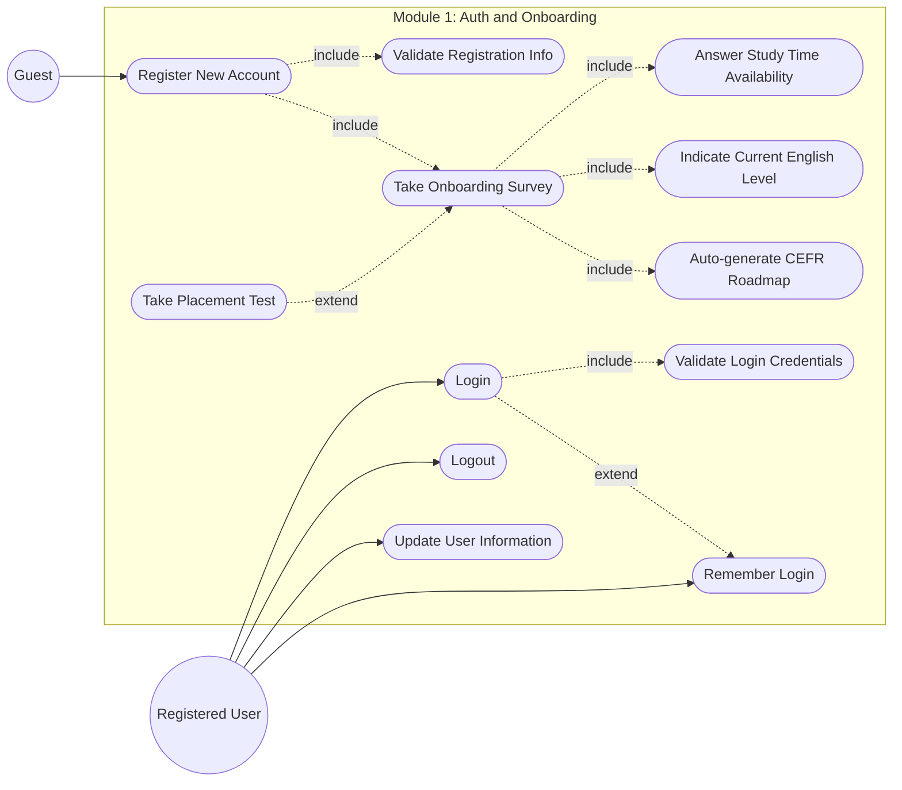
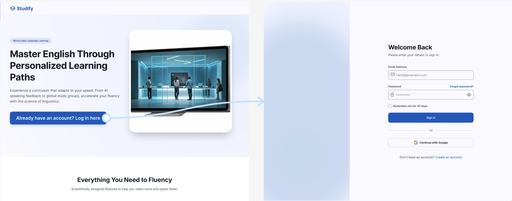
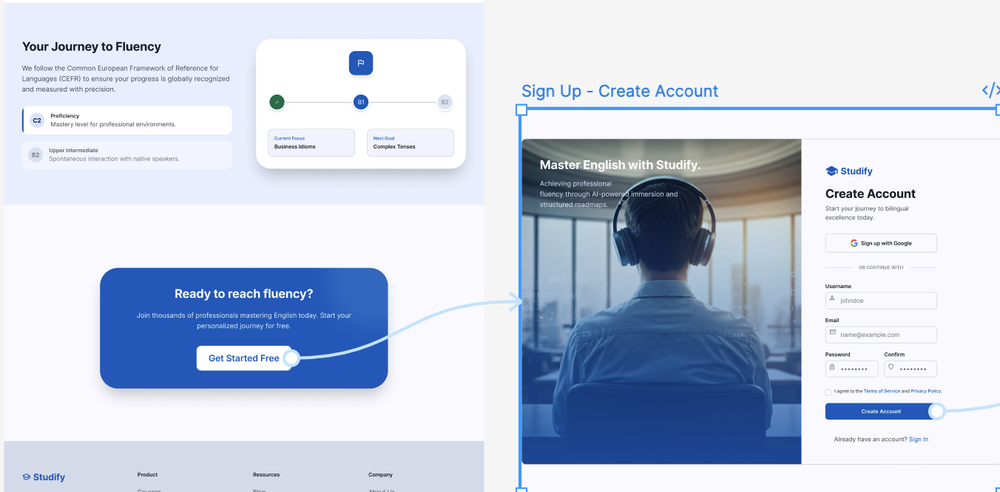

# Use-Case Specification: Authentication and Onboarding

**Version:** 1.0

### Revision History

| Date         | Version | Description                                                             | Author              |
| :----------- | :------ | :---------------------------------------------------------------------- | :------------------ |
| `23/07/2026` | `1.0`   | Initial version of Authentication and Onboarding Use-Case Specification | `Nguyễn Khánh Linh` |

---

### Table of Contents

1. [Use-Case Name](#1-use-case-name)

   1. [Brief Description](#11-brief-description)
2. [Flow of Events](#2-flow-of-events)

   1. [Basic Flow](#21-basic-flow)
   2. [Alternative Flows](#22-alternative-flows)

      1. [Authentication Alternative Flow](#221-authentication-alternative-flow)
      2. [Onboarding Survey Alternative Flow](#222-onboarding-survey-alternative-flow)
      3. [Smart Onboarding Alternative Flow](#223-smart-onboarding-alternative-flow)
3. [Special Requirements](#3-special-requirements)
4. [Preconditions](#4-preconditions)
5. [Postconditions](#5-postconditions)
6. [Extension Points](#6-extension-points)
7. [UI Prototype](#7-ui-prototype)

---

## 1. Authentication and Onboarding

### 1.1 Brief Description

This use case describes the process by which a user creates an account or logs into the system, completes an onboarding survey to provide information about their English learning goals and current proficiency, and receives a personalized English learning roadmap aligned with the CEFR framework. If the user does not know their current English proficiency, the system provides a short placement test to determine an appropriate CEFR level and automatically configures the user's learning roadmap.

---

## 2. Flow of Events

### 2.1 Basic Flow

1. The use case starts when the user accesses the system.

2. The system displays the authentication interface, allowing the user to either log in to an existing account or register a new account.

*UI Interface of Landing Page, Login Page and Register Page*

*UI Prototype from Landing Page -> Login Page*

*UI Prototype from Lading Page -> Register Page*

1. If the user does not have an account, the user selects the registration option and provides the required information, including:

   * Email
   * Username
   * Password

2. The system validates the provided registration information and creates a new user account.

3. The user logs into the system using their registered credentials.

4. The system verifies the user's credentials and grants access to the system.

5. If this is the user's first time accessing the learning features, the system displays the onboarding survey.

6. The system asks the user how much time they intend to spend learning English and provides predefined options for the user to select.

7.  The system asks whether the user already knows their current English proficiency level.

8.  If the user knows their current proficiency level, the user selects their corresponding CEFR level.

9.  If the user does not know their current proficiency level, the system provides a placement test consisting of approximately 10–15 questions arranged from easier to more difficult levels.

10. The user completes the placement test.

11. The system evaluates the user's placement test results and determines the user's estimated English proficiency level according to the CEFR framework.

12. The system saves the user's onboarding information and identified proficiency level.

13. The system automatically configures and displays a personalized learning roadmap corresponding to the user's CEFR level.

14. The user can access the assigned learning roadmap and begin studying.

15. The use case ends successfully.

---

### 2.2 Alternative Flows

#### 2.2.1 Authentication Alternative Flow

This alternative flow describes exceptions and alternative behaviors related to user authentication.

##### A1. Invalid Login Credentials

1. The user enters an incorrect email/username or password.
2. The system verifies the provided credentials and determines that they are invalid.
3. The system displays an error message indicating that the login information is incorrect.
4. The user is allowed to re-enter their credentials.
5. The flow returns to Step 5 of the Basic Flow.

##### A2. Email or Username Already Exists

1. The user attempts to register a new account.
2. The system detects that the provided email or username is already associated with an existing account.
3. The system displays an appropriate error message.
4. The user is asked to provide a different email or username.
5. The flow returns to Step 3 of the Basic Flow.

##### A3. Password Reset

1. The user selects the password reset option.
2. The system requests the email address associated with the user's account.
3. The user provides their registered email address.
4. The system verifies the email address.
5. The system provides instructions for resetting the password.
6. The user creates a new password.
7. The user returns to the login interface.
8. The flow resumes at Step 5 of the Basic Flow.

##### A4. User Logs Out

1. The user selects the logout option.
2. The system terminates the user's active session.
3. The system redirects the user to the authentication interface.
4. The use case ends.

---

#### 2.2.2 Onboarding Survey Alternative Flow

This alternative flow describes alternative behaviors during the onboarding survey.

##### A1. User Knows Their English Proficiency Level

1. The system asks whether the user knows their current English proficiency level.
2. The user selects "Yes".
3. The system displays the available CEFR proficiency levels.
4. The user selects their current proficiency level.
5. The system records the selected CEFR level.
6. The flow resumes at Step 14 of the Basic Flow.

##### A2. User Does Not Know Their English Proficiency Level

1. The system asks whether the user knows their current English proficiency level.
2. The user selects "No".
3. The system informs the user that a placement test is required to estimate their proficiency level.
4. The system displays a placement test consisting of approximately 10–15 questions.
5. The user completes the placement test.
6. The system evaluates the user's answers.
7. The system determines an estimated CEFR proficiency level.
8. The flow resumes at Step 14 of the Basic Flow.

##### A3. User Leaves the Onboarding Process

1. The user exits the onboarding survey or placement test before completing it.
2. The system saves the user's incomplete onboarding status.
3. The system allows the user to continue the onboarding process when they return to the learning features.
4. The flow resumes from the incomplete onboarding step.

---

#### 2.2.3 Smart Onboarding Alternative Flow

This alternative flow describes exceptions that occur when the system configures the user's personalized learning roadmap.

##### A1. Invalid or Incomplete Proficiency Information

1. The system determines that the user's proficiency information is missing or invalid.
2. The system informs the user that their proficiency information must be completed or updated.
3. The user provides or updates their proficiency information.
4. The system validates the updated information.
5. The flow resumes at Step 14 of the Basic Flow.

##### A2. Placement Test Result Cannot Determine a Level

1. The system evaluates the user's placement test results.
2. The system determines that the available answers are insufficient to reliably estimate the user's CEFR level.
3. The system informs the user that the placement test result is inconclusive.
4. The system requests the user to retake the placement test.
5. The user completes the placement test again.
6. The system evaluates the new results and determines an estimated CEFR level.
7. The flow resumes at Step 14 of the Basic Flow.

##### A3. Roadmap Configuration Failure

1. The system attempts to generate the user's personalized learning roadmap.
2. The system encounters an error while configuring or retrieving the roadmap.
3. The system displays an appropriate error message.
4. The system allows the user to retry the operation.
5. If the operation is successful, the flow resumes at Step 15 of the Basic Flow.
6. If the operation continues to fail, the system records the error and informs the user that the roadmap is temporarily unavailable.

---

## 3. Special Requirements

### 3.1 Security Requirements

* User passwords must be securely stored using appropriate password hashing mechanisms.
* Authentication sessions must be protected against unauthorized access.
* The system must prevent unauthorized users from accessing another user's personal information and learning progress.
* Password reset operations must verify ownership of the registered email account.
* The system should provide appropriate error messages without exposing sensitive authentication information.

### 3.2 Performance Requirements

* The authentication interface should load within 2 seconds under normal operating conditions.
* Authentication requests should receive a response within 500 milliseconds under normal system load.
* The system should support at least 100 concurrent users.

### 3.3 Usability Requirements

* The registration and login process should be simple and understandable for users.
* The onboarding survey should present questions and answer options clearly.
* The placement test should provide a straightforward user experience and clearly indicate the user's progress.
* The system should provide clear feedback when users enter invalid information or encounter an error.

### 3.4 Compatibility Requirements

* The system should support modern desktop web browsers.
* The authentication and onboarding interfaces should maintain consistent behavior across supported browsers.

### 3.5 CEFR Alignment

* User proficiency levels must be represented according to the Common European Framework of Reference for Languages (CEFR).
* The learning roadmap generated by the system must correspond to the user's identified or estimated CEFR level.

---

## 4. Preconditions

### 4.1 System Availability

* The system is available and accessible to the user.
* The authentication and onboarding services are operational.

### 4.2 User Authentication

* For existing users, the user must have a registered account to log into the system.
* For new users, the user must provide the required registration information to create an account.

---

## 5. Postconditions

### 5.1 Successful Authentication and Onboarding

After the use case is completed successfully:

* The user's account is created or authenticated.
* The user's authentication session is established.
* The user's learning preferences and available learning time are stored.
* The user's English proficiency level is identified or estimated.
* The user's CEFR level is stored in the system.
* A personalized learning roadmap is automatically configured and displayed.
* The user can access the assigned learning roadmap and begin the learning process.

### 5.2 Incomplete Onboarding

If the user leaves the onboarding process before completion:

* The user's completed onboarding information is retained.
* The user's onboarding status is marked as incomplete.
* The user can resume the onboarding process at a later time.

---

## 6. Extension Points

### 6.1 Password Reset

The password reset functionality extends the authentication flow when an existing user cannot remember their password and requests to create a new password.

### 6.2 Placement Test

The placement test extends the onboarding survey when the user does not know their current English proficiency level.

### 6.3 Personalized Roadmap Configuration

The personalized roadmap configuration extends the onboarding process after the user's proficiency level has been identified or estimated, allowing the system to generate and display an appropriate CEFR-aligned learning roadmap.

### 6.4 User Profile Update

The user profile update functionality allows an authenticated user to update their username or other supported profile information after completing authentication.

## 7. UI Prototype

## Flow 01: 