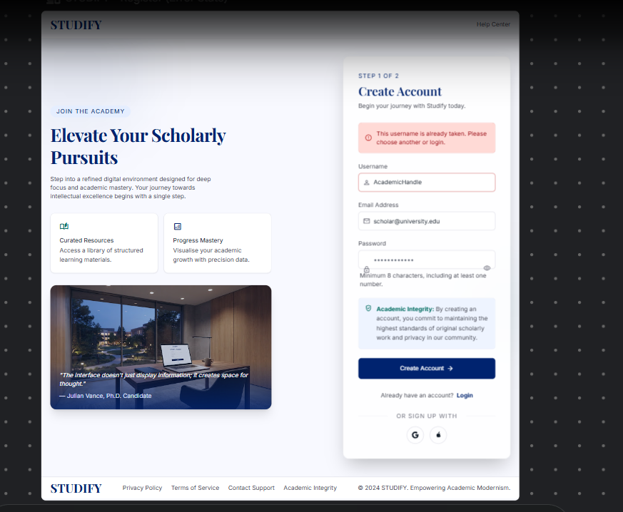
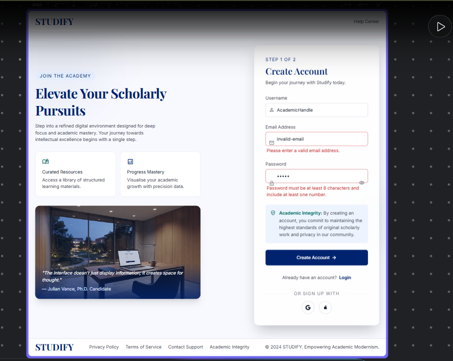

# Studify
## Use-Case Specification: Register New Account

**Version:** 1.0

---

### Revision History

| Date | Version | Description | Author |
| :--- | :--- | :--- | :--- |
| 23/Jul/26 | 1.0 | Initial version of UC1 | Khanh Linh |

---

### Table of Contents

- [1. Use-Case Name](#1-use-case-name)
  - [1.1 Brief Description](#11-brief-description)
- [2. Flow of Events](#2-flow-of-events)
  - [2.1 Basic Flow](#21-basic-flow)
  - [2.2 Alternative Flows](#22-alternative-flows)
    - [2.2.1 Duplicate Email or Username](#221-duplicate-email-or-username)
    - [2.2.2 Invalid Input Format](#222-invalid-input-format)
- [3. Special Requirements](#3-special-requirements)
- [4. Preconditions](#4-preconditions)
- [5. Postconditions](#5-postconditions)
- [6. Extension Points](#6-extension-points)

---

## 1. Use-Case Name

**UC1 — Register New Account**

### 1.1 Brief Description

This use case allows a Guest (a user who does not yet have an account) to create a new account in the Studify system by providing an email address, a password, and a username. This is the entry point for all users who wish to access Studify's personalized learning features, and it directly leads into the Onboarding Survey use case (UC9) once registration succeeds.

---

## 2. Flow of Events

### 2.1 Basic Flow

This use case begins when the Guest chooses to register a new account on the Studify landing page or login screen.

1. The Guest selects the "Sign Up" option.
2. The system displays the registration form, requesting: Email, Password, and Username.
3. The Guest enters their Email, Password, and desired Username, then submits the form.
4. The system performs UC7 — Validate Registration Info to check that the email format is valid, the password meets the minimum security requirements (e.g., minimum length, at least one number), and the username is not already taken.
5. The system creates a new user account and stores it in the database, with the account status set to "active."
6. The system automatically logs the Guest in as a Registered User.
7. The system redirects the newly Registered User into UC9 — Take Onboarding Survey to begin the onboarding process.
8. The use case ends successfully.

### 2.2 Alternative Flows

#### 2.2.1 Duplicate Email or Username

At step 4 of the Basic Flow, if the system determines that the submitted email or username already exists in the system:

1. The system displays an error message indicating which field (email or username) is already in use.
2. The system keeps the previously entered form values (except password) so the Guest does not have to re-enter everything.
3. The Guest updates the conflicting field and resubmits.
4. The flow resumes at step 4 of the Basic Flow.

#### 2.2.2 Invalid Input Format

At step 4 of the Basic Flow, if the email format is invalid, or the password does not meet the minimum security requirements:

1. The system displays a validation error message specific to the field(s) that failed (e.g., "Password must be at least 8 characters").
2. The Guest corrects the invalid field(s) and resubmits.
3. The flow resumes at step 4 of the Basic Flow.

---

## 3. Special Requirements

### 3.1 Password Security

Passwords must be hashed (e.g., using bcrypt) before being stored; plaintext passwords must never be persisted in the database.

### 3.2 Response Time

The registration process (from form submission to account creation confirmation) should complete within 2 seconds under normal network conditions.

### 3.3 Email Uniqueness

The system must enforce email and username uniqueness at the database level (unique constraints), not solely at the application logic level, to prevent race conditions during concurrent registrations.

---

## 4. Preconditions

### 4.1 No Existing Account

The Guest must not already have an existing account associated with the email address they are attempting to register with.

### 4.2 Network Connectivity

The Guest's device must have an active internet connection to communicate with the Studify backend.

---

## 5. Postconditions

### 5.1 Account Created

A new user record exists in the system's database with a unique identifier, hashed password, email, and username.

### 5.2 User Authenticated

The newly registered user is automatically authenticated and treated as a Registered User for the remainder of the session.

### 5.3 Onboarding Initiated

The user is directed into the Onboarding Survey (UC9) flow, having not yet completed it.

---

## 6. Extension Points

### 6.1 Onboarding Survey Trigger

*Location: End of Basic Flow, step 7.* This is the point at which control passes from UC1 to UC9 — Take Onboarding Survey, allowing the two use cases to remain independently specified while being sequentially linked in the actual user journey.
