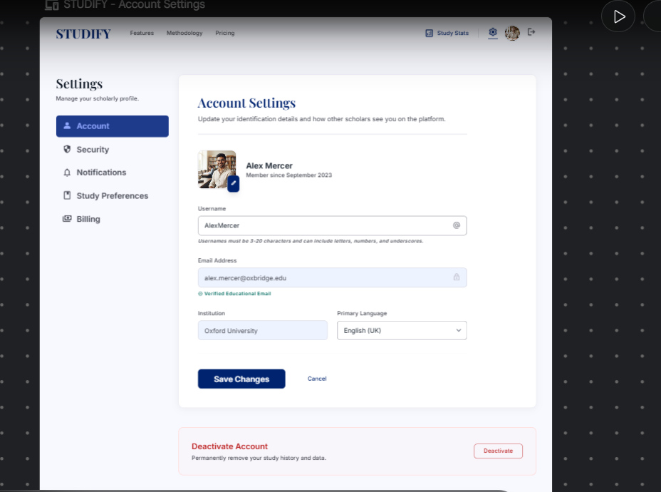

# Studify
## Use-Case Specification: Update User Information

**Version:** 1.0

---

### Revision History

| Date | Version | Description | Author |
| :--- | :--- | :--- | :--- |
| 23/Jul/26 | 1.0 | Initial draft | Khanh Linh |

---

### Table of Contents

- [1. Use-Case Name](#1-use-case-name)
  - [1.1 Brief Description](#11-brief-description)
- [2. Flow of Events](#2-flow-of-events)
  - [2.1 Basic Flow](#21-basic-flow)
  - [2.2 Alternative Flows](#22-alternative-flows)
    - [2.2.1 Duplicate Username](#221-duplicate-username)
    - [2.2.2 Invalid Input Format](#222-invalid-input-format)
    - [2.2.3 User Cancels Update](#223-user-cancels-update)
- [3. Special Requirements](#3-special-requirements)
- [4. Preconditions](#4-preconditions)
- [5. Postconditions](#5-postconditions)
- [6. Extension Points](#6-extension-points)

---

## 1. Use-Case Name

**UC5 — Update User Information**

### 1.1 Brief Description

This use case allows a Registered User to view and modify their personal account information, primarily their username, while logged into Studify. This helps users keep their profile accurate and personalized without needing to create a new account.

---

## 2. Flow of Events

### 2.1 Basic Flow

This use case begins when the Registered User navigates to their account/profile settings page.

1. The Registered User selects the "Account Settings" or "Profile" option from the navigation menu.
2. The system displays the current user information, including the existing username, in an editable form.
3. The Registered User modifies the username field and selects "Save Changes."
4. The system validates the new username (see Alternative Flows 2.2.1 and 2.2.2 for validation failures).
5. The system updates the user's record in the database with the new username.
6. The system displays a confirmation message indicating the update was successful.
7. The use case ends successfully.

### 2.2 Alternative Flows

#### 2.2.1 Duplicate Username

At step 4 of the Basic Flow, if the new username submitted by the Registered User is already taken by another account:

1. The system displays an error message indicating the username is already in use.
2. The system keeps the form populated with the Registered User's attempted input so they do not need to re-enter it.
3. The Registered User modifies the username and resubmits.
4. The flow resumes at step 4 of the Basic Flow.

#### 2.2.2 Invalid Input Format

At step 4 of the Basic Flow, if the new username does not meet formatting requirements (e.g., contains invalid characters, is too short, or too long):

1. The system displays a validation error message specifying the formatting rule that was violated.
2. The Registered User corrects the input and resubmits.
3. The flow resumes at step 4 of the Basic Flow.

#### 2.2.3 User Cancels Update

At step 3 of the Basic Flow, if the Registered User selects "Cancel" instead of "Save Changes":

1. The system discards any unsaved changes made in the form.
2. The system returns the Registered User to the previous view (e.g., dashboard) without modifying their stored information.
3. The use case ends without any changes being made.

---

## 3. Special Requirements

### 3.1 Response Time

The update process (from form submission to confirmation) should complete within 2 seconds under normal network conditions.

### 3.2 Username Uniqueness

The system must enforce username uniqueness at the database level (unique constraint) to prevent race conditions when multiple users attempt to claim the same username concurrently.

### 3.3 Audit Trail

Changes to user information should be logged with a timestamp for account security and support purposes.

---

## 4. Preconditions

### 4.1 Authenticated Session

The Registered User must be logged into the system (i.e., must have previously completed UC2 — Login) to access and modify their account information.

---

## 5. Postconditions

### 5.1 Information Updated

The Registered User's stored information (username) is updated in the database to reflect the new value.

### 5.2 No Change on Cancellation

If the Registered User cancels the update, their stored information remains unchanged from before the use case began.

---

## 6. Extension Points

### 6.1 None

*This use case does not currently define any extension points into other use cases.*
