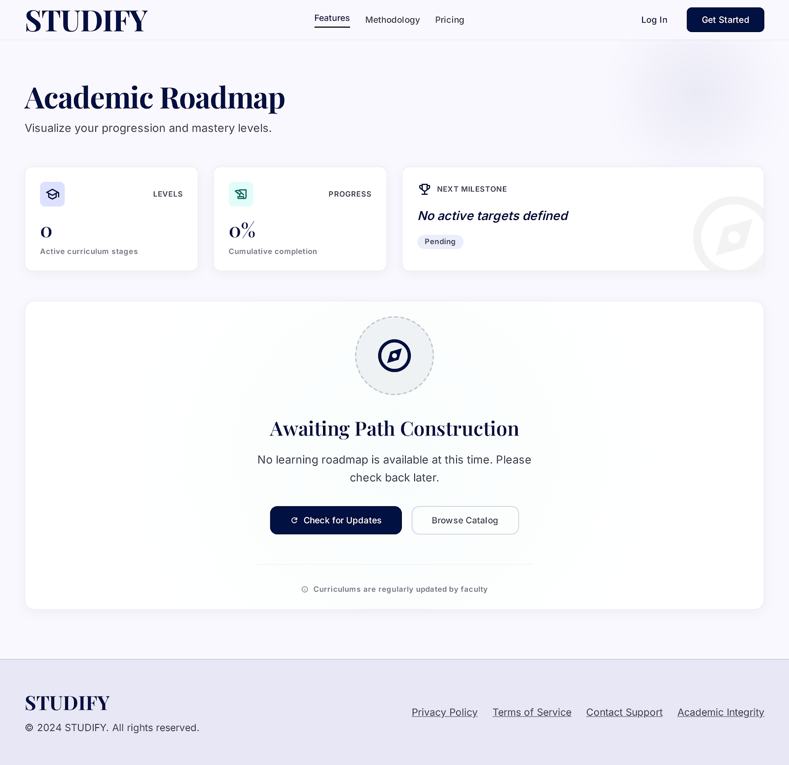

# Studify
## Use-Case Specification: View Learning Roadmap

**Version:** 1.0

---

### Revision History

| Date | Version | Description | Author |
| :--- | :--- | :--- | :--- |
| 23/Jul/26 | 1.0 | Initial draft of use-case specification UC1 – View Learning Roadmap | `Lê Kim Hằng` |

---

### Table of Contents

- [1. Use-Case Name](#1-use-case-name)
  - [1.1 Brief Description](#11-brief-description)
- [2. Flow of Events](#2-flow-of-events)
  - [2.1 Basic Flow](#21-basic-flow)
  - [2.2 Alternative Flows](#22-alternative-flows)
    - [2.2.1 Empty Roadmap](#221-empty-roadmap)
    - [2.2.2 Load Failure / Network Error](#222-load-failure--network-error)
- [3. Special Requirements](#3-special-requirements)
  - [3.1 Performance](#31-performance)
  - [3.2 Usability](#32-usability)
- [4. Preconditions](#4-preconditions)
  - [4.1 Learner Logged In](#41-learner-logged-in)
- [5. Postconditions](#5-postconditions)
  - [5.1 Roadmap Displayed](#51-roadmap-displayed)
- [6. Extension Points](#6-extension-points)
  - [6.1 Level Selection](#61-level-selection)

---

## 1. Use-Case Name

**View Learning Roadmap**

### 1.1 Brief Description

This use case allows the Learner to view the overall learning roadmap of the Studify system, organized by proficiency levels (e.g., A1, A2, B1, etc.). The roadmap is displayed as a list or diagram of levels, allowing the Learner to understand the structure of the study program before diving into individual lessons. This use case includes the **View Lesson Details by Level** use case, which allows the Learner to view the detailed lessons contained within a selected level.

---

## 2. Flow of Events

### 2.1 Basic Flow

This use case begins when the Learner navigates to the **Roadmap** screen from the Dashboard.

1. The Learner selects the "Learning Roadmap" option from the navigation bar or the Dashboard home page.
2. The system queries the list of proficiency levels (A1, A2, B1, B2, C1, C2, etc.) along with summary information for each level (level name, number of lessons, short description).
3. The system displays the learning roadmap as a list/diagram of levels, ordered from easiest to hardest.
4. For each level, the system displays an overall status (Not Started / In Progress / Completed) based on the Learner's current learning progress.
5. The Learner selects a specific level to view its details.
6. The system executes the **View Lesson Details by Level** use case *(<<include>>)* to display the list of lessons belonging to the selected level.
7. The use case ends when the lesson list for the selected level has been successfully displayed.

### 2.2 Alternative Flows

#### 2.2.1 Empty Roadmap

*Trigger condition: The system has no level/roadmap data configured yet (e.g., newly deployed system, data not yet populated).*

1. At step 3 of the Basic Flow, the system detects that no levels exist in the database.
2. The system displays the message "No learning roadmap is available at this time. Please check back later."
3. The use case ends.

#### 2.2.2 Load Failure / Network Error

*Trigger condition: An error occurs while querying roadmap data from the server (network error, server 500 error, timeout).*

1. At step 2 of the Basic Flow, the request to fetch roadmap data fails.
2. The system displays a user-friendly error message, e.g., "Unable to load the learning roadmap. Please check your network connection and try again."
3. The system provides a "Retry" button.
4. If the Learner selects "Retry," the flow returns to step 2 of the Basic Flow.
5. If the Learner takes no action, the use case ends.

---

## 3. Special Requirements

### 3.1 Performance

The roadmap list must be loaded and displayed within a maximum of 2 seconds under normal network conditions (stable 4G/Wi-Fi connection).

### 3.2 Usability

The roadmap interface must be intuitive, clearly indicating progress status (using distinct colors or icons for: Not Started / In Progress / Completed) so the Learner can easily identify which level to study next.

---

## 4. Preconditions

### 4.1 Learner Logged In

The Learner must be successfully logged in to the Studify system before accessing the Roadmap screen.

---

## 5. Postconditions

### 5.1 Roadmap Displayed

The system has successfully displayed the list of learning levels along with the Learner's corresponding progress status. If the Learner has selected a specific level, the lesson list for that level has also been displayed (via the include relationship).

---

## 6. Extension Points

### 6.1 Level Selection

This extension point occurs at step 5 of the Basic Flow, immediately after the Learner selects a specific level on the roadmap. This is the point where the **View Lesson Details by Level** use case is included to continue the flow of displaying the lesson details for the selected level.
