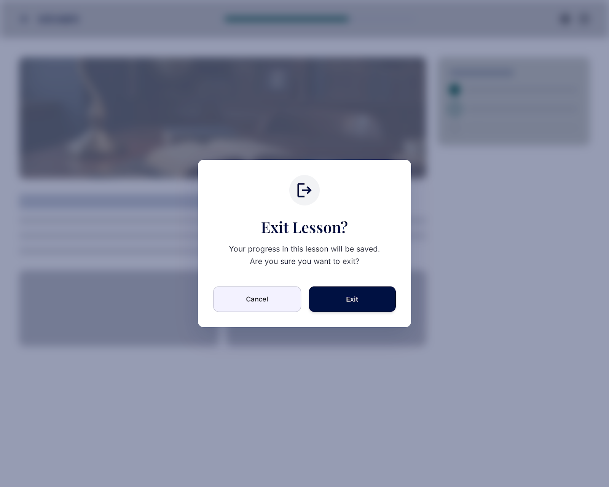

# Studify
## Use-Case Specification: Study Lesson

**Version:** 1.0

---

### Revision History

| Date | Version | Description | Author |
| :--- | :--- | :--- | :--- |
| 23/Jul/26 | 1.0 | Initial draft of use-case specification UC3 – Study Lesson |`Lê Kim Hằng` |

---

### Table of Contents

- [1. Use-Case Name](#1-use-case-name)
  - [1.1 Brief Description](#11-brief-description)
- [2. Flow of Events](#2-flow-of-events)
  - [2.1 Basic Flow](#21-basic-flow)
  - [2.2 Alternative Flows](#22-alternative-flows)
    - [2.2.1 Learner Skips Quiz](#221-learner-skips-quiz)
    - [2.2.2 Load Failure / Network Error](#222-load-failure--network-error)
    - [2.2.3 Learner Exits Lesson Early](#223-learner-exits-lesson-early)
- [3. Special Requirements](#3-special-requirements)
  - [3.1 Performance](#31-performance)
  - [3.2 Usability](#32-usability)
- [4. Preconditions](#4-preconditions)
  - [4.1 Lesson Selected](#41-lesson-selected)
- [5. Postconditions](#5-postconditions)
  - [5.1 Lesson Progress Updated](#51-lesson-progress-updated)
- [6. Extension Points](#6-extension-points)
  - [6.1 Theory Section](#61-theory-section)
  - [6.2 Quiz Section](#62-quiz-section)

---

## 1. Use-Case Name

**Study Lesson**

### 1.1 Brief Description

This use case allows the Learner to study the content of a specific lesson that was selected from the lesson list of a level. The lesson study screen combines two main components: condensed theory content and a quiz to test comprehension. This use case is included by the **View Lesson Details by Level** use case, and it in turn includes two use cases: **Study Theory** (condensed content) and **Take Quiz**.

*Figure 3.1: Lesson study screen ("Mastering the Present Perfect") showing the Theory → Quiz → Result step indicator, condensed theory content, and an embedded concept-check question.*

---

## 2. Flow of Events

### 2.1 Basic Flow

This use case begins immediately after the Learner selects a specific lesson from the lesson list (triggered from the View Lesson Details by Level use case).

1. The system receives the lesson ID that the Learner has selected.
2. The system loads the full content of the lesson, including the theory section and the associated quiz.
3. The system displays the lesson study screen, starting with the theory content section.
4. The system executes the **Study Theory** use case *(<<include>>)* to present the condensed theoretical content to the Learner.
5. After the Learner finishes reviewing the theory content, the Learner proceeds to the quiz section.
6. The system executes the **Take Quiz** use case *(<<include>>)* to present the quiz associated with the lesson.
7. Once the Learner completes the quiz, the system updates the Learner's progress for this lesson (marking it as Completed or In Progress, depending on the quiz result policy).
8. The use case ends when the Learner's lesson progress has been successfully updated and the result is presented.

### 2.2 Alternative Flows

#### 2.2.1 Learner Skips Quiz

*Trigger condition: The Learner chooses to exit after reviewing the theory content without taking the quiz.*

1. At step 5 of the Basic Flow, the Learner selects "Skip Quiz" or navigates away from the lesson screen.
2. The system saves the Learner's progress for the theory section only, marking the lesson status as "In Progress."
3. The use case ends.

#### 2.2.2 Load Failure / Network Error

*Trigger condition: An error occurs while loading lesson content (theory or quiz) from the server (network error, server 500 error, timeout).*

1. At step 2 of the Basic Flow, the request to fetch lesson content fails.
2. The system displays a user-friendly error message, e.g., "Unable to load the lesson content. Please check your network connection and try again."
3. The system provides a "Retry" button.
4. If the Learner selects "Retry," the flow returns to step 2 of the Basic Flow.
5. If the Learner takes no action, the use case ends.

#### 2.2.3 Learner Exits Lesson Early

*Trigger condition: The Learner chooses to leave the lesson screen before completing the theory or quiz section.*

1. At any point between step 3 and step 6 of the Basic Flow, the Learner selects "Exit" or navigates back.
2. The system displays a confirmation prompt: "Your progress in this lesson will be saved. Are you sure you want to exit?"
3. If the Learner confirms, the system saves the current partial progress and navigates the Learner back to the lesson list (View Lesson Details by Level).
4. If the Learner cancels, the flow resumes at the point it was interrupted.
5. The use case ends if the Learner confirmed the exit.

---

## 3. Special Requirements

### 3.1 Performance

Lesson content (theory and quiz) must be fully loaded within a maximum of 3 seconds under normal network conditions.

### 3.2 Usability

The transition between the theory section and the quiz section must be clear and intuitive, with visible progress indicators (e.g., a step indicator showing "Theory → Quiz → Result") so the Learner always understands their current position within the lesson.

---

## 4. Preconditions

### 4.1 Lesson Selected

The Learner has selected a specific lesson from the View Lesson Details by Level screen before this use case is executed.

---

## 5. Postconditions

### 5.1 Lesson Progress Updated

The system has successfully updated the Learner's progress for the selected lesson (Not Started / In Progress / Completed), based on whether the Learner completed the theory section, the quiz, or both.

---

## 6. Extension Points

### 6.1 Theory Section

This extension point occurs at step 4 of the Basic Flow, right after the lesson study screen is displayed. This is the point where the **Study Theory** use case is included to present the condensed theoretical content to the Learner.

### 6.2 Quiz Section

This extension point occurs at step 6 of the Basic Flow, after the Learner has finished reviewing the theory content. This is the point where the **Take Quiz** use case is included to present the quiz associated with the lesson.