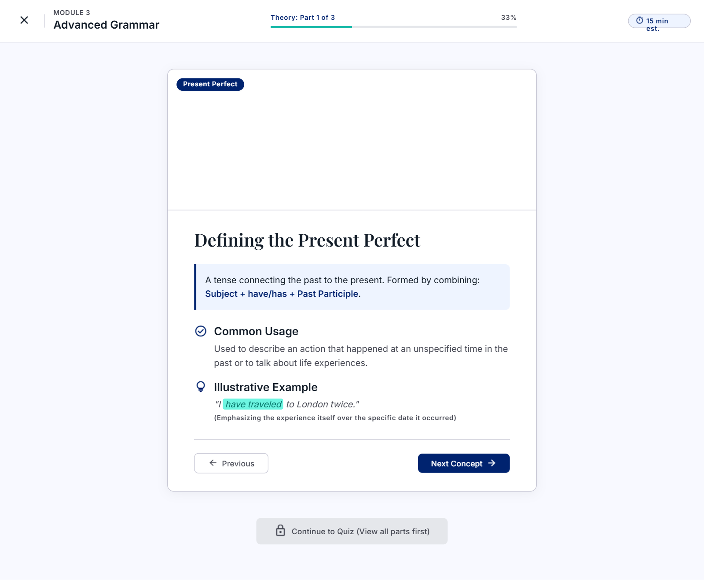
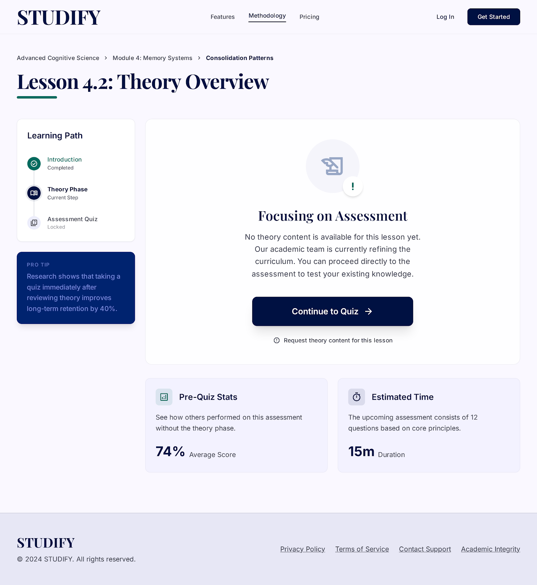

# Studify
## Use-Case Specification: Study Theory

**Version:** 1.0

---

### Revision History

| Date | Version | Description | Author |
| :--- | :--- | :--- | :--- |
| 23/Jul/26 | 1.0 | Initial draft of use-case specification UC4 – Study Theory |`Lê Kim Hằng` |

---

### Table of Contents

- [1. Use-Case Name](#1-use-case-name)
  - [1.1 Brief Description](#11-brief-description)
- [2. Flow of Events](#2-flow-of-events)
  - [2.1 Basic Flow](#21-basic-flow)
  - [2.2 Alternative Flows](#22-alternative-flows)
    - [2.2.1 Empty Theory Content](#221-empty-theory-content)
    - [2.2.2 Load Failure / Network Error](#222-load-failure--network-error)
    - [2.2.3 Learner Revisits Theory Content](#223-learner-revisits-theory-content)
- [3. Special Requirements](#3-special-requirements)
  - [3.1 Performance](#31-performance)
  - [3.2 Usability](#32-usability)
- [4. Preconditions](#4-preconditions)
  - [4.1 Lesson Loaded](#41-lesson-loaded)
- [5. Postconditions](#5-postconditions)
  - [5.1 Theory Section Marked as Reviewed](#51-theory-section-marked-as-reviewed)
- [6. Extension Points](#6-extension-points)
  - [6.1 Proceed to Quiz](#61-proceed-to-quiz)

---

## 1. Use-Case Name

**Study Theory**

### 1.1 Brief Description

This use case allows the Learner to review the condensed theoretical content of a lesson before taking the associated quiz. The theory content is presented in a concise, easy-to-digest format (e.g., key points, short explanations, examples) rather than a long-form article, so the Learner can grasp the core concepts quickly. This use case is included by the **Study Lesson** use case and represents the first stage of the lesson study flow.

*Figure 4.1: Condensed theory content ("Defining the Present Perfect"), Theory Part 1 of 3, with Previous/Next Concept navigation.*

---

## 2. Flow of Events

### 2.1 Basic Flow

This use case begins immediately after the system displays the lesson study screen and starts with the theory content section (triggered from the Study Lesson use case).

1. The system retrieves the condensed theory content associated with the selected lesson (key points, short explanations, illustrative examples).
2. The system displays the theory content on screen, organized into short, clearly separated sections (e.g., cards, bullet points, or paginated slides).
3. The Learner reads through the theory content, navigating between sections using "Next" / "Previous" controls if the content spans multiple sections.
4. Once the Learner has reviewed all theory sections, the system enables the "Continue to Quiz" button.
5. The Learner selects "Continue to Quiz."
6. The use case ends, and control returns to the Study Lesson use case, which proceeds to the Take Quiz use case.

### 2.2 Alternative Flows

#### 2.2.1 Empty Theory Content

*Trigger condition: The selected lesson has no theory content configured (data not yet entered).*

1. At step 1 of the Basic Flow, the system detects that no theory content exists for the lesson.
2. The system displays the message "No theory content is available for this lesson yet."
3. The system automatically enables the "Continue to Quiz" button so the Learner is not blocked.
4. The use case ends.

#### 2.2.2 Load Failure / Network Error

*Trigger condition: An error occurs while retrieving theory content from the server (network error, server 500 error, timeout).*

1. At step 1 of the Basic Flow, the request to fetch theory content fails.
2. The system displays a user-friendly error message, e.g., "Unable to load the lesson content. Please check your network connection and try again."
3. The system provides a "Retry" button.
4. If the Learner selects "Retry," the flow returns to step 1 of the Basic Flow.
5. If the Learner takes no action, the use case ends.

#### 2.2.3 Learner Revisits Theory Content

*Trigger condition: The Learner has already completed the quiz for this lesson previously and re-opens the lesson to review the theory content again.*

1. At step 2 of the Basic Flow, the system detects that the Learner has already completed this lesson.
2. The system displays the theory content in a read-only review mode, along with a note indicating the lesson has already been completed.
3. The Learner may still navigate through the content and choose "Continue to Quiz" to retake the quiz, or exit back to the lesson list.
4. The use case ends.

---

## 3. Special Requirements

### 3.1 Performance

Theory content must be fully loaded and rendered within a maximum of 2 seconds under normal network conditions.

### 3.2 Usability

Theory content must remain concise (condensed format), avoiding long blocks of text. Each section should be scannable within a few seconds, using visual aids (icons, highlighted keywords, short examples) to support quick comprehension.

---

## 4. Preconditions

### 4.1 Lesson Loaded

The lesson study screen has already been loaded and the Study Lesson use case has directed the flow to the theory content section.

---

## 5. Postconditions

### 5.1 Theory Section Marked as Reviewed

The system has recorded that the Learner has reviewed the theory content for this lesson, and the Learner has been directed to proceed to the quiz section.

---

## 6. Extension Points

### 6.1 Proceed to Quiz

This extension point occurs at step 5 of the Basic Flow, after the Learner selects "Continue to Quiz." This is the point where control returns to the Study Lesson use case, which then includes the **Take Quiz** use case.