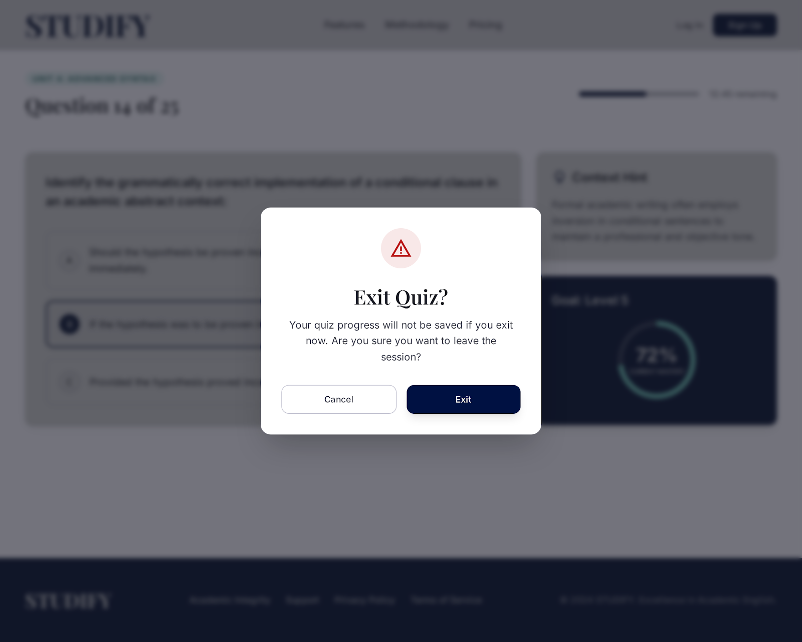

# Self-Study Dashboard
## Use-Case Specification: UC5 - Take Quiz

**Version:** 1.0

---

### Revision History

| Date | Version | Description | Author |
| :--- | :--- | :--- | :--- |
| 23/Jul/26 | 1.0 | Initial draft for UC5: Take Quiz | `Lê Kim Hằng` |

---

### Table of Contents

- [Self-Study Dashboard](#self-study-dashboard)
  - [Use-Case Specification: UC5 - Take Quiz](#use-case-specification-uc5---take-quiz)
    - [Revision History](#revision-history)
    - [Table of Contents](#table-of-contents)
  - [1. Use-Case Name](#1-use-case-name)
    - [1.1 Brief Description](#11-brief-description)
  - [2. Flow of Events](#2-flow-of-events)
    - [2.1 Basic Flow](#21-basic-flow)
    - [2.2 Alternative Flows](#22-alternative-flows)
      - [2.2.1 Incomplete Quiz Submission](#221-incomplete-quiz-submission)
      - [2.2.2 Session Timeout / Connectivity Loss](#222-session-timeout--connectivity-loss)
  - [3. Special Requirements](#3-special-requirements)
    - [3.1 Performance Requirement](#31-performance-requirement)
    - [3.2 Usability Requirement](#32-usability-requirement)
  - [4. Preconditions](#4-preconditions)
    - [4.1 Lesson Context](#41-lesson-context)
  - [5. Postconditions](#5-postconditions)
    - [5.1 State Update](#51-state-update)
  - [6. Extension Points](#6-extension-points)
    - [6.1 None](#61-none)

---

## 1. Use-Case Name
**UC5: Take Quiz**

### 1.1 Brief Description
This use case allows a Learner to complete a quiz as part of a specific lesson to assess their understanding of the studied material. The use case accommodates various question formats, specifically Multiple Choice (UC6) and Fill in the Blank (UC7). Upon submission, the system evaluates the answers and triggers the result display process.

---

## 2. Flow of Events

### 2.1 Basic Flow
1. The Learner selects the "Start Quiz" action from the lesson interface (originating from UC3: Study Lesson).
2. The system initializes the quiz session and retrieves the set of questions associated with the current lesson.
3. The system presents the quiz interface to the Learner, rendering specific question types:
   * **Multiple Choice (UC6):** System displays a question with predefined options. Learner selects one or more correct options.
   * **Fill in the Blank (UC7):** System displays text with missing words. Learner types the corresponding text into the input fields.
4. The Learner navigates through the questions, providing answers.
5. The Learner selects the "Submit Quiz" action.# Studify
## Use-Case Specification: Take Quiz

**Version:** 1.0

---

### Revision History

| Date | Version | Description | Author |
| :--- | :--- | :--- | :--- |
| 23/Jul/26 | 1.0 | Initial draft of use-case specification UC5 – Take Quiz | `<name>` |

---

### Table of Contents

- [1. Use-Case Name](#1-use-case-name)
  - [1.1 Brief Description](#11-brief-description)
- [2. Flow of Events](#2-flow-of-events)
  - [2.1 Basic Flow](#21-basic-flow)
  - [2.2 Alternative Flows](#22-alternative-flows)
    - [2.2.1 Multiple Choice Question Type](#221-multiple-choice-question-type)
    - [2.2.2 Fill in the Blank Question Type](#222-fill-in-the-blank-question-type)
    - [2.2.3 Learner Leaves a Question Unanswered](#223-learner-leaves-a-question-unanswered)
    - [2.2.4 Empty Quiz](#224-empty-quiz)
    - [2.2.5 Load Failure / Network Error](#225-load-failure--network-error)
    - [2.2.6 Learner Exits Quiz Early](#226-learner-exits-quiz-early)
- [3. Special Requirements](#3-special-requirements)
  - [3.1 Performance](#31-performance)
  - [3.2 Usability](#32-usability)
- [4. Preconditions](#4-preconditions)
  - [4.1 Theory Section Reviewed](#41-theory-section-reviewed)
- [5. Postconditions](#5-postconditions)
  - [5.1 Quiz Result Recorded](#51-quiz-result-recorded)
- [6. Extension Points](#6-extension-points)
  - [6.1 View Result](#61-view-result)

---

## 1. Use-Case Name

**Take Quiz**

### 1.1 Brief Description

This use case allows the Learner to answer a set of quiz questions associated with a lesson, in order to test their comprehension of the theory content just reviewed. The quiz may contain different question types, specifically **Multiple Choice** and **Fill in the Blank**, which are specializations (generalization relationship) of this use case. Once the Learner submits the quiz, this use case includes the **View Quiz Result** use case to present the outcome. This use case is included by the **Study Lesson** use case.

*Figure 5.1: Quiz question 2 of 10 (Fill in the Blank format), showing question progress, remaining time, and answer options.*

---

## 2. Flow of Events

### 2.1 Basic Flow

This use case begins immediately after the Learner selects "Continue to Quiz" from the Study Theory section (triggered from the Study Lesson use case).

1. The system retrieves the list of quiz questions associated with the selected lesson.
2. The system displays the first question to the Learner, along with the total number of questions and the current question index (e.g., "Question 1 of 10").
3. The system renders the question according to its type — either as a **Multiple Choice** question or a **Fill in the Blank** question — following the corresponding specialized flow.
4. The Learner submits an answer for the current question.
5. The system records the Learner's answer and moves to the next question.
6. Steps 3–5 repeat until the Learner has answered all questions in the quiz.
7. The Learner submits the completed quiz.
8. The system calculates the quiz score by comparing the Learner's answers against the correct answers.
9. The system saves the quiz attempt (score, answers, timestamp) associated with the Learner and the lesson.
10. The system executes the **View Quiz Result** use case *(<<include>>)* to present the outcome to the Learner.
11. The use case ends when the quiz result has been successfully displayed.

### 2.2 Alternative Flows

#### 2.2.1 Multiple Choice Question Type

*Specialization (generalization): applies when the current question is of type Multiple Choice.*

1. At step 3 of the Basic Flow, the system renders the question stem along with a set of predefined answer options (typically 2–4 options).
2. The Learner selects exactly one option as their answer.
3. The flow resumes at step 4 of the Basic Flow.

#### 2.2.2 Fill in the Blank Question Type

*Specialization (generalization): applies when the current question is of type Fill in the Blank.*

1. At step 3 of the Basic Flow, the system renders the question stem containing one or more blank input fields.
2. The Learner types the missing word(s) or phrase(s) directly into the input field(s).
3. The system may apply basic normalization (trimming whitespace, case-insensitive comparison) when the answer is later evaluated.
4. The flow resumes at step 4 of the Basic Flow.

#### 2.2.3 Learner Leaves a Question Unanswered

*Trigger condition: The Learner attempts to move to the next question or submit the quiz without answering the current question.*

1. At step 4 of the Basic Flow, the Learner selects "Next" or "Submit" without providing an answer.
2. The system displays a warning: "Please answer this question before continuing."
3. The flow resumes at step 3 of the Basic Flow for the current question.

#### 2.2.4 Empty Quiz

*Trigger condition: The selected lesson has no quiz questions configured.*

1. At step 1 of the Basic Flow, the system detects that no questions exist for the lesson's quiz.
2. The system displays the message "No quiz is available for this lesson yet."
3. The system marks the lesson as completed based on the theory section alone, and returns control to the Study Lesson use case.
4. The use case ends.

#### 2.2.5 Load Failure / Network Error

*Trigger condition: An error occurs while retrieving quiz questions or submitting quiz answers to the server (network error, server 500 error, timeout).*

1. At step 1 or step 7 of the Basic Flow, the corresponding request fails.
2. The system displays a user-friendly error message, e.g., "Unable to load/submit the quiz. Please check your network connection and try again."
3. The system provides a "Retry" button.
4. If the Learner selects "Retry," the flow returns to the step that failed.
5. If the Learner takes no action, the use case ends without the quiz result being recorded.

#### 2.2.6 Learner Exits Quiz Early

*Trigger condition: The Learner chooses to leave the quiz before answering all questions.*

1. At any point between step 3 and step 6 of the Basic Flow, the Learner selects "Exit" or navigates back.
2. The system displays a confirmation prompt: "Your quiz progress will not be saved if you exit now. Are you sure?"
3. If the Learner confirms, the system discards the in-progress quiz attempt and navigates the Learner back to the lesson screen.
4. If the Learner cancels, the flow resumes at the point it was interrupted.
5. The use case ends if the Learner confirmed the exit.

---

## 3. Special Requirements

### 3.1 Performance

The quiz questions must be fully loaded within a maximum of 2 seconds, and the quiz score must be calculated and the result displayed within 1 second after submission, under normal network conditions.

### 3.2 Usability

The quiz interface must clearly indicate question progress (e.g., a progress bar or "Question X of Y" indicator) and provide clear visual distinction between Multiple Choice and Fill in the Blank question formats so the Learner immediately understands how to answer each type.

---

## 4. Preconditions

### 4.1 Theory Section Reviewed

The Learner has completed the Study Theory use case for the current lesson (or the lesson has no theory content) before this use case is executed.

---

## 5. Postconditions

### 5.1 Quiz Result Recorded

The system has saved the Learner's quiz attempt, including the score, submitted answers, and timestamp, and the corresponding lesson progress has been updated accordingly.

---

## 6. Extension Points

### 6.1 View Result

This extension point occurs at step 10 of the Basic Flow, immediately after the Learner submits the completed quiz and the score has been calculated. This is the point where the **View Quiz Result** use case is included to present the outcome to the Learner.
6. The system validates that all required questions have been answered.
7. The system records the submitted answers, evaluates them against the correct keys, and calculates the final score.
8. The system transitions the Learner to **UC8: View Quiz Result** (*<<include>> relationship*).

### 2.2 Alternative Flows

#### 2.2.1 Incomplete Quiz Submission
If, at step 6 of the Basic Flow, the system detects that the Learner has left one or more questions unanswered:
1. The system displays a warning message indicating which questions are incomplete.
2. The system prompts the Learner to either "Return to Quiz" or "Submit Anyway".
3. If the Learner selects "Return to Quiz", the system returns to step 4 of the Basic Flow.
4. If the Learner selects "Submit Anyway", the system marks unanswered questions as incorrect and proceeds to step 7 of the Basic Flow.

#### 2.2.2 Session Timeout / Connectivity Loss
If the Learner's connection drops or the session times out before step 5 of the Basic Flow:
1. The system attempts to auto-save the Learner's current progress locally or to the server.
2. Upon reconnection, the system prompts the Learner to resume the quiz from the last saved state.
3. The flow resumes at step 4 of the Basic Flow.

---

## 3. Special Requirements

### 3.1 Performance Requirement
The system must retrieve and render the quiz questions within 2 seconds of the Learner initiating the quiz to ensure a seamless learning experience.

### 3.2 Usability Requirement
The quiz interface must visually indicate the Learner's progress (e.g., 5/10 questions answered) and allow for easy navigation between previous and next questions before final submission.

---

## 4. Preconditions

### 4.1 Lesson Context
The Learner must be logged into the Self-Study Dashboard, actively engaged in a lesson (UC3: Study Lesson), and ideally have completed studying the required theory (UC4: Study Theory) before accessing the quiz.

---

## 5. Postconditions

### 5.1 State Update
The Learner's quiz attempts, submitted answers, and calculated score are successfully saved in the system's database. The system is now ready to execute UC8 (View Quiz Result).

---

## 6. Extension Points

### 6.1 None
There are no explicit extension points for this specific use case (Note: UC8 extends to UC9, but UC5 strictly includes UC8).