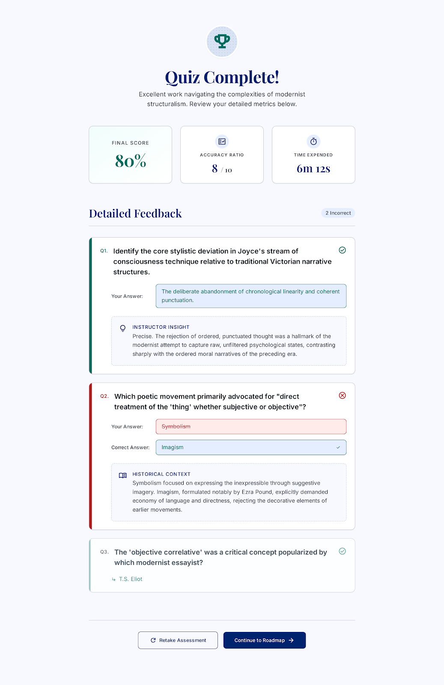

# Self-Study Dashboard
## Use-Case Specification: UC8 - View Quiz/Assessment Result

**Version:** 1.1

---

### Revision History

| Date | Version | Description | Author |
| :--- | :--- | :--- | :--- |
| 23/Jul/26 | 1.1 | Updated to handle Level Assessment results and Level Advancement rules (F2.2) | `Lê Kim Hằng` |
---

### Table of Contents

- [Self-Study Dashboard](#self-study-dashboard)
  - [Use-Case Specification: UC8 - View Quiz/Assessment Result](#use-case-specification-uc8---view-quizassessment-result)
    - [Revision History](#revision-history)
    - [Table of Contents](#table-of-contents)
  - [1. Use-Case Name](#1-use-case-name)
    - [1.1 Brief Description](#11-brief-description)
  - [2. Flow of Events](#2-flow-of-events)
    - [2.1 Basic Flow](#21-basic-flow)
    - [2.2 Alternative Flows](#22-alternative-flows)
      - [2.2.1 Level Assessment Passed (>= 90%)](#221-level-assessment-passed--90)
      - [2.2.2 Level Assessment Failed (< 90%)](#222-level-assessment-failed--90)
  - [3. Special Requirements](#3-special-requirements)
    - [3.1 Visual Feedback Requirement](#31-visual-feedback-requirement)
  - [4. Preconditions](#4-preconditions)
    - [4.1 Submission Completed](#41-submission-completed)
  - [5. Postconditions](#5-postconditions)
    - [5.1 Session Resolution](#51-session-resolution)
  - [6. Extension Points](#6-extension-points)
    - [6.1 Update Learning Progress](#61-update-learning-progress)
    - [6.2 Unlock Next CEFR Level](#62-unlock-next-cefr-level)

---

## 1. Use-Case Name
**UC8: View Quiz/Assessment Result**

### 1.1 Brief Description
This use case presents the calculated results, score, and detailed feedback to the Learner after submitting either a lesson practice quiz (UC5) or a comprehensive Level Assessment Test (UC12). It evaluates compliance with pass/fail criteria and triggers progress updates (UC9) or level advancement (UC1).

*Figure 8.1: "Quiz Complete!" result screen showing final score, accuracy ratio, time expended, and detailed per-question feedback.*

---

## 2. Flow of Events

### 2.1 Basic Flow
1. The use case begins automatically when UC5 (Take Practice Quiz) or UC12 (Take Level Assessment Test) submits answers for evaluation.
2. The system retrieves evaluated answers, calculates score percentage, and identifies correct vs. incorrect responses.
3. The system displays the summary score board (score %, correct ratio, time taken).
4. The system presents a detailed question-by-question review showing submitted choices, correct keys, and explanation notes.
5. The Learner clicks "Continue".
6. The use case ends, returning the Learner to the lesson overview or roadmap interface.

### 2.2 Alternative Flows

#### 2.2.1 Level Assessment Passed (>= 90%)
If the submission originates from UC12 (Level Assessment Test) and the score is 90% or higher:
1. The system displays a prominent "Level Mastery Achieved!" celebration dialog.
2. The system triggers the extension point **6.2 Unlock Next CEFR Level** to unlock the subsequent level on the roadmap (UC1).
3. The flow proceeds to step 4 of the Basic Flow.

#### 2.2.2 Level Assessment Failed (< 90%)

If the submission originates from UC12 and the score is below 90%:
1. The system displays a message: "Score below 90%. Level advancement requires 90%+ on this test or 100% roadmap completion."
2. The system offers options to "Retake Assessment" or "Review Missing Lessons".
3. The flow proceeds to step 4 of the Basic Flow.

---

## 3. Special Requirements

### 3.1 Visual Feedback Requirement
Score indicators must clearly display pass/fail status using distinct visual hierarchy (e.g., Green/Badge for >=90% level pass, Yellow/Red for retake required).

---

## 4. Preconditions

### 4.1 Submission Completed
The Learner must have submitted answers via UC5 or UC12, and the system grading engine must have completed processing the submission.

---

## 5. Postconditions

### 5.1 Session Resolution
Assessment attempt data is archived in the user profile, and progression rules are updated.

---

## 6. Extension Points

### 6.1 Update Learning Progress
**Location:** Step 3 of Basic Flow.
**Description:** Extends to **UC9: Track Learning Progress** to update real-time statistics.

### 6.2 Unlock Next CEFR Level
**Location:** Step 2 of Alternative Flow 2.2.1.
**Description:** Extends to **UC1: View Learning Roadmap** to change the lock status of the next CEFR level from "Locked" to "Available".