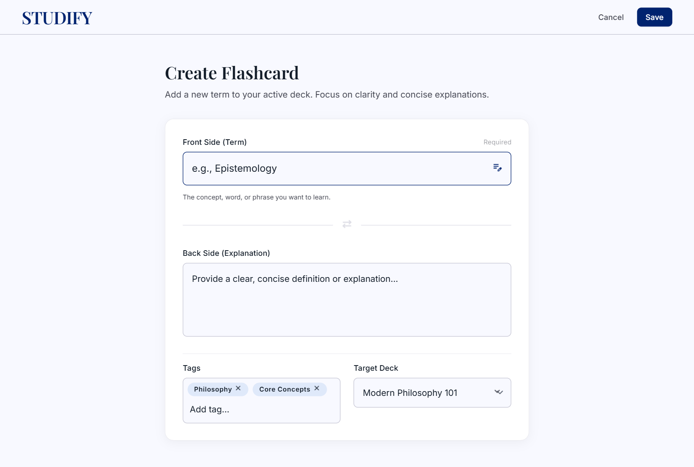
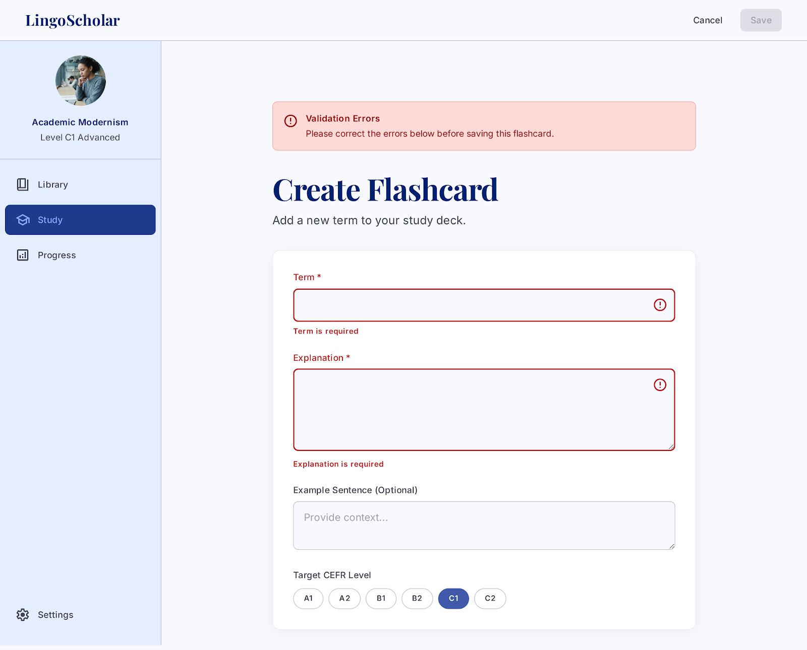
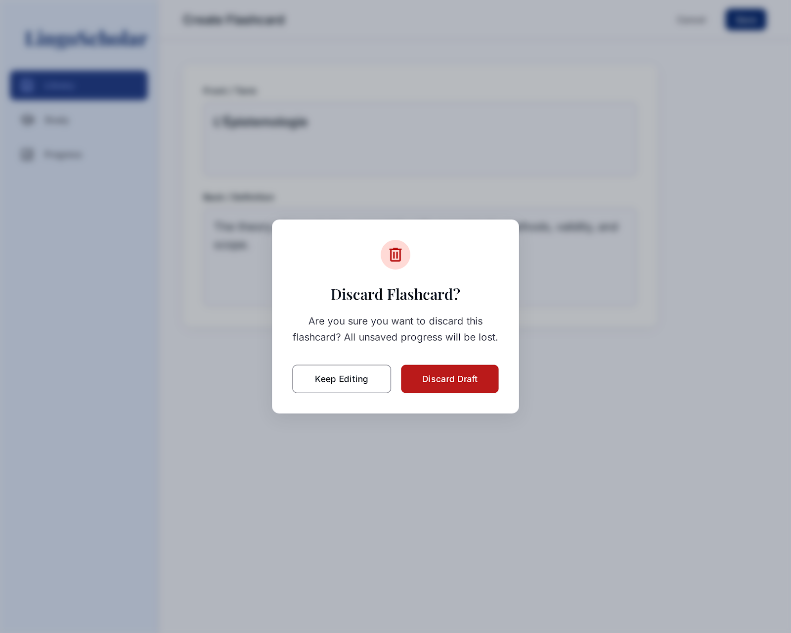

# STUDIFY
## Use-Case Specification: Enter Flashcard Manually

**Version:** 1.0

---

### Revision History

| Date | Version | Description | Author |
| :--- | :--- | :--- | :--- |
| `23/07/2026` | `1.0` | Initial version of Enter Flashcard Manually Use-Case Specification | `Group 09` |

---

### Table of Contents

1. [Use-Case Name](#1-use-case-name)
   1. [Brief Description](#11-brief-description)
2. [Flow of Events](#2-flow-of-events)
   1. [Basic Flow](#21-basic-flow)
   2. [Alternative Flows](#22-alternative-flows)
      1. [Missing Required Fields](#221-missing-required-fields)
      2. [User Cancels the Operation](#222-user-cancels-the-operation)
      3. [Duplicate Flashcard Detected](#223-duplicate-flashcard-detected)
3. [Special Requirements](#3-special-requirements)
4. [Preconditions](#4-preconditions)
5. [Postconditions](#5-postconditions)
6. [Extension Points](#6-extension-points)

---

## 1. Use-Case Name

### 1.1 Brief Description

This use case describes the process by which a User manually creates a flashcard by typing the term (front side) and its explanation (back side) directly into the system. The user may also optionally assign tags to the flashcard for organization and filtering. Upon submission, the system validates and saves the flashcard to the user's personal flashcard collection. This use case is a specialization of the **Create Flashcard** use case (UC1).

---

## 2. Flow of Events

### 2.1 Basic Flow

This use case starts when the User selects the option to create a new flashcard manually from the flashcard management interface.

1. The system displays the flashcard creation form, providing two main input fields:
   - **Term** (front side of the card): a text field for the vocabulary word, phrase, or concept.
   - **Explanation** (back side of the card): a text field for the definition, translation, or description.

2. The User types the desired term into the **Term** field.

3. The User types the corresponding explanation into the **Explanation** field.

4. Optionally, the User adds one or more tags to the flashcard by interacting with the tag input component (refer to UC5 – Add Tags).

5. The User clicks the **Save** (or **Create**) button to submit the flashcard.

6. The system validates the input:
   - The **Term** field must not be empty.
   - The **Explanation** field must not be empty.

7. The system saves the new flashcard to the User's flashcard collection, associating it with any tags provided.

8. The system displays a success confirmation message (e.g., "Flashcard created successfully").

9. The use case ends successfully. The new flashcard is now available in the User's flashcard list.

---

### 2.2 Alternative Flows

#### 2.2.1 Missing Required Fields

This alternative flow occurs when the User attempts to save the flashcard without filling in one or both required fields.

1. The User clicks the **Save** button without providing a value for the **Term** field, the **Explanation** field, or both.
2. The system detects that one or more required fields are empty.
3. The system highlights the empty field(s) with a visual indicator (e.g., red border) and displays an inline error message (e.g., "Term is required" or "Explanation is required").
4. The form remains open with the User's existing input preserved.
5. The flow returns to Step 2 or Step 3 of the Basic Flow.

#### 2.2.2 User Cancels the Operation

This alternative flow occurs when the User decides to discard the flashcard creation.

1. At any point before saving, the User clicks the **Cancel** button or navigates away from the creation form.
2. The system displays a confirmation dialog asking: "Are you sure you want to discard this flashcard?"
3. If the User confirms, the system discards all entered data and returns the User to the flashcard management interface.
4. If the User declines, the system closes the confirmation dialog and returns the User to the creation form with all entered data preserved.
5. The use case ends.

#### 2.2.3 Duplicate Flashcard Detected

This alternative flow occurs when the system detects a flashcard with an identical term already exists in the User's collection.

1. The User submits the flashcard creation form with a term that already exists in their personal collection.
2. The system detects the duplicate term.
3. The system warns the User: "A flashcard with this term already exists. Do you want to save a duplicate or cancel?"
4. If the User chooses to save, the system saves the new flashcard as a separate entry and the flow continues at Step 8 of the Basic Flow.
5. If the User chooses to cancel, the system discards the submission and the flow returns to Step 2 of the Basic Flow.

---

## 3. Special Requirements

### 3.1 Usability Requirements

- The flashcard creation form must be simple, intuitive, and accessible with minimal clicks from the main navigation.
- Both the Term and Explanation fields must support multi-line text input to accommodate longer content.
- Inline validation feedback must be displayed immediately upon attempting to submit incomplete data.

### 3.2 Performance Requirements

- The flashcard must be saved and confirmed within 1 second under normal network conditions.
- The form must render and be interactive within 500 milliseconds of the user triggering the creation action.

### 3.3 Data Integrity Requirements

- All entered text must be stored exactly as typed, preserving spacing, capitalization, and special characters.
- The system must ensure that the created flashcard is durably saved and not lost in the event of a page refresh after successful submission.

---

## 4. Preconditions

### 4.1 User Authentication

- The User must be authenticated (logged in) to the STUDIFY system.

### 4.2 Flashcard Module Availability

- The flashcard management module must be operational and accessible.

### 4.3 Flashcard Creation Interface Displayed

- The User has navigated to the flashcard creation interface and selected the manual entry option.

---

## 5. Postconditions

### 5.1 Successful Flashcard Creation

After the use case is completed successfully:

- A new flashcard record is created and persisted in the system, associated with the authenticated User's account.
- The flashcard contains the Term entered by the User on the front side.
- The flashcard contains the Explanation entered by the User on the back side.
- Any tags provided by the User are associated with the new flashcard.
- The new flashcard is immediately visible in the User's flashcard collection.

### 5.2 Cancelled Creation

If the User cancels the operation:

- No new flashcard is created.
- The User's existing flashcard collection remains unchanged.
- The system returns the User to the flashcard management interface.

---

## 6. Extension Points

### 6.1 Add Tags

This use case extends to UC5 (Add Tags) when, at Step 4 of the Basic Flow, the User chooses to assign one or more tags to the flashcard being created.

### 6.2 Write Explanation

This use case includes UC4 (Write Explanation) as the User must provide an explanation for the flashcard term during the manual entry process (Step 3 of the Basic Flow).

---

## 7. UI Prototype

### 7.1 Basic Flow — Manual Entry Form (Term Field Active)
*Shows the creation form with the Term input focused and placeholder text visible.*

### 7.2 Alternative Flow 2.2.1 — Missing Required Field Error
*Shows inline red error border and message when Term or Explanation is empty.*

### 7.3 Alternative Flow 2.2.2 — Cancel Confirmation Dialog
*Shows the discard confirmation modal.*

