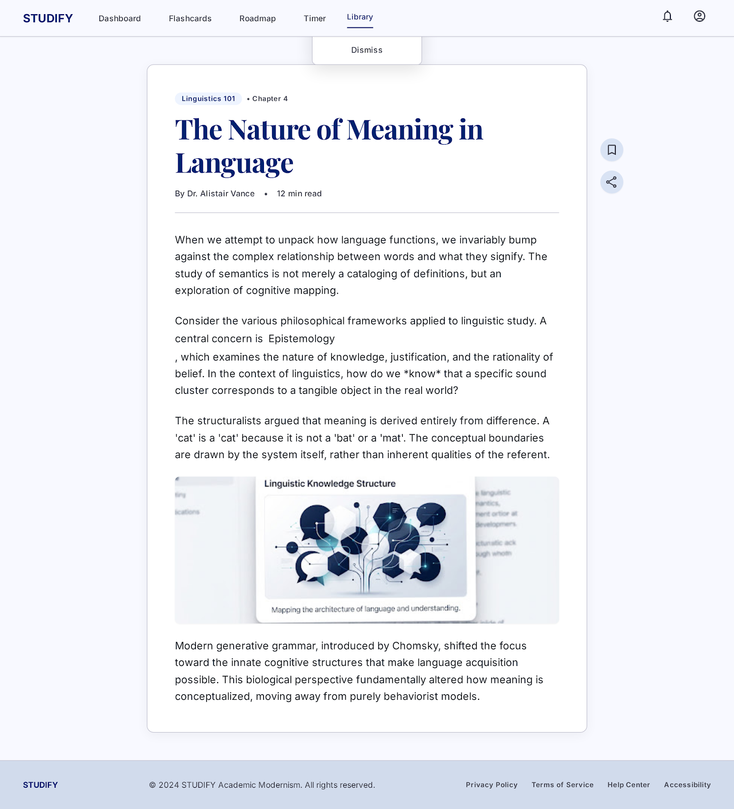
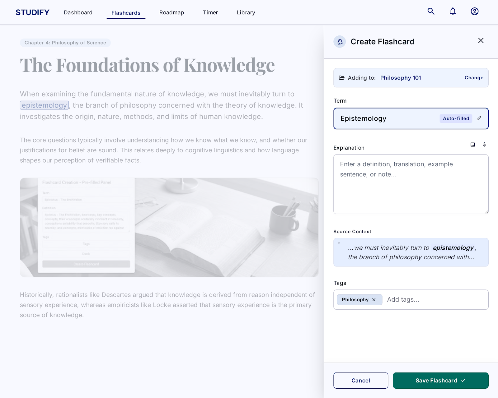
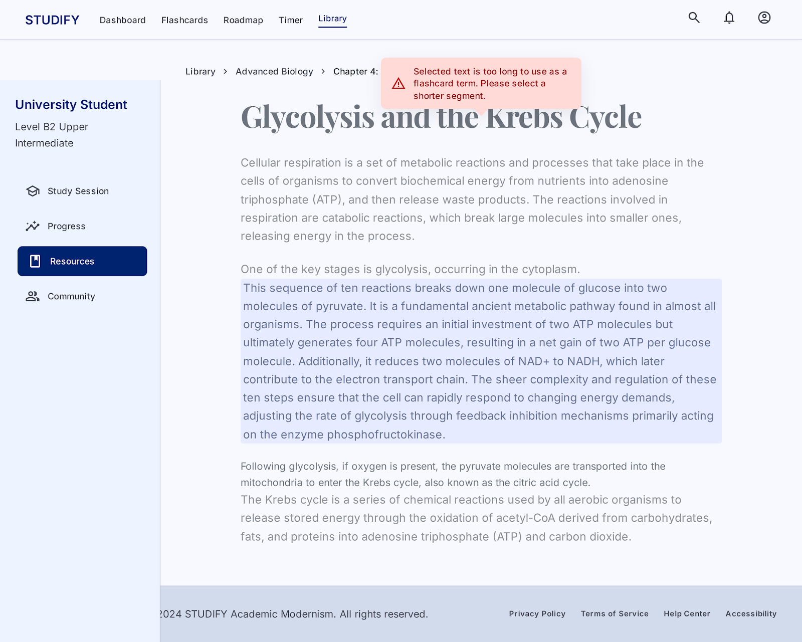
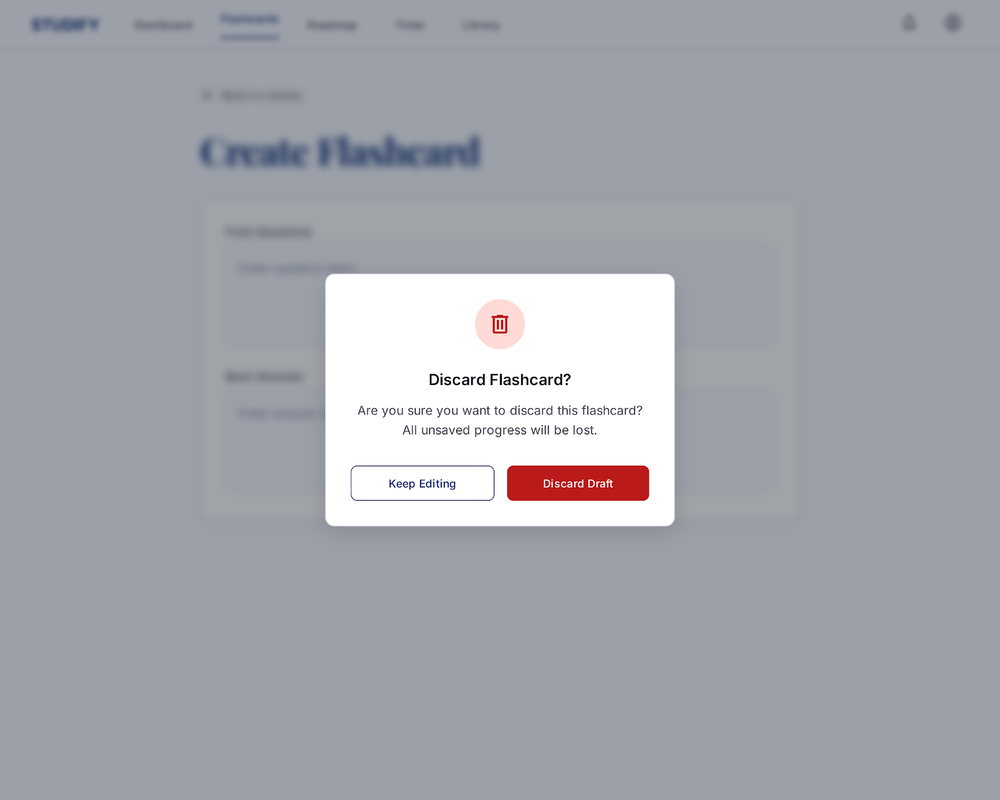

# STUDIFY
## Use-Case Specification: Create Flashcard from Highlighted Text

**Version:** 1.0

---

### Revision History

| Date | Version | Description | Author |
| :--- | :--- | :--- | :--- |
| `23/07/2026` | `1.0` | Initial version of Create Flashcard from Highlighted Text Use-Case Specification | `Group 09` |

---

### Table of Contents

1. [Use-Case Name](#1-use-case-name)
   1. [Brief Description](#11-brief-description)
2. [Flow of Events](#2-flow-of-events)
   1. [Basic Flow](#21-basic-flow)
   2. [Alternative Flows](#22-alternative-flows)
      1. [User Deselects Text Before Confirming](#221-user-deselects-text-before-confirming)
      2. [Selected Text Exceeds Maximum Length](#222-selected-text-exceeds-maximum-length)
      3. [User Cancels the Operation](#223-user-cancels-the-operation)
3. [Special Requirements](#3-special-requirements)
4. [Preconditions](#4-preconditions)
5. [Postconditions](#5-postconditions)
6. [Extension Points](#6-extension-points)

---

## 1. Use-Case Name

### 1.1 Brief Description

This use case describes the process by which a User creates a flashcard by highlighting (selecting) a word or phrase from text displayed within the STUDIFY application (e.g., within a lesson, reading passage, or vocabulary article). Upon selecting the text, the system automatically populates the **Term** field of a new flashcard with the highlighted text, and the User then provides the explanation. This use case is a specialization of the **Create Flashcard** use case (UC1) and extends it via an automated text capture mechanism.

---

## 2. Flow of Events

### 2.1 Basic Flow

This use case starts when the User is reading or viewing text content within the STUDIFY application and selects (highlights) a word or phrase.

1. The User highlights a word or phrase from a text passage displayed in the application (e.g., a lesson article, vocabulary list, or reading exercise).

2. The system detects the text selection event and displays a contextual action tooltip or popup near the selected text, presenting an option such as **"Create Flashcard"**.

3. The User clicks the **"Create Flashcard"** option in the tooltip/popup.

4. The system opens the flashcard creation panel (or modal) with the **Term** field automatically pre-populated with the highlighted text.

5. The User reviews the pre-populated term and, if necessary, edits it.

6. The User types or fills in the **Explanation** field for the flashcard (refer to UC4 – Write Explanation).

7. Optionally, the User adds one or more tags to the flashcard (refer to UC5 – Add Tags).

8. The User clicks the **Save** (or **Create**) button.

9. The system validates the input:
   - The **Term** field must not be empty.
   - The **Explanation** field must not be empty.

10. The system saves the new flashcard to the User's flashcard collection, associating it with any tags provided.

11. The system displays a success confirmation message (e.g., "Flashcard created successfully").

12. The system closes the creation panel and returns the User to the text content they were reading.

13. The use case ends successfully. The new flashcard is immediately available in the User's flashcard collection.

---

### 2.2 Alternative Flows

#### 2.2.1 User Deselects Text Before Confirming

This alternative flow occurs when the User highlights text but then deselects it before initiating flashcard creation.

1. The User highlights a word or phrase.
2. The system displays the contextual tooltip/popup.
3. The User clicks elsewhere on the page, causing the text selection to be cleared.
4. The system automatically closes the tooltip/popup without creating a flashcard.
5. The use case ends without a flashcard being created.

#### 2.2.2 Selected Text Exceeds Maximum Length

This alternative flow occurs when the User highlights a text segment that is too long to serve as a flashcard term.

1. The User highlights a text passage that exceeds the maximum allowed character limit for the **Term** field (e.g., more than 200 characters).
2. The system detects that the selected text is too long.
3. The system displays a warning message in the tooltip: "Selected text is too long to use as a flashcard term. Please select a shorter segment."
4. The tooltip does not display the **"Create Flashcard"** action.
5. The use case ends without proceeding, and the User may re-select a shorter text segment to restart the flow.

#### 2.2.3 User Cancels the Operation

This alternative flow occurs when the User opens the flashcard creation panel but decides not to proceed.

1. After the system opens the flashcard creation panel (Step 4 of the Basic Flow), the User clicks the **Cancel** button or closes the panel.
2. The system displays a confirmation dialog: "Are you sure you want to discard this flashcard?"
3. If the User confirms, the system discards all data in the panel and closes it, returning the User to the text content.
4. If the User declines, the system returns the User to the creation panel with all previously entered data preserved.
5. The use case ends.

---

## 3. Special Requirements

### 3.1 Usability Requirements

- The contextual tooltip/popup must appear promptly (within 300 milliseconds) after the User completes a text selection.
- The tooltip must be positioned near the selected text without obstructing the surrounding content.
- The pre-populated term in the flashcard creation form must be visually distinct (e.g., displayed in a highlighted style) to make it clear that it was auto-filled.

### 3.2 Performance Requirements

- The flashcard creation panel must open and render within 500 milliseconds of the User clicking the "Create Flashcard" option.
- Saving the flashcard must complete within 1 second under normal network conditions.

### 3.3 Compatibility Requirements

- The text highlight detection mechanism must function correctly on all supported desktop browsers (Chrome, Firefox, Edge, Safari).
- The feature must support text selection via both mouse drag and keyboard-based selection (Shift + Arrow Keys).

### 3.4 Data Accuracy Requirements

- The system must capture the selected text exactly as it appears, preserving case, spacing, punctuation, and diacritics.

---

## 4. Preconditions

### 4.1 User Authentication

- The User must be authenticated (logged in) to the STUDIFY system.

### 4.2 Text Content is Displayed

- The User must be viewing a page or module within STUDIFY that displays readable text content (e.g., a lesson article, reading passage, or vocabulary list).

### 4.3 Text Selection Capability

- The User's browser and device must support standard text selection.

---

## 5. Postconditions

### 5.1 Successful Flashcard Creation

After the use case is completed successfully:

- A new flashcard record is created and persisted in the system, associated with the authenticated User's account.
- The **Term** field of the flashcard contains the originally highlighted text (or the User's edited version of it).
- The **Explanation** field contains the text entered by the User.
- Any tags assigned by the User are associated with the new flashcard.
- The new flashcard is immediately visible in the User's flashcard collection.
- The User is returned to the text content page without losing their reading position.

### 5.2 Cancelled or Aborted Creation

If the User cancels or the operation is aborted:

- No new flashcard is created.
- The User's existing flashcard collection remains unchanged.
- The User is returned to the content they were reading.

---

## 6. Extension Points

### 6.1 Add Tags

This use case extends to UC5 (Add Tags) when, at Step 7 of the Basic Flow, the User chooses to assign one or more tags to the flashcard being created from the highlighted text.

### 6.2 Write Explanation

This use case includes UC4 (Write Explanation) as the User must provide an explanation (back side of the card) after the Term is auto-populated from the highlighted text (Step 6 of the Basic Flow).

---

## 7. UI Prototype

### 7.1 Basic Flow — Highlighted Text with Contextual Tooltip
*Shows text selected in a reading passage with the "Create Flashcard" tooltip appearing nearby.*

### 7.2 Basic Flow — Creation Panel with Pre-filled Term
*Shows the flashcard creation panel with Term auto-populated from the highlighted text.*

### 7.3 Alternative Flow 2.2.2 — Selected Text Too Long Warning
*Shows the tooltip/warning when the selected text exceeds the maximum term length.*

### 7.4 Alternative Flow 2.2.3 — Cancel Confirmation Dialog
*Shows the discard confirmation modal when the User exits the creation panel.*

