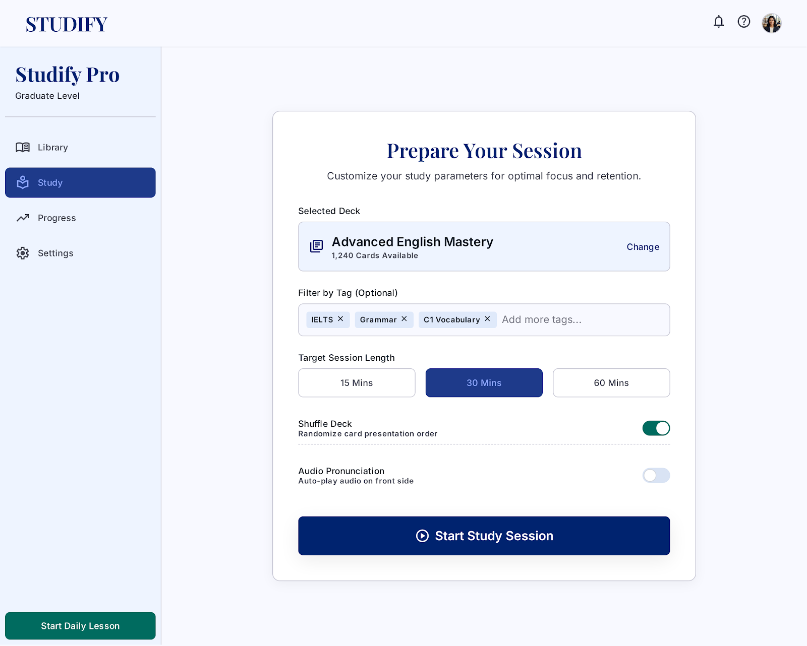
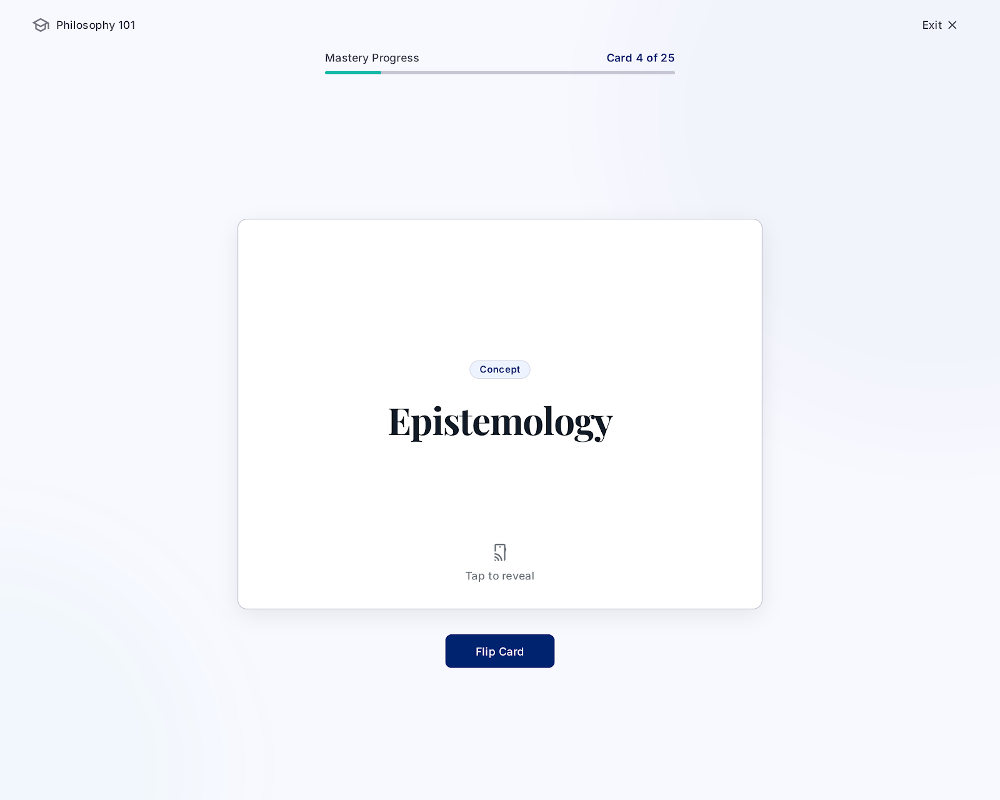
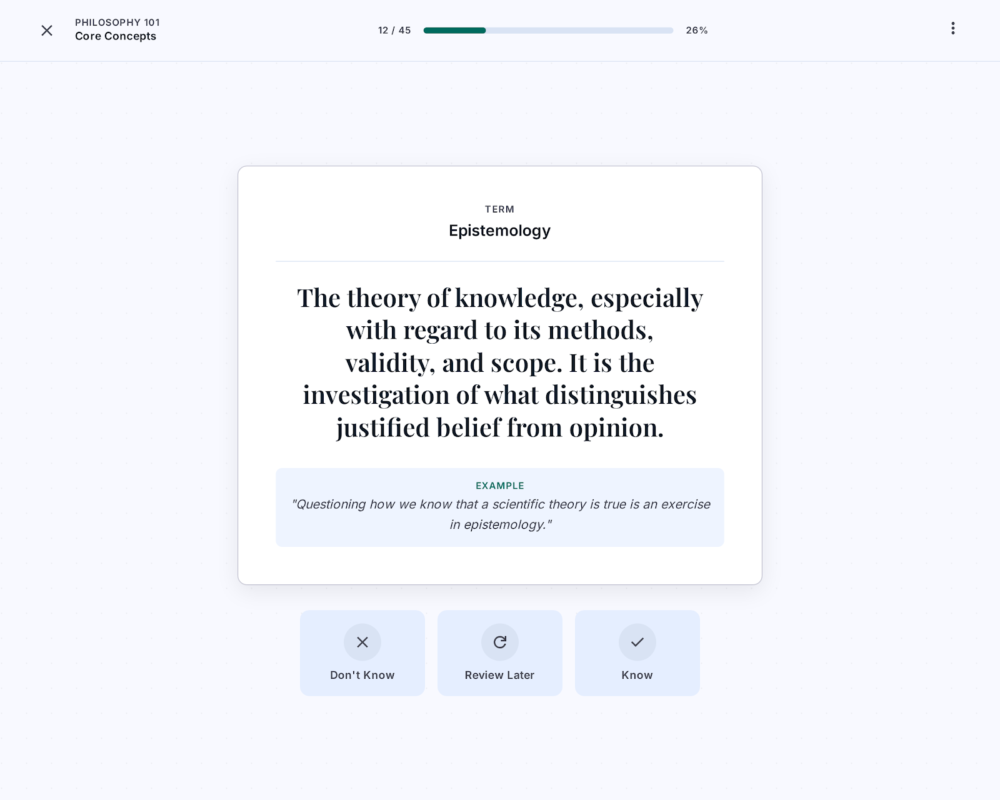
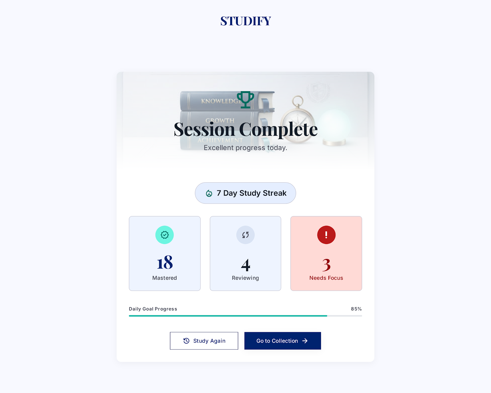

# STUDIFY
## Use-Case Specification: Study Flashcards

**Version:** 1.0

---

### Revision History

| Date | Version | Description | Author |
| :--- | :--- | :--- | :--- |
| `23/07/2026` | `1.0` | Initial version of Study Flashcards Use-Case Specification | `Group 09` |

---

### Table of Contents

1. [Use-Case Name](#1-use-case-name)
   1. [Brief Description](#11-brief-description)
2. [Flow of Events](#2-flow-of-events)
   1. [Basic Flow](#21-basic-flow)
   2. [Alternative Flows](#22-alternative-flows)
      1. [User Applies a Tag Filter Before Studying](#221-user-applies-a-tag-filter-before-studying)
      2. [User Reaches the End of the Deck](#222-user-reaches-the-end-of-the-deck)
      3. [User Exits the Study Session Early](#223-user-exits-the-study-session-early)
      4. [Flashcard Collection is Empty](#224-flashcard-collection-is-empty)
3. [Special Requirements](#3-special-requirements)
4. [Preconditions](#4-preconditions)
5. [Postconditions](#5-postconditions)
6. [Extension Points](#6-extension-points)

---

## 1. Use-Case Name

### 1.1 Brief Description

This use case describes the process by which a User conducts a flashcard study session within the STUDIFY application. During a study session, the User is presented with flashcards one at a time. For each card, the User views the **Term** (front side), optionally flips the card to view the **Explanation** (back side), and then marks their study status. The study session may be filtered by tags (UC6 – Filter Flashcards by Tag) to focus on a specific subset of cards. This use case includes UC8 (Flip Card to View Explanation) and UC9 (Mark Study Status) as mandatory components.

---

## 2. Flow of Events

### 2.1 Basic Flow

This use case starts when the User navigates to the Study Flashcards section and initiates a study session.

1. The system displays the **Study Session** setup screen or, if no setup is needed, immediately loads the first flashcard from the User's full flashcard collection.

2. Optionally, before starting, the User may apply a tag filter to select a specific subset of flashcards to study (refer to UC6 – Filter Flashcards by Tag). If filtered, only flashcards matching the selected tag(s) are included in the session deck.

3. The system shuffles (or presents in order) the flashcards and displays the first flashcard with:
   - The **Term** displayed prominently on the front face.
   - A **Flip** button or tap area to reveal the back side.
   - A session progress indicator (e.g., "Card 1 of 20").

4. The User reads the **Term** displayed on the front of the flashcard.

5. The User flips the card to view the **Explanation** on the back side (refer to UC8 – Flip Card to View Explanation). This is a mandatory included use case.

6. After reviewing the Explanation, the User marks their study status for the current card (refer to UC9 – Mark Study Status). This is a mandatory included use case.

7. Based on the marked status, the system determines whether to remove the card from the current session queue or keep it for re-review.

8. The system advances to the next flashcard in the deck and displays it (repeating from Step 4).

9. The system continues until all flashcards in the session deck have been reviewed.

10. The use case ends when the study session is complete.

---

### 2.2 Alternative Flows

#### 2.2.1 User Applies a Tag Filter Before Studying

This alternative flow occurs when the User wants to study a specific tagged subset of flashcards. This delegates to the full specification in UC6 (Filter Flashcards by Tag).

1. At the study session setup screen (Step 1 of the Basic Flow), the User clicks the **Filter by Tag** control.
2. The system displays the Tag Filter component populated with the User's tag library.
3. The User selects one or more tags.
4. The system loads only the flashcards associated with the selected tag(s) into the session deck.
5. The system displays the number of cards in the filtered deck (e.g., "15 cards tagged 'IELTS Vocabulary'").
6. The flow resumes at Step 3 of the Basic Flow.

#### 2.2.2 User Reaches the End of the Deck

This alternative flow occurs when the User has reviewed all flashcards in the session deck.

1. The User completes the last flashcard in the deck (marks their status for it).
2. The system detects that there are no remaining cards.
3. The system displays a **Session Summary** screen showing:
   - Total cards reviewed.
   - Breakdown by study status (e.g., number marked as "Know", "Don't Know", "Review Later").
   - Study streak or progress metrics.
4. The system prompts the User with options:
   - **"Study Again"**: Restart the session with the same deck.
   - **"Review Difficult Cards"**: Start a new session with only cards marked "Don't Know" or "Review Later".
   - **"Go to Collection"**: Return to the flashcard collection.
5. The User selects an option.
6. The use case ends.

#### 2.2.3 User Exits the Study Session Early

This alternative flow occurs when the User quits the session before finishing all cards.

1. The User clicks the **"Exit"** or **"End Session"** button during the study session.
2. The system asks: "Are you sure you want to end this session? Your progress will be saved."
3. If the User confirms, the system saves the progress for all cards reviewed so far and displays a partial session summary.
4. If the User declines, the system returns to the current flashcard.
5. The use case ends.

#### 2.2.4 Flashcard Collection is Empty

This alternative flow occurs when the User has no flashcards to study.

1. The User navigates to the Study Flashcards section.
2. The system detects that the User's flashcard collection is empty (or that the applied tag filter returns no cards).
3. The system displays an empty state message: "You have no flashcards to study. Create some flashcards to get started!" with a shortcut button to create a new flashcard.
4. The use case ends without starting a session.

---

## 3. Special Requirements

### 3.1 Usability Requirements

- The study interface must be clean, distraction-free, and optimized for focused review.
- The card flip animation must be smooth and visually indicate the transition from the Term side to the Explanation side.
- The progress indicator must always be visible during the session (e.g., a progress bar and card counter).
- Navigation controls (previous card, next card, exit) must be clearly accessible.

### 3.2 Performance Requirements

- Each flashcard must load and display within 200 milliseconds of the previous card being dismissed.
- Study session data (study status updates) must be saved asynchronously in the background without interrupting the User's flow.

### 3.3 Spaced Repetition Requirements

- The system should support a basic spaced repetition algorithm (e.g., SM-2) to prioritize cards based on study status and review history, scheduling "difficult" cards for more frequent review.

### 3.4 Accessibility Requirements

- The card flip action must be triggerable via keyboard (e.g., Spacebar to flip, arrow keys to mark status).
- All status buttons must have distinct visual labels and keyboard shortcuts.

---

## 4. Preconditions

### 4.1 User Authentication

- The User must be authenticated (logged in) to the STUDIFY system.

### 4.2 Non-Empty Flashcard Collection

- The User must have at least one flashcard in their personal collection (or in the tag-filtered subset) to start a study session.

---

## 5. Postconditions

### 5.1 Successful Session Completion

After the use case is completed successfully:

- The study status (e.g., "Know", "Don't Know", "Review Later") for each reviewed flashcard is saved and associated with that flashcard.
- The User's overall study progress metrics (e.g., daily cards reviewed, study streak) are updated.
- The session summary is displayed to the User.

### 5.2 Early Exit

If the User exits the session before completion:

- The study status for all reviewed cards is saved.
- Cards not yet reviewed retain their previous study status.

### 5.3 Session with Tag Filter

If the User studied with a tag filter applied:

- Only the study statuses of the filtered cards are updated.
- Cards outside the filter are unaffected.

---

## 6. Extension Points

### 6.1 Filter Flashcards by Tag

This use case is extended by UC6 (Filter Flashcards by Tag) at the study session setup step (Step 2 of the Basic Flow), when the User chooses to restrict the study deck to a specific tag-filtered subset of flashcards.

### 6.2 Flip Card to View Explanation

This use case includes UC8 (Flip Card to View Explanation) as a mandatory step (Step 5 of the Basic Flow). For each flashcard, the User must have the ability to flip the card to see the Explanation on the back side.

### 6.3 Mark Study Status

This use case includes UC9 (Mark Study Status) as a mandatory step (Step 6 of the Basic Flow). After reviewing each card, the User must mark their self-assessed study status.

---

## 7. UI Prototype

### 7.1 Basic Flow — Study Session Setup Screen
*Shows the session configuration screen with optional tag filter and "Start Session" button.*

### 7.2 Basic Flow — Flashcard Front (Term Visible, Flip Prompt)
*Shows the card front with Term, progress bar (e.g., "Card 1 of 20"), and Flip button.*

### 7.3 Basic Flow — Flashcard Back (Explanation + Status Buttons)
*Shows the flipped card with Explanation revealed and Know / Review Later / Don't Know buttons.*

### 7.4 Alternative Flow 2.2.2 — Session Summary Screen
*Shows the end-of-deck summary with status breakdown and "Study Again / Review Difficult / Go to Collection" options.*

