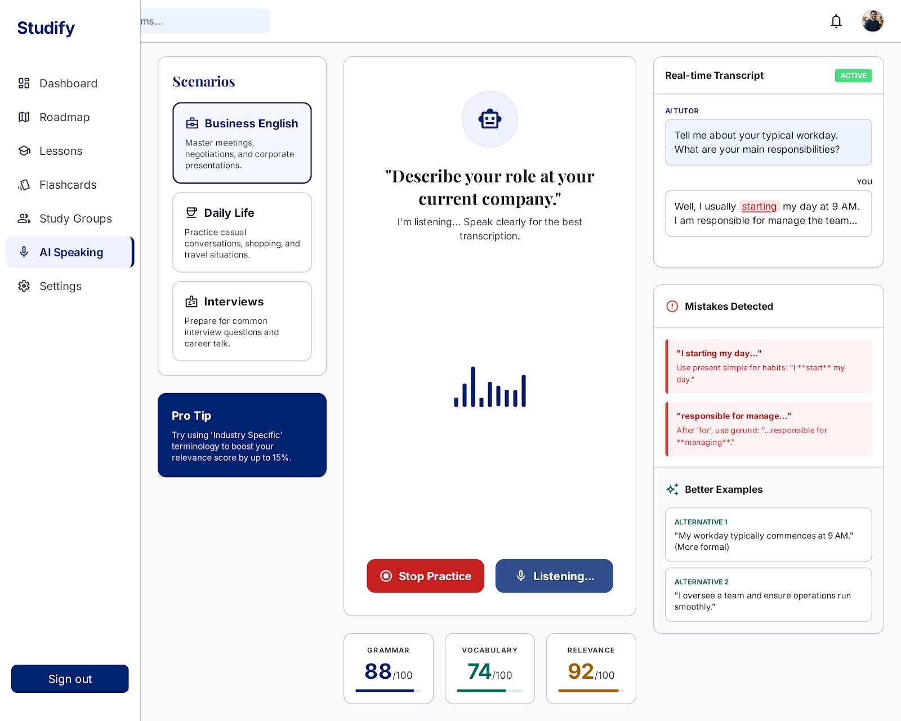
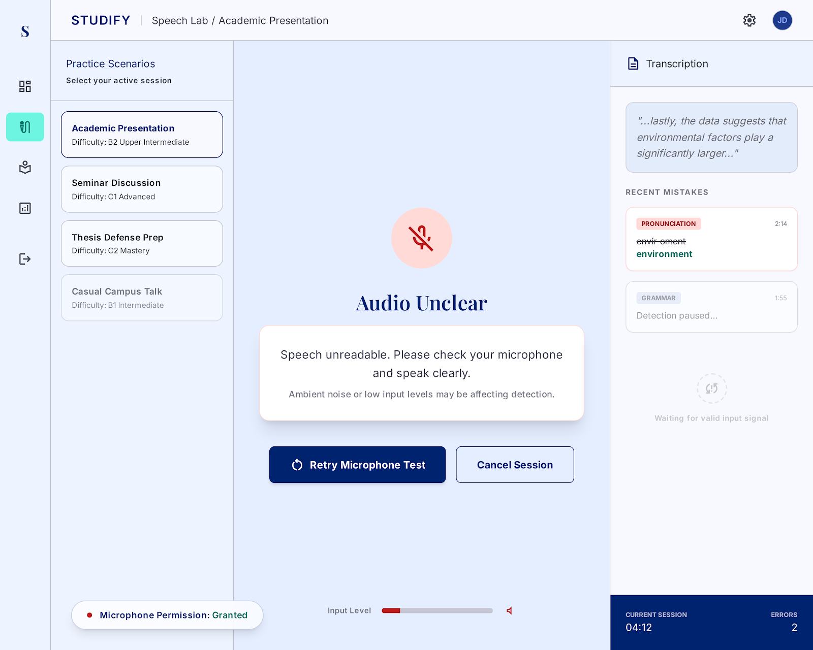
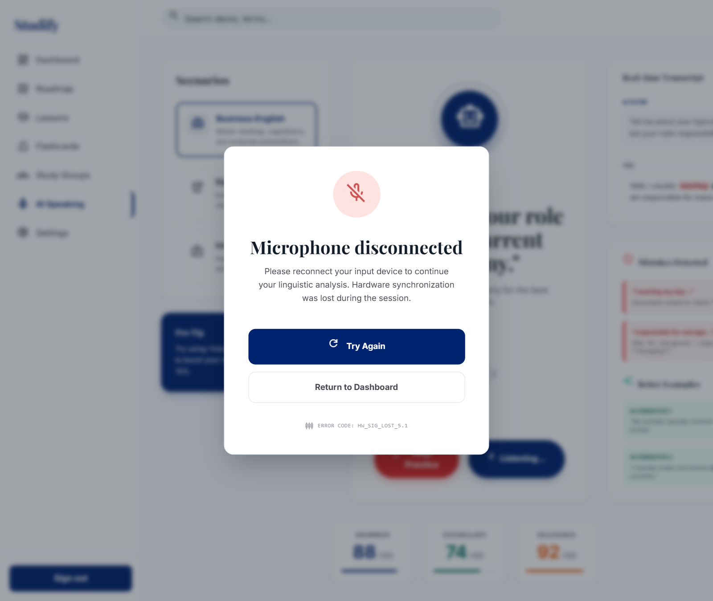
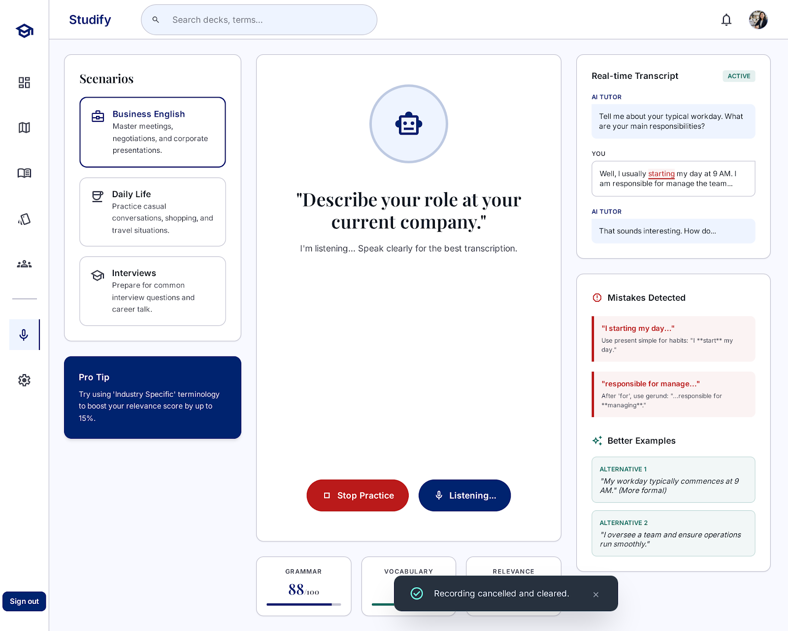

# AI Speaking Assistant
## Use-Case Specification: UC5.1 Speech Recognition

**Version:** 1.0

---

### Revision History

| Date | Version | Description | Author |
| :--- | :--- | :--- | :--- |
| 23/Jul/26 | 1.0 | Initial RUP specification draft for UC5.1 | System Analyst |

---

### Table of Contents

- [1. Use-Case Name](#1-use-case-name)
  - [1.1 Brief Description](#11-brief-description)
- [2. Flow of Events](#2-flow-of-events)
  - [2.1 Basic Flow](#21-basic-flow)
  - [2.2 Alternative Flows](#22-alternative-flows)
    - [2.2.1 Audio Unclear or Low Volume](#221-audio-unclear-or-low-volume)
    - [2.2.2 Silence Timeout](#222-silence-timeout)
    - [2.2.3 Audio Hardware Disconnected](#223-audio-hardware-disconnected)
    - [2.2.4 User Manually Cancels Recording](#224-user-manually-cancels-recording)
- [3. Special Requirements](#3-special-requirements)
  - [3.1 Real-Time Processing Latency](#31-real-time-processing-latency)
  - [3.2 Multi-Language Accent Robustness](#32-multi-language-accent-robustness)
  - [3.3 Audio Stream Data Encryption](#33-audio-stream-data-encryption)
- [4. Preconditions](#4-preconditions)
  - [4.1 Active Session State](#41-active-session-state)
  - [4.2 Microphone Permission Granted](#42-microphone-permission-granted)
  - [4.3 Audio Input Device Detected](#43-audio-input-device-detected)
- [5. Postconditions](#5-postconditions)
  - [5.1 Audio Transcribed & Stored](#51-audio-transcribed--stored)
  - [5.2 Session Metrics Updated](#52-session-metrics-updated)
  - [5.3 Audio Stream Closed](#53-audio-stream-closed)
- [6. Extension Points](#6-extension-points)
  - [6.1 None](#61-none)

---

## 1. Use-Case Name
**UC5.1: Speech recognition**

### 1.1 Brief Description
This use case describes how the system captures real-time spoken audio input from the Learner and processes it through the AI Engine to generate an accurate text transcription. It serves as an essential foundational service included by downstream conversation and evaluation modules.

---

## 2. Flow of Events

### 2.1 Basic Flow
1. The Learner begins speaking into their device microphone during an active practice turn.
2. The system streams the live audio input stream to the AI Engine's Speech-to-Text (STT) processing module.
3. The AI Engine processes the audio signal and converts it into a structured text transcript.
4. The system validates the transcribed text and returns it to the calling use case for downstream dialogue processing and evaluation.

### 2.2 Alternative Flows

#### 2.2.1 Audio Unclear or Low Volume
1. In step 3 of the Basic Flow, the AI Engine determines that the signal-to-noise ratio is too low or background noise obscures speech clarity.
2. The system prompts the Learner with an on-screen warning: *"Speech unreadable. Please check your microphone and speak clearly."*
3. The Learner re-speaks their input, and the execution returns to step 2 of the Basic Flow.

#### 2.2.2 Silence Timeout
1. In step 1 of the Basic Flow, the system detects continuous silence exceeding 10 seconds.
2. The system automatically pauses active audio recording and displays a prompt asking if the user is ready.
3. Once the Learner clicks "Resume", the flow restarts at step 1 of the Basic Flow.

#### 2.2.3 Audio Hardware Disconnected
1. During step 1 or step 2 of the Basic Flow, the active input microphone is unplugged or disconnected.
2. The system detects hardware loss, pauses processing, and displays an alert: *"Microphone disconnected. Please reconnect your input device."*
3. Once the system detects hardware restoration, the Learner clicks "Try Again", restarting the flow at step 1.

#### 2.2.4 User Manually Cancels Recording
1. At any point during step 1 or step 2, the Learner clicks the "Cancel" button on the UI.
2. The system terminates audio streaming, purges temporary audio buffers, and resets the interface state back to the prompt start.

---

## 3. Special Requirements

### 3.1 Real-Time Processing Latency
The speech-to-text recognition pipeline must complete and return the final text transcript within 2 seconds (< 2.0s) following the end of user speech detection.

### 3.2 Multi-Language Accent Robustness
The STT model must maintain a minimum Word Error Rate (WER) accuracy of 85% or higher across varied non-native English accents.

### 3.3 Audio Stream Data Encryption
All live audio streamed from the client interface to the AI Engine must be encrypted in transit using TLS 1.3 / WebRTC Secure Real-Time Transport Protocol (SRTP).

---

## 4. Preconditions

### 4.1 Active Session State
The Learner must be authenticated and engaged in an active speaking practice session.

### 4.2 Microphone Permission Granted
The web browser or application permissions must explicitly allow microphone access.

### 4.3 Audio Input Device Detected
At least one functional audio input capture device must be active and registered by the operating system.

---

## 5. Postconditions

### 5.1 Audio Transcribed & Stored
The user's spoken audio is successfully transcribed into plain text and stored in the active session buffer for turn processing.

### 5.2 Session Metrics Updated
System logs record audio capture metadata (duration, noise level, token length) for performance analytics.

### 5.3 Audio Stream Closed
The active microphone capture stream is cleanly closed or set back to standby mode to save client resources.

---

## 6. Extension Points

### 6.1 None
This use case contains no extension points.