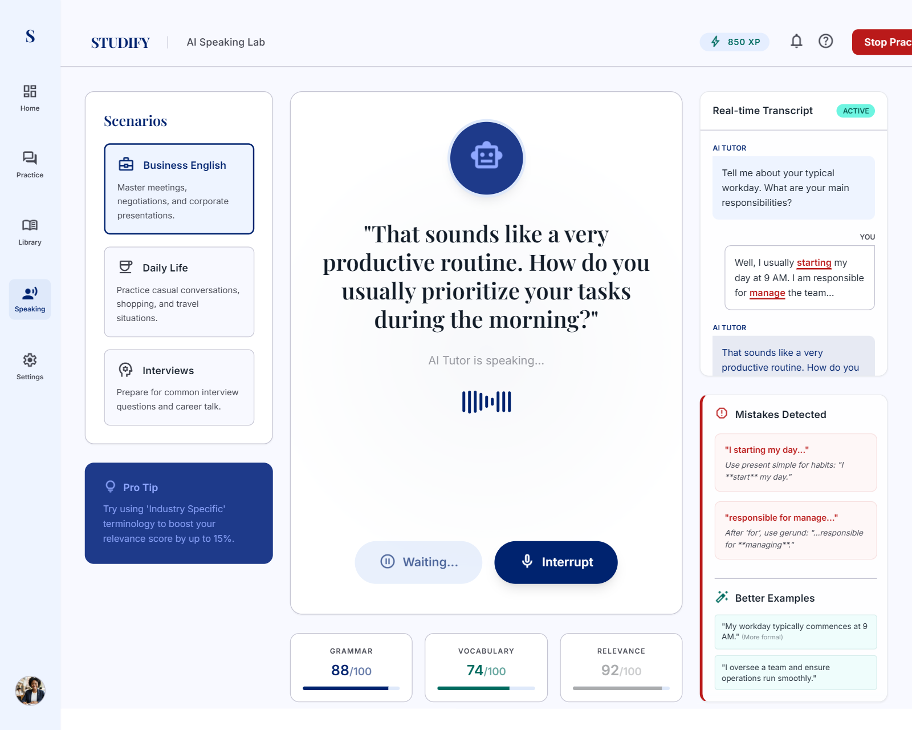
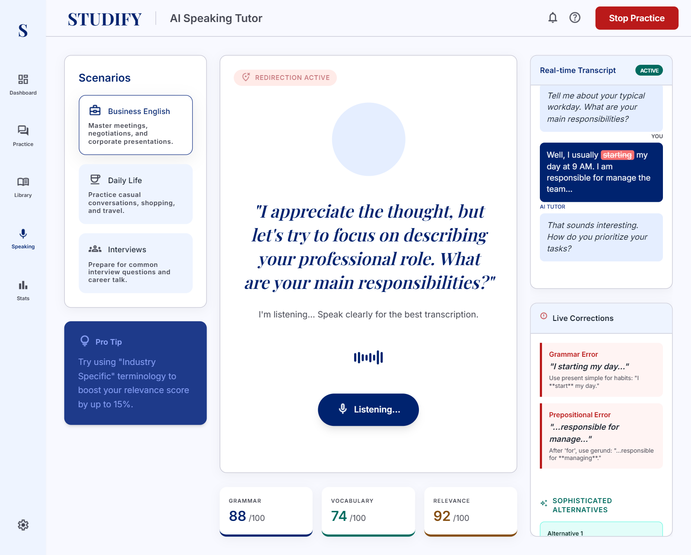
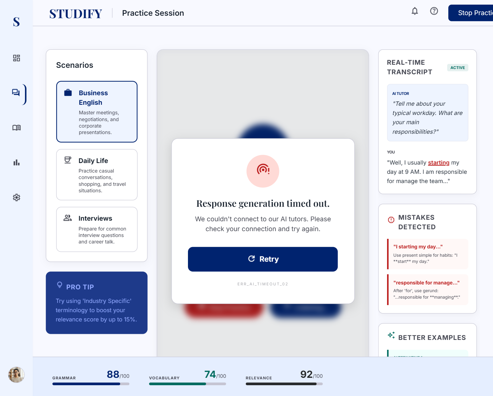
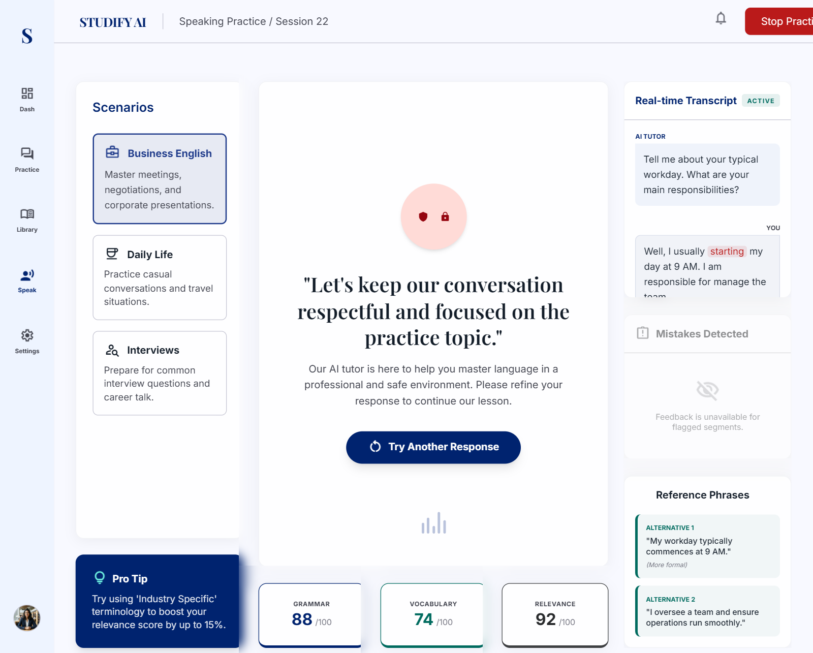
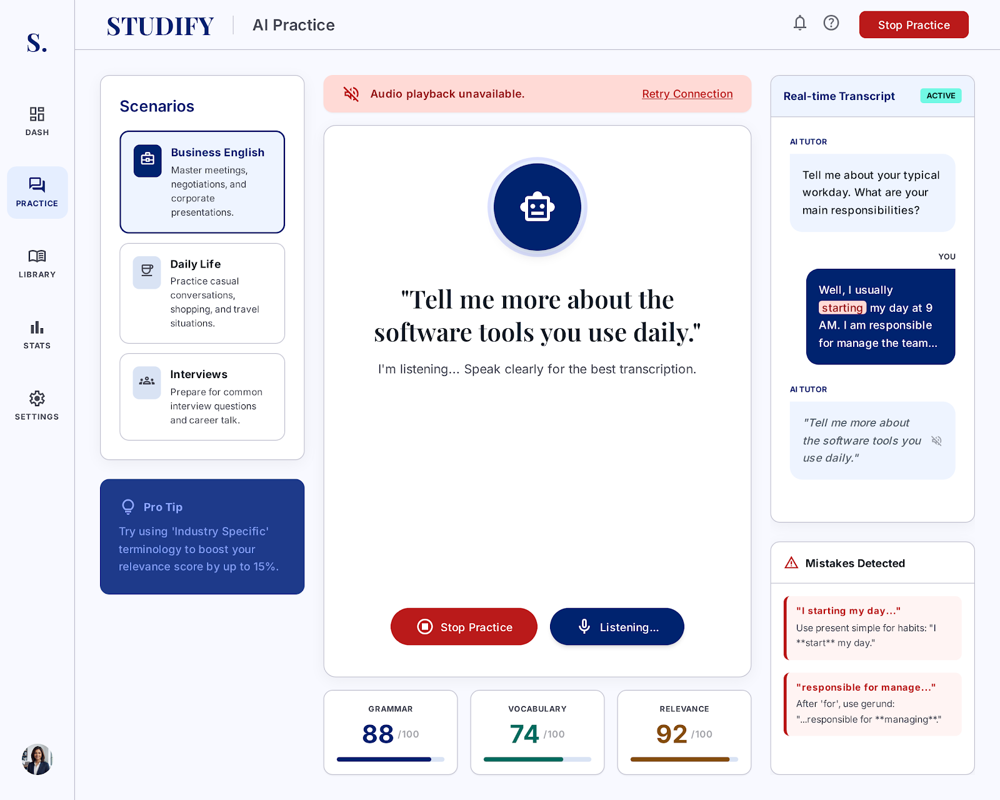

# AI Speaking Assistant
## Use-Case Specification: UC5.2 Generate Appropriate Reply

**Version:** 1.0

---

### Revision History

| Date | Version | Description | Author |
| :--- | :--- | :--- | :--- |
| 23/Jul/26 | 1.0 | Initial RUP specification draft for UC5.2 | System Analyst |

---

### Table of Contents

- [1. Use-Case Name](#1-use-case-name)
  - [1.1 Brief Description](#11-brief-description)
- [2. Flow of Events](#2-flow-of-events)
  - [2.1 Basic Flow](#21-basic-flow)
  - [2.2 Alternative Flows](#22-alternative-flows)
    - [2.2.1 Off-Topic Input Handling](#221-off-topic-input-handling)
    - [2.2.2 AI Service Timeout](#222-ai-service-timeout)
    - [2.2.3 Inappropriate or Flagged Content](#223-inappropriate-or-flagged-content)
    - [2.2.4 Text-to-Speech (TTS) Synthesis Failure](#224-text-to-speech-tts-synthesis-failure)
- [3. Special Requirements](#3-special-requirements)
  - [3.1 Conversational Latency](#31-conversational-latency)
  - [3.2 Natural Voice Synthesis Quality](#32-natural-voice-synthesis-quality)
  - [3.3 Conversation Context Length](#33-conversation-context-length)
- [4. Preconditions](#4-preconditions)
  - [4.1 Active Scenario Context](#41-active-scenario-context)
  - [4.2 Transcribed Text Input Received](#42-transcribed-text-input-received)
  - [4.3 AI Engine Service Availability](#43-ai-engine-service-availability)
- [5. Postconditions](#5-postconditions)
  - [5.1 Dialogue State Updated](#51-dialogue-state-updated)
  - [5.2 Audio Response Cached](#52-audio-response-cached)
  - [5.3 History Stack Updated](#53-history-stack-updated)
- [6. Extension Points](#6-extension-points)
  - [6.1 None](#61-none)

---

## 1. Use-Case Name
**UC5.2: Generate appropriate reply**

### 1.1 Brief Description
This use case captures the end-to-end process in which the AI Speaking Assistant receives the Learner's transcribed input, evaluates the context of the active practice scenario (e.g., Business, Casual, Interview), and uses the AI Engine to construct a natural, contextually relevant response in both text and synthesized audio forms.

---

## 2. Flow of Events

### 2.1 Basic Flow
1. The Learner speaks their turn into the interface.
2. The system executes **UC5.1: Speech recognition** to obtain the transcribed text transcript (`<<include>>`).
3. The system bundles the transcript, active scenario metadata, and prior conversation turns, submitting the payload to the AI Engine.
4. The AI Engine processes the request and generates an in-context conversational reply.
5. The system synthesizes the text response into natural-sounding voice audio.
6. The system displays the conversation text in the chat panel and plays the audio reply to the Learner.

### 2.2 Alternative Flows

#### 2.2.1 Off-Topic Input Handling
1. In step 4 of the Basic Flow, the AI Engine detects that the user's input strays significantly from the scenario prompt.
2. The AI Engine generates a polite redirection response acknowledging the input while prompting the Learner back to the scenario core topic.
3. The execution resumes at step 5 of the Basic Flow.

#### 2.2.2 AI Service Timeout
1. In step 4 of the Basic Flow, the connection to the AI Engine service times out (exceeds 5 seconds).
2. The system presents an error alert: *"Response generation timed out. Click to retry."*
3. The Learner clicks retry, and execution restarts at step 3 of the Basic Flow.

#### 2.2.3 Inappropriate or Flagged Content
1. In step 4 of the Basic Flow, safety filters flag user input containing abusive, hateful, or explicit language.
2. The system bypasses normal conversation generation and responds with a standard safety prompt: *"Let's keep our conversation respectful and focused on the practice topic."*
3. The execution resumes at step 5 of the Basic Flow.

#### 2.2.4 Text-to-Speech (TTS) Synthesis Failure
1. In step 5 of the Basic Flow, the TTS engine fails to synthesize audio.
2. The system displays the text reply in the chat interface and displays a non-intrusive notification: *"Audio playback unavailable."*
3. The flow completes without audio playback.

---

## 3. Special Requirements

### 3.1 Conversational Latency
The total latency for reply text generation and Text-To-Speech (TTS) rendering combined must not exceed 3 to 5 seconds to maintain natural conversation dynamics.

### 3.2 Natural Voice Synthesis Quality
Audio output must utilize neural TTS voices sampled at a minimum of 24kHz to ensure realistic human cadence, tone, and inflection.

### 3.3 Conversation Context Length
The AI Engine must maintain and process a context history window of at least 10 prior dialogue turns to ensure coherent multi-turn conversations.

---

## 4. Preconditions

### 4.1 Active Scenario Context
A practice scenario must be initialized, and the dialogue state must be active.

### 4.2 Transcribed Text Input Received
Valid text output from **UC5.1** must be passed into the dialogue handler.

### 4.3 AI Engine Service Availability
The system's backend AI model API must be online and responsive.

---

## 5. Postconditions

### 5.1 Dialogue State Updated
The newly generated AI turn (text and audio) is saved into the session history, and the state advances to wait for the user's next turn.

### 5.2 Audio Response Cached
Synthesized voice audio files are temporarily cached on the client to allow instant replay by the user.

### 5.3 History Stack Updated
The full transcript exchange is appended to the user's session history record.

---

## 6. Extension Points

### 6.1 None
This use case contains no extension points.