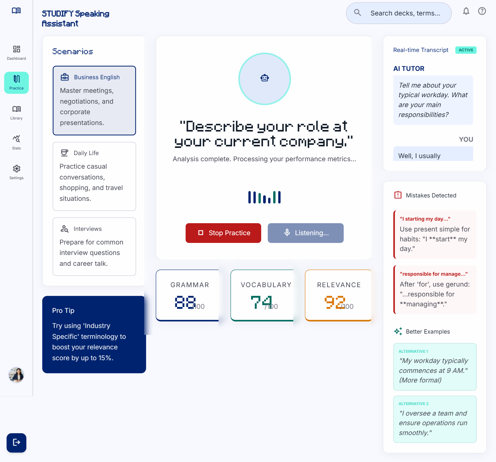
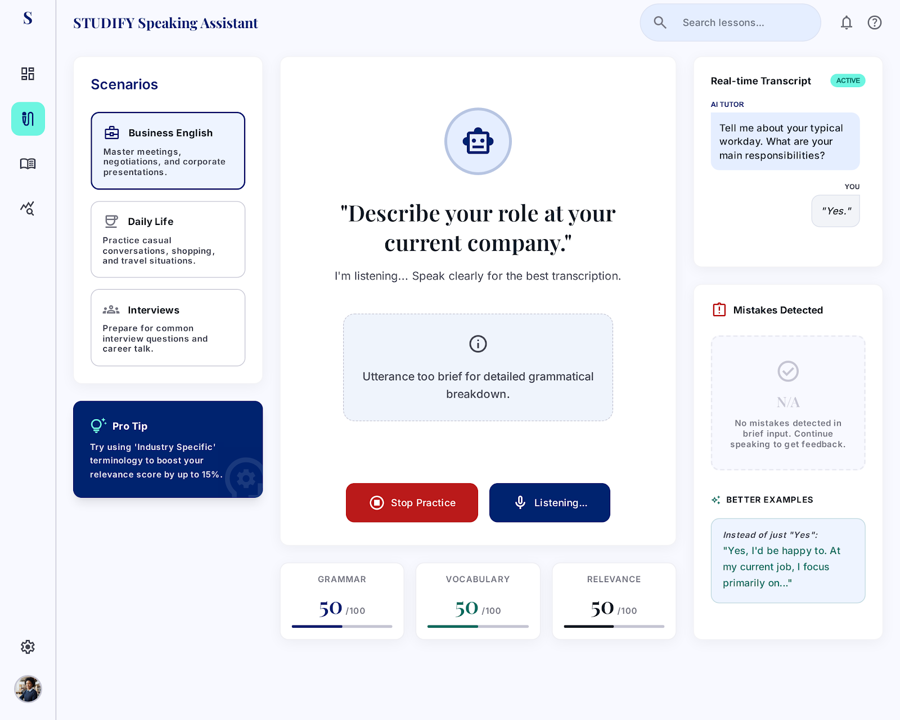
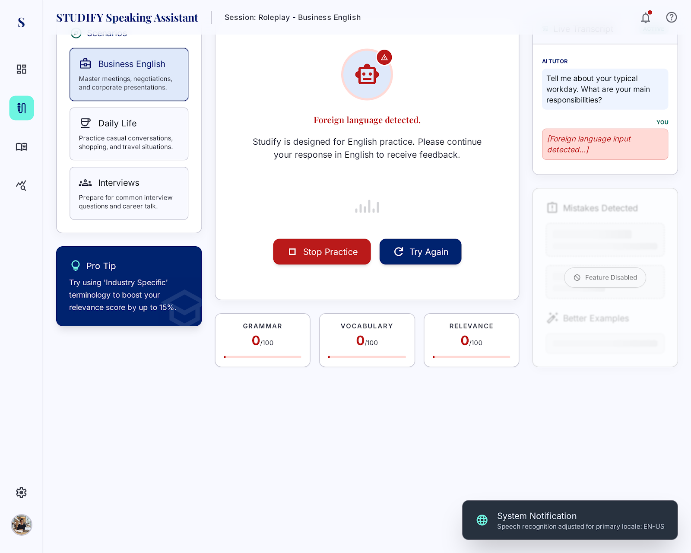
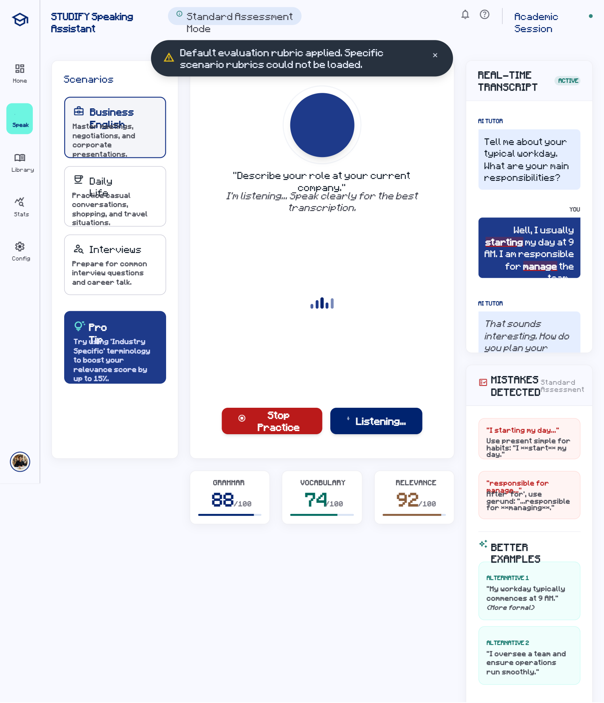

# AI Speaking Assistant
## Use-Case Specification: UC5.3 Evaluate Performance on Specific Criteria

**Version:** 1.0

---

### Revision History

| Date | Version | Description | Author |
| :--- | :--- | :--- | :--- |
| 23/Jul/26 | 1.0 | Initial RUP specification draft for UC5.3 | System Analyst |

---

### Table of Contents

- [1. Use-Case Name](#1-use-case-name)
  - [1.1 Brief Description](#11-brief-description)
- [2. Flow of Events](#2-flow-of-events)
  - [2.1 Basic Flow](#21-basic-flow)
  - [2.2 Alternative Flows](#22-alternative-flows)
    - [2.2.1 Brief Input Evaluation](#221-brief-input-evaluation)
    - [2.2.2 Non-English Speech Input Detected](#222-non-english-speech-input-detected)
    - [2.2.3 Rubric Configuration Missing](#223-rubric-configuration-missing)
- [3. Special Requirements](#3-special-requirements)
  - [3.1 Multi-Criteria Scoring Consistency](#31-multi-criteria-scoring-consistency)
  - [3.2 Evaluation Latency](#32-evaluation-latency)
  - [3.3 Deterministic Scoring Standards](#33-deterministic-scoring-standards)
- [4. Preconditions](#4-preconditions)
  - [4.1 Transcribed Input Available](#41-transcribed-input-available)
  - [4.2 Evaluation Rubric Loaded](#42-evaluation-rubric-loaded)
  - [4.3 Scenario Context Set](#43-scenario-context-set)
- [5. Postconditions](#5-postconditions)
  - [5.1 Metrics Logged](#51-metrics-logged)
  - [5.2 UI Performance Panel Updated](#52-ui-performance-panel-updated)
  - [5.3 Analytics Trend Updated](#53-analytics-trend-updated)
- [6. Extension Points](#6-extension-points)
  - [6.1 Performance Weakness Detected](#61-performance-weakness-detected)

---

## 1. Use-Case Name
**UC5.3: Evaluate performance on specific criteria**

### 1.1 Brief Description
This use case details how the system analyzes the Learner's transcribed spoken speech against specific core linguistic criteria (Grammar, Vocabulary & Word Choice, and Context Relevance) to produce structured analytical scores and diagnostic feedback.

---

## 2. Flow of Events

### 2.1 Basic Flow
1. The system initiates a performance evaluation routine upon turn completion.
2. The system executes **UC5.1: Speech recognition** to capture/verify the input text (`<<include>>`).
3. The system submits the transcript and active target evaluation rubric to the AI Engine.
4. The AI Engine evaluates performance across three strict criteria:
   - **Grammar & Syntax:** Identifies structural, tense, and agreement errors.
   - **Vocabulary & Word Choice:** Assesses lexical variety, appropriateness, and sophistication.
   - **Context Relevance:** Evaluates how accurately the utterance addresses the scenario prompt.
5. The system records numerical scores and qualitative diagnostic notes.
6. The system presents the detailed breakdown on the interface evaluation panel.

### 2.2 Alternative Flows

#### 2.2.1 Brief Input Evaluation
1. In step 4 of the Basic Flow, the AI Engine determines that the user utterance is too brief (e.g., single-word responses like "Yes" or "Okay") to perform full grammatical analysis.
2. The AI Engine assigns neutral baseline scores and notes: *"Utterance too brief for detailed grammatical breakdown."*
3. The execution resumes at step 5 of the Basic Flow.

#### 2.2.2 Non-English Speech Input Detected
1. In step 4 of the Basic Flow, the AI Engine detects that the transcribed text is in a language other than English.
2. The system assigns a score of 0 for Vocabulary and Grammar, flagging the turn with: *"Foreign language detected. Please practice in English."*
3. The execution resumes at step 5 of the Basic Flow.

#### 2.2.3 Rubric Configuration Missing
1. In step 3 of the Basic Flow, the system fails to load target scenario rubric configuration parameters.
2. The system falls back to a standardized default evaluation rubric and logs a system warning.
3. The execution resumes at step 4 of the Basic Flow.

---

## 3. Special Requirements

### 3.1 Multi-Criteria Scoring Consistency
The evaluation module must generate standardized scores (0–100 scale) along with human-readable diagnostic rationales for Grammar, Vocabulary, and Context Relevance.

### 3.2 Evaluation Latency
Evaluation calculations and metric scoring must be completed within 1.5 seconds following text input ingestion.

### 3.3 Deterministic Scoring Standards
Scoring guidelines must adhere to standardized CEFR (Common European Framework of Reference for Languages) proficiency benchmarks.

---

## 4. Preconditions

### 4.1 Transcribed Input Available
The Learner's spoken input must be successfully processed into text format.

### 4.2 Evaluation Rubric Loaded
Target scenario rubric criteria must be active in session memory.

### 4.3 Scenario Context Set
The specific practice domain (e.g., Job Interview, Restaurant Order) must be active to measure contextual relevance accurately.

---

## 5. Postconditions

### 5.1 Metrics Logged
Detailed evaluation scores and criterion breakdowns are logged in the active session report.

### 5.2 UI Performance Panel Updated
Visual score cards and radar charts on the learner's screen are updated with new metrics.

### 5.3 Analytics Trend Updated
Scores are appended to the learner's long-term progress profile database.

---

## 6. Extension Points

### 6.1 Performance Weakness Detected
- **Location:** Step 5 of the Basic Flow.
- **Condition:** If performance scores fall below set thresholds or specific actionable errors/weaknesses are flagged, the system invokes **UC5.4: Provide guidance on how to improve** (`<<extend>>`).